# Maven的下载安装和使用

**目录**

[0. 相关文章链接](#t0)

[1. Maven最新版本下载](#t1)

[2. Maven历史版本下载](#t2)

[3. Maven在windows上的安装](#t3)

[4. Maven在Centos7上的安装](#t4)

[5. Maven中央仓库地址大全](#t5)

[5.1. 推荐使用仓库](#t6)

[5.2. 各仓库地址](#t7)

------

# 0. 相关文章链接

[大数据基础知识点 文章汇总](https://blog.csdn.net/yang_shibiao/article/details/122592426)

# 1. Maven最新版本下载

进入maven的官网，官网地址：[Maven – Welcome to Apache Maven](https://maven.apache.org/)

在左边侧边栏进入download页面，如下图：

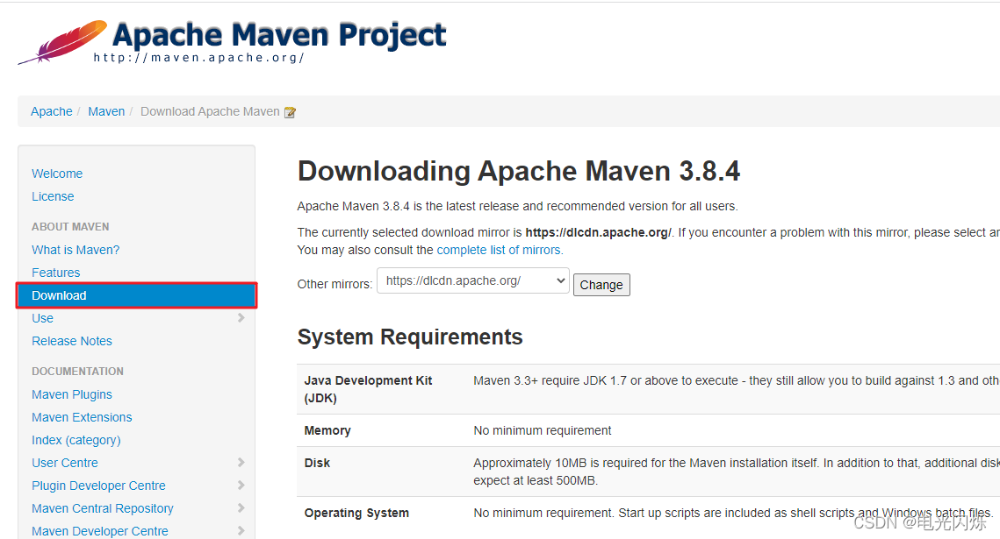

在该页面的右侧下载对应的安装包，如下图：

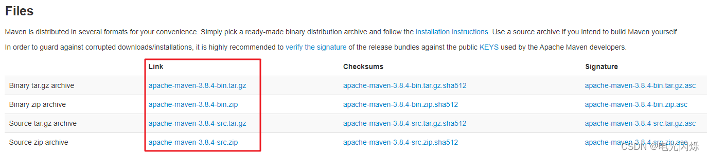

# 2. Maven历史版本下载

进入maven的官网，官网地址：[Maven – Welcome to Apache Maven](https://maven.apache.org/)

在左边侧边栏进入download页面，如下图：


在该页面的右侧滑入最下方（Previous Releases模块，可以直接搜索该关键词找到该模块），点击 [archives](https://archive.apache.org/dist/maven/maven-3/) 即可跳转到历史版本下载页面，如下图：

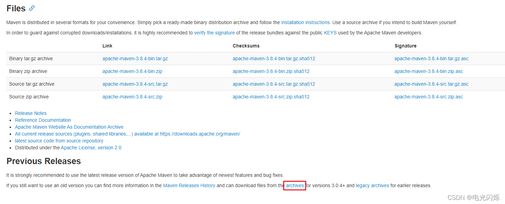

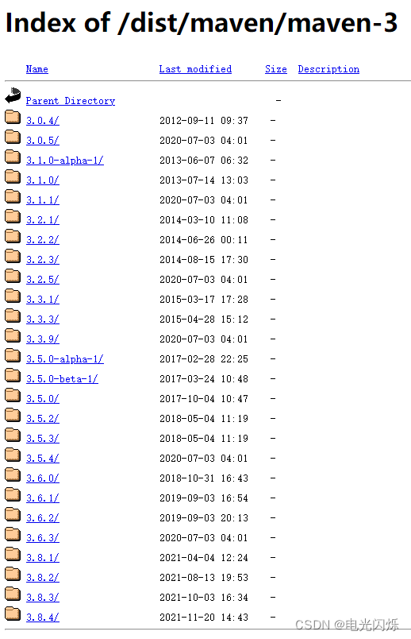

点击对应的版本即可以看到该版本下有2个文件夹，一个是二进制版本，一个是源码版本；其中二进制版本是编译好的，可以直接使用，源码版本没有编译，需要自行编译，我们平常直接使用二进制版本即可，如下图：

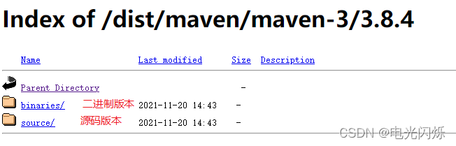


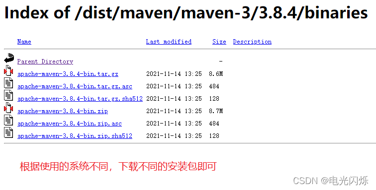

# 3. Maven在windows上的安装

解压下载的zip压缩包到windows目录下，如下所示，博主是解压在 D:\Develop 目录下：

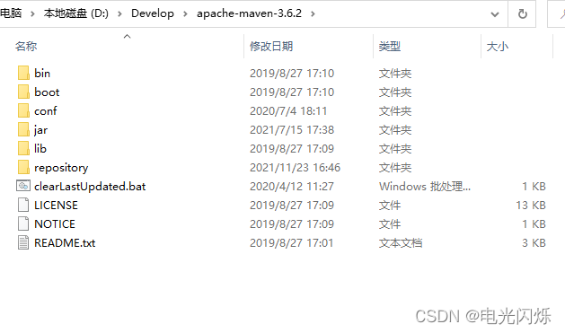

修改conf目录下的 settings.xml 配置文件：

```XML
<!-- 在50行左右修改本地仓库地址，博主是在maven的目录下新建repository文件夹作为本地仓库地址，方便迁移 -->


<!-- 本地仓库 -->


<localRepository>D:\Develop\apache-maven-3.6.2\repository</localRepository>


 


<mirrors>


	<!-- mirror


	 | Specifies a repository mirror site to use instead of a given repository. The repository that


	 | this mirror serves has an ID that matches the mirrorOf element of this mirror. IDs are used


	 | for inheritance and direct lookup purposes, and must be unique across the set of mirrors.


	 |


	<mirror>


	  <id>mirrorId</id>


	  <mirrorOf>repositoryId</mirrorOf>


	  <name>Human Readable Name for this Mirror.</name>


	  <url>http://my.repository.com/repo/path</url>


	</mirror>


	 -->


	<mirror>


	  <id>aliyunCentralMaven</id>


	  <name>阿里云中央仓库</name>


	  <url>https://maven.aliyun.com/repository/central/</url>


	  <mirrorOf>central</mirrorOf>


	</mirror>


	<mirror>


	  <id>aliyunSpringMaven</id>


	  <name>阿里云Spring插件仓库</name>


	  <url>https://maven.aliyun.com/repository/spring/</url>


	  <mirrorOf>*</mirrorOf>


	</mirror>


	<mirror>


	  <id>repo2</id>


	  <name>Mirror from Maven Repo2</name>


	  <url>https://repo.spring.io/plugins-release/</url>


	  <mirrorOf>central</mirrorOf>


	</mirror>


	<mirror>


	  <id>UK</id>


	  <name>UK Central</name>


	  <url>https://uk.maven.org/maven2/</url>


	  <mirrorOf>central</mirrorOf>


	</mirror>


	<mirror>


	  <id>jboss-public-repository-group</id>


	  <name>JBoss Public Repository Group</name>


	  <url>https://repository.jboss.org/nexus/content/groups/public/</url>


	  <mirrorOf>central</mirrorOf>


	</mirror>


	<mirror>


	  <id>CN</id>


	  <name>OSChina Central</name>


	  <url>https://maven.oschina.net/content/groups/public/</url>


	  <mirrorOf>central</mirrorOf>


	</mirror>


	<mirror>


	  <id>CN</id>


	  <name>OSChina Central</name>


	  <url>https://maven.oschina.net/content/groups/public/</url>


	  <mirrorOf>central</mirrorOf>


	</mirror>


	<mirror>


	  <id>maven-net-cn</id>


	  <name>Maven China Mirror</name>


	  <url>http://maven.net.cn/content/groups/public/</url>


	  <mirrorOf>central</mirrorOf>


	</mirror>


</mirrors>
```

配置环境变量：

此电脑 -> 右击选择属性 -> 右侧点击高级系统设置 -> 选择环境变量

新增 MAVEN_HOME ， 并设置值为maven的安装地址（ D:\Develop\[apache](https://so.csdn.net/so/search?q=apache&spm=1001.2101.3001.7020)-maven-3.6.2）


在Path中新增maven（%MAVEN_HOME%\bin），如下图所示：

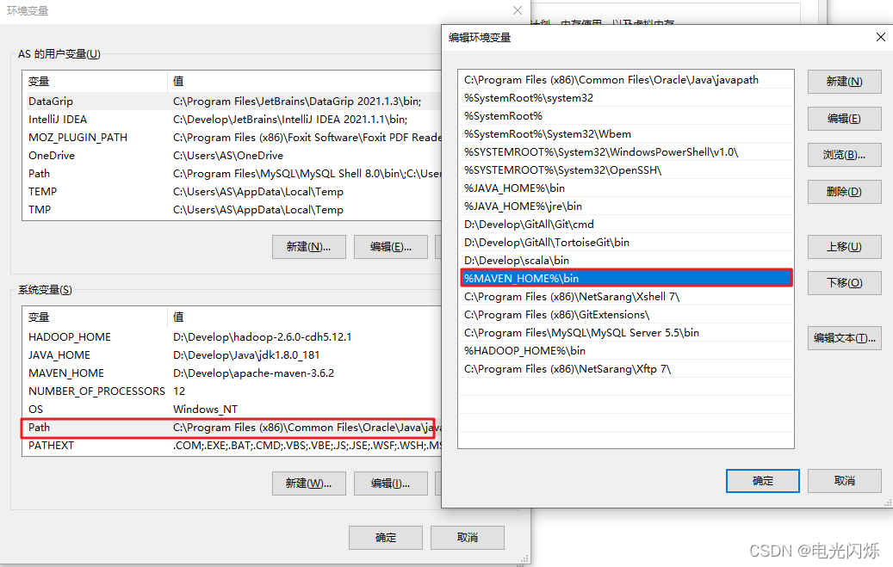

验证，在命令行中输入 mvn -version，如下图所示：

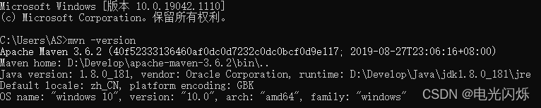

# 4. Maven在Centos7上的安装

上传安装包，解压安装包，并配置软连接：

```XML
# 在 /usr/local 目录下


tar -zxvf apache-maven-3.8.4-bin.tar.gz


ln -s /usr/local/apache-maven-3.8.4 /usr/local/maven 
```

完成后截图如下所示：

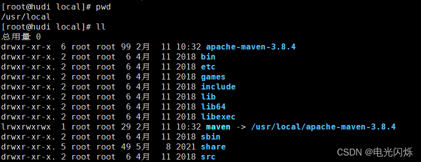

配置环境变量：

```XML
vim /etc/profile


 


# 添加以下内容


export MAVEN_HOME=/usr/local/maven


export PATH=$MAVEN_HOME/bin:$PATH


 


# soure环境变量


source /etc/profile
```

执行mvn -version命令验证maven是否可以使用：

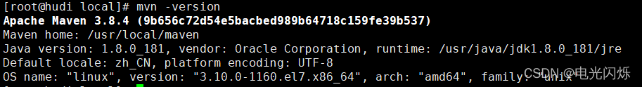

修改conf目录下的 settings.xml 配置文件：

```XML
<!-- 在50行左右修改本地仓库地址，博主是在maven的目录下新建repository文件夹作为本地仓库地址，方便迁移 -->


<!-- 本地仓库 -->


<localRepository>D:\Develop\apache-maven-3.6.2\repository</localRepository>


 


<mirrors>


	<!-- mirror


	 | Specifies a repository mirror site to use instead of a given repository. The repository that


	 | this mirror serves has an ID that matches the mirrorOf element of this mirror. IDs are used


	 | for inheritance and direct lookup purposes, and must be unique across the set of mirrors.


	 |


	<mirror>


	  <id>mirrorId</id>


	  <mirrorOf>repositoryId</mirrorOf>


	  <name>Human Readable Name for this Mirror.</name>


	  <url>http://my.repository.com/repo/path</url>


	</mirror>


	 -->


	<mirror>


	  <id>aliyunCentralMaven</id>


	  <name>阿里云中央仓库</name>


	  <url>https://maven.aliyun.com/repository/central/</url>


	  <mirrorOf>central</mirrorOf>


	</mirror>


	<mirror>


	  <id>aliyunSpringMaven</id>


	  <name>阿里云Spring插件仓库</name>


	  <url>https://maven.aliyun.com/repository/spring/</url>


	  <mirrorOf>*</mirrorOf>


	</mirror>


	<mirror>


	  <id>repo2</id>


	  <name>Mirror from Maven Repo2</name>


	  <url>https://repo.spring.io/plugins-release/</url>


	  <mirrorOf>central</mirrorOf>


	</mirror>


	<mirror>


	  <id>UK</id>


	  <name>UK Central</name>


	  <url>https://uk.maven.org/maven2/</url>


	  <mirrorOf>central</mirrorOf>


	</mirror>


	<mirror>


	  <id>jboss-public-repository-group</id>


	  <name>JBoss Public Repository Group</name>


	  <url>https://repository.jboss.org/nexus/content/groups/public/</url>


	  <mirrorOf>central</mirrorOf>


	</mirror>


	<mirror>


	  <id>CN</id>


	  <name>OSChina Central</name>


	  <url>https://maven.oschina.net/content/groups/public/</url>


	  <mirrorOf>central</mirrorOf>


	</mirror>


	<mirror>


	  <id>CN</id>


	  <name>OSChina Central</name>


	  <url>https://maven.oschina.net/content/groups/public/</url>


	  <mirrorOf>central</mirrorOf>


	</mirror>


	<mirror>


	  <id>maven-net-cn</id>


	  <name>Maven China Mirror</name>


	  <url>http://maven.net.cn/content/groups/public/</url>


	  <mirrorOf>central</mirrorOf>


	</mirror>


</mirrors>
```

# 5. Maven中央仓库地址大全

## **5.1. 推荐使用仓库** 

```bash
1、阿里云中央仓库：http://maven.aliyun.com/nexus/content/groups/public/


2、中央仓库：http://mvnrepository.com/


3、camunda.com 中央仓库：https://app.camunda.com/nexus/content/groups/public


 


# 在maven中配置如下


    <mirror>


      <id>aliyunCentralMaven</id>


      <name>aliyun central maven</name>


      <url>https://maven.aliyun.com/repository/central/</url>


      <mirrorOf>central</mirrorOf>


    </mirror>


    <mirror>


      <id>centralMaven</id>


      <name>central maven</name>


      <url>http://mvnrepository.com/</url>


      <mirrorOf>central</mirrorOf>


    </mirror>
```

## **5.2. 各仓库地址** 

```xml
1、阿里中央仓库


<repository>  


    <id>alimaven</id>


    <name>aliyun maven</name>


    <url>http://maven.aliyun.com/nexus/content/groups/public/</url>


</repository> 


 


2、camunda.com 中央仓库


<repository>  


    <id>activiti-repos2</id>  


    <name>Activiti Repository 2</name>  


    <url>https://app.camunda.com/nexus/content/groups/public</url>  


</repository>  


 


3、spring.io 中央仓库


<repository>  


    <id>springsource-repos</id>  


    <name>SpringSource Repository</name>  


    <url>http://repo.spring.io/release/</url>  


</repository>


 


4、maven.apache.org 中央仓库


<repository>  


    <id>central-repos</id>  


    <name>Central Repository</name>  


    <url>http://repo.maven.apache.org/maven2</url>  


</repository>


 


5、maven.org 中央仓库


<repository>  


    <id>central-repos1</id>  


    <name>Central Repository 2</name>  


    <url>http://repo1.maven.org/maven2/</url>  


</repository>


 


6、alfresco.com 中央仓库


<repository>  


    <id>activiti-repos</id>  


    <name>Activiti Repository</name>  


    <url>https://maven.alfresco.com/nexus/content/groups/public</url>  


</repository>  


 


7、oschina 中央仓库（需要x墙哟）


<repository>  


    <id>oschina-repos</id>  


    <name>Oschina Releases</name>  


    <url>http://maven.oschina.net/content/groups/public</url>  


</repository>  


 


8、oschina thinkgem 中央仓库（需要x墙哟）


<repository>   


    <id>thinkgem-repos</id>   


    <name>ThinkGem Repository</name>  


    <url>http://git.oschina.net/thinkgem/repos/raw/master</url>  


</repository> 


 


9、java.net 中央仓库（需要x墙哟）


<repository>  


    <id>java-repos</id>  


    <name>Java Repository</name>  


    <url>http://download.java.net/maven/2/</url>  


</repository>


 


10、github.com 中央仓库（需要x墙哟）


<repository>   


    <id>thinkgem-repos2</id>   


    <name>ThinkGem Repository 2</name>  


    <url>https://raw.github.com/thinkgem/repository/master</url>  


</repository>  


 


 
```

------

**注：****其他相关文章链接由此进 ->** [大数据基础知识点 文章汇总](https://blog.csdn.net/yang_shibiao/article/details/122592426)

------