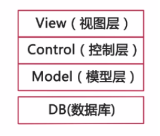
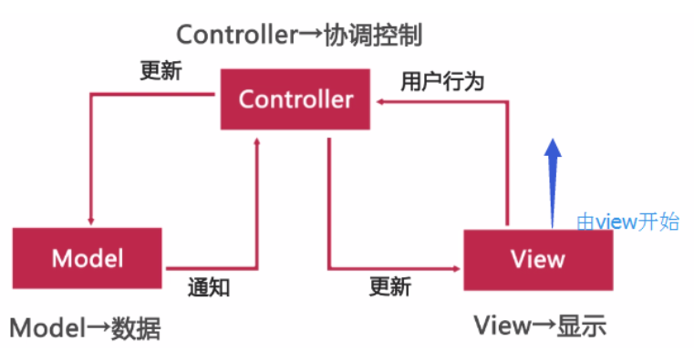

# JDBC

参考链接：

[l廖雪峰JDBC查询](https://www.liaoxuefeng.com/wiki/1252599548343744/1321748435828770)

[Java中JDBC的使用详解](https://blog.csdn.net/qq_22172133/article/details/81266048/)

[Java数据库连接——JDBC基础知识（操作数据库：增删改查）](https://www.cnblogs.com/Qian123/p/5339164.html)

## 什么是JDBC

JDBC是JAVA Database Connectivity的缩写，是一组标准的Java语言中的接口和类，使用这些接口和类，Java客户端程序可以访问各种不同类型的数据库。


JDBC代表Java数据库连接。

JDBC库中所包含的API任务通常与数据库使用：

- 连接到数据库
- 创建SQL或MySQL语句
- 在数据库中执行SQL或MySQL查询
- 查看和修改记录


## 使用的详解步骤——以Mysql为例

### 1. MAVAEN引入包

### 2. 加载数据库驱动

```java
//1.加载驱动(开发推荐的方式)
Class.forName("com.mysql.jdbc.Driver");
```

注意：如果连接的是SQL server

```java
//1.加载驱动
Class.forName("com.microsoft.jdbc.sqlserver.SQLServerDriver");
```

### 3. 建立连接

#### 1）数据库URL

 URL用于标识数据库的位置，程序员通过URL地址告诉JDBC程序连接哪个数据库，URL的写法为：

jdbc:mysql://[host:port],[host:port].../[database][?参数名1][=参数值1][&参数名2][=参数值2]...

参考链接:[mysql jdbc url具体参数全解](https://blog.csdn.net/wfanking/article/details/95504879)


常用数据库URL地址的写法：

Oracle：jdbc:oracle:thin:@localhost:1521:shen

SqlServer：jdbc:microsoft:sqlserver://localhost:1433; DatabaseName=shen

MySql：jdbc:mysql://localhost:3306/shen

注意：如果是localhost:3306，mysql可以简写为jdbc:mysql:///sid（尽量不这样）

2）Connection

Jdbc程序中的Connection，它用于代表数据库的链接，Collection是数据库编程中最重要的一个对象，客户端与数据库所有交互都是通过connection对象完成的，创建方法为：

Connection conn = DriverManager.getConnection(url,user,pass); 

这个对象的常用方法：

|               方法                |                      描述                       |
| :-------------------------------: | :---------------------------------------------: |
|         createStatement()         |       创建向数据库发送sql的statement对象        |
|       preparStatement(sql)        | 创建向数据库发送预编译sql的PrepareStatement对象 |
|         prepareCall(sql)          |   创建爱你执行存储过程的callableStatement对象   |
| setAutoCommit(boolean autoCommit) |              设置事务是否自动提交               |
|             commit()              |                在链接上提交事务                 |
|            roolback()             |               在此链接上回滚事务                |

```java
String url = "jdbc:mysql://localhost:3306/shen";
String username = "shen";
String password = "Anxin062039";
Connection conn = null;
			
//2.获取与数据库的链接
conn = DriverManager.getConnection(url, username, password);
```

### 4. 执行SQL语句

1）Statement

 Jdbc程序中的Statement对象用于向数据库发送SQL语句，创建方法为：

​         Statement st = conn.createStatement();

Statement对象常用方法：

|           方法            |                    含义                    |
| :-----------------------: | :----------------------------------------: |
| executeQuery(String sql)  |          用于向数据库发送查询语句          |
| executeUpdate(String sql) | 用于想数据库发送insert、update、delete语句 |
|    execute(String sql)    |        用于想数据库发送任意sql语句         |
|   addBatch(String sql)    |       把多条sql语句放到一个批处理中        |
|      executeBatch()       |        向数据库发送一批sql语句执行         |

```java
Statement st = null;
//3.获取用于向数据库发送sql语句的statement
st = conn.createStatement();
//4.向数据库发sql
String sql = "select id,name,password,email,birthday from users";
st.executeQuery(sql);
```

2) PreparedStatement

PreparedStatement是Statement的孩子，它的实例对象可以通过调用：

PreparedStatement st = conn.preparedStatement

```java
PreperedStatement st = null;
String sql = "select * from users where name=? and password=?";
 
//3.获取用于向数据库发送sql语句的Preperedstatement
st = conn.preparedStatement(sql);//在此次传入，进行预编译
st.setString(1, username);
st.setString(2, password);
//4.向数据库发sql
st.executeQuery();//在这里不需要传入sql
```

比较：相对于Statement对象而言

* PreperedStatement可以避免SQL注入的问题。
          如：String sql="select * from admin where loginname='"+loginName+"' and loginpwd='"+loginPwd+"'";

        在应用中：
    
            -》请输入账号：
    
                 333
    
            -》请输入密码：
    
                  wer'or'1'='1

 


        实际上发送：select * from admin where loginname='333' and loginpwd='wer'or'1'='1'，登录成功！

 

* Statement会使数据库频繁编译SQL，可能造成数据库缓冲区溢出。
* PreparedStatement 可对SQL进行预编译，从而提高数据库的执行效率。
  并且PreperedStatement对于sql中的参数，允许使用占位符的形式进行替换，简化sql语句的编写。

### 5、获取结果

jdbc程序中的ResultSet用于代表Sql语句的执行结果。Resultset封装执行结果时，采用的类似于表格的方式，ResultSet对象维护了一个执行表格数据行的游标，初始的时候，游标在第一行之前，调用，ResultSet.next()方法，可以使游标指向具体的数据行，进行调用方法获取该行的数据。

1）获取行

ResultSet提供了对结果集进行滚动的方法：

|       方法       |          描述           |
| :--------------: | :---------------------: |
|      next()      |      移动到下一行       |
|    previous()    |      移动到前一行       |
| absolute(int ow) |      移动到指定行       |
|  beforeFirst()   | 移动到resultSet的最前面 |
|   afterLast()    | 移动到resultSet的最后面 |

2）获取值

ResultSet既然用于封装执行结果的，所以该对象提供的都是用于获取数据的get方法：

- 获取任意类型的数据：

  getObject(int index)

  getObject(String columnName)

- 获取指定类型的数据，例如：

  getString(int index)

  getString(String columnName)

附加：

常用数据类型转换：

|         SQL类型          |      Jdbc对应方法      |      返回类型      |
| :----------------------: | :--------------------: | :----------------: |
|      bit(1)，bit(n)      | getBoolean，getBytes() |  Boolean，byte[]   |
|         tinyint          |       getByte()        |        Byte        |
|         smallint         |       getShort()       |       Short        |
|           int            |         getInt         |        Int         |
|          bigint          |       getLong()        |        Long        |
| char,varchar,longvarchar |       getString        |       String       |
|     text(clob) blob      |  getClob()，getblob()  |     Clob，blob     |
|           date           |       getDate()        |   java.sql.Date    |
|           time           |       getTime()        |   java.sql.Time    |
|        timestamp         |      getTimestamp      | java.sql.Timestamp |

```java
ResultSet rs = null;
//4.向数据库发sql,并获取代表结果集的resultset
String sql = "select id,name,password,email,birthday from users";
rs = st.executeQuery(sql);
			
//5.取出结果集的数据
rs.afterLast();
rs.previous();
System.out.println("id=" + rs.getObject("id"));
System.out.println("name=" + rs.getObject("name"));
System.out.println("password=" + rs.getObject("password"));
System.out.println("email=" + rs.getObject("email"));
System.out.println("birthday=" + rs.getObject("birthday"));
```

或者

```java
//循环取出(id)
while(rs.next())
{
	String id=rs.getString(1);//1代表数据库中表的列数，id在第一列也可以("id")！！！
	System.out.println(id+" ");
}
```

### 6、释放资源

 Jdbc程序运行完后，切记要释放程序在运行过程中，创建的那些与数据库进行交互的对象，这些对象通常是ResultSet, Statement和Connection对象。

注意：为确保资源释放代码能运行，资源释放代码也一定要放在finally语句中。

```java
//6.关闭链接，释放资源
	if(rs!=null){ //结果对象
		try{
			rs.close();
		}catch (Exception e) {
			e.printStackTrace();
		}
		rs = null;
	
	}
	if(st!=null){ //Statement对象
		try{
			st.close();
		}catch (Exception e) {
			e.printStackTrace();
		}
				
	}	
	if(conn!=null){ //连接对象
		try{
			conn.close();
		}catch (Exception e) {
			e.printStackTrace();
		}
}
```

## 基本操作

### DDL(数据定义语言DDL用来创建数据库中的各种对象——表、视图、索引、同义词、聚簇等；)

```java
/**
 * 在java中使用ddl语句（credate,drop,backup...）
 */
package com.shen.study2;
import java.sql.Connection;
import java.sql.DriverManager;
import java.sql.PreparedStatement;
import java.sql.ResultSet;
public class Test1 {
	public static void main(String[] args) {
		// TODO Auto-generated method stub
		Test1 test=new Test1();
	}
	
	public Test1()
	{
		this.lianjie();
	}
	public void lianjie()
	{
		//定义需要的对象
		PreparedStatement ps=null;
		Connection ct=null;
		ResultSet rs=null;
		try {
			//初始化对象
			//1.加载驱动
			Class.forName("com.microsoft.jdbc.sqlserver.SQLServerDriver");
			//2.得到连接(1433表示sql server的默认端口)
			ct=DriverManager.getConnection("jdbc:microsoft:sqlserver://localhost:1433;databaseName=shen","sa","Anxin062039");
			//3.创建Preparestatement,创建数据
			ps=ct.prepareStatement("create database vvv");
//			ps=ct.prepareStatement("create table xxx");//创建表
//			ps=ct.prepareStatement("backup database shen to disk='F:/123.bak'");//备份数据库
			
			//如果执行的是ddl语句
			boolean b=ps.execute();
			if(b)
			{
				System.out.println("创建成功！");
			}else {
				System.out.println("失败");
			}
		} catch (Exception e) {
			// TODO: handle exception
		}finally {
			//关闭资源
			try {
				//为了程序健壮
				if(ps!=null)
					ps.close();
				if(ct!=null)
					ct.close();
			} catch (Exception e2) {
				// TODO: handle exception
			}
		}
				
	}
}
```

### CRUD: 增加(Create)、读取(Retrieve)（重新得到数据-->高级应用：报表、分页）、更新(Update)和删除(Delete)

实例：user

```java
public class User {
	private int id;
	private String name;
	private String password;
	private String email;
	private Date birthday;
        
        //相关的get和set
}
```

连接工具：JdbcUtils

```java
import java.io.InputStream;
import java.sql.Connection;
import java.sql.DriverManager;
import java.sql.ResultSet;
import java.sql.SQLException;
import java.sql.Statement;
import java.util.Properties;
 
public class JdbcUtils {
 
	private static String driver = null;
	private static String url = null;
	private static String username = null;
	private static String password = null;
	
	static{
		try{
			InputStream in = JdbcUtils.class.getClassLoader().getResourceAsStream("db.properties");
			Properties prop = new Properties();
			prop.load(in);
			
			driver = prop.getProperty("driver");
			url = prop.getProperty("url");
			username = prop.getProperty("username");
			password = prop.getProperty("password");
			
			Class.forName(driver);
			
		}catch (Exception e) {
			throw new ExceptionInInitializerError(e);
		}
	}
	
	
	public static Connection getConnection() throws SQLException{
		
		return DriverManager.getConnection(url, username,password);
	}
	
	public static void release(Connection conn,Statement st,ResultSet rs){
		
		if(rs!=null){
			try{
				rs.close();
			}catch (Exception e) {
				e.printStackTrace();
			}
			rs = null;
 
		}
		if(st!=null){
			try{
				st.close();
			}catch (Exception e) {
				e.printStackTrace();
			}
			
		}
		
		if(conn!=null){
			try{
				conn.close();
			}catch (Exception e) {
				e.printStackTrace();
			}
			
		}
		
	}
}
```

资源文件：db.properties

```
#driver=com.mysql.jdbc.Driver
#url=jdbc:mysql://localhost:3306/shen
#username=shen
#password=Anxin062039
```

注意：前面添加#,表示注释。如果改成SQL server直接更改这里即可

功能实现：Demo

```java
import java.sql.Connection;
import java.sql.ResultSet;
import java.sql.Statement;
 
import org.junit.Test;
 
import cn.itcast.utils.JdbcUtils;
 
//使用jdbc对数据库增删改查
public class Demo {
 
	@Test
	public void insert(){
		Connection conn = null;
		Statement st = null;
		ResultSet rs = null;
		try{
			conn = JdbcUtils.getConnection();
			st = conn.createStatement();
			String sql = "insert into users(id,name,password,email,birthday) values(4,'xxx','123','xx@sina.com',to_date('1980-09-09','YYYY-MM-DD'))";
			int num = st.executeUpdate(sql);  //update
			if(num>0){
				System.out.println("插入成功！！");
			}
			
		}catch (Exception e) {
			e.printStackTrace();
		}finally{
			JdbcUtils.release(conn, st, rs);
		}
	}
	
	@Test
	public void delete(){
		Connection conn = null;
		Statement st = null;
		ResultSet rs = null;
		try{
			conn = JdbcUtils.getConnection();
			String sql = "delete from users where id=4";
			st = conn.createStatement();
			int num = st.executeUpdate(sql);
			if(num>0){
				System.out.println("删除成功！！");
			}
		}catch (Exception e) {
			
			
		}finally{
			JdbcUtils.release(conn, st, rs);
		}
	}
	
	@Test
	public void update(){
		Connection conn = null;
		Statement st = null;
		ResultSet rs = null;
		try{
			conn = JdbcUtils.getConnection();
			String sql = "update users set name='wuwang',email='wuwang@sina.com' where id=3";
			st = conn.createStatement();
			int num = st.executeUpdate(sql);
			if(num>0){
				System.out.println("更新成功！！");
			}
		}catch (Exception e) {
			
			
		}finally{
			JdbcUtils.release(conn, st, rs);
		}
	}
	
	@Test
	public void find(){
		Connection conn = null;
		Statement st = null;
		ResultSet rs = null;
		try{
			conn = JdbcUtils.getConnection();
			String sql = "select * from users where id=1";
			st = conn.createStatement();
			rs = st.executeQuery(sql);
			if(rs.next()){
				System.out.println(rs.getString("name"));
			}
		}catch (Exception e) {
			
		}finally{
			JdbcUtils.release(conn, st, rs);
		}
	}
	
}
```

### 采用MVC三层架构



采用MVC三层架构：建议由下往上开发（DB->view,需求读懂以后，设计数据库，然后根据数据库映射模型，再写控制层，再写视图层）

- View视图层——展示数据，反馈用户行为
-  Control控制层——控制数据流通过程，协调视图层和数据层
-  Model模型层——与数据库建立映射，与数据进行交互
- （DB数据库）



先新增对应的model层：按照数据库表对应的字段编写实体类。

```java
package com.study.model;

import java.util.Date;

public class Goddess {
    private Integer id;
    private String userName;
    private Integer sex;
    private Integer age;
    private Date birthday;
    private String email;
    private String mobile;
    private String createUser;
    private Date createDate;
    private String updateUser;
    private Date updateDate;
    private Integer isDel;
    public Integer getId() {
        return id;
    }
    public void setId(Integer id) {
        this.id = id;
    }
    public String getUserName() {
        return userName;
    }
    public void setUserName(String userName) {
        this.userName = userName;
    }
    public Integer getSex() {
        return sex;
    }
    public void setSex(Integer sex) {
        this.sex = sex;
    }
    public Integer getAge() {
        return age;
    }
    public void setAge(Integer age) {
        this.age = age;
    }
    public Date getBirthday() {
        return birthday;
    }
    public void setBirthday(Date birthday) {
        this.birthday = birthday;
    }
    public String getEmail() {
        return email;
    }
    public void setEmail(String email) {
        this.email = email;
    }
    public String getMobile() {
        return mobile;
    }
    public void setMobile(String mobile) {
        this.mobile = mobile;
    }
    public String getCreateUser() {
        return createUser;
    }
    public void setCreateUser(String createUser) {
        this.createUser = createUser;
    }
    public Date getCreateDate() {
        return createDate;
    }
    public void setCreateDate(Date createDate) {
        this.createDate = createDate;
    }
    public String getUpdateUser() {
        return updateUser;
    }
    public void setUpdateUser(String updateUser) {
        this.updateUser = updateUser;
    }
    public Date getUpdateDate() {
        return updateDate;
    }
    public void setUpdateDate(Date updateDate) {
        this.updateDate = updateDate;
    }
    public Integer getIsDel() {
        return isDel;
    }
    public void setIsDel(Integer isDel) {
        this.isDel = isDel;
    }

}
```

然后开始新增Dao层，并修改DBUtil.java

DBUtil.java代码如下：

```java
package com.study.db;

import java.sql.Connection;
import java.sql.DriverManager;
import java.sql.ResultSet;
import java.sql.SQLException;
import java.sql.Statement;

public class DBUtil {

    private static final String URL="jdbc:mysql://localhost:3306/demo_jdbc";
    private static final String NAME="root";
    private static final String PASSWORD="root";

    private static Connection conn=null;
    //静态代码块（将加载驱动、连接数据库放入静态块中）
    static{
        try {
            //1.加载驱动程序
            Class.forName("com.mysql.jdbc.Driver");
            //2.获得数据库的连接
            conn = DriverManager.getConnection(URL, NAME, PASSWORD);
        } catch (ClassNotFoundException e) {
            e.printStackTrace();
        } catch (SQLException e) {
            e.printStackTrace();
        }
    }
    //对外提供一个方法来获取数据库连接
    public static Connection getConnection(){
        return conn;
    }

    public static void main(String[] args) throws Exception{

        //3.通过数据库的连接操作数据库，实现增删改查
        Statement stmt = conn.createStatement();
        ResultSet rs = stmt.executeQuery("select user_name,age from imooc_goddess");//选择import java.sql.ResultSet;
        while(rs.next()){//如果对象中有数据，就会循环打印出来
            System.out.println(rs.getString("user_name")+","+rs.getInt("age"));
        }
    }
}
```

goddessDao.java 代码如下：

```java
package com.study.dao;

import java.sql.Connection;
import java.sql.ResultSet;
import java.sql.SQLException;
import java.sql.Statement;
import java.util.ArrayList;
import java.util.List;

import com.study.db.DBUtil;
import com.study.model.Goddess;

public class GoddessDao {

    public void addGoddess(){

    }

    public void updateGoddess(){

    }
    public void delGoddess(){

    }

    public List<Goddess> query() throws Exception{
        Connection con=DBUtil.getConnection();
        Statement stmt=con.createStatement();
        ResultSet rs=stmt.executeQuery("select user_name,age from imooc_goddess");
        List<Goddess> gs=new ArrayList<Goddess>();
        Goddess g=null;
        while(rs.next()){//如果对象中有数据，就会循环打印出来
            g=new Goddess();
            g.setUserName(rs.getString("user_name"));
            g.setAge(rs.getInt("age"));
            gs.add(g);
        }
        return gs;
    }

    //查询单个女神
    public Goddess get(){
        return null;
    }
}
```

新增Controller层：GoddessAction.java

```java
package com.study.controller;

import java.util.List;

import com.study.dao.GoddessDao;
import com.study.model.Goddess;

public class GoddessAction {

    public static void main(String[] args) throws Exception {
        GoddessDao gd=new GoddessDao();
        List<Goddess> gs=gd.query();
        for (Goddess goddess : gs) {
            System.out.println(goddess.getUserName()+","+goddess.getAge());
        }

    }

}
```

PS：CRUD：增加(Create)、读取(Retrieve)（重新得到数据-->高级应用：报表、分页）、更新(Update)和删除(Delete)

### 搭建模型层

新增create操作：

```java
//添加女神
    public void addGoddess(Goddess g) throws Exception{
        Connection con=DBUtil.getConnection();//首先拿到数据库的连接
        String sql="" +
                "insert into imooc_goddess"+
                "(user_name,sex,age,birthday,email,mobile,"+
                "create_user,create_date,update_user,update_date,isdel) "+
                "values("+
                "?,?,?,?,?,?,?,current_date(),?,current_date(),?)";//参数用?表示，相当于占位符;用mysql的日期函数current_date()来获取当前日期
        //预编译sql语句
        PreparedStatement psmt = con.prepareStatement(sql);
        //先对应SQL语句，给SQL语句传递参数
        psmt.setString(1, g.getUserName());
        psmt.setInt(2, g.getSex());
        psmt.setInt(3, g.getAge());
        //注意：setDate()函数第二个参数需要的是java.sql.Date类型，我们传进来的是java.util.Date，类型不符，需要做一下转换
        psmt.setDate(4, new Date(g.getBirthday().getTime()));
        psmt.setString(5, g.getEmail());
        psmt.setString(6, g.getMobile());
        psmt.setString(7, g.getCreateUser());
        psmt.setString(8, g.getUpdateUser());
        psmt.setInt(9, g.getIsDel());
        //执行SQL语句
        psmt.execute();
        /**
         * prepareStatement这个方法会将SQL语句加载到驱动程序conn集成程序中，但是并不直接执行
         * 而是当它调用execute()方法的时候才真正执行；
         *
         * 上面SQL中的参数用?表示，相当于占位符，然后在对参数进行赋值。
         * 当真正执行时，这些参数会加载在SQL语句中，把SQL语句拼接完整才去执行。
         * 这样就会减少对数据库的操作
         */
    }
```

测试：

```java
package com.study.controller;

import java.util.Date;
import java.util.List;

import com.study.dao.GoddessDao;
import com.study.model.Goddess;

public class GoddessAction {

    public static void main(String[] args) throws Exception {
        GoddessDao gd=new GoddessDao();
        Goddess g1=new Goddess();
        g1.setUserName("小夏");
        g1.setAge(22);
        g1.setSex(1);
        g1.setBirthday(new Date());
        g1.setEmail("xiaoxia@qq.com");
        g1.setMobile("123456789");
        g1.setCreateUser("admin");
        g1.setUpdateUser("admin");
        g1.setIsDel(1);
        //添加女神
        gd.addGoddess(g1);
    }

}
```

修改、删除、查询(根据id)操作：

```java
//更新女神
    public void updateGoddess(Goddess g) throws SQLException{
        Connection con=DBUtil.getConnection();//首先拿到数据库的连接
        String sql="" +
                "update imooc_goddess "+
                "set user_name=?,sex=?,age=?,birthday=?,email=?,mobile=?,"+
                "update_user=?,update_date=current_date(),isdel=?) "+
                "where id=?";//参数用?表示，相当于占位符;用mysql的日期函数current_date()来获取当前日期
        //预编译sql语句
        PreparedStatement psmt = con.prepareStatement(sql);
        //先对应SQL语句，给SQL语句传递参数
        psmt.setString(1, g.getUserName());
        psmt.setInt(2, g.getSex());
        psmt.setInt(3, g.getAge());
        //注意：setDate()函数第二个参数需要的是java.sql.Date类型，我们传进来的是java.util.Date，类型不符，需要做一下转换
        psmt.setDate(4, new Date(g.getBirthday().getTime()));
        psmt.setString(5, g.getEmail());
        psmt.setString(6, g.getMobile());
        psmt.setString(7, g.getUpdateUser());
        psmt.setInt(8, g.getIsDel());
        psmt.setInt(9, g.getId());
        //执行SQL语句
        psmt.execute();
    }

//删除女神
    public void delGoddess(Integer id) throws SQLException{
        Connection con=DBUtil.getConnection();//首先拿到数据库的连接
        String sql="" +
                "delete from imooc_goddess "+
                "where id=?";//参数用?表示，相当于占位符;用mysql的日期函数current_date()来获取当前日期
        //预编译sql语句
        PreparedStatement psmt = con.prepareStatement(sql);
        //先对应SQL语句，给SQL语句传递参数
        psmt.setInt(1, id);
        //执行SQL语句
        psmt.execute();
    }

//查询单个女神(根据id去查询)
    public Goddess get(Integer id) throws SQLException{
        Goddess g=null;
        Connection con=DBUtil.getConnection();//首先拿到数据库的连接
        String sql="" +
                "select * from imooc_goddess "+
                "where id=?";//参数用?表示，相当于占位符;用mysql的日期函数current_date()来获取当前日期
        //预编译sql语句
        PreparedStatement psmt = con.prepareStatement(sql);
        //先对应SQL语句，给SQL语句传递参数
        psmt.setInt(1, id);
        //执行SQL语句
        /*psmt.execute();*///execute()方法是执行更改数据库操作（包括新增、修改、删除）;executeQuery()是执行查询操作
        ResultSet rs = psmt.executeQuery();//返回一个结果集
        //遍历结果集
        while(rs.next()){
            g=new Goddess();
            g.setId(rs.getInt("id"));
            g.setUserName(rs.getString("user_name"));
            g.setAge(rs.getInt("age"));
            g.setSex(rs.getInt("sex"));
            //rs.getDate("birthday")获得的是java.sql.Date类型。注意：java.sql.Date类型是java.util.Date类型的子集，所以这里不需要进行转换了。
            g.setBirthday(rs.getDate("birthday"));
            g.setEmail(rs.getString("email"));
            g.setMobile(rs.getString("mobile"));
            g.setCreateUser(rs.getString("create_user"));
            g.setCreateDate(rs.getDate("create_date"));
            g.setUpdateUser(rs.getString("update_user"));
            g.setUpdateDate(rs.getDate("update_date"));
            g.setIsDel(rs.getInt("isdel"));
        }
        return g;
    }
```

 查询（根据name\mobile等）操作

```java
//查询单个女神(根据姓名等信息去查询)
        public List<Goddess> get(String name,String mobile) throws SQLException{
            List<Goddess> result=new ArrayList<Goddess>();
            Connection con=DBUtil.getConnection();//首先拿到数据库的连接
            StringBuffer sb=new StringBuffer();
            sb.append("select * from imooc_goddess ");
            sb.append("where user_name like ? and mobile like ?");
            //预编译sql语句
            PreparedStatement psmt = con.prepareStatement(sb.toString());
            //先对应SQL语句，给SQL语句传递参数
            psmt.setString(1, "%"+name+"%");
            psmt.setString(2, "%"+mobile+"%");
            System.out.println(sb.toString());
            //执行SQL语句
            /*psmt.execute();*///execute()方法是执行更改数据库操作（包括新增、修改、删除）;executeQuery()是执行查询操作
            ResultSet rs = psmt.executeQuery();//返回一个结果集
            Goddess g=null;
            //遍历结果集
            while(rs.next()){
                g=new Goddess();
                g.setId(rs.getInt("id"));
                g.setUserName(rs.getString("user_name"));
                g.setAge(rs.getInt("age"));
                g.setSex(rs.getInt("sex"));
                //rs.getDate("birthday")获得的是java.sql.Date类型。注意：java.sql.Date类型是java.util.Date类型的子集，所以这里不需要进行转换了。
                g.setBirthday(rs.getDate("birthday"));
                g.setEmail(rs.getString("email"));
                g.setMobile(rs.getString("mobile"));
                g.setCreateUser(rs.getString("create_user"));
                g.setCreateDate(rs.getDate("create_date"));
                g.setUpdateUser(rs.getString("update_user"));
                g.setUpdateDate(rs.getDate("update_date"));
                g.setIsDel(rs.getInt("isdel"));

                result.add(g);//将结果封装到对象中
            }
            return result;
        }
```

测试：

```java
package com.study.controller;

import java.util.Date;
import java.util.List;

import com.study.dao.GoddessDao;
import com.study.model.Goddess;

public class GoddessAction {

    public static void main(String[] args) throws Exception {
        GoddessDao gd=new GoddessDao();
        /*//查询所有女神
        List<Goddess> gs=gd.query();
        for (Goddess goddess : gs) {
            System.out.println(goddess.getUserName()+","+goddess.getAge());
        }*/

        Goddess g1=new Goddess();
        g1.setUserName("小夏");
        g1.setAge(22);
        g1.setSex(1);
        g1.setBirthday(new Date());
        g1.setEmail("xiaoxia@qq.com");
        g1.setMobile("123456789");
        g1.setCreateUser("admin");
        g1.setUpdateUser("admin");
        g1.setIsDel(1);
        //添加女神
//        gd.addGoddess(g1);

        //查询单个女神（根据id）
        /*Goddess g2 = gd.get(4);
        System.out.println(g2.toString());*/

        //查询单个女神（根据姓名等信息）
        List<Goddess> list = gd.get("小溪", "139");
        //遍历结果集
        for(int i=0;i<list.size();i++){
            System.out.println(list.get(i).toString());
        }
    }

}
```

运行结果：

```
select * from imooc_goddess where user_name like ? and mobile like ?
Goddess [id=1, userName=小溪, sex=1, age=22, birthday=2000-12-12, email=xiaoxi@163.com, mobile=13911111111, createUser=ADMIN, createDate=2015-01-08, updateUser=ADMIN, updateDate=2015-01-08, isDel=0]
```

查询操作的进一步完善：

```java
//查询单个女神(根据姓名等信息去查询)----->使用Map存储条件信息；防止条件为空可加一条where 1=1
                public List<Goddess> get(List<Map<String, Object>> params) throws SQLException{
                    List<Goddess> result=new ArrayList<Goddess>();
                    Connection con=DBUtil.getConnection();//首先拿到数据库的连接
                    StringBuffer sb=new StringBuffer();
                    sb.append("select * from imooc_goddess where 1=1 ");//注意where 1=1 的小技巧
                    if(params !=null && params.size()>0){//先判断集合是否为空
                        //遍历集合
                        for(int i=0;i<params.size();i++){
                            Map<String, Object> map=params.get(i);
                            sb.append("and "+map.get("name")+" " +map.get("rela")+" "+map.get("value")+" ");//查询什么？关系是什么？以及值是什么，我们都可以通过参数传进来。
                        }

                    }
                    //预编译sql语句
                    PreparedStatement psmt = con.prepareStatement(sb.toString());
                    System.out.println(sb.toString());
                    //执行SQL语句
                    /*psmt.execute();*///execute()方法是执行更改数据库操作（包括新增、修改、删除）;executeQuery()是执行查询操作
                    ResultSet rs = psmt.executeQuery();//返回一个结果集
                    Goddess g=null;
                    //遍历结果集
                    while(rs.next()){
                        g=new Goddess();
                        g.setId(rs.getInt("id"));
                        g.setUserName(rs.getString("user_name"));
                        g.setAge(rs.getInt("age"));
                        g.setSex(rs.getInt("sex"));
                        //rs.getDate("birthday")获得的是java.sql.Date类型。注意：java.sql.Date类型是java.util.Date类型的子集，所以这里不需要进行转换了。
                        g.setBirthday(rs.getDate("birthday"));
                        g.setEmail(rs.getString("email"));
                        g.setMobile(rs.getString("mobile"));
                        g.setCreateUser(rs.getString("create_user"));
                        g.setCreateDate(rs.getDate("create_date"));
                        g.setUpdateUser(rs.getString("update_user"));
                        g.setUpdateDate(rs.getDate("update_date"));
                        g.setIsDel(rs.getInt("isdel"));

                        result.add(g);//将结果封装到对象中
                    }
                    return result;
                }
```

测试：

```java
//查询单个女神(根据姓名等信息去查询)----->使用Map存储条件信息
        List<Map<String, Object>> params=new ArrayList<Map<String,Object>>();
        Map<String, Object> param=new HashMap<String, Object>();
        param.put("name", "user_name");
//        param.put("rela", "=");
//        param.put("value", "'小溪'");//注意加上单引号，因为这个变量是字符串的形式
        param.put("rela", "like");
        param.put("value", "'%小溪%'");//注意加上单引号，因为这个变量是字符串的形式
        params.add(param);
        param=new HashMap<String, Object>();
        param.put("name", "mobile");
        param.put("rela", "like");
        param.put("value", "'%139%'");
        params.add(param);
        List<Goddess> list1 = gd.get(params);
        //遍历结果集
        for(int i=0;i<list1.size();i++){
            System.out.println(list1.get(i).toString());
        }
```

运行结果：

```
select * from imooc_goddess where 1=1 and user_name like '%小溪%' and mobile like '%139%' 
Goddess [id=1, userName=小溪, sex=1, age=22, birthday=2000-12-12, email=xiaoxi@163.com, mobile=13911111111, createUser=ADMIN, createDate=2015-01-08, updateUser=ADMIN, updateDate=2015-01-08, isDel=0]
```

这个查询的亮点在于：使用get(List<Map<String,Object>> params) 和 where 1=1；

jdbc传参数过多的时候：用List<Map<String,Object>> params双泛型作为参数.

我们查询的每一个条件都是一个键值对。键值对的数据结构就是Map。
然后是因为查询的条件可能是多个，数量不确定，所以用List 比较好，所以就会是List<Map<key,value>>这样的数据结构了。

上面使用where 1=1的原因主要是下面的语句直接就跟着一个and。SQL语句后面需要跟着where，但不确定where后面是否有语句，就要加上1=1，保证语法不会出错。

一般用于构造动态SQL语句，"SELECT ... FROM ... WHERE 1=1 "+动态构造条件子句。

### 搭建控制层

控制层起到一个桥梁的作用，连接模型层和视图层。

```java
package com.study.controller;

import java.util.List;
import java.util.Map;

import com.study.dao.GoddessDao;
import com.study.model.Goddess;

public class GoddessAction1 {

    //添加女神
    public void add(Goddess goddess) throws Exception{
        GoddessDao dao=new GoddessDao();
        goddess.setSex(1);
        goddess.setIsDel(0);
        dao.addGoddess(goddess);
    }

    //修改女神
    public void edit(Goddess goddess) throws Exception{
        GoddessDao dao=new GoddessDao();
        dao.updateGoddess(goddess);
    }

    //删除女神
    public void del(Integer id) throws Exception{
        GoddessDao dao=new GoddessDao();
        dao.delGoddess(id);
    }

    //查询所有女神信息
    public List<Goddess> query() throws Exception{
        GoddessDao dao=new GoddessDao();
        return dao.query();
    }

    //查询单个女神信息(根据id)
    public Goddess get(Integer id) throws Exception{
        GoddessDao dao=new GoddessDao();
        return dao.get(id);
    }

    //查询单个女神信息（根据姓名等信息）
    public List<Goddess> get(List<Map<String, Object>> params) throws Exception{
        GoddessDao dao=new GoddessDao();
        return dao.get(params);
    }
}
```

### 搭建视图层


代码实例：

```java
package com.study.view;

import java.text.ParseException;
import java.text.SimpleDateFormat;
import java.util.Date;
import java.util.List;
import java.util.Scanner;

import com.study.controller.GoddessAction1;
import com.study.model.Goddess;

public class View {

    //提示语
    private static final String CONTEXT="欢迎来到女神禁区：\n" +
            "下面是女神禁区的功能列表：\n" +
            "[MAIN/M]:主菜单\n" +
            "[QUERY/Q]:查看全部女神的信息\n" +
            "[GET/G]:查看某位女神的详细信息\n" +
            "[ADD/A]:添加女神信息\n" +
            "[UPDATE/U]:更新女神信息\n" +
            "[DELETE/D]:删除女神信息\n" +
            "[SEARCH/S]:查询女神信息(根据姓名、手机号来查询)\n" +
            "[EXIT/E]:退出女神禁区\n" +
            "[BREAK/B]:退出当前功能，返回主菜单";

    //操作标记
    private static final String OPERATION_MAIN="MAIN";
    private static final String OPERATION_QUERY="QUERY";
    private static final String OPERATION_GET="GET";
    private static final String OPERATION_ADD="ADD";
    private static final String OPERATION_UPDATE="UPDATE";
    private static final String OPERATION_DELETE="DELETE";
    private static final String OPERATION_SEARCH="SEARCH";
    private static final String OPERATION_EXIT="EXIT";
    private static final String OPERATION_BREAK="BREAK";

    public static void main(String[] args) {
        //输出提示
        System.out.println(CONTEXT);
        //怎么保持程序的一直运行:while(true){}
        Scanner scanner=new Scanner(System.in);//接受控制台的输入
        Goddess goddess=new Goddess();
        GoddessAction1 action=new GoddessAction1();

        String prenious=null;//标记，记住上一次请求
        Integer step=1;//步骤标记
        while(scanner.hasNext()){//scanner.hasNext()有数值时才进行循环，没有就不进行循环
            String in=scanner.next().toString();
            if(OPERATION_EXIT.equals(in.toUpperCase())
                    || OPERATION_EXIT.substring(0, 1).equals(in.toUpperCase())){
                System.out.println("您已成功退出女神禁区。");
                break;//退出当前while循环
            }else if(OPERATION_QUERY.equals(in.toUpperCase())
                    ||OPERATION_QUERY.substring(0, 1).equals(in.toUpperCase())){
                try {
                    List<Goddess> list=action.query();
                    for (Goddess go : list) {
                        System.out.println(go.getId()+",姓名："+go.getUserName());
                    }
                } catch (Exception e) {
                    e.printStackTrace();
                }
            }else if(OPERATION_ADD.equals(in.toUpperCase())
                    || OPERATION_ADD.substring(0, 1).equals(in.toUpperCase())
                    || OPERATION_ADD.equals(prenious)){
                prenious=OPERATION_ADD;
                //新增女神
                if(1==step){//如果是第一次进来
                    System.out.println("请输入女神的［姓名］");
                }else if(2==step){
                    goddess.setUserName(in);
                    System.out.println("请输入女神的［年龄］");
                }else if(3==step){
                    goddess.setAge(Integer.valueOf(in));//string转换为int型
                    System.out.println("请输入女神的［生日］，格式如：yyyy-MM-dd");
                }else if(4==step){
                    SimpleDateFormat sf=new SimpleDateFormat("yyyy-MM-dd");
                    Date birthday=null;
                    try {
                        birthday = sf.parse(in);
                        goddess.setBirthday(birthday);
                        System.out.println("请输入女神的［邮箱］");
                    } catch (ParseException e) {
                        e.printStackTrace();
                        System.out.println("您输入的格式有误，请重新输入");
                        step=3;
                    }
                }else if(5==step){
                    goddess.setEmail(in);
                    System.out.println("请输入女神的［手机号］");
                }else if(6==step){
                    goddess.setMobile(in);
                    try {
                        action.add(goddess);
                        System.out.println("新增女神成功");
                    } catch (Exception e) {
                        e.printStackTrace();
                        System.out.println("新增女神失败");
                    }
                }
                if(OPERATION_ADD.equals(prenious)){
                    step++;
                }
            }else{
                System.out.println("您输入的值为："+in);
            }
        }
    }
}
```

### JDBC总结

1、JDBC的基本概念：JDBC是连接数据库的桥梁；

是由Java语言编写的类和接口组成，可以为多种数据库提供统一的访问。

2、采用MVC三层结构:

DB（数据库）、Model（模型层）、Control（控制层）、View（视图层）

模型层（DB + DAO）：封装了实现类
控制层：负责调用模型层
视图层调用控制层

3、JDBC各种连接方式的对比：

- 1、JDBC + ODBC桥的方式。特点：需要数据库的ODBC驱动，仅适用于微软的系统

这种方式，JDBC将调用传递给ODBC，然后ODBC再调用本地的数据库驱动代码。

- 2、JDBC + 厂商API的形式。特点：厂商API一般使用C编写

这种方式，JDBC将调用直接传递给厂商API的服务，然后在调用本地的数据库驱动。

- 3、JDBC + 厂商Database Connection Server + DataBase的形式。

特点：在JAVA与DATABASE之间架起了一台专门用于数据库连接的服务器（一般有数据库厂商提供）
这种方式，JDBC将调用传递给中间服务器，中间服务器再将调用转换成数据库能够被调用的形式，在调用数据库服务器。中间增设数据库服务器能够提升效率，但不如直接操作数据库便捷。

- 4、JDBC + DATABASE的连接方式。

特点：这使得Application与数据库分开，开发者只需关心内部逻辑的实现而不需注重数据库连接的具体实现。（没有中间环节，是推荐方式！）

## 常见操作

### 1、处理大数据

下面的内容都借助CRUD中的内容

#### 1）存取文本文件(.txt)

 clob用于存储大文本（mysql中无clob,存储大文本采用的是Text）

数据库为：

```
	 create table testclob
	 (
	 	id int primary key auto_increment,
	 	resume text
	 );
```

```java
public class Demo1 {
	@Test
	public void add() {
		Connection conn = null;
		PreparedStatement st = null;
		ResultSet rs = null;
		
		try{
			conn = JdbcUtils.getConnection();
			String sql = "insert into testclob(resume) values(?)";
			st = conn.prepareStatement(sql);
			
			//Reader reader = new InputStreamReader(Demo1.class.getClassLoader().getResourceAsStream("1.txt"));
			String path  = Demo1.class.getClassLoader().getResource("1.txt").getPath();//1.txt文件在src下
			File file = new File(path);
			st.setCharacterStream(1, new FileReader(file), (int) file.length());//将该文件添加
			int num = st.executeUpdate();
			if(num>0){
				System.out.println("插入成功！！");
			}
		}catch (Exception e) {
			e.printStackTrace();
		}finally{
			JdbcUtils.release(conn, st, rs);
		}
	}
	
	@Test
	public void read(){
		Connection conn = null;
		PreparedStatement st = null;
		ResultSet rs = null;
		
		try{
			conn = JdbcUtils.getConnection();
			String sql = "select resume from testclob where id=1";
			st = conn.prepareStatement(sql);
			rs = st.executeQuery();
			if(rs.next()){
				System.out.println("haha");
				Reader reader = rs.getCharacterStream("resume");
				char buffer[] = new char[1024];
				int len = 0;
				FileWriter out = new FileWriter("c:\\1.txt");
				while((len=reader.read(buffer))>0){
					out.write(buffer, 0, len);
				}
				out.close();
				reader.close();
			}
			
		}catch (Exception e) {
			e.printStackTrace();
		}finally{
			JdbcUtils.release(conn, st, rs);
		}
	}
}
```

#### 2)存取二进制值文件（图片、视频）

数据库：

```
	 create table testblob
	 (
	 	id int primary key auto_increment,
	 	image longblob
	 );
```

```java
public class Demo2 {
	@Test
	public void add(){
		Connection conn = null;
		PreparedStatement st = null;
		ResultSet rs = null;
		
		try{
			conn = JdbcUtils.getConnection();
			String sql = "insert into testblob(image) values(?)";
			st = conn.prepareStatement(sql);
			String path = Demo2.class.getClassLoader().getResource("01.jpg").getPath();
			st.setBinaryStream(1, new FileInputStream(path), (int) new File(path).length());
			int num = st.executeUpdate();
			if(num>0){
				System.out.println("插入成功！！");
			}
		}catch (Exception e) {
			e.printStackTrace();
		}finally{
			JdbcUtils.release(conn, st, rs);
		}
	}
	
	@Test
	public void read(){
		Connection conn = null;
		PreparedStatement st = null;
		ResultSet rs = null;
		
		try{
			conn = JdbcUtils.getConnection();
			String sql = "select image from testblob where id=?";
			st = conn.prepareStatement(sql);
			st.setInt(1, 1);
			rs = st.executeQuery();
			if(rs.next()){
				InputStream in = rs.getBinaryStream("image");
				int len = 0;
				byte buffer[] = new byte[1024];
				
				FileOutputStream out = new FileOutputStream("c:\\1.jpg");
				while((len=in.read(buffer))>0){
					out.write(buffer,0, len);
				}
				in.close();
				out.close();
			}
		}catch (Exception e) {
			e.printStackTrace();
		}finally{
			JdbcUtils.release(conn, st, rs);
		}
	}
}
```

### 2、批量处理SQL

数据库

```
	 create table testbatch
	 (
	 	id int primary key,
	 	name varchar2(20)
	 );
```

#### 1)通过statement

```java
	@Test
	public void testbatch1(){
		
		Connection conn = null;
		Statement st = null;
		ResultSet rs = null;
		
		try{
			conn = JdbcUtils.getConnection();
			String sql1 = "insert into testbatch(id,name) values(1,'aaa')";
			String sql2 = "insert into testbatch(id,name) values(2,'bbb')";
			String sql3 = "delete from testbatch where id=1";
			
			st = conn.createStatement();
			st.addBatch(sql1);
			st.addBatch(sql2);
			st.addBatch(sql3);
			
			st.executeBatch(); 
			st.clearBatch();
		}catch (Exception e) {
			e.printStackTrace();
		}finally{
			JdbcUtils.release(conn, st, rs);
		}
	}
```

#### 2)通过preparedstatement

```java
	@Test
	public void testbatch2(){
		
		long starttime = System.currentTimeMillis();
		Connection conn = null;
		PreparedStatement st = null;
		ResultSet rs = null;
		
		try{
			conn = JdbcUtils.getConnection();
			String sql = "insert into testbatch(id,name) values(?,?)";
			st = conn.prepareStatement(sql);
			
			for(int i=1;i<10000008;i++){  //i=1000  2000
				st.setInt(1, i);
				st.setString(2, "aa" + i);
				st.addBatch();
				
				if(i%1000==0){
					st.executeBatch();
					st.clearBatch();
				}
			}
			st.executeBatch();
			
		}catch (Exception e) {
			e.printStackTrace();
		}finally{
			JdbcUtils.release(conn, st, rs);
		}
		
		long endtime = System.currentTimeMillis();
		
		System.out.println("程序花费时间：" + (endtime-starttime)/1000 + "秒！！");
	}
```

### 3、获取自动生成的主键

数据库：

```
	 create table test1
	 (
	 	id int primary key auto_increment,//id自动生成
	 	name varchar(20)
	 );
```

```java
public class Demo4 {
 
	/**
	 * 获取自动生成的主键
	 */
	public static void main(String[] args) {
		
		Connection conn = null;
		PreparedStatement st = null;
		ResultSet rs = null;
		
		try{
			conn = JdbcUtils.getConnection();
			String sql = "insert into test1(name) values(?)";
			st = conn.prepareStatement(sql);
			st.setString(1, "aaa");//在插入name时数据库会自动生成id
			st.executeUpdate();
			
			rs = st.getGeneratedKeys();//获取生成的主键
			if(rs.next()){
				System.out.println(rs.getInt(1));
			}
		}catch (Exception e) {
			e.printStackTrace();
		}finally{
			JdbcUtils.release(conn, st, rs);
		}
 
	}
}
```

### 调用存储过程

```java
public class Demo5 {
 
	/*
	 *jdbc调用存储过程 
	 
 create procedure p_course_insert
@c_no nvarchar(50),
@c_name nvarchar(50),
@t_name nvarchar(50)
as
insert into t_course(c_no,c_name,t_name)
values(@c_no,@c_name,@t_name)
	 */
	public static void main(String[] args) {
		
		
		Connection conn = null;
		CallableStatement cs = null;
		ResultSet rs = null;
		
		try{
			conn = JdbcUtils.getConnection();
			cs = conn.prepareCall("{call p_course_inser(?,?,?)}");
			cs.setString(1, "xxxxx");
			cs.registerOutParameter(2, Types.VARCHAR);
			
			cs.execute();
			String result = cs.getString(2);
			System.out.println(result);
			
		}catch (Exception e) {
			e.printStackTrace();
		}finally{
			JdbcUtils.release(conn, cs, rs);
		}
 
	}
 
}
```

### 5、使用事务

#### 1）普通事务的操作

```java
	/**
	 * 模似转帐
	  
create table account(
	id int primary key auto_increment,
	name varchar(40),
	money float
)character set utf8 collate utf8_general_ci;
insert into account(name,money) values('aaa',1000);
insert into account(name,money) values('bbb',1000);
insert into account(name,money) values('ccc',1000);
	 
	 */
	public static void main(String[] args) {
		
		Connection conn = null;
		PreparedStatement st = null;
		ResultSet rs = null;
		
		try{
			conn = JdbcUtils.getConnection();
			conn.setAutoCommit(false);   //start transaction，开启事务
			
			String sql1 = "update account set money=money-100 where name='aaa'";
			st = conn.prepareStatement(sql1);
			st.executeUpdate();
			
			
			String sql2 = "update account set money=money+100 where name='bbb'";
			st = conn.prepareStatement(sql2);
			st.executeUpdate();
			
			
			conn.commit();//提交
			
			System.out.println("成功！！！");  //log4j
			
		}catch (Exception e) {
			e.printStackTrace();//如果程序出错手动回滚
		}finally{
			JdbcUtils.release(conn, st, rs);
		}
		
	}
```

#### 2）设置食物回滚点

```java
	public static void main(String[] args) {
		
		Connection conn = null;
		PreparedStatement st = null;
		ResultSet rs = null;
		Savepoint sp = null;
		
		try{
			conn = JdbcUtils.getConnection();
			conn.setAutoCommit(false);   //start transaction
			
			String sql1 = "update account set money=money-100 where name='aaa'";
			st = conn.prepareStatement(sql1);
			st.executeUpdate();
			
			sp = conn.setSavepoint();//在这里设置事务回滚点
			
			String sql2 = "update account set money=money+100 where name='bbb'";
			st = conn.prepareStatement(sql2);
			st.executeUpdate();
			
			int x = 1/0;
			
			String sql3 = "update account set money=money+100 where name='ccc'"; 
			st = conn.prepareStatement(sql3);
			st.executeUpdate();
			
			conn.commit();
			
		}catch (Exception e) {
			try {
				conn.rollback(sp);//回滚到该事务点，即该点之前的会正常执行（sql1）
				conn.commit();  //回滚了要记得提交,如果没有提交sql1将会自动回滚
			} catch (SQLException e1) {
				// TODO Auto-generated catch block
				e1.printStackTrace();
			}
			e.printStackTrace();
		}finally{
			JdbcUtils.release(conn, st, rs);
		}
		
	}
```

#### 3)设置事务隔离级别

```java
conn = JdbcUtils.getConnection();
conn.setTransactionIsolation(Connection.TRANSACTION_READ_COMMITTED);//避免脏读
conn.setAutoCommit(false);
/*
Serializable：可避免脏读、不可重复读、虚读情况的发生。（串行化）
Repeatable read：可避免脏读、不可重复读情况的发生。（可重复读）
Read committed：可避免脏读情况发生（读已提交）。
Read uncommitted：最低级别，以上情况均无法保证。(读未提交)
*/
```

## 使用数据库连接池

### 原因

#### 1）传统连接方法


缺点：

   用户每次请求都需要向数据库获得链接，而数据库创建连接通常需要消耗相对较大的资源，创建时间也较长。假设网站一天10万访问量，数据库服务器就需要创建10万次连接，极大的浪费数据库的资源，并且极易造成数据库服务器内存溢出、拓机。

#### 2）数据库连接池


### 开源连接池

#### 1）DBCP数据库连接池

工具类如下：JdbcUtils_DBCP

```java
import java.io.InputStream;
import java.sql.Connection;
import java.sql.DriverManager;
import java.sql.ResultSet;
import java.sql.SQLException;
import java.sql.Statement;
import java.util.Properties;
 
import javax.sql.DataSource;
 
import org.apache.commons.dbcp.BasicDataSourceFactory;
 
 
public class JdbcUtils_DBCP {
	
	private static DataSource ds = null;
	static{
		try{
			InputStream in = JdbcUtils_DBCP.class.getClassLoader().getResourceAsStream("dbcpconfig.properties");
			Properties prop = new Properties();
			prop.load(in);
			
			BasicDataSourceFactory factory = new BasicDataSourceFactory();
			
			ds = factory.createDataSource(prop);
			System.out.println(ds);
		}catch (Exception e) {
			throw new ExceptionInInitializerError(e);
		}
	}
	
	public static Connection getConnection() throws SQLException{
		
		return ds.getConnection();
	}
	
	public static void release(Connection conn,Statement st,ResultSet rs){
		
		
		if(rs!=null){
			try{
				rs.close();
			}catch (Exception e) {
				e.printStackTrace();
			}
			rs = null;
 
		}
		if(st!=null){
			try{
				st.close();
			}catch (Exception e) {
				e.printStackTrace();
			}
			
		}
		
		if(conn!=null){
			try{
				conn.close();
			}catch (Exception e) {
				e.printStackTrace();
			}
			
		}
	}
	
}
```

#### 2)C3P0数据库连接池

连接工具类：JdbcUtils_C3p0（自己在这里更改）

```java
import java.io.InputStream;
import java.sql.Connection;
import java.sql.DriverManager;
import java.sql.ResultSet;
import java.sql.SQLException;
import java.sql.Statement;
import java.util.Properties;
 
import javax.sql.DataSource;
 
import org.apache.commons.dbcp.BasicDataSourceFactory;
 
import com.mchange.v2.c3p0.ComboPooledDataSource;
 
 
public class JdbcUtils_C3P0 {
	
	private static ComboPooledDataSource ds = null;
	static{
		try{
			ds = new ComboPooledDataSource();
			ds.setDriverClass("com.mysql.jdbc.Driver");
			ds.setJdbcUrl("jdbc:mysql://localhost:3306/day16");
			ds.setUser("root");
			ds.setPassword("root");
			
			ds.setInitialPoolSize(10);//最初连接数
			ds.setMinPoolSize(5);//最小连接数
			ds.setMaxPoolSize(20);//最大连接数
			
		}catch (Exception e) {
			throw new ExceptionInInitializerError(e);
		}
	}
	
	public static Connection getConnection() throws SQLException{
		
		return ds.getConnection();
	}
	
	public static void release(Connection conn,Statement st,ResultSet rs){
		
		
		if(rs!=null){
			try{
				rs.close();
			}catch (Exception e) {
				e.printStackTrace();
			}
			rs = null;
 
		}
		if(st!=null){
			try{
				st.close();
			}catch (Exception e) {
				e.printStackTrace();
			}
			
		}
		
		if(conn!=null){
			try{
				conn.close();
			}catch (Exception e) {
				e.printStackTrace();
			}
			
		}
	}
	
}
```

也可以将配置信息放在xml文件中（src下）：c3p0-config.xml

```xml
<?xml version="1.0" encoding="UTF-8"?>
<c3p0-config>
	<default-config>
		<property name="driverClass">com.mysql.jdbc.Driver</property>
		<property name="jdbcUrl">jdbc:mysql://localhost:3306/day16</property>
		<property name="user">root</property>
		<property name="password">root</property>
	
		<property name="acquireIncrement">5</property>
		<property name="initialPoolSize">10</property>
		<property name="minPoolSize">5</property>
		<property name="maxPoolSize">20</property>
	</default-config>
	
	<named-config name="mysql">
		<property name="driverClass">com.mysql.jdbc.Driver</property>
		<property name="jdbcUrl">jdbc:mysql://localhost:3306/day16</property>
		<property name="user">root</property>
		<property name="password">root</property>
	
		<property name="acquireIncrement">5</property>
		<property name="initialPoolSize">10</property>
		<property name="minPoolSize">5</property>
		<property name="maxPoolSize">20</property>
	</named-config>
	
	
	<named-config name="oracle">
		<property name="driverClass">com.mysql.jdbc.Driver</property>
		<property name="jdbcUrl">jdbc:mysql://localhost:3306/day16</property>
		<property name="user">root</property>
		<property name="password">root</property>
	
		<property name="acquireIncrement">5</property>
		<property name="initialPoolSize">10</property>
		<property name="minPoolSize">5</property>
		<property name="maxPoolSize">20</property>
	</named-config>
</c3p0-config>
```

这样JdbcUtils_C3p0可以改为：

```java
			/*
            ds = new ComboPooledDataSource();
			ds.setDriverClass("com.mysql.jdbc.Driver");
			ds.setJdbcUrl("jdbc:mysql://localhost:3306/day16");
			ds.setUser("root");
			ds.setPassword("root");
			
			ds.setInitialPoolSize(10);//最初连接数
			ds.setMinPoolSize(5);//最小连接数
			ds.setMaxPoolSize(20);//最大连接数
            */
             ds = new ComboPooledDataSource(""mysql"");//如果默认()
```

