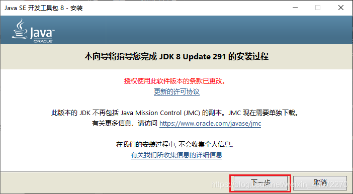
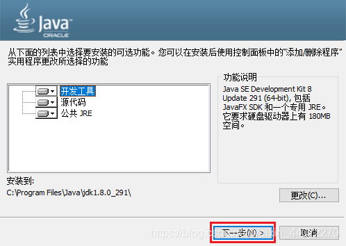
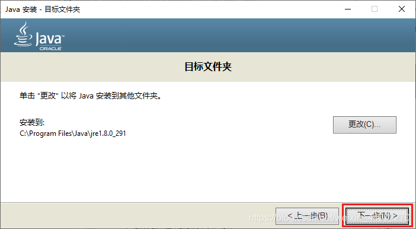
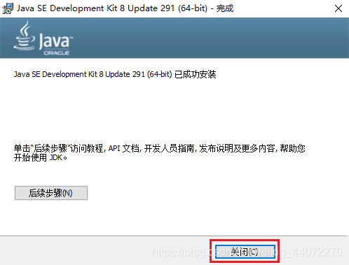
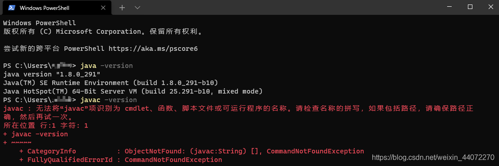
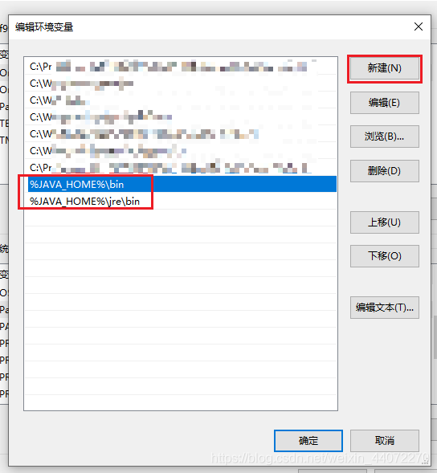
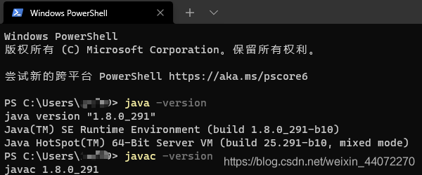
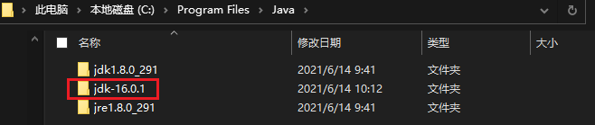
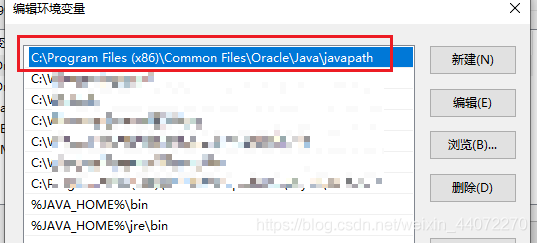

# 安装不同版本

[参考文章](https://blog.csdn.net/weixin_44072270/article/details/117897967)

### 在Windows环境配置多版本Java

- - [在Windows环境配置多版本Java](#WindowsJava_1)
  - - - [0、准备的准备](#0_3)
      - [1、下载安装包](#1_11)
      - [2、安装Java8](#2Java8_20)
      - - - [安装jdk](#jdk_21)
          - [安装jre](#jre_26)
          - [配置环境变量](#_29)
      - [3、安装Java16](#3Java16_54)
      - - - [解压文件](#_55)
          - [配置Java16环境](#Java16_62)
          - [配置JAVA_HOME](#JAVA_HOME_69)
          - [修改javapath](#javapath_80)
      - [结语](#_92)

## **在Windows环境配置多版本Java** 

相信很多小伙伴在开发springboot后端或者玩minecraft的时候都会遇到上古Java的版本要求（比如Java8），但是如今最新的Java版本已经到Java16了，如何在电脑安装多个版本的Java并做到切换呢？下面来一起看看吧

#### 0、准备的准备

多版本的Java需求一般是Java1.8+Java11之后版本的组合，本文就将以Java8和Java16两种版本的安装与配置为例。

- 如果你的电脑之前没有安装过任何版本的Java，请直接跳到第2步
- 如果你的电脑之前已经安装了Java1.8，请跳到第3步
- 如果你的电脑之前安装了Java11及更新的版本：若之前是通过.exe文件进行安装，需要在`控制面板->程序和功能`中找到安装的Java版本并完成卸载；若之前是通过二进制的.zip文件手动进行配置，需要将Java的安装目录手动进行删除，路径一般为`C:\Program Files\Java`，之后再进入到环境变量中删除JAVA_HOME、CLASSPATH、PATH中关于Java的设置

刚才这一步的目的是为了确保先安装Java8，再安装更高的版本

#### 1、下载安装包

官网地址：

Java8(Java SE Development Kit 8u291)[下载链接](https://www.oracle.com/java/technologies/javase/javase-jdk8-downloads.html) 选`jdk-8u291-windows-x64.exe`下载
 Java11(Java SE Development Kit 16.0.1)[下载链接](https://www.oracle.com/java/technologies/javase-jdk11-downloads.html) 选`jdk-11.0.11_windows-x64_bin.zip`下载
 Java16(Java SE Development Kit 16.0.1)[下载链接](https://www.oracle.com/java/technologies/javase-jdk16-downloads.html) 选`jdk-16.0.1_windows-x64_bin.zip`下载

由于Java8版本只提供了exe的安装程序，所以只能下载安装包，其余版本我们都直接选择压缩包进行下载

#### 2、安装Java8

###### 安装jdk

运行`jdk-8u291-windows-x64.exe`安装程序，无脑yes就行了
 
 可以自行修改安装位置
 

###### 安装jre

接下来安装jre，需要修改位置的话跟刚才的jdk放到同一目录下就可以了
 

###### 配置环境变量

到这里安装就完成了，我们来测试一下是否安装成功~
 可以看到java已经正常了，但是javac还是无法识别，所以需要配置环境变量
 一共需要配置三项内容：JAVA_HOME、CLASSPATH和PATH
 在**系统变量**（不是用户变量)进行修改

**JAVA_HOME**：
 变量名：`JAVA_HOME`
 变量值：刚才你安装jdk的目录，默认情况下是`C:\Program Files\Java\jdk1.8.0_291`

**CLASSPATH** ：
 变量名：`CLASSPATH`
 变量值：`.;%JAVA_HOME%\lib\dt.jar;%JAVA_HOME%\lib\tools.jar;`

**PATH**：
 双击进入编辑界面，然后点击右侧“新建”按钮，新建两条：
 `%JAVA_HOME%\bin`
 `%JAVA_HOME%\jre\bin`
 
 之后点击确认（一定要点确认，不要直接点叉，否则不会保存）

现在我们再测试一遍：
 
 java和javac都可以成功运行了，配置完成！

#### 3、安装Java16

###### 解压文件

由于java16我们下载的是压缩包，所以直接将压缩包解压之后的内容放到自己想要的位置就可以了

（这里注意一下，压缩包解压完成后里面还套了一个文件夹，写路径的时候注意别搞错了）
 
 这里我直接把东西放到刚才安装Java8的目录下面了，你愿意放到其他地方也无所谓

###### 配置Java16环境

由于CLASSPATH和PATH在刚才都配置过了，我们现在只需要配置JAVA_HOME就可以了。

还是在环境变量中新建变量JAVA16_HOME
 变量名：`JAVA16_HOME`
 变量值：你放置16版本jdk的目录，我这里是`C:\Program Files\Java\jdk-16.0.1`

###### 配置JAVA_HOME

刚才我们在Java8配置的JAVA_HOME，需要改一下名字，改为`JAVA8_HOME`

最后我们再重新创建一个变量JAVA_HOME
 变量名：`JAVA_HOME`
 变量值：`%JAVAxx_HOME%`

这样当你需要使用哪个版本的Java的时候，就直接把JAVAxx_HOME的那个xx改为你需要的版本编号就可以了

上面这些变量值的命名你也可以按照自己的习惯进行更改，只要能相互对应上就可以

###### 修改javapath 下面的我没做，也可以

进行到上面这一步还并没有完，不信你可以自己试一试当你把JAVA_HOME改为16之后在cmd中查看版本一定还是java8

这是因为PATH中的第一行javapath的优先级高于你后面自己配置JAVA_HOME的内容，而javapath被指向了Java8的版本
 

所以解决方案有两个：

- 第一个是将你自己添加的两行放到javapath那一行的上面，不管是通过把上面那一行挪下来还是下面那两行挪上去都可以
- 第二个办法是复制javapath那一行的地址到文件管理器打开，发现里面有三个文件java.exe、javaw.exe、javaws.exe，我们将这三个文件去掉即可（不推荐删除，万一以后还有用就麻烦了，可以在文件名最后加上.bak的后缀，或者改成一个你认为好看但是和原来不一样的名字就可以了）

上面这两个办法推荐第二种，因为第一种可能会引起其他一些变化（虽然也不重要）

#### 结语

到这里多版本Java的环境在我们的电脑上就配置完成了，如果需要整个系统的运行环境进行更改，直接去环境变量把JAVA_HOME对应的版本号修改就可以了。当然现在的编译器比如说IDEA和VSCode都支持在Workspace里面单独配置Java版本，非常的方便。

上文的配置思路也可以用于[Maven](https://so.csdn.net/so/search?q=Maven&spm=1001.2101.3001.7020)、nodejs等等，而python可以使用anaconda这种平台直接进行配置，更加省事方便~