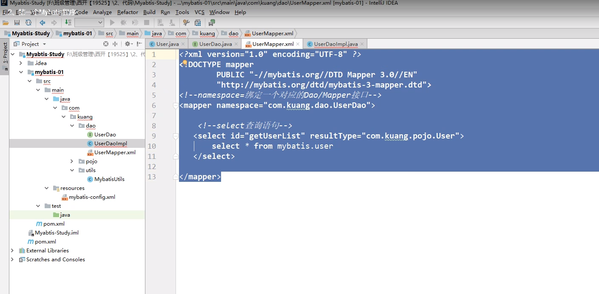

# Mybatis介绍

什么是mybatis

它解决了什么

# 创建第一个Mybatis程序

在mysql中

新建数据库 mybatis

新建 user表 id name pwd

插入一些数据

打开IDEA新建一个maven项目

在pom.xml中导入依赖：1）mysql驱动，2）mybatis,，3）Junit

创建模块 mybatis-01

编写mybatis xml配置文件 

在maven项目下src/main/resources下面新建mybatis-config.xml文件

在官网上，将xml配置的示例复制粘贴下来

编写Mybatis工具类，获取到一个对象可以执行sql语句

## 编写代码

- 创建pojo文件夹，创建User实体类

- Dao接口 

  public interface UserDao{

  }

  

  新建UserMapper.xml

  

  resultType里面填写List里面的泛型

  ## 测试

  注册Mapper

  

  测试方法

  

#  IDEA连接Mysql

# Maven写在src目录下面的配置文件，不能导出的问题

