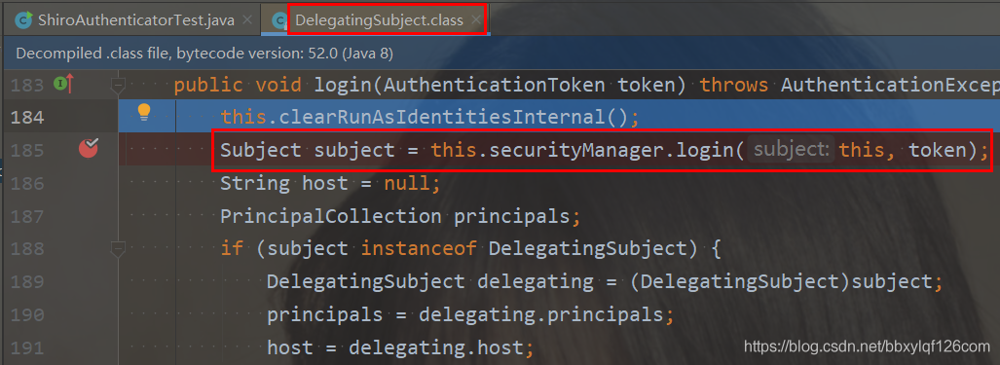
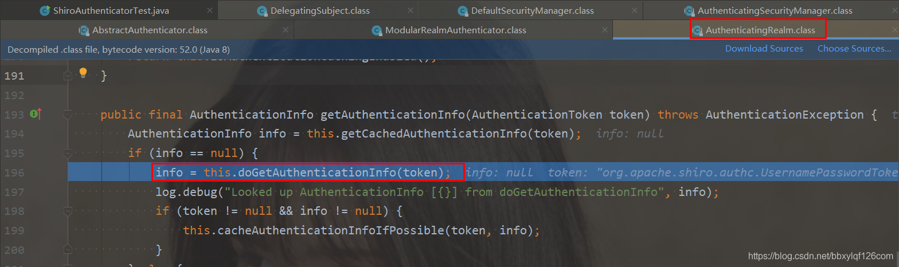
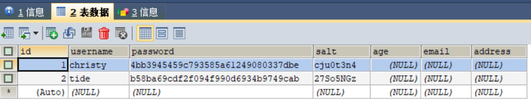

# **Shiro简介**

按照惯例，先上[官网](https://shiro.apache.org/)：https://shiro.apache.org/

## **什么是Shiro**

`Shiro`是一个功能强大且易于使用的Java安全框架，它执行身份验证、授权、加密和会话管理。使用Shiro易于理解的API，您可以快速轻松地保护任何应用程序—从最小的移动应用程序到最大的web和企业应用程序

## **Shiro核心架构**


### Subject

`Subject`即主体，外部应用与subject进行交互，subject记录了当前的操作用户，将用户的概念理解为当前操作的主体。外部程序通过subject进行认证授权，而subject是通过SecurityManager安全管理器进行认证授权

### SecurityManager

`SecurityManager`即安全管理器，对全部的subject进行安全管理，它是shiro的核心，负责对所有的subject进行安全管理。通过SecurityManager可以完成subject的认证、授权等，实质上SecurityManager是通过Authenticator进行认证，通过Authorizer进行授权，通过SessionManager进行会话管理等

`SecurityManager`是一个接口，继承了Authenticator, Authorizer, SessionManager这三个接口

### Authenticator

`Authenticator`即认证器，对用户身份进行认证，Authenticator是一个接口，shiro提供ModularRealmAuthenticator实现类，通过ModularRealmAuthenticator基本上可以满足大多数需求，也可以自定义认证器

### Authorizer

`Authorizer`即授权器，用户通过认证器认证通过，在访问功能时需要通过授权器判断用户是否有此功能的操作权限

### Realm

`Realm`即领域，相当于datasource数据源，securityManager进行安全认证需要通过Realm获取用户权限数据，比如：如果用户身份数据在数据库那么realm就需要从数据库获取用户身份信息

> ★ 
>
> 不要把realm理解成只是从数据源取数据，在realm中还有认证授权校验的相关的代码
>
> ”

### SessionManager

`sessionManager`即会话管理，shiro框架定义了一套会话管理，它不依赖web容器的[session](https://so.csdn.net/so/search?q=session&spm=1001.2101.3001.7020)，所以shiro可以使用在非web应用上，也可以将分布式应用的会话集中在一点管理，此特性可使它实现单点登录

### SessionDAO

`SessionDAO`即会话dao，是对session会话操作的一套接口，比如要将session存储到数据库，可以通过jdbc将会话存储到数据库

### CacheManager

`CacheManager`即缓存管理，将用户权限数据存储在缓存，这样可以提高性能

### Cryptography

`Cryptography`即密码管理，shiro提供了一套加密/解密的组件，方便开发。比如提供常用的散列、加/解密等功能。

# **Shiro中的认证**

## **什么是认证**

身份认证，就是判断一个用户是否为合法用户的处理过程。最常用的简单身份认证方式是系统通过核对用户输入的用户名和口令，看其是否与系统中存储的该用户的用户名和口令一致，来判断用户身份是否正确

## **三个概念**

### Subject

访问系统的用户，主体可以是用户、程序等，进行认证的都称为主体

### Principal

身份信息，是主体（subject）进行身份认证的标识，标识必须具有`唯一性`，如用户名、手机号、邮箱地址等，一个主体可以有多个身份，但是必须有一个主身份（Primary Principal）

### credential

凭证信息，是只有主体自己知道的安全信息，如密码、证书等

## **认证的实现**

1. 创建一个普通的maven项目，引入shiro的pom依赖

   ```java
   <dependency>
     <groupId>org.apache.shiro</groupId>
     <artifactId>shiro-core</artifactId>
     <version>1.5.3</version>
   </dependency>
   ```

2. 引入shiro配置文件`shiro.ini`，并加入以下配置

   ```java
   # 约定写法
   [users]
   # 用户名=密码
   christy=123456
   tide=654321
   ```

   > shiro的配置文件是一个.ini文件，类似于.txt文件
   >
   > .ini文件经常用作某些软件的特定的配置文件，可以支持一些复杂的数据格式，shiro可以按照内部约定的某种格式读取配置文件中的数据
   >
   > 之所以提供这个配置文件是用来学习shiro时书写我们系统中相关的权限数据，从而减轻配置数据库并从数据库读取数据的压力，降低学习成本，提高学习效率

3. 测试Java代码

   ```java
   import org.apache.shiro.SecurityUtils;
   import org.apache.shiro.authc.AuthenticationToken;
   import org.apache.shiro.authc.IncorrectCredentialsException;
   import org.apache.shiro.authc.UnknownAccountException;
   import org.apache.shiro.authc.UsernamePasswordToken;
   import org.apache.shiro.mgt.DefaultSecurityManager;
   import org.apache.shiro.realm.text.IniRealm;
   import org.apache.shiro.subject.Subject;
   
   public class ShiroAuthenticatorTest {
       public static void main(String[] args){
           // 1、创建安全管理器对象
           DefaultSecurityManager securityManager = new DefaultSecurityManager();
           // 2、给安全管理器设置realm
           securityManager.setRealm(new IniRealm("classpath:shiro.ini"));
           // 3、给全局安全工具类SecurityUtils设置安全管理器
           SecurityUtils.setSecurityManager(securityManager);
           // 4、拿到当前的subject
           Subject subject = SecurityUtils.getSubject();
           // 5、创建令牌
           AuthenticationToken token = new UsernamePasswordToken("christy","123456");
   
           try {
               // 6、用户认证
               System.out.println("认证状态："+subject.isAuthenticated());
               subject.login(token);
               System.out.println("认证状态："+subject.isAuthenticated());
           } catch (UnknownAccountException e){
               e.printStackTrace();
               System.out.println("认证失败：用户不存在！");
           } catch (IncorrectCredentialsException e){
               e.printStackTrace();
               System.out.println("认证失败：密码不正确！");
           } catch (Exception e){
               e.printStackTrace();
           }
       }
   }
   ```

   > 认证的几种状态
   >
   > UnknownAccountException：用户名错误
   >
   > IncorrectCredentialsException：密码错误
   >
   > DisabledAccountException：账号被禁用
   >
   > LockedAccountException：账号被锁定
   >
   > ExcessiveAttemptsException：登录失败次数过多
   >
   > ExpiredCredentialsException：凭证过期

# **Shiro认证的源码分析**

上面我们已经简单实现了shiro的认证，但是shiro内部认证的具体流程是怎么样的，这次我们通过追踪源码的方式具体分析一下。我们在认证处打上断点，点击debug模式运行，然后一步步运行到最后，中间经过的类我们都记录下来








至此啊，在SimpleAccountRealm中完成了用户名的认证。

那么密码呢？在哪里校验的呢？我们继续点击下一步，直到这里


我们看到这里断言密码是否匹配的方法，点进去


我们看到了这里拿的是我们输入的密码和根据token取出的用户中的密码做的比较来验证密码是否正确，这是系统帮我们完成的

上面我们说了用户的认证是在`SimpleAccountRealm`的`doGetAuthenticationInfo`的方法中完成的，而SimpleAccountRealm继承自`AuthorizingRealm`，而`AuthorizingRealm`中有一个抽象方法

```java
protected abstract AuthorizationInfo doGetAuthorizationInfo(PrincipalCollection var1);
```

SimpleAccountRealm就是复写了`AuthorizingRealm`中的这个抽象方法实现的用户认证，所以后面我们需要自定义认证的时候我们就可以自定义一个realm继承自`AuthorizingRealm`来复写doGetAuthorizationInfo，在这个方法里面实现我们自己的认证逻辑

不仅认证，有意思的是`AuthorizingRealm`是继承自`AuthenticatingRealm`，而AuthenticatingRealm中有个抽象方法

```java
protected abstract AuthenticationInfo doGetAuthenticationInfo(AuthenticationToken var1) throws AuthenticationException;
```

这个方法是实现用户授权的方法。

也就是说通过我们自定义realm继承`AuthorizingRealm`就可以同时复写认证和授权两个方法

**Realm的继承关系如下**


# **Shiro使用自定义Relam实现认证**

上面我们实现了简单的认证并且分析了认证的基本流程，通常情况下shiro的认证都是通过自定义relam来实现的

## **CustomerRealm**

首先我们编写自定义realm的代码：

```java
import org.apache.shiro.authc.AuthenticationException;
import org.apache.shiro.authc.AuthenticationInfo;
import org.apache.shiro.authc.AuthenticationToken;
import org.apache.shiro.authc.SimpleAuthenticationInfo;
import org.apache.shiro.authz.AuthorizationInfo;
import org.apache.shiro.realm.AuthorizingRealm;
import org.apache.shiro.subject.PrincipalCollection;

/**
 * 自定义realm
 */
public class CustomerRealm extends AuthorizingRealm {
    // 授权
    @Override
    protected AuthorizationInfo doGetAuthorizationInfo(PrincipalCollection principalCollection) {
        return null;
    }

    // 认证
    @Override
    protected AuthenticationInfo doGetAuthenticationInfo(AuthenticationToken token) throws AuthenticationException {
        // 在token中获取用户名
        String principal = (String) token.getPrincipal();
        System.out.println(principal);
        // 模拟根据身份信息从数据库查询
        if("christy".equals(principal)){
            // 参数说明：用户名 | 密码 | 当前realm的名字
            SimpleAuthenticationInfo simpleAuthenticationInfo = new SimpleAuthenticationInfo(principal,"123456",this.getName());
            return simpleAuthenticationInfo;
        }

        return null;
    }
}
```

## **CustomerRealmAuthenticatorTest**

```java
import com.christy.shiro.realm.CustomerRealm;
import org.apache.shiro.SecurityUtils;
import org.apache.shiro.authc.IncorrectCredentialsException;
import org.apache.shiro.authc.UnknownAccountException;
import org.apache.shiro.authc.UsernamePasswordToken;
import org.apache.shiro.mgt.DefaultSecurityManager;
import org.apache.shiro.subject.Subject;

public class CustomerRealmAuthenticatorTest {
    public static void main(String[] args) {
        // 创建SecurityManager
        DefaultSecurityManager defaultSecurityManager = new DefaultSecurityManager();
        // 设置自定义realm
        defaultSecurityManager.setRealm(new CustomerRealm());
        // 设置安全工具类
        SecurityUtils.setSecurityManager(defaultSecurityManager);
        // 通过安全工具类获取subject
        Subject subject = SecurityUtils.getSubject();
        // 创建token
        UsernamePasswordToken token = new UsernamePasswordToken("christy", "123456");
        try {
            // 登录认证
            subject.login(token);
            System.out.println(subject.isAuthenticated());
        } catch (UnknownAccountException e) {
            e.printStackTrace();
            System.out.println("用户名错误");
        } catch (IncorrectCredentialsException e) {
            e.printStackTrace();
            System.out.println("密码错误");
        }
    }
}
```

## **测试**

以上代码编写完成后，我们运行`CustomerRealmAuthenticatorTest`里面的main方法，执行结果如下


# **Shiro的加密和随机盐**

## **Shiro中密码的加密策略**

实际应用中用户的密码并不是明文存储在数据库中的，而是采用一种加密算法将密码加密后存储在数据库中。Shiro中提供了一整套的加密算法，并且提供了随机盐。shiro使用指定的加密算法将用户密码和随机盐进行加密，并按照指定的散列次数将散列后的密码存储在数据库中。由于随机盐每个用户可以不同，这就极大的提高了密码的安全性。

## **Shiro中的加密方式**

```java
import org.apache.shiro.crypto.hash.Md5Hash;

public class ShiroMD5Test {
    public static void main(String[] args){
        // MD5加密，无随机盐，无散列
        Md5Hash md5Hash01 = new Md5Hash("123456");
        System.out.println(md5Hash01.toHex());

        // MD5+随机盐加密，无散列
        Md5Hash md5Hash02 = new Md5Hash("123456","1q2w3e");
        System.out.println(md5Hash02.toHex());

        // MD5+随机盐加密+散列1024
        Md5Hash md5Hash03 = new Md5Hash("123456","1q2w3e",1024);
        System.out.println(md5Hash03.toHex());
    }
}
```

运行结果如下

```java
e10adc3949ba59abbe56e057f20f883e
9eab7472e164bb8c1b823ae960467f74
41a4e25bcf1272844e38b19047dd68a0
```

# **Shiro中自定义加密Realm**

## **CustomerMD5Realm**

```java
import org.apache.shiro.authc.AuthenticationException;
import org.apache.shiro.authc.AuthenticationInfo;
import org.apache.shiro.authc.AuthenticationToken;
import org.apache.shiro.authc.SimpleAuthenticationInfo;
import org.apache.shiro.authz.AuthorizationInfo;
import org.apache.shiro.realm.AuthorizingRealm;
import org.apache.shiro.subject.PrincipalCollection;
import org.apache.shiro.util.ByteSource;

public class CustomerMD5Realm extends AuthorizingRealm {
    @Override
    protected AuthorizationInfo doGetAuthorizationInfo(PrincipalCollection principalCollection) {
        return null;
    }

    // 认证
    @Override
    protected AuthenticationInfo doGetAuthenticationInfo(AuthenticationToken token) throws AuthenticationException {
        // 从token中获取用户名
        String principal = (String) token.getPrincipal();
        if("christy".equals(principal)){
            /**
             * 用户名
             * 加密后的密码
             * 随机盐
             * 当前realm的名称
             */
            return new SimpleAuthenticationInfo(principal,
                    "41a4e25bcf1272844e38b19047dd68a0",
                    ByteSource.Util.bytes("1q2w3e"),
                    this.getName());
        }
        return null;
    }
}
```

## **CustomerMD5AuthenticatorTest**

```java
import com.christy.shiro.realm.CustomerMD5Realm;
import org.apache.shiro.SecurityUtils;
import org.apache.shiro.authc.IncorrectCredentialsException;
import org.apache.shiro.authc.UnknownAccountException;
import org.apache.shiro.authc.UsernamePasswordToken;
import org.apache.shiro.authc.credential.HashedCredentialsMatcher;
import org.apache.shiro.mgt.DefaultSecurityManager;
import org.apache.shiro.subject.Subject;

public class CustomerMD5AuthenticatorTest {
    public static void main(String[] args) {
        // 创建SecurityManager
        DefaultSecurityManager defaultSecurityManager = new DefaultSecurityManager();
        // 设置自定义realm
        CustomerMD5Realm realm = new CustomerMD5Realm();
        // 为realm设置凭证匹配器
        HashedCredentialsMatcher credentialsMatcher = new HashedCredentialsMatcher();
        // 设置加密算法
        credentialsMatcher.setHashAlgorithmName("md5");
        // 设置hash次数
        credentialsMatcher.setHashIterations(1024);
        realm.setCredentialsMatcher(credentialsMatcher);
        defaultSecurityManager.setRealm(realm);
        // 设置安全工具类
        SecurityUtils.setSecurityManager(defaultSecurityManager);
        // 通过安全工具类获取subject
        Subject subject = SecurityUtils.getSubject();
        // 创建token
        UsernamePasswordToken token = new UsernamePasswordToken("christy", "123456");
        try {
            // 登录认证
            subject.login(token);
            System.out.println("认证成功");
        } catch (UnknownAccountException e) {
            e.printStackTrace();
            System.out.println("用户名错误");
        } catch (IncorrectCredentialsException e) {
            e.printStackTrace();
            System.out.println("密码错误");
        }
    }
}
```

## **测试**


# **Shiro中的授权**

## **什么是授权**

**授权可简单理解为who对what(which)进行How操作：**

`Who，即主体（Subject）`，主体需要访问系统中的资源。

`What，即资源（Resource)`，如系统菜单、页面、按钮、类方法、系统商品信息等。资源包括`资源类型`和`资源实例`，比如`商品信息为资源类型`，类型为t01的商品为`资源实例`，编号为001的商品信息也属于资源实例。

`How，权限/许可（Permission)`，规定了主体对资源的操作许可，权限离开资源没有意义，如用户查询权限、用户添加权限、某个类方法的调用权限、编号为001用户的修改权限等，通过权限可知主体对哪些资源都有哪些操作许可。

## **授权方式**

### 基于角色的访问控制

RBAC基于角色的访问控制（Role-Based Access Control）是以角色为中心进行访问控制

```java
if(subject.hasRole("admin")){
   //操作什么资源
}
```

### 基于资源的访问控制

RBAC基于资源的访问控制（Resource-Based Access Control）是以资源为中心进行访问控制

```java
if(subject.isPermission("user:update:01")){ //资源实例
  //对01用户进行修改
}
if(subject.isPermission("user:update:*")){  //资源类型
  //对01用户进行修改
}
```

## **权限字符串**

 权限字符串的规则是：**资源标识符：操作：资源实例标识符**，意思是对哪个资源的哪个实例具有什么操作，“:”是资源/操作/实例的分割符，权限字符串也可以使用*通配符。

例子：

- 用户创建权限：user:create，或user:create:*
- 用户修改实例001的权限：user:update:001
- 用户实例001的所有权限：user:*：001

## **权限的编码方式**

### 编程式

```java
Subject subject = SecurityUtils.getSubject();
if(subject.hasRole("admin")) {
	//有权限
} else {
	//无权限
}
```

### 注解式

```java
@RequiresRoles("admin")
public void hello() {
	//有权限
}
```

### 标签式

```jsp
JSP/GSP 标签：在JSP/GSP 页面通过相应的标签完成：
<shiro:hasRole name="admin">
	<!— 有权限—>
</shiro:hasRole>
注意: Thymeleaf 中使用shiro需要额外集成!
```

## **授权的实现**

我们基于上面MD5加密的例子进行修改

### CustomerMD5Realm

```java
import org.apache.shiro.authc.AuthenticationException;
import org.apache.shiro.authc.AuthenticationInfo;
import org.apache.shiro.authc.AuthenticationToken;
import org.apache.shiro.authc.SimpleAuthenticationInfo;
import org.apache.shiro.authz.AuthorizationInfo;
import org.apache.shiro.realm.AuthorizingRealm;
import org.apache.shiro.subject.PrincipalCollection;
import org.apache.shiro.util.ByteSource;

public class CustomerMD5Realm extends AuthorizingRealm {
    @Override
    protected AuthorizationInfo doGetAuthorizationInfo(PrincipalCollection principals) {
        // 从系统返回的身份信息集合中获取主身份信息（用户名）
        String primaryPrincipal = (String) principals.getPrimaryPrincipal();
        System.out.println("用户名: "+primaryPrincipal);

        //根据用户名获取当前用户的角色信息,以及权限信息
        SimpleAuthorizationInfo simpleAuthorizationInfo = new SimpleAuthorizationInfo();

        //将数据库中查询角色信息赋值给权限对象
        simpleAuthorizationInfo.addRole("admin");
        simpleAuthorizationInfo.addRole("user");

        //将数据库中查询权限信息赋值个权限对象
        simpleAuthorizationInfo.addStringPermission("user:*:01");
        simpleAuthorizationInfo.addStringPermission("product:create");

        return simpleAuthorizationInfo;
    }

    // 认证
    @Override
    protected AuthenticationInfo doGetAuthenticationInfo(AuthenticationToken token) throws AuthenticationException {
        // 从token中获取用户名
        String principal = (String) token.getPrincipal();
        if("christy".equals(principal)){
            /**
             * 用户名
             * 加密后的密码
             * 随机盐
             * 当前realm的名称
             */
            return new SimpleAuthenticationInfo(principal,
                    "41a4e25bcf1272844e38b19047dd68a0",
                    ByteSource.Util.bytes("1q2w3e"),
                    this.getName());
        }
        return null;
    }
}
```

### CustomerMD5AuthenticatorTest

```java
import com.christy.shiro.realm.CustomerMD5Realm;
import org.apache.shiro.SecurityUtils;
import org.apache.shiro.authc.IncorrectCredentialsException;
import org.apache.shiro.authc.UnknownAccountException;
import org.apache.shiro.authc.UsernamePasswordToken;
import org.apache.shiro.authc.credential.HashedCredentialsMatcher;
import org.apache.shiro.mgt.DefaultSecurityManager;
import org.apache.shiro.subject.Subject;

public class CustomerMD5AuthenticatorTest {
    public static void main(String[] args) {
        // 创建SecurityManager
        DefaultSecurityManager defaultSecurityManager = new DefaultSecurityManager();
        // 设置自定义realm
        CustomerMD5Realm realm = new CustomerMD5Realm();
        // 为realm设置凭证匹配器
        HashedCredentialsMatcher credentialsMatcher = new HashedCredentialsMatcher();
        // 设置加密算法
        credentialsMatcher.setHashAlgorithmName("md5");
        // 设置hash次数
        credentialsMatcher.setHashIterations(1024);
        realm.setCredentialsMatcher(credentialsMatcher);
        defaultSecurityManager.setRealm(realm);
        // 设置安全工具类
        SecurityUtils.setSecurityManager(defaultSecurityManager);
        // 通过安全工具类获取subject
        Subject subject = SecurityUtils.getSubject();
        // 创建token
        UsernamePasswordToken token = new UsernamePasswordToken("christy", "123456");
        try {
            // 登录认证
            subject.login(token);
            System.out.println("认证成功");  
        } catch (UnknownAccountException e) {
            e.printStackTrace();
            System.out.println("用户名错误");
        } catch (IncorrectCredentialsException e) {
            e.printStackTrace();
            System.out.println("密码错误");
        }
        
        //授权
        if(subject.isAuthenticated()){
            //基于角色权限控制
            System.out.println(subject.hasRole("super"));

            //基于多角色权限控制(同时具有)
            System.out.println(subject.hasAllRoles(Arrays.asList("admin", "super")));

            //是否具有其中一个角色
            boolean[] booleans = subject.hasRoles(Arrays.asList("admin", "super", "user"));
            for (boolean aBoolean : booleans) {
                System.out.println(aBoolean);
            }
            
            System.out.println("==============================================");

            //基于权限字符串的访问控制  资源标识符:操作:资源类型
            System.out.println("权限:"+subject.isPermitted("user:update:01"));
            System.out.println("权限:"+subject.isPermitted("product:create:02"));

            //分别具有那些权限
            boolean[] permitted = subject.isPermitted("user:*:01", "order:*:10");
            for (boolean b : permitted) {
                System.out.println(b);
            }

            //同时具有哪些权限
            boolean permittedAll = subject.isPermittedAll("user:*:01", "product:create:01");
            System.out.println(permittedAll);
        }
    }
}
```

### 测试

```java
用户名: christy
false
用户名: christy
用户名: christy
false
用户名: christy
用户名: christy
用户名: christy
true
false
true
==============================================
用户名: christy
权限:true
用户名: christy
权限:true
用户名: christy
用户名: christy
true
false
用户名: christy
用户名: christy
true
```

# **Springboot整合Shiro**

## **springboot基本环境搭建**

我们新建一个springboot工程`springboot_shiro_jsp`，本案例使用jsp作为前端页面展示形式，所以新建的springboot工程需要进行一下配置

### pom.xml依赖

在pom文件中我们引入jsp解析的依赖

```java
<!-- 引入jsp依赖 -->
<dependency>
    <groupId>org.apache.tomcat.embed</groupId>
    <artifactId>tomcat-embed-jasper</artifactId>
</dependency>

<dependency>
    <groupId>jstl</groupId>
    <artifactId>jstl</artifactId>
    <version>1.2</version>
</dependency>
```

### webapp目录

在`main`目录下我们新建一个`webapp`目录，目录里面新建一个jsp文件`index.jsp`

```jsp
<!doctype html>
<html lang="en">
    <head>
        <meta charset="UTF-8">
        <meta name="viewport" content="width=device-width, user-scalable=no, initial-scale=1.0, maximum-scale=1.0, minimum-scale=1.0">
        <meta http-equiv="X-UA-Compatible" content="ie=edge">
        <title>index</title>
    </head>

    <body>
        hello world!
    </body>
</html>
```

### application.yml配置jsp模板

```java
spring:  
  # 设置视图模板为jsp
  mvc:
    view:
      prefix: /
      suffix: .jsp

123456
```

### Working directory目录


### 启动

以上配置完毕后，启动我们的项目，输入`http://localhost:8888/index.jsp`


至此，最基本的springboot集成jsp的环境已经搭建完毕了，后面我们要集成shiro

## **项目中引入Shiro**

### pom.xml依赖

```java
<!-- shiro -->
<dependency>
	<groupId>org.apache.shiro</groupId>
  	<artifactId>shiro-spring-boot-starter</artifactId>
  	<version>1.5.3</version>
</dependency>

123456
```

### 自定义Realm

我们知道实际开发中使用shiro时都是使用自定的realm，我们先不管三七二十一，先自定义一个realm，暂时不实现认证和授权

```java
import org.apache.shiro.authc.AuthenticationException;
import org.apache.shiro.authc.AuthenticationInfo;
import org.apache.shiro.authc.AuthenticationToken;
import org.apache.shiro.authz.AuthorizationInfo;
import org.apache.shiro.realm.AuthorizingRealm;
import org.apache.shiro.subject.PrincipalCollection;

/**
 * 自定义realm
 */
public class CustomerRealm extends AuthorizingRealm {
    // 授权
    @Override
    protected AuthorizationInfo doGetAuthorizationInfo(PrincipalCollection principals) {
        return null;
    }

    // 认证
    @Override
    protected AuthenticationInfo doGetAuthenticationInfo(AuthenticationToken token) throws AuthenticationException {
        return null;
    }
}

1234567891011121314151617181920212223
```

### ShiroConfiguration

这个类是Shiro的核心配置类，里面继承了ShiroFilter、SecurityManager和上面的自定义的Realm

```java
import com.christy.shiro.realm.CustomerRealm;
import org.apache.shiro.realm.Realm;
import org.apache.shiro.spring.web.ShiroFilterFactoryBean;
import org.apache.shiro.web.mgt.DefaultWebSecurityManager;
import org.springframework.context.annotation.Bean;
import org.springframework.context.annotation.Configuration;

import java.util.HashMap;
import java.util.Map;

/**
 * Shiro的核心配置类，用来整合shiro框架
 */
@Configuration
public class ShiroConfiguration {

    //1.创建shiroFilter  //负责拦截所有请求
    @Bean
    public ShiroFilterFactoryBean getShiroFilterFactoryBean(DefaultWebSecurityManager defaultWebSecurityManager){
        ShiroFilterFactoryBean shiroFilterFactoryBean = new ShiroFilterFactoryBean();

        //给filter设置安全管理器
        shiroFilterFactoryBean.setSecurityManager(defaultWebSecurityManager);

        //配置系统受限资源
        //配置系统公共资源
        Map<String,String> map = new HashMap<String,String>();
        map.put("/index.jsp","authc");//authc 请求这个资源需要认证和授权

        //默认认证界面路径
        shiroFilterFactoryBean.setLoginUrl("/login.jsp");
        shiroFilterFactoryBean.setFilterChainDefinitionMap(map);

        return shiroFilterFactoryBean;
    }

    //2.创建安全管理器
    @Bean
    public DefaultWebSecurityManager getDefaultWebSecurityManager(Realm realm){
        DefaultWebSecurityManager defaultWebSecurityManager = new DefaultWebSecurityManager();
        //给安全管理器设置
        defaultWebSecurityManager.setRealm(realm);

        return defaultWebSecurityManager;
    }

    //3.创建自定义realm
    @Bean
    public Realm getRealm(){
        CustomerRealm customerRealm = new CustomerRealm();
        return customerRealm;
    }
}

1234567891011121314151617181920212223242526272829303132333435363738394041424344454647484950515253
```

### login.jsp与index.jsp

在上面的`ShiroConfiguration`类中，我们看到未认证的用户访问受限资源(这里指index.jsp)时会自动跳转到登录页面login.jsp，shiro默认的登录页面也是这个，我们新建一个login.jsp

```jsp
<%--解决页面乱码--%>
<%@page contentType="text/html; UTF-8" pageEncoding="UTF-8" isELIgnored="false" %>
<!doctype html>
<html lang="en">
    <head>
        <meta charset="UTF-8">
        <meta name="viewport" content="width=device-width, user-scalable=no, initial-scale=1.0, maximum-scale=1.0, minimum-scale=1.0">
        <meta http-equiv="X-UA-Compatible" content="ie=edge">
        <title>index</title>
    </head>

    <body>
        <h1>用户登录</h1>
    </body>
</html>

```

为了与login.jsp区别开来，我们更改index.jsp的内容如下

```java
<%--解决页面乱码--%>
<%@page contentType="text/html; UTF-8" pageEncoding="UTF-8" isELIgnored="false" %>
<!doctype html>
<html lang="en">
    <head>
        <meta charset="UTF-8">
        <meta name="viewport"
              content="width=device-width, user-scalable=no, initial-scale=1.0, maximum-scale=1.0, minimum-scale=1.0">
        <meta http-equiv="X-UA-Compatible" content="ie=edge">
        <title>login</title>
    </head>

    <body>
        <h1>系统主页</h1>

        <ul>
            <li><a href="">用户管理</a></li>
            <li><a href="">订单管理</a></li>
        </ul>
    </body>
</html>
```

### 启动

以上工作准备完毕后，我们启动项目再次访问index.jsp，发现页面跳转到登录页面。这就说明我们的项目中成功的引入了Shiro

## **Shiro中常见过滤器**

| 配置缩写          | 对应的过滤器                   | 功能                                                         |
| :---------------- | :----------------------------- | :----------------------------------------------------------- |
| anon              | AnonymousFilter                | 指定url可以匿名访问                                          |
| authc             | FormAuthenticationFilter       | 指定url需要form表单登录，默认会从请求中获取`username`、`password`,`rememberMe`等参数并尝试登录，如果登录不了就会跳转到loginUrl配置的路径。我们也可以用这个过滤器做默认的登录逻辑，但是一般都是我们自己在控制器写登录逻辑的，自己写的话出错返回的信息都可以定制嘛。 |
| authcBasic        | BasicHttpAuthenticationFilter  | 指定url需要basic登录                                         |
| logout            | LogoutFilter                   | 登出过滤器，配置指定url就可以实现退出功能，非常方便          |
| noSessionCreation | NoSessionCreationFilter        | 禁止创建会话                                                 |
| perms             | PermissionsAuthorizationFilter | 需要指定权限才能访问                                         |
| port              | PortFilter                     | 需要指定端口才能访问                                         |
| rest              | HttpMethodPermissionFilter     | 将http请求方法转化成相应的动词来构造一个权限字符串，这个感觉意义不大，有兴趣自己看源码的注释 |
| roles             | RolesAuthorizationFilter       | 需要指定角色才能访问                                         |
| ssl               | SslFilter                      | 需要https请求才能访问                                        |
| user              | UserFilter                     | 需要已登录或“记住我”的用户才能访问                           |

## **项目中实现认证和退出**

### login.jsp中实现登录

既然要实现认证就需要用户有登录操作，此时我们去修改以下login.jsp

```jsp
<form action="${pageContext.request.contextPath}/user/login" method="post">
        用户名:<input type="text" name="username" > <br/>
        密码  : <input type="text" name="password"> <br>
        <input type="submit" value="登录">
</form>

12345
```

我么看到上面的登录请求的url是`user/login`,这个时候我们就需要一个控制器UserController了

```java
import org.apache.shiro.SecurityUtils;
import org.apache.shiro.authc.IncorrectCredentialsException;
import org.apache.shiro.authc.UnknownAccountException;
import org.apache.shiro.authc.UsernamePasswordToken;
import org.apache.shiro.subject.Subject;
import org.springframework.stereotype.Controller;
import org.springframework.web.bind.annotation.RequestMapping;

@Controller
@RequestMapping("user")
public class UserController {
    /**
     * 用户登录
     * @param username
     * @param password
     * @return
     */
    @RequestMapping("login")
    public String login(String username,String password){
        // 获取当前登录用户
        Subject subject = SecurityUtils.getSubject();

        try {
            // 执行登录操作
            subject.login(new UsernamePasswordToken(username,password));
            // 认证通过后直接跳转到index.jsp
            return "redirect:/index.jsp";
        } catch (UnknownAccountException e) {
            e.printStackTrace();
            System.out.println("用户名错误~");
        } catch (IncorrectCredentialsException e) {
            e.printStackTrace();
            System.out.println("密码错误~");
        } catch (Exception e) {
            e.printStackTrace();
        }
        // 如果认证失败仍然回到登录页面
        return "redirect:/login.jsp";
    }
}


1234567891011121314151617181920212223242526272829303132333435363738394041
```

### index.jsp中实现退出

上面我们说了出了认证还有退出功能也要实现，下面我们在index.jsp中实现

```jsp
<%--解决页面乱码--%>
<%@page contentType="text/html; UTF-8" pageEncoding="UTF-8" isELIgnored="false" %>
<!doctype html>
<html lang="en">
    <head>
        <meta charset="UTF-8">
        <meta name="viewport"
              content="width=device-width, user-scalable=no, initial-scale=1.0, maximum-scale=1.0, minimum-scale=1.0">
        <meta http-equiv="X-UA-Compatible" content="ie=edge">
        <title>index</title>
    </head>

    <body>
        <h1>系统主页</h1>
        <a href="${pageContext.request.contextPath}/user/logout">退出用户</a>
        <ul>
            <li><a href="">用户管理</a></li>
            <li><a href="">订单管理</a></li>
        </ul>
    </body>
</html>

123456789101112131415161718192021
```

同样的我们需要在UserController中实现退出的操作

```java
@RequestMapping("logout")
public String logout(){
    Subject subject = SecurityUtils.getSubject();
    subject.logout();
    // 退出后仍然会到登录页面
    return "redirect:/login.jsp";
}

1234567
```

### 在CustomerRealm中实现认证

```java
import org.apache.shiro.authc.AuthenticationException;
import org.apache.shiro.authc.AuthenticationInfo;
import org.apache.shiro.authc.AuthenticationToken;
import org.apache.shiro.authc.SimpleAuthenticationInfo;
import org.apache.shiro.authz.AuthorizationInfo;
import org.apache.shiro.realm.AuthorizingRealm;
import org.apache.shiro.subject.PrincipalCollection;

/**
 * 自定义realm
 */
public class CustomerRealm extends AuthorizingRealm {
    // 授权
    @Override
    protected AuthorizationInfo doGetAuthorizationInfo(PrincipalCollection principals) {
        return null;
    }

    // 认证
    @Override
    protected AuthenticationInfo doGetAuthenticationInfo(AuthenticationToken token) throws AuthenticationException {
        // 获取当前登录的主题
        String principal = (String) token.getPrincipal();
        // 模拟数据库返回的数据
        if("christy".equals(principal)){
            return new SimpleAuthenticationInfo(principal,"123456",this.getName());
        }
        return null;
    }
}

123456789101112131415161718192021222324252627282930
```

上面的认证中只要我们输入的用户名是`christy`，密码`123456`就可以认证通过进入到主页

### ShiroConfiguration

最后还有一步千万不能忘了就是修改ShiroConfiguration

```java
//配置系统受限资源
//配置系统公共资源
Map<String,String> map = new HashMap<String,String>();
map.put("/user/login","anon");  // anon 设置为公共资源，放行要注意anon和authc的顺序
map.put("/index.jsp","authc");  //authc 请求这个资源需要认证和授权

//默认认证界面路径
shiroFilterFactoryBean.setLoginUrl("/login.jsp");
shiroFilterFactoryBean.setFilterChainDefinitionMap(map);

123456789
```

### 测试

以上操作准备完毕后，我们重启项目后进行测试


## **MD5、Salt的注册流程**

### 新建register.jsp

```jsp
<%--解决页面乱码--%>
<%@page contentType="text/html; UTF-8" pageEncoding="UTF-8" isELIgnored="false" %>
<!doctype html>
<html lang="en">
    <head>
        <meta charset="UTF-8">
        <meta name="viewport"
              content="width=device-width, user-scalable=no, initial-scale=1.0, maximum-scale=1.0, minimum-scale=1.0">
        <meta http-equiv="X-UA-Compatible" content="ie=edge">
        <title>register</title>
    </head>

    <body>
        <h1>用户注册</h1>

        <form action="${pageContext.request.contextPath}/user/register" method="post">
            用户名:<input type="text" name="username" > <br/>
            密码  : <input type="text" name="password"> <br>
            <input type="submit" value="立即注册">
        </form>
    </body>
</html>

12345678910111213141516171819202122
```

### 新建t_user

```sql
DROP TABLE IF EXISTS `t_user`;
create table `t_user` (
	`id` int (11),
	`username` varchar (32),
	`password` varchar (32),
	`salt` varchar (32),
	`age` int (11),
	`email` varchar (32),
	`address` varchar (128)
); 

12345678910
```

### 修改pom.xml

```xml
<!-- mybatis plus -->
<dependency>
    <groupId>com.baomidou</groupId>
    <artifactId>mybatis-plus-boot-starter</artifactId>
    <version>3.4.1</version>
</dependency>

<!-- Druid数据源 -->
<dependency>
    <groupId>com.alibaba</groupId>
    <artifactId>druid-spring-boot-starter</artifactId>
    <version>1.1.10</version>
</dependency>

<!-- Mysql -->
<dependency>
    <groupId>mysql</groupId>
    <artifactId>mysql-connector-java</artifactId>
    <scope>runtime</scope>
</dependency>

1234567891011121314151617181920
```

### 修改application.yml

```properties
spring:
  datasource:
    type: com.alibaba.druid.pool.DruidDataSource
    druid:
      driver-class-name: com.mysql.jdbc.Driver
      url: jdbc:mysql://localhost:3306/christy?useUnicode=true&characterEncoding=UTF-8&allowMultiQueries=true&serverTimezone=UTC
      username: root
      password: 123456
      # 监控统计拦截的filters
      filters: stat,wall,log4j,config
      # 配置初始化大小/最小/最大
      initial-size: 5
      min-idle: 5
      max-active: 20
      # 获取连接等待超时时间
      max-wait: 60000
      # 间隔多久进行一次检测，检测需要关闭的空闲连接
      time-between-eviction-runs-millis: 60000
      # 一个连接在池中最小生存的时间
      min-evictable-idle-time-millis: 300000
      validation-query: SELECT 'x'
      test-while-idle: true
      test-on-borrow: false
      test-on-return: false
      # 打开PSCache，并指定每个连接上PSCache的大小。oracle设为true，mysql设为false。分库分表较多推荐设置为false
      pool-prepared-statements: false
      max-pool-prepared-statement-per-connection-size: 20
      
mybatis-plus:
  type-aliases-package: com.christy.shiro.model.entity
  configuration:
    map-underscore-to-camel-case: true

1234567891011121314151617181920212223242526272829303132
```

### 新建User.java

```java
/**
 * @Author Christy
 * @DESC
 * @Date 2020/11/16 15:38
 **/
@Data
@NoArgsConstructor
@AllArgsConstructor
@TableName("t_user")
@ApiModel("用户实体类")
public class User implements Serializable {
    /** 数据库中设置该字段自增时该注解不能少 **/
    @TableId(type = IdType.AUTO)
    @ApiModelProperty(name = "id", value = "ID 主键")
    private Integer id;

    @TableField(fill = FieldFill.INSERT_UPDATE)
    @ApiModelProperty(name = "username", value = "用户名")
    private String username;

    @TableField(fill = FieldFill.INSERT_UPDATE)
    @ApiModelProperty(name = "password", value = "密码")
    private String password;

    @TableField(fill = FieldFill.INSERT)
    @ApiModelProperty(name = "salt", value = "盐")
    private String salt;

    @TableField(fill = FieldFill.INSERT_UPDATE)
    @ApiModelProperty(name = "age", value = "年龄")
    private Integer age;

    @TableField(fill = FieldFill.INSERT_UPDATE)
    @ApiModelProperty(name = "email", value = "邮箱")
    private String email;

    @TableField(fill = FieldFill.INSERT_UPDATE)
    @ApiModelProperty(name = "address", value = "地址")
    private String address;
}

12345678910111213141516171819202122232425262728293031323334353637383940
```

### 新建UserMapper.java

```java
package com.christy.shiro.model.mapper;

import com.baomidou.mybatisplus.core.mapper.BaseMapper;
import com.christy.shiro.model.entity.User;
import org.apache.ibatis.annotations.Mapper;

/**
 * @Author Christy
 * @DESC
 * @Date 2020/11/16 15:49
 **/
@Mapper
public interface UserMapper extends BaseMapper<User> {

}

123456789101112131415
```

### 新建UserService.java、UserServiceImpl.java及相关类

#### UserService.java

```java
import com.christy.shiro.model.entity.User;

public interface UserService {
    /**
     * 用户注册
     * @param user
     */
    void register(User user);
}

12345678910
```

#### UserServiceImpl.java

```java
package com.christy.shiro.service.impl;

import com.christy.shiro.constants.ShiroConstant;
import com.christy.shiro.model.entity.User;
import com.christy.shiro.model.mapper.UserMapper;
import com.christy.shiro.service.UserService;
import com.christy.shiro.utils.SaltUtil;
import org.apache.shiro.crypto.hash.Md5Hash;
import org.springframework.beans.factory.annotation.Autowired;
import org.springframework.stereotype.Service;

@Service
public class UserServiceImpl implements UserService {
    @Autowired
    private UserMapper userMapper;

    @Override
    public void register(User user) {
        // 生成随机盐
        String salt = SaltUtil.getSalt(ShiroConstant.SALT_LENGTH);
        // 保存随机盐
        user.setSalt(salt);
        // 生成密码
        Md5Hash password = new Md5Hash(user.getPassword(), salt, ShiroConstant.HASH_ITERATORS);
        // 保存密码
        user.setPassword(password.toHex());
        userMapper.insert(user);
    }
}

1234567891011121314151617181920212223242526272829
```

#### SaltUtil.java

```java
package com.christy.shiro.utils;

import java.util.Random;

/**
 * 用户随机盐生成工具类
 */
public class SaltUtil {
    /**
     * 生成salt的静态方法
     * @param n
     * @return
     */
    public static String getSalt(int n){
        char[] chars = "ABCDEFGHIJKLMNOPQRSTUVWXYZabcdefghijklmnopqrstuvwxyz01234567890!@#$%^&*()".toCharArray();
        StringBuilder sb = new StringBuilder();
        for (int i = 0; i < n; i++) {
            char aChar = chars[new Random().nextInt(chars.length)];
            sb.append(aChar);
        }
        return sb.toString();
    }
}

1234567891011121314151617181920212223
```

#### ShiroConstant.java

```java
package com.christy.shiro.constants;

public class ShiroConstant {
    /** 随机盐的位数 **/
    public static final int SALT_LENGTH = 8;
    /** hash的散列次数 **/
    public static final int HASH_ITERATORS = 1024;

}

123456789
```

### 修改UserController.java

```java
package com.christy.shiro.controller;

import com.christy.shiro.model.entity.User;
import com.christy.shiro.service.UserService;
import org.apache.shiro.SecurityUtils;
import org.apache.shiro.authc.IncorrectCredentialsException;
import org.apache.shiro.authc.UnknownAccountException;
import org.apache.shiro.authc.UsernamePasswordToken;
import org.apache.shiro.subject.Subject;
import org.springframework.beans.factory.annotation.Autowired;
import org.springframework.stereotype.Controller;
import org.springframework.web.bind.annotation.RequestMapping;

@Controller
@RequestMapping("user")
public class UserController {
    @Autowired
    private UserService userService;
    
    …………省略其他方法…………
    
	/**
     * 用户注册
     * @param user
     * @return
     */
    @RequestMapping("register")
    public String register(User user){
        try {
            userService.register(user);
            return "redirect:/login.jsp";
        } catch (Exception e) {
            e.printStackTrace();
        }
        return "redirect:/register.jsp";
    }
}

12345678910111213141516171819202122232425262728293031323334353637
```

### 修改ShiroConfiguration.java

最后不要忘记修改`ShiroConfiguration.java`，将`register.jsp`和`/user/register`配置成公共的可访问资源

```java
    // anon 设置为公共资源，放行要注意anon和authc的顺序
    map.put("/user/register","anon");
    map.put("/register.jsp","anon");

123
```

### 重启项目测试


可以看到我们注册的用户已经顺利保存到数据库，而且密码是经过加密的

## **MD5、Salt的认证流程**

上面我们完成了基于MD5+Salt的注册流程，保存到数据库的密码都是经过加密处理的，这时候再用最初的简单密码匹配器进行`equals`方法进行登录显然是不行的了，我们下面来改造一下认证的流程

### 修改UserService.java、UserServiceImpl.java

#### UserService.java

```java
package com.christy.shiro.service;

import com.christy.shiro.model.entity.User;

public interface UserService {
    ……省略其他方法……

    /**
     * 根据用户名获取用户
     */
    User findUserByUserName(String userName);
}

123456789101112
```

#### UserServiceImpl.java

```java
package com.christy.shiro.service.impl;

import com.christy.shiro.constants.ShiroConstant;
import com.christy.shiro.model.entity.User;
import com.christy.shiro.model.mapper.UserMapper;
import com.christy.shiro.service.UserService;
import com.christy.shiro.utils.SaltUtil;
import org.apache.shiro.crypto.hash.Md5Hash;
import org.springframework.beans.factory.annotation.Autowired;
import org.springframework.stereotype.Service;

@Service("userService")
public class UserServiceImpl implements UserService {
    ……省略其他方法……

    @Override
    public User findUserByUserName(String userName) {
        return userMapper.findUserByUsername(userName);
    }
}


123456789101112131415161718192021
```

### 修改CustomerRealm.java及其相关类

#### CustomerRealm.java

```java
package com.christy.shiro.realm;

import com.christy.shiro.model.entity.User;
import com.christy.shiro.service.UserService;
import com.christy.shiro.utils.ApplicationContextUtil;
import org.apache.shiro.authc.AuthenticationException;
import org.apache.shiro.authc.AuthenticationInfo;
import org.apache.shiro.authc.AuthenticationToken;
import org.apache.shiro.authc.SimpleAuthenticationInfo;
import org.apache.shiro.authz.AuthorizationInfo;
import org.apache.shiro.realm.AuthorizingRealm;
import org.apache.shiro.subject.PrincipalCollection;
import org.apache.shiro.util.ByteSource;
import org.springframework.util.ObjectUtils;

/**
 * 自定义realm
 */
public class CustomerRealm extends AuthorizingRealm {
    // 授权
    @Override
    protected AuthorizationInfo doGetAuthorizationInfo(PrincipalCollection principals) {
        return null;
    }

    // 认证
    @Override
    protected AuthenticationInfo doGetAuthenticationInfo(AuthenticationToken token) throws AuthenticationException {
        // 获取当前登录的主题
        String principal = (String) token.getPrincipal();
        // 由于CustomerRealm并没有交由工厂管理，故不能诸如UserService
        UserService userService = (UserService) ApplicationContextUtil.getBean("userService");
        User user = userService.findUserByUserName(principal);
        if(!ObjectUtils.isEmpty(user)){
            return new SimpleAuthenticationInfo(user.getUsername(),user.getPassword(), new CustomerByteSource(user.getSalt()),this.getName());
        }
        return null;
    }
}


12345678910111213141516171819202122232425262728293031323334353637383940
```

#### ApplicationContextUtil.java

```java
package com.christy.shiro.utils;

import org.springframework.beans.BeansException;
import org.springframework.context.ApplicationContext;
import org.springframework.context.ApplicationContextAware;
import org.springframework.stereotype.Component;

@Component
public class ApplicationContextUtil implements ApplicationContextAware {
    public static ApplicationContext context;

    @Override
    public void setApplicationContext(ApplicationContext applicationContext) throws BeansException {
        this.context = applicationContext;
    }

    /**
     * 根据工厂中的类名获取类实例
     */
    public static Object getBean(String beanName){
        return context.getBean(beanName);
    }
}


123456789101112131415161718192021222324
```

#### CustomerByteSource.java

```java
package com.christy.shiro.configuration.shiro.salt;

import org.apache.shiro.codec.Base64;
import org.apache.shiro.codec.CodecSupport;
import org.apache.shiro.codec.Hex;
import org.apache.shiro.util.ByteSource;

import java.io.File;
import java.io.InputStream;
import java.io.Serializable;
import java.util.Arrays;

//自定义salt实现  实现序列化接口
public class CustomerByteSource implements ByteSource, Serializable {

    private byte[] bytes;
    private String cachedHex;
    private String cachedBase64;

    public CustomerByteSource() {

    }

    public CustomerByteSource(byte[] bytes) {
        this.bytes = bytes;
    }

    public CustomerByteSource(char[] chars) {
        this.bytes = CodecSupport.toBytes(chars);
    }

    public CustomerByteSource(String string) {
        this.bytes = CodecSupport.toBytes(string);
    }

    public CustomerByteSource(ByteSource source) {
        this.bytes = source.getBytes();
    }

    public CustomerByteSource(File file) {
        this.bytes = (new CustomerByteSource.BytesHelper()).getBytes(file);
    }

    public CustomerByteSource(InputStream stream) {
        this.bytes = (new CustomerByteSource.BytesHelper()).getBytes(stream);
    }

    public static boolean isCompatible(Object o) {
        return o instanceof byte[] || o instanceof char[] || o instanceof String || o instanceof ByteSource || o instanceof File || o instanceof InputStream;
    }

    public byte[] getBytes() {
        return this.bytes;
    }

    public boolean isEmpty() {
        return this.bytes == null || this.bytes.length == 0;
    }

    public String toHex() {
        if (this.cachedHex == null) {
            this.cachedHex = Hex.encodeToString(this.getBytes());
        }

        return this.cachedHex;
    }

    public String toBase64() {
        if (this.cachedBase64 == null) {
            this.cachedBase64 = Base64.encodeToString(this.getBytes());
        }

        return this.cachedBase64;
    }

    public String toString() {
        return this.toBase64();
    }

    public int hashCode() {
        return this.bytes != null && this.bytes.length != 0 ? Arrays.hashCode(this.bytes) : 0;
    }

    public boolean equals(Object o) {
        if (o == this) {
            return true;
        } else if (o instanceof ByteSource) {
            ByteSource bs = (ByteSource) o;
            return Arrays.equals(this.getBytes(), bs.getBytes());
        } else {
            return false;
        }
    }

    private static final class BytesHelper extends CodecSupport {
        private BytesHelper() {
        }

        public byte[] getBytes(File file) {
            return this.toBytes(file);
        }

        public byte[] getBytes(InputStream stream) {
            return this.toBytes(stream);
        }
    }
}

123456789101112131415161718192021222324252627282930313233343536373839404142434445464748495051525354555657585960616263646566676869707172737475767778798081828384858687888990919293949596979899100101102103104105106107
```

### 修改ShiroConfiguration.java及其相关类

#### ShiroConfiguration.java

```java
package com.christy.shiro.configuration;

import com.christy.shiro.constants.ShiroConstant;
import com.christy.shiro.realm.CustomerRealm;
import org.apache.shiro.authc.credential.HashedCredentialsMatcher;
import org.apache.shiro.authc.credential.Md5CredentialsMatcher;
import org.apache.shiro.realm.Realm;
import org.apache.shiro.spring.web.ShiroFilterFactoryBean;
import org.apache.shiro.web.mgt.DefaultWebSecurityManager;
import org.springframework.context.annotation.Bean;
import org.springframework.context.annotation.Configuration;

import java.util.HashMap;
import java.util.Map;

/**
 * Shiro的核心配置类，用来整合shiro框架
 */
@Configuration
public class ShiroConfiguration {

    ……省略其他方法……

    //3.创建自定义realm
    @Bean
    public Realm getRealm(){
        CustomerRealm customerRealm = new CustomerRealm();
        // 设置密码匹配器
        HashedCredentialsMatcher credentialsMatcher = new HashedCredentialsMatcher();
        // 设置加密方式
        credentialsMatcher.setHashAlgorithmName(ShiroConstant.HASH_ALGORITHM_NAME.MD5);
        // 设置散列次数
        credentialsMatcher.setHashIterations(ShiroConstant.HASH_ITERATORS);
        customerRealm.setCredentialsMatcher(credentialsMatcher);
        return customerRealm;
    }
}

12345678910111213141516171819202122232425262728293031323334353637
```

#### ShiroConstant.java

```java
package com.christy.shiro.constants;

public class ShiroConstant {
    /** 随机盐的位数 **/
    public static final int SALT_LENGTH = 8;
    /** hash的散列次数 **/
    public static final int HASH_ITERATORS = 1024;
    /** 加密方式 **/
    public interface HASH_ALGORITHM_NAME {
        String MD5 = "MD5";
    }
}

123456789101112
```

### 重启项目进行测试


上面我们注册的两个账号都能正常登录，至此基于MD5+Salt的认证流程告一段落

## **项目中实现授权**

### 基于角色的授权

#### 持久层

```sql
# 用户表上面已经有了：t_user

/*Table structure for table `t_role` */

DROP TABLE IF EXISTS `t_role`;
CREATE TABLE `t_role` (
  `id` int(11) NOT NULL AUTO_INCREMENT,
  `name` varchar(64) DEFAULT NULL,
  PRIMARY KEY (`id`)
) ENGINE=InnoDB AUTO_INCREMENT=4 DEFAULT CHARSET=utf8;


/*Table structure for table `t_user_role` */

DROP TABLE IF EXISTS `t_user_role`;
CREATE TABLE `t_user_role` (
  `id` int(11) NOT NULL AUTO_INCREMENT,
  `user_id` int(8) DEFAULT NULL,
  `role_id` int(8) DEFAULT NULL,
  PRIMARY KEY (`id`)
) ENGINE=InnoDB AUTO_INCREMENT=7 DEFAULT CHARSET=utf8;

123456789101112131415161718192021
```



`t_user`中的数据是我们通过上面认证注册的用户


```
t_role`角色表中有两种角色`admin`和`user
```


我们为用户`christy`赋予了`admin`的权限，`tide`赋予了`user`的权限

#### 视图层index.jsp

```jsp
<%--解决页面乱码--%>
<%@page contentType="text/html; UTF-8" pageEncoding="UTF-8" isELIgnored="false" %>
<%@taglib prefix="shiro" uri="http://shiro.apache.org/tags" %>
<!doctype html>
<html lang="en">
    <head>
        <meta charset="UTF-8">
        <meta name="viewport"
              content="width=device-width, user-scalable=no, initial-scale=1.0, maximum-scale=1.0, minimum-scale=1.0">
        <meta http-equiv="X-UA-Compatible" content="ie=edge">
        <title>index</title>
    </head>

    <body>
        <h1>系统主页</h1>
        <a href="${pageContext.request.contextPath}/user/logout">退出用户</a>
        <ul>
            <%-- admin角色的用户能同时拥有用户管理和订单管理的权限，user角色的用户只拥有订单管理的权限 --%>
            <shiro:hasRole name="admin">
            <li>
                <a href="">用户管理</a>
            </li>
            </shiro:hasRole>
            
            <shiro:hasAnyRoles name="admin,user">
            <li><a href="">订单管理</a></li>
            </shiro:hasAnyRoles>
        </ul>
    </body>
</html>

123456789101112131415161718192021222324252627282930
```

#### 实体类User.java与Role.java

```java
package com.christy.shiro.model.entity;

import com.baomidou.mybatisplus.annotation.*;
import io.swagger.annotations.ApiModel;
import io.swagger.annotations.ApiModelProperty;
import lombok.AllArgsConstructor;
import lombok.Data;
import lombok.NoArgsConstructor;

import java.io.Serializable;
import java.util.ArrayList;
import java.util.List;

/**
 * @Author Christy
 * @DESC
 * @Date 2020/11/16 15:38
 **/
@Data
@NoArgsConstructor
@AllArgsConstructor
@TableName("t_user")
@ApiModel("用户实体类")
public class User implements Serializable {
    /** 其他属性省略 **/

    @TableField(exist = false)
    private List<Role> roles = new ArrayList<>();
}

1234567891011121314151617181920212223242526272829
package com.christy.shiro.model.entity;

import com.baomidou.mybatisplus.annotation.*;
import io.swagger.annotations.ApiModel;
import io.swagger.annotations.ApiModelProperty;
import lombok.AllArgsConstructor;
import lombok.Data;
import lombok.NoArgsConstructor;

import java.io.Serializable;
import java.util.ArrayList;
import java.util.List;

/**
 * @Author Christy
 * @DESC
 * @Date 2020/11/16 15:38
 **/
@Data
@NoArgsConstructor
@AllArgsConstructor
@TableName("t_role")
@ApiModel("角色实体类")
public class Role implements Serializable {
    /** 数据库中设置该字段自增时该注解不能少 **/
    @TableId(type = IdType.AUTO)
    @ApiModelProperty(name = "id", value = "ID 主键")
    private Integer id;

    @TableField(fill = FieldFill.INSERT_UPDATE)
    @ApiModelProperty(name = "name", value = "角色名称")
    private String name;
}

123456789101112131415161718192021222324252627282930313233
```

#### Mapper层

```java
package com.christy.shiro.model.mapper;

import com.baomidou.mybatisplus.core.mapper.BaseMapper;
import com.christy.shiro.model.entity.User;
import org.apache.ibatis.annotations.Mapper;
import org.apache.ibatis.annotations.Select;

/**
 * @Author Christy
 * @DESC
 * @Date 2020/11/16 15:49
 **/
@Mapper
public interface UserMapper extends BaseMapper<User> {

    /**
     * 根据用户名查找用户
     * @author Christy
     * @date 2020/11/17 22:19
     * @param username
     * @return com.christy.mplus.model.entity.User
     */
    @Select("SELECT u.id,u.username,u.password,u.salt,u.age,u.email,u.address FROM t_user u WHERE u.username = #{username}")
    User findUserByUsername(String username);
}

12345678910111213141516171819202122232425
package com.christy.shiro.model.mapper;

import com.baomidou.mybatisplus.core.mapper.BaseMapper;
import com.christy.shiro.model.entity.Role;
import org.apache.ibatis.annotations.Mapper;
import org.apache.ibatis.annotations.Select;

import java.util.List;

/**
 * @Author Christy
 * @DESC
 * @Date 2020/11/17 22:40
 **/
@Mapper
public interface RoleMapper extends BaseMapper<Role> {
    /**
     * 根据用户id查询用户的角色
     * @author Christy
     * @date 2020/11/17 22:42
     * @param userId
     * @return java.util.List<com.christy.mplus.model.entity.Role>
     */
    @Select("select r.id,r.name from t_role r left join t_user_role ur on ur.role_id = r.id where ur.user_id = #{userId}")
    List<Role> getRolesByUserId(Integer userId);
}

1234567891011121314151617181920212223242526
```

#### Service层

```
UserService`不变，新建`RoleService.java`和`RoleServiceImpl.java
package com.christy.shiro.service;

import com.christy.shiro.model.entity.Role;

import java.util.List;

public interface RoleService {
    /**
     * 根据用户id获取用户的角色集合
     * @param userId
     * @return
     */
    List<Role> getRolesByUserId(Integer userId);
}


123456789101112131415
package com.christy.shiro.service.impl;

import com.christy.shiro.model.entity.Role;
import com.christy.shiro.model.mapper.RoleMapper;
import com.christy.shiro.service.RoleService;
import org.springframework.beans.factory.annotation.Autowired;
import org.springframework.stereotype.Service;

import java.util.List;

@Service("roleService")
public class RoleServiceImpl implements RoleService {
    @Autowired
    private RoleMapper roleMapper;

    @Override
    public List<Role> getRolesByUserId(Integer userId) {
        return roleMapper.getRolesByUserId(userId);
    }
}


123456789101112131415161718192021
```

#### Realm中实现授权

```java
package com.christy.shiro.configuration.shiro.realm;

import com.christy.shiro.configuration.shiro.salt.CustomerByteSource;
import com.christy.shiro.model.entity.Role;
import com.christy.shiro.model.entity.User;
import com.christy.shiro.service.RoleService;
import com.christy.shiro.service.UserService;
import com.christy.shiro.utils.ApplicationContextUtil;
import org.apache.shiro.authc.AuthenticationException;
import org.apache.shiro.authc.AuthenticationInfo;
import org.apache.shiro.authc.AuthenticationToken;
import org.apache.shiro.authc.SimpleAuthenticationInfo;
import org.apache.shiro.authz.AuthorizationInfo;
import org.apache.shiro.authz.SimpleAuthorizationInfo;
import org.apache.shiro.realm.AuthorizingRealm;
import org.apache.shiro.subject.PrincipalCollection;
import org.springframework.util.CollectionUtils;
import org.springframework.util.ObjectUtils;

import java.util.List;

/**
 * 自定义realm
 */
public class CustomerRealm extends AuthorizingRealm {
    // 授权
    @Override
    protected AuthorizationInfo doGetAuthorizationInfo(PrincipalCollection principals) {
        // 获取主身份信息
        String principal = (String) principals.getPrimaryPrincipal();
        // 根据主身份信息获取角色信息
        UserService userService = (UserService) ApplicationContextUtil.getBean("userService");
        User user = userService.findUserByUserName(principal);
        RoleService roleService = (RoleService) ApplicationContextUtil.getBean("roleService");
        List<Role> roles = roleService.getRolesByUserId(user.getId());
        if(!CollectionUtils.isEmpty(roles)){
            SimpleAuthorizationInfo simpleAuthorizationInfo = new SimpleAuthorizationInfo();
            roles.forEach(role -> {
                simpleAuthorizationInfo.addRole(role.getName());
            });
            return simpleAuthorizationInfo;
        }
        return null;
    }

    /** 认证代码省略 **/
}


123456789101112131415161718192021222324252627282930313233343536373839404142434445464748
```

#### 重启项目测试


上图可以看到admin角色的用户登录系统后能够看到用户管理和订单管理，user角色的用户只能看到订单管理

### 基于权限的授权

#### 持久层

新增`t_permission`和`t_role_permission`表

```java
/*Table structure for table `t_permission` */

DROP TABLE IF EXISTS `t_permission`;
CREATE TABLE `t_permission` (
  `id` int(11) NOT NULL AUTO_INCREMENT,
  `name` varchar(128) DEFAULT NULL,
  `url` varchar(255) DEFAULT NULL,
  PRIMARY KEY (`id`)
) ENGINE=InnoDB AUTO_INCREMENT=4 DEFAULT CHARSET=utf8;


/*Table structure for table `t_role_permission` */

DROP TABLE IF EXISTS `t_role_permission`;
CREATE TABLE `t_role_permission` (
  `id` int(11) NOT NULL AUTO_INCREMENT,
  `role_id` int(11) DEFAULT NULL,
  `permission_id` int(11) DEFAULT NULL,
  PRIMARY KEY (`id`)
) ENGINE=InnoDB AUTO_INCREMENT=6 DEFAULT CHARSET=utf8;

1234567891011121314151617181920
```


#### 视图层-index.jsp

```jsp
<%--解决页面乱码--%>
<%@page contentType="text/html; UTF-8" pageEncoding="UTF-8" isELIgnored="false" %>
<%@taglib prefix="shiro" uri="http://shiro.apache.org/tags" %>
<!doctype html>
<html lang="en">
    <head>
        <meta charset="UTF-8">
        <meta name="viewport"
              content="width=device-width, user-scalable=no, initial-scale=1.0, maximum-scale=1.0, minimum-scale=1.0">
        <meta http-equiv="X-UA-Compatible" content="ie=edge">
        <title>index</title>
    </head>

    <body>
        <h1>系统主页</h1>
        <a href="${pageContext.request.contextPath}/user/logout">退出用户</a>
        <ul>
            <%-- admin角色的用户能同时拥有用户管理和订单管理的权限，user角色的用户只拥有订单管理的权限 --%>
            <shiro:hasRole name="admin">
            <li>
                <a href="">用户管理</a>
            </li>
            </shiro:hasRole>

            <%-- admin角色的用户对订单有增删改查的权限，user角色的用户只能查看订单 --%>
            <shiro:hasAnyRoles name="admin,user">
            <li>
                <a href="">订单管理</a>
                <ul>
                    <shiro:hasPermission name="order:add:*">
                        <li><a href="">新增</a></li>
                    </shiro:hasPermission>
                    <shiro:hasPermission name="order:del:*">
                        <li><a href="">删除</a></li>
                    </shiro:hasPermission>
                    <shiro:hasPermission name="order:upd:*">
                        <li><a href="">修改</a></li>
                    </shiro:hasPermission>
                    <shiro:hasPermission name="order:find:*">
                        <li><a href="">查询</a></li>
                    </shiro:hasPermission>

                </ul>
            </li>
            </shiro:hasAnyRoles>
        </ul>
    </body>
</html>

123456789101112131415161718192021222324252627282930313233343536373839404142434445464748
```

#### 实体类Role.java与Permission.java

```java
package com.christy.shiro.model.entity;

import com.baomidou.mybatisplus.annotation.*;
import io.swagger.annotations.ApiModel;
import io.swagger.annotations.ApiModelProperty;
import lombok.AllArgsConstructor;
import lombok.Data;
import lombok.NoArgsConstructor;

import java.io.Serializable;
import java.util.ArrayList;
import java.util.List;

/**
 * @Author Christy
 * @DESC
 * @Date 2020/11/16 15:38
 **/
@Data
@NoArgsConstructor
@AllArgsConstructor
@TableName("t_role")
@ApiModel("角色实体类")
public class Role implements Serializable {
    /** 其他属性字段省略 **/

    @TableField(exist = false)
    private List<Permission> permissions = new ArrayList<>();
}

1234567891011121314151617181920212223242526272829
package com.christy.shiro.model.entity;

import com.baomidou.mybatisplus.annotation.*;
import io.swagger.annotations.ApiModel;
import io.swagger.annotations.ApiModelProperty;
import lombok.AllArgsConstructor;
import lombok.Data;
import lombok.NoArgsConstructor;

import java.io.Serializable;

/**
 * @Author Christy
 * @DESC
 * @Date 2020/11/16 15:38
 **/
@Data
@NoArgsConstructor
@AllArgsConstructor
@TableName("t_permission")
@ApiModel("权限实体类")
public class Permission implements Serializable {
    /** 数据库中设置该字段自增时该注解不能少 **/
    @TableId(type = IdType.AUTO)
    @ApiModelProperty(name = "id", value = "ID主键")
    private Integer id;

    @TableField(fill = FieldFill.INSERT_UPDATE)
    @ApiModelProperty(name = "name", value = "权限名称")
    private String name;

    @TableField(fill = FieldFill.INSERT_UPDATE)
    @ApiModelProperty(name = "url", value = "权限菜单URL")
    private String url;
}

1234567891011121314151617181920212223242526272829303132333435
```

#### Mapper层

```java
package com.christy.shiro.model.mapper;

import com.baomidou.mybatisplus.core.mapper.BaseMapper;
import com.christy.shiro.model.entity.Permission;
import com.christy.shiro.model.entity.Role;
import org.apache.ibatis.annotations.Mapper;
import org.apache.ibatis.annotations.Select;

import java.util.List;

@Mapper
public interface PermissionMapper extends BaseMapper<Permission> {

    /**
     * 根据角色id查询权限
     * @author Christy
     * @date 2020/12/01 22:42
     * @param roleId
     * @return java.util.List<com.christy.mplus.model.entity.Permission>
     */
    @Select("select p.id,p.name,p.url from t_permission p left join t_role_permission rp on rp.permission_id = p.id where rp.role_id = #{roleId}")
    List<Permission> getPermissionsByRoleId(Integer roleId);
}


123456789101112131415161718192021222324
```

#### Service层

```java
package com.christy.shiro.service;

import com.christy.shiro.model.entity.Permission;

import java.util.List;

public interface PermissionService {
    /**
     * 根据角色id获取权限集合
     * @param roleId
     * @return
     */
    List<Permission> getPermissionsByRoleId(Integer roleId);
}

1234567891011121314
package com.christy.shiro.service.impl;

import com.christy.shiro.model.entity.Permission;
import com.christy.shiro.model.mapper.PermissionMapper;
import com.christy.shiro.service.PermissionService;
import org.springframework.beans.factory.annotation.Autowired;
import org.springframework.stereotype.Service;

import java.util.List;

@Service("permissionService")
public class PermissionServiceImpl implements PermissionService {
    @Autowired
    private PermissionMapper permissionMapper;

    @Override
    public List<Permission> getPermissionsByRoleId(Integer roleId) {
        return permissionMapper.getPermissionsByRoleId(roleId);
    }
}

1234567891011121314151617181920
```

#### Realm中实现授权

```java
package com.christy.shiro.configuration.shiro.realm;

import com.christy.shiro.configuration.shiro.salt.CustomerByteSource;
import com.christy.shiro.model.entity.Permission;
import com.christy.shiro.model.entity.Role;
import com.christy.shiro.model.entity.User;
import com.christy.shiro.service.PermissionService;
import com.christy.shiro.service.RoleService;
import com.christy.shiro.service.UserService;
import com.christy.shiro.utils.ApplicationContextUtil;
import org.apache.shiro.authc.AuthenticationException;
import org.apache.shiro.authc.AuthenticationInfo;
import org.apache.shiro.authc.AuthenticationToken;
import org.apache.shiro.authc.SimpleAuthenticationInfo;
import org.apache.shiro.authz.AuthorizationInfo;
import org.apache.shiro.authz.SimpleAuthorizationInfo;
import org.apache.shiro.realm.AuthorizingRealm;
import org.apache.shiro.subject.PrincipalCollection;
import org.springframework.util.CollectionUtils;
import org.springframework.util.ObjectUtils;

import java.util.List;

/**
 * 自定义realm
 */
public class CustomerRealm extends AuthorizingRealm {
    // 授权
    @Override
    protected AuthorizationInfo doGetAuthorizationInfo(PrincipalCollection principals) {
        // 获取主身份信息
        String principal = (String) principals.getPrimaryPrincipal();
        // 根据主身份信息获取角色信息
        UserService userService = (UserService) ApplicationContextUtil.getBean("userService");
        User user = userService.findUserByUserName(principal);

        RoleService roleService = (RoleService) ApplicationContextUtil.getBean("roleService");
        List<Role> roles = roleService.getRolesByUserId(user.getId());
        if(!CollectionUtils.isEmpty(roles)){
            SimpleAuthorizationInfo simpleAuthorizationInfo = new SimpleAuthorizationInfo();
            roles.forEach(role -> {
                simpleAuthorizationInfo.addRole(role.getName());
                PermissionService permissionService = (PermissionService) ApplicationContextUtil.getBean("permissionService");
                List<Permission> permissions = permissionService.getPermissionsByRoleId(role.getId());
                if(!CollectionUtils.isEmpty(permissions)){
                    permissions.forEach(permission -> {
                        simpleAuthorizationInfo.addStringPermission(permission.getName());
                    });
                }
            });
            return simpleAuthorizationInfo;
        }
        return null;
    }

    /** 认证代码省略 **/
}


12345678910111213141516171819202122232425262728293031323334353637383940414243444546474849505152535455565758
```

#### 重启项目测试


## **EhCache实现缓存**

shiro提供了缓存管理器，这样在用户第一次认证授权后访问其受限资源的时候就不用每次查询数据库从而达到减轻数据压力的作用，使用shiro的缓存管理器也很简单

### 修改pom.xml

```xml
<!--引入shiro和ehcache-->
<dependency>
  <groupId>org.apache.shiro</groupId>
  <artifactId>shiro-ehcache</artifactId>
  <version>1.5.3</version>
</dependency>

123456
```

### 修改ShiroConfiguration.java

```java
package com.christy.shiro.configuration.shiro;

import com.christy.shiro.constants.ShiroConstant;
import com.christy.shiro.configuration.shiro.realm.CustomerRealm;
import org.apache.shiro.authc.credential.HashedCredentialsMatcher;
import org.apache.shiro.cache.ehcache.EhCacheManager;
import org.apache.shiro.realm.Realm;
import org.apache.shiro.spring.web.ShiroFilterFactoryBean;
import org.apache.shiro.web.mgt.DefaultWebSecurityManager;
import org.springframework.context.annotation.Bean;
import org.springframework.context.annotation.Configuration;

import java.util.HashMap;
import java.util.Map;

/**
 * Shiro的核心配置类，用来整合shiro框架
 */
@Configuration
public class ShiroConfiguration {

    //1.创建shiroFilter  //负责拦截所有请求
    @Bean
    public ShiroFilterFactoryBean getShiroFilterFactoryBean(DefaultWebSecurityManager defaultWebSecurityManager){
        ShiroFilterFactoryBean shiroFilterFactoryBean = new ShiroFilterFactoryBean();

        //给filter设置安全管理器
        shiroFilterFactoryBean.setSecurityManager(defaultWebSecurityManager);

        //配置系统资源
        Map<String,String> map = new HashMap<String,String>();
        // anon 设置为公共资源，放行要注意anon和authc的顺序
        map.put("/user/login","anon");
        map.put("/user/register","anon");
        map.put("/register.jsp","anon");
        //authc 请求这个资源需要认证和授权
        map.put("/index.jsp","authc");

        //默认认证界面路径
        shiroFilterFactoryBean.setLoginUrl("/login.jsp");
        shiroFilterFactoryBean.setFilterChainDefinitionMap(map);

        return shiroFilterFactoryBean;
    }

    //2.创建安全管理器
    @Bean
    public DefaultWebSecurityManager getDefaultWebSecurityManager(Realm realm){
        DefaultWebSecurityManager defaultWebSecurityManager = new DefaultWebSecurityManager();
        //给安全管理器设置
        defaultWebSecurityManager.setRealm(realm);

        return defaultWebSecurityManager;
    }

    //3.创建自定义realm
    @Bean
    public Realm getRealm(){
        CustomerRealm customerRealm = new CustomerRealm();

        // 设置密码匹配器
        HashedCredentialsMatcher credentialsMatcher = new HashedCredentialsMatcher();
        // 设置加密方式
        credentialsMatcher.setHashAlgorithmName(ShiroConstant.HASH_ALGORITHM_NAME.MD5);
        // 设置散列次数
        credentialsMatcher.setHashIterations(ShiroConstant.HASH_ITERATORS);
        customerRealm.setCredentialsMatcher(credentialsMatcher);

        // 设置缓存管理器
        customerRealm.setCacheManager(new EhCacheManager());
        // 开启全局缓存
        customerRealm.setCachingEnabled(true);
        // 开启认证缓存并指定缓存名称
        customerRealm.setAuthenticationCachingEnabled(true);
        customerRealm.setAuthenticationCacheName("authenticationCache");
        // 开启授权缓存并指定缓存名称
        customerRealm.setAuthorizationCachingEnabled(true);
        customerRealm.setAuthorizationCacheName("authorizationCache");
        return customerRealm;
    }
}

123456789101112131415161718192021222324252627282930313233343536373839404142434445464748495051525354555657585960616263646566676869707172737475767778798081
```

这样就将EhCache集成进来了，但是shiro的这个缓存是本地缓存，也就是说当程序宕机重启后仍然需要从数据库加载数据，不能实现分布式缓存的功能。下面我们来集成redis来实现缓存

## **Springboot集成Redis实现Shiro缓存**

### 修改pom.xml

```xml
<!-- 引入redis -->
<dependency>
    <groupId>org.springframework.boot</groupId>
    <artifactId>spring-boot-starter-data-redis</artifactId>
</dependency>

12345
```

### 修改application.yml

```properties
spring: 
  redis:
    host: 127.0.0.1
    port: 6379
    password: lml123456
    database: 0

123456
```

### 启动redis服务


### RedisCacheManager.java与RedisCache.java

```java
package com.christy.shiro.configuration.shiro.cache;

import org.apache.shiro.cache.Cache;
import org.apache.shiro.cache.CacheException;
import org.apache.shiro.cache.CacheManager;

public class RedisCacheManager implements CacheManager {
    @Override
    public <K, V> Cache<K, V> getCache(String cacheName) throws CacheException {
        System.out.println("缓存名称: "+cacheName);
        return new RedisCache<K,V>(cacheName);
    }
}

12345678910111213
package com.christy.shiro.configuration.shiro.cache;

import com.christy.shiro.utils.ApplicationContextUtil;
import org.apache.shiro.cache.Cache;
import org.apache.shiro.cache.CacheException;
import org.springframework.data.redis.core.RedisTemplate;
import org.springframework.data.redis.serializer.StringRedisSerializer;

import java.util.Collection;
import java.util.Set;


public class RedisCache<K,V> implements Cache<K,V> {
    private String cacheName;

    public RedisCache() {
    }

    public RedisCache(String cacheName) {
        this.cacheName = cacheName;
    }

    @Override
    public V get(K k) throws CacheException {
        System.out.println("获取缓存:"+ k);
        return (V) getRedisTemplate().opsForHash().get(this.cacheName,k.toString());
    }

    @Override
    public V put(K k, V v) throws CacheException {
        System.out.println("设置缓存key: "+k+" value:"+v);
        getRedisTemplate().opsForHash().put(this.cacheName,k.toString(),v);
        return null;
    }

    @Override
    public V remove(K k) throws CacheException {
        return (V) getRedisTemplate().opsForHash().delete(this.cacheName,k.toString());
    }

    @Override
    public void clear() throws CacheException {
        getRedisTemplate().delete(this.cacheName);
    }

    @Override
    public int size() {
        return getRedisTemplate().opsForHash().size(this.cacheName).intValue();
    }

    @Override
    public Set<K> keys() {
        return getRedisTemplate().opsForHash().keys(this.cacheName);
    }

    @Override
    public Collection<V> values() {
        return getRedisTemplate().opsForHash().values(this.cacheName);
    }

    private RedisTemplate getRedisTemplate(){
        RedisTemplate redisTemplate = (RedisTemplate) ApplicationContextUtil.getBean("redisTemplate");
        redisTemplate.setKeySerializer(new StringRedisSerializer());
        redisTemplate.setHashKeySerializer(new StringRedisSerializer());
        return redisTemplate;
    }
}

12345678910111213141516171819202122232425262728293031323334353637383940414243444546474849505152535455565758596061626364656667
```

### 修改ShiroConfiguration.java

这一步主要修改的就是**getRealm()**方法中设置缓存管理器的代码，由`EnCacheManager()`换成我们自定义的`RedisCacheManager()`其他的不用动

```java
package com.christy.shiro.configuration.shiro;

import com.christy.shiro.configuration.shiro.cache.RedisCacheManager;
import com.christy.shiro.constants.ShiroConstant;
import com.christy.shiro.configuration.shiro.realm.CustomerRealm;
import org.apache.shiro.authc.credential.HashedCredentialsMatcher;
import org.apache.shiro.cache.ehcache.EhCacheManager;
import org.apache.shiro.realm.Realm;
import org.apache.shiro.spring.web.ShiroFilterFactoryBean;
import org.apache.shiro.web.mgt.DefaultWebSecurityManager;
import org.springframework.context.annotation.Bean;
import org.springframework.context.annotation.Configuration;

import java.util.HashMap;
import java.util.Map;

/**
 * Shiro的核心配置类，用来整合shiro框架
 */
@Configuration
public class ShiroConfiguration {

    //1.创建shiroFilter  //负责拦截所有请求
    @Bean
    public ShiroFilterFactoryBean getShiroFilterFactoryBean(DefaultWebSecurityManager defaultWebSecurityManager){
        ShiroFilterFactoryBean shiroFilterFactoryBean = new ShiroFilterFactoryBean();

        //给filter设置安全管理器
        shiroFilterFactoryBean.setSecurityManager(defaultWebSecurityManager);

        //配置系统资源
        Map<String,String> map = new HashMap<String,String>();
        // anon 设置为公共资源，放行要注意anon和authc的顺序
        map.put("/user/login","anon");
        map.put("/user/register","anon");
        map.put("/register.jsp","anon");
        //authc 请求这个资源需要认证和授权
        map.put("/index.jsp","authc");

        //默认认证界面路径
        shiroFilterFactoryBean.setLoginUrl("/login.jsp");
        shiroFilterFactoryBean.setFilterChainDefinitionMap(map);

        return shiroFilterFactoryBean;
    }

    //2.创建安全管理器
    @Bean
    public DefaultWebSecurityManager getDefaultWebSecurityManager(Realm realm){
        DefaultWebSecurityManager defaultWebSecurityManager = new DefaultWebSecurityManager();
        //给安全管理器设置
        defaultWebSecurityManager.setRealm(realm);

        return defaultWebSecurityManager;
    }

    //3.创建自定义realm
    @Bean
    public Realm getRealm(){
        CustomerRealm customerRealm = new CustomerRealm();

        // 设置密码匹配器
        HashedCredentialsMatcher credentialsMatcher = new HashedCredentialsMatcher();
        // 设置加密方式
        credentialsMatcher.setHashAlgorithmName(ShiroConstant.HASH_ALGORITHM_NAME.MD5);
        // 设置散列次数
        credentialsMatcher.setHashIterations(ShiroConstant.HASH_ITERATORS);
        customerRealm.setCredentialsMatcher(credentialsMatcher);

        // 设置缓存管理器
        /*customerRealm.setCacheManager(new EhCacheManager());*/
        customerRealm.setCacheManager(new RedisCacheManager());
        // 开启全局缓存
        customerRealm.setCachingEnabled(true);
        // 开启认证缓存并指定缓存名称
        customerRealm.setAuthenticationCachingEnabled(true);
        customerRealm.setAuthenticationCacheName("authenticationCache");
        // 开启授权缓存并指定缓存名称
        customerRealm.setAuthorizationCachingEnabled(true);
        customerRealm.setAuthorizationCacheName("authorizationCache");
        return customerRealm;
    }
}

1234567891011121314151617181920212223242526272829303132333435363738394041424344454647484950515253545556575859606162636465666768697071727374757677787980818283
```

### 重启项目测试


上图可以看到我们用户登录以后用户的认证和授权数据已经缓存到redis了，这个时候即使程序重启，redis中的缓存数据也不会删除，除非用户自己退出登录。

## **集成图片验证码**

### 视图层-login.jsp

```jsp
<%--解决页面乱码--%>
<%@page contentType="text/html; UTF-8" pageEncoding="UTF-8" isELIgnored="false" %>
<!doctype html>
<html lang="en">
    <head>
        <meta charset="UTF-8">
        <meta name="viewport"
              content="width=device-width, user-scalable=no, initial-scale=1.0, maximum-scale=1.0, minimum-scale=1.0">
        <meta http-equiv="X-UA-Compatible" content="ie=edge">
        <title>login</title>
    </head>

    <body>
        <h1>用户登录</h1>

        <form action="${pageContext.request.contextPath}/user/login" method="post">
            用户名:<input type="text" name="username" > <br/>
            密码  : <input type="text" name="password"> <br>
            验证码: <input type="text" name="verifyCode"><br>
            <input type="submit" value="登录">
        </form>
    </body>
</html>

1234567891011121314151617181920212223
```

### 工具类-VerifyCodeUtil.java

```java
package com.christy.shiro.utils;

import javax.imageio.ImageIO;
import java.awt.*;
import java.awt.geom.AffineTransform;
import java.awt.image.BufferedImage;
import java.io.File;
import java.io.FileOutputStream;
import java.io.IOException;
import java.io.OutputStream;
import java.util.Arrays;
import java.util.Random;

public class VerifyCodeUtil {
    //使用到Algerian字体，系统里没有的话需要安装字体，字体只显示大写，去掉了1,0,i,o几个容易混淆的字符
    public static final String VERIFY_CODES = "23456789ABCDEFGHJKLMNPQRSTUVWXYZ";
    private static Random random = new Random();
    
    /**
     * 使用系统默认字符源生成验证码
     * @param verifySize 验证码长度
     * @return
     */
    public static String generateVerifyCode(int verifySize) {
        return generateVerifyCode(verifySize, VERIFY_CODES);
    }

    /**
     * 使用指定源生成验证码
     * @param verifySize 验证码长度
     * @param sources    验证码字符源
     * @return
     */
    public static String generateVerifyCode(int verifySize, String sources) {
        if (sources == null || sources.length() == 0) {
            sources = VERIFY_CODES;
        }
        int codesLen = sources.length();
        Random rand = new Random(System.currentTimeMillis());
        StringBuilder verifyCode = new StringBuilder(verifySize);
        for (int i = 0; i < verifySize; i++) {
            verifyCode.append(sources.charAt(rand.nextInt(codesLen - 1)));
        }
        return verifyCode.toString();
    }

    /**
     * 生成随机验证码文件,并返回验证码值
     * @param w
     * @param h
     * @param outputFile
     * @param verifySize
     * @return
     * @throws IOException
     */
    public static String outputVerifyImage(int w, int h, File outputFile, int verifySize) throws IOException {
        String verifyCode = generateVerifyCode(verifySize);
        outputImage(w, h, outputFile, verifyCode);
        return verifyCode;
    }

    /**
     * 输出随机验证码图片流,并返回验证码
     * @param w
     * @param h
     * @param os
     * @param verifySize
     * @return
     * @throws IOException
     */
    public static String outputVerifyImage(int w, int h, OutputStream os, int verifySize) throws IOException {
        String verifyCode = generateVerifyCode(verifySize);
        outputImage(w, h, os, verifyCode);
        return verifyCode;
    }

    /**
     * 生成指定验证码图像文件
     * @param w
     * @param h
     * @param outputFile
     * @param code
     * @throws IOException
     */
    public static void outputImage(int w, int h, File outputFile, String code) throws IOException {
        if (outputFile == null) {
            return;
        }
        File dir = outputFile.getParentFile();
        if (!dir.exists()) {
            dir.mkdirs();
        }
        try {
            outputFile.createNewFile();
            FileOutputStream fos = new FileOutputStream(outputFile);
            outputImage(w, h, fos, code);
            fos.close();
        } catch (IOException e) {
            throw e;
        }
    }

    /**
     * 输出指定验证码图片流
     * @param w
     * @param h
     * @param os
     * @param code
     * @throws IOException
     */
    public static void outputImage(int w, int h, OutputStream os, String code) throws IOException {
        int verifySize = code.length();
        BufferedImage image = new BufferedImage(w, h, BufferedImage.TYPE_INT_RGB);
        Random rand = new Random();
        Graphics2D g2 = image.createGraphics();
        g2.setRenderingHint(RenderingHints.KEY_ANTIALIASING, RenderingHints.VALUE_ANTIALIAS_ON);
        Color[] colors = new Color[5];
        Color[] colorSpaces = new Color[]{Color.WHITE, Color.CYAN, Color.GRAY, Color.LIGHT_GRAY, Color.MAGENTA, Color.ORANGE, Color.PINK, Color.YELLOW};
        float[] fractions = new float[colors.length];
        for (int i = 0; i < colors.length; i++) {
            colors[i] = colorSpaces[rand.nextInt(colorSpaces.length)];
            fractions[i] = rand.nextFloat();
        }
        Arrays.sort(fractions);

        g2.setColor(Color.GRAY);// 设置边框色
        g2.fillRect(0, 0, w, h);

        Color c = getRandColor(200, 250);
        g2.setColor(c);// 设置背景色
        g2.fillRect(0, 2, w, h - 4);

        //绘制干扰线
        Random random = new Random();
        g2.setColor(getRandColor(160, 200));// 设置线条的颜色
        for (int i = 0; i < 20; i++) {
            int x = random.nextInt(w - 1);
            int y = random.nextInt(h - 1);
            int xl = random.nextInt(6) + 1;
            int yl = random.nextInt(12) + 1;
            g2.drawLine(x, y, x + xl + 40, y + yl + 20);
        }

        // 添加噪点
        float yawpRate = 0.05f;// 噪声率
        int area = (int) (yawpRate * w * h);
        for (int i = 0; i < area; i++) {
            int x = random.nextInt(w);
            int y = random.nextInt(h);
            int rgb = getRandomIntColor();
            image.setRGB(x, y, rgb);
        }

        shear(g2, w, h, c);// 使图片扭曲

        g2.setColor(getRandColor(100, 160));
        int fontSize = h - 4;
        Font font = new Font("Algerian", Font.ITALIC, fontSize);
        g2.setFont(font);
        char[] chars = code.toCharArray();
        for (int i = 0; i < verifySize; i++) {
            AffineTransform affine = new AffineTransform();
            affine.setToRotation(Math.PI / 4 * rand.nextDouble() * (rand.nextBoolean() ? 1 : -1), (w / verifySize) * i + fontSize / 2, h / 2);
            g2.setTransform(affine);
            g2.drawChars(chars, i, 1, ((w - 10) / verifySize) * i + 5, h / 2 + fontSize / 2 - 10);
        }

        g2.dispose();
        ImageIO.write(image, "jpg", os);
    }

    private static Color getRandColor(int fc, int bc) {
        if (fc > 255)
            fc = 255;
        if (bc > 255)
            bc = 255;
        int r = fc + random.nextInt(bc - fc);
        int g = fc + random.nextInt(bc - fc);
        int b = fc + random.nextInt(bc - fc);
        return new Color(r, g, b);
    }

    private static int getRandomIntColor() {
        int[] rgb = getRandomRgb();
        int color = 0;
        for (int c : rgb) {
            color = color << 8;
            color = color | c;
        }
        return color;
    }

    private static int[] getRandomRgb() {
        int[] rgb = new int[3];
        for (int i = 0; i < 3; i++) {
            rgb[i] = random.nextInt(255);
        }
        return rgb;
    }

    private static void shear(Graphics g, int w1, int h1, Color color) {
        shearX(g, w1, h1, color);
        shearY(g, w1, h1, color);
    }

    private static void shearX(Graphics g, int w1, int h1, Color color) {
        int period = random.nextInt(2);

        boolean borderGap = true;
        int frames = 1;
        int phase = random.nextInt(2);

        for (int i = 0; i < h1; i++) {
            double d = (double) (period >> 1) * Math.sin((double) i / (double) period + (6.2831853071795862D * (double) phase) / (double) frames);
            g.copyArea(0, i, w1, 1, (int) d, 0);
            if (borderGap) {
                g.setColor(color);
                g.drawLine((int) d, i, 0, i);
                g.drawLine((int) d + w1, i, w1, i);
            }
        }
    }

    private static void shearY(Graphics g, int w1, int h1, Color color) {
        int period = random.nextInt(40) + 10; // 50;

        boolean borderGap = true;
        int frames = 20;
        int phase = 7;
        for (int i = 0; i < w1; i++) {
            double d = (double) (period >> 1) * Math.sin((double) i / (double) period + (6.2831853071795862D * (double) phase) / (double) frames);
            g.copyArea(i, 0, 1, h1, 0, (int) d);
            if (borderGap) {
                g.setColor(color);
                g.drawLine(i, (int) d, i, 0);
                g.drawLine(i, (int) d + h1, i, h1);
            }
        }
    }

    public static void main(String[] args) throws IOException {
        //获取验证码
        String s = generateVerifyCode(4);
        //将验证码放入图片中
        outputImage(260, 60, new File(""), s);
        System.out.println(s);
    }
}

123456789101112131415161718192021222324252627282930313233343536373839404142434445464748495051525354555657585960616263646566676869707172737475767778798081828384858687888990919293949596979899100101102103104105106107108109110111112113114115116117118119120121122123124125126127128129130131132133134135136137138139140141142143144145146147148149150151152153154155156157158159160161162163164165166167168169170171172173174175176177178179180181182183184185186187188189190191192193194195196197198199200201202203204205206207208209210211212213214215216217218219220221222223224225226227228229230231232233234235236237238239240241242243244245246247248
```

### Controller层

**UserController.java**中有两处变动，其一是需要一个生成验证码的方法并输出到页面；其二是要修改认证的流程，先进行验证码的校验，验证码校验通过以后才可以进行Shiro的认证

```java
package com.christy.shiro.controller;

import com.christy.shiro.model.entity.User;
import com.christy.shiro.service.UserService;
import com.christy.shiro.utils.VerifyCodeUtil;
import io.swagger.annotations.Api;
import io.swagger.annotations.ApiOperation;
import org.apache.shiro.SecurityUtils;
import org.apache.shiro.authc.IncorrectCredentialsException;
import org.apache.shiro.authc.UnknownAccountException;
import org.apache.shiro.authc.UsernamePasswordToken;
import org.apache.shiro.subject.Subject;
import org.springframework.beans.factory.annotation.Autowired;
import org.springframework.stereotype.Controller;
import org.springframework.web.bind.annotation.RequestMapping;

import javax.servlet.ServletOutputStream;
import javax.servlet.http.HttpServletResponse;
import javax.servlet.http.HttpSession;
import java.io.IOException;

@Controller
@RequestMapping("user")
@Api(tags = "用户管理Controller")
public class UserController {
    @Autowired
    private UserService userService;
    
    /** 其他方法省略 **/

    /**
     * 用户登录
     * @param username
     * @param password
     * @return
     */
    @RequestMapping("login")
    public String login(String username,String password, String verifyCode,HttpSession session){
        // 校验验证码
        String verifyCodes = (String) session.getAttribute("verifyCode");
        // 获取当前登录用户
        Subject subject = SecurityUtils.getSubject();

        try {
            if(verifyCodes.equalsIgnoreCase(verifyCode)){
                subject.login(new UsernamePasswordToken(username,password));
                return "redirect:/index.jsp";
            } else {
                throw new RuntimeException("验证码错误");
            }
        } catch (UnknownAccountException e) {
            e.printStackTrace();
            System.out.println("用户名错误~");
        } catch (IncorrectCredentialsException e) {
            e.printStackTrace();
            System.out.println("密码错误~");
        } catch (Exception e) {
            e.printStackTrace();
        }
        return "redirect:/login.jsp";
    }

    @RequestMapping("getImage")
    public void getImage(HttpSession session, HttpServletResponse response) throws IOException {
        //生成验证码
        String verifyCode = VerifyCodeUtil.generateVerifyCode(4);
        //验证码放入session
        session.setAttribute("verifyCode",verifyCode);
        //验证码存入图片
        ServletOutputStream os = response.getOutputStream();
        response.setContentType("image/png");
        VerifyCodeUtil.outputImage(180,40,os,verifyCode);
    }
}


123456789101112131415161718192021222324252627282930313233343536373839404142434445464748495051525354555657585960616263646566676869707172737475
```

### ShiroConfiguration.java

最后一定要记得做，就是将生成验证码的请求URL放行

```java
map.put("/user/getImage","anon");

1
```

### 重启项目测试


上面可以看到不输入验证码或者输错验证码是登录不进去的，到此验证码我们也成功实现了。