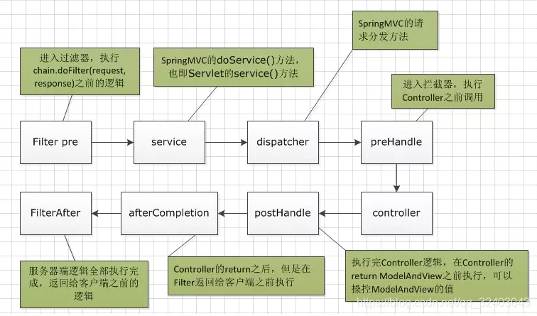
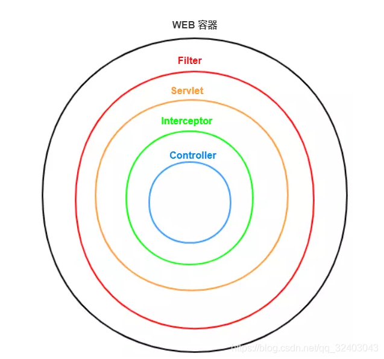
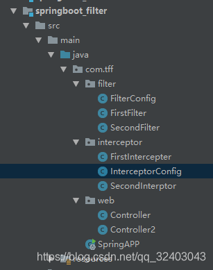
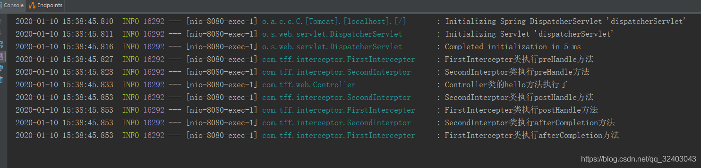
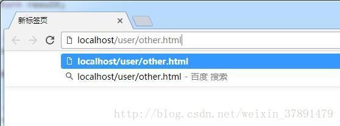
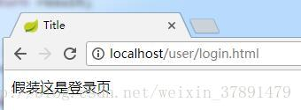
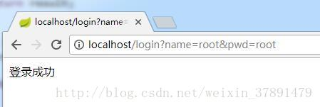
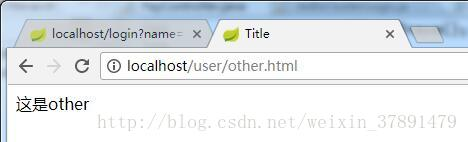

# 监听器 过滤器 拦截器

## 区别

[SpringBoot中的过滤器，拦截器，监听器你真的清楚吗？](https://blog.csdn.net/qq_32403043/article/details/103919771?ops_request_misc=%257B%2522request%255Fid%2522%253A%2522164680834316781683931891%2522%252C%2522scm%2522%253A%252220140713.130102334.pc%255Fall.%2522%257D&request_id=164680834316781683931891&biz_id=0&utm_medium=distribute.pc_search_result.none-task-blog-2~all~first_rank_ecpm_v1~rank_v31_ecpm-6-103919771.pc_search_result_control_group&utm_term=Springboot+%E7%9B%91%E5%90%AC%E5%99%A8+%E6%8B%A6%E6%88%AA%E5%99%A8+%E8%BF%87%E6%BB%A4%E5%99%A8&spm=1018.2226.3001.4187)

[springBoot(6)---过滤器，监听器，拦截器](https://blog.csdn.net/yudiandemingzi/article/details/80399971?ops_request_misc=&request_id=&biz_id=102&utm_term=Springboot%20%E7%9B%91%E5%90%AC%E5%99%A8%20%E6%8B%A6%E6%88%AA%E5%99%A8%20%E8%BF%87%E6%BB%A4%E5%99%A8&utm_medium=distribute.pc_search_result.none-task-blog-2~all~sobaiduweb~default-1-80399971.pc_search_result_control_group&spm=1018.2226.3001.4187)

### 过滤器

通俗理解：当你有一堆东西的时候，你只希望选择符合你要求的某一些东西。定义这些要求的工具，就是过滤器。（理解：就是一堆字母中取一个B）。
 应用场景：过滤字符编码、做一些业务逻辑判断、[URL](https://so.csdn.net/so/search?q=URL&spm=1001.2101.3001.7020)级别的权限控制，敏感词汇的过滤，等等。它是随你的web应用启动而启动的，只初始化一次，以后就可以拦截相关请求，只有当你的web应用停止或重新部署的时候才销毁。
 **特点：**
 过滤器 (实现 javax.servlet.Filter 接口)

① 过滤器是在web应用启动的时候初始化一次, 在web应用停止的时候销毁.

② 可以对请求的URL进行过滤, 对敏感词过滤,

③ 挡在[拦截器](https://so.csdn.net/so/search?q=拦截器&spm=1001.2101.3001.7020)的外层

④ Filter 是 Servlet 规范的一部分

### 拦截器

通俗理解：在一个流程正在进行的时候，你希望干预它的进展，甚至终止它进行，这是拦截器做的事情。（理解：就是一堆字母中，干预它，通过验证的少点，顺便干点别的东西）。
 应用场景：
 1、日志记录 ：记录请求信息的日志
 2、权限检查，如登录检查
 3、性能检测：检测方法的执行时间。
 **特点：**
 拦截器 (实现 org.springframework.web.servlet.HandlerInterceptor 接口)

① 不依赖[Spring](https://so.csdn.net/so/search?q=Spring&spm=1001.2101.3001.7020)容器, 可以使用 Spring 容器管理的Bean

② 拦截器通过动态代理进行

③ 拦截器应用场景, 性能分析, 权限检查, 日志记录

### 监听器

通俗理解：这就好比你在干活的时候有监工一样。时时刻刻关注着你。
 应用场景：用来监听对象的创建与销毁的发生, 比如 session 的创建销毁, request 的创建销毁, ServletContext 创建销毁 。
 **特点：**
 监听器 (实现 javax.servlet.ServletRequestListener, javax.servlet.http.HttpSessionListener, javax.servlet.ServletContextListener 等等接口)

① 主要用来监听对象的创建与销毁的发生, 比如 session 的创建销毁, request 的创建销毁, ServletContext 创建销毁

我们通过一幅图来看一下他们之间的关系：
 
 这是过滤器和拦截器的执行顺序（监听器知道上面的就行了）。
 
 针对这个图再去理解上面的特点和一些使用场景你可能会更清楚。
 **最后在说一下：springboot中怎么去配置过滤器和拦截器**

先创建一个springboot项目，目录结构如下：
 
 过滤器如下：

```java
package com.tff.filter;

import org.slf4j.Logger;
import org.slf4j.LoggerFactory;

import javax.servlet.*;
import javax.servlet.http.HttpServletRequest;
import java.io.IOException;

public class FirstFilter implements Filter {
    Logger logger = LoggerFactory.getLogger(this.getClass());

    @Override
    public void doFilter(ServletRequest request, ServletResponse response, FilterChain chain) throws IOException, ServletException {
        logger.info("FirstFilter执行{}方法：Before","doFilter");
       /* HttpServletRequest req = (HttpServletRequest)request;
        String url = req.getRequestURI();
        if(url.contains("user")){
            chain.doFilter(request,response);
        }else {
            request.getRequestDispatcher("/failed").forward(request,response);
        }*/

        chain.doFilter(request,response);
        logger.info("FirstFilter执行{}方法：after","doFilter");
    }
}
```

就是实现Filter接口，重写doFilter方法。这个可以在这个方法里面过滤你要过滤的东西，也可以在其他配置类中处理（如果在这里处理，就是备注里面的内容），如果在其他配置类里面处理，请看下面（springboot项目建议在配置类中处理）：

```java
package com.tff.filter;

import org.springframework.boot.web.servlet.FilterRegistrationBean;
import org.springframework.context.annotation.Bean;
import org.springframework.context.annotation.Configuration;

/***
 *  过滤器配置类
 */

public class FilterConfig  {

    /***
     *  注册第一个过滤器
     * @return
     */
    @Bean
    public FilterRegistrationBean firstFilter(){
        FilterRegistrationBean registrationBean = new FilterRegistrationBean(new FirstFilter());
        //可不设置，默认过滤路径为/*
        registrationBean.addUrlPatterns("/user/*");
        //有多个过滤器的时候，用于设置先后的顺序
        registrationBean.setOrder(1);
        return registrationBean;
    }
}
```

OK ,springboot中的过滤器就已经ok了，
 在来一起看一下拦截器：
 创建一个拦截器类，实现HandlerInterceptor接口，重写一下一些方法：

```java
package com.tff.interceptor;

import org.slf4j.Logger;
import org.slf4j.LoggerFactory;
import org.springframework.web.servlet.HandlerInterceptor;
import org.springframework.web.servlet.ModelAndView;

import javax.servlet.http.HttpServletRequest;
import javax.servlet.http.HttpServletResponse;

public class FirstIntercepter implements HandlerInterceptor {
    Logger logger = LoggerFactory.getLogger(this.getClass());

    /***
     *  controller方法调用前执行
     * @param request
     * @param response
     * @param handler
     * @return 往下执行则返回true 否则返回false
     */
    @Override
    public boolean preHandle(HttpServletRequest request, HttpServletResponse response, Object handler) {
        logger.info("{}类执行{}方法",this.getClass().getSimpleName(),"preHandle");
        return true;
    }

    /***
     *  controller方法调用之后视图渲染前执行
     * @param request
     * @param response
     * @param handler
     * @param modelAndView
     */
    @Override
    public void postHandle(HttpServletRequest request, HttpServletResponse response, Object handler, ModelAndView modelAndView) {
        logger.info("{}类执行{}方法",this.getClass().getSimpleName(),"postHandle");
    }

    /***
     *  controller方法调用且视图渲染完成后执行
     * @param request
     * @param response
     * @param handler
     * @param ex
     */
    @Override
    public void afterCompletion(HttpServletRequest request, HttpServletResponse response, Object handler, Exception ex) {
        logger.info("{}类执行{}方法",this.getClass().getSimpleName(),"afterCompletion");
    }
}
```

拦截器的配置类（springboot推荐）

```java
package com.tff.interceptor;

import org.springframework.context.annotation.Configuration;
import org.springframework.web.servlet.config.annotation.InterceptorRegistry;
import org.springframework.web.servlet.config.annotation.WebMvcConfigurer;

@Configuration
public class InterceptorConfig implements WebMvcConfigurer {

    /**
     *  重写添加拦截器方法
     * @param registry
     */
    @Override
    public void addInterceptors(InterceptorRegistry registry) {
        registry.addInterceptor(new FirstIntercepter())
                .addPathPatterns("/**")
                .order(1)；
    }
}
```

拦截器就配置完成了
 接下来我们写一个Controller类，来进行验证下：

```java
package com.tff.web;


import org.slf4j.Logger;
import org.slf4j.LoggerFactory;
import org.springframework.web.bind.annotation.GetMapping;
import org.springframework.web.bind.annotation.RequestMapping;
import org.springframework.web.bind.annotation.RestController;

import java.util.HashMap;
import java.util.Map;

@RestController
@RequestMapping("/user")
public class Controller {

    Logger logger = LoggerFactory.getLogger(this.getClass());

    @GetMapping("/hello")
    public String test(){
        logger.info("Controller类的{}方法执行了","hello");
        return "hello";
    }
}
```

浏览器地址栏输入：http://localhost:8080/user/hello
 输出结果：
 
 这个顺序刚好跟我们上面第一张图的顺序一样，也验证了这个流程。
 欢迎各位大佬批评指正！

## 监听器

### 1. 监听器介绍

什么是 web 监听器？web 监听器是一种 Servlet 中特殊的类，它们能帮助开发者监听 web 中特定的事件，比如 ServletContext, HttpSession, ServletRequest 的创建和销毁；变量的创建、销毁和修改等。可以在某些动作前后增加处理，实现监控。

### 2. Spring Boot中监听器的使用

web 监听器的使用场景很多，比如监听 servlet 上下文用来初始化一些数据、监听 http session 用来获取当前在线的人数、监听客户端请求的 servlet request 对象来获取用户的访问信息等等。这一节中，我们主要通过这三个实际的使用场景来学习一下 Spring Boot 中监听器的使用。

#### 2.1 监听Servlet上下文对象

监听 servlet 上下文对象可以用来初始化数据，用于缓存。什么意思呢？我举一个很常见的场景，比如用户在点击某个站点的首页时，一般都会展现出首页的一些信息，而这些信息基本上或者大部分时间都保持不变的，但是这些信息都是来自数据库。如果用户的每次点击，都要从数据库中去获取数据的话，用户量少还可以接受，如果用户量非常大的话，这对数据库也是一笔很大的开销。

针对这种首页数据，大部分都不常更新的话，我们完全可以把它们缓存起来，每次用户点击的时候，我们都直接从缓存中拿，这样既可以提高首页的访问速度，又可以降低服务器的压力。如果做的更加灵活一点，可以再加个定时器，定期的来更新这个首页缓存。就类似与 CSDN 个人博客首页中排名的变化一样。

下面我们针对这个功能，来写一个 demo，在实际中，读者可以完全套用该代码，来实现自己项目中的相关逻辑。首先写一个 Service，模拟一下从数据库查询数据：

```java
@Service
public class UserService {

    /**
     * 获取用户信息
     * @return
     */
    public User getUser() {
        // 实际中会根据具体的业务场景，从数据库中查询对应的信息
        return new User(1L, "倪升武", "123456");
    }
}
```

然后写一个监听器，实现 `ApplicationListener<ContextRefreshedEvent>` 接口，重写 `onApplicationEvent` 方法，将 ContextRefreshedEvent 对象传进去。如果我们想在加载或刷新应用上下文时，也重新刷新下我们预加载的资源，就可以通过监听 ContextRefreshedEvent 来做这样的事情。如下：

```java
/**
 * 使用ApplicationListener来初始化一些数据到application域中的监听器
 * @author shengni ni
 * @date 2018/07/05
 */
@Component
public class MyServletContextListener implements ApplicationListener<ContextRefreshedEvent> {

    @Override
    public void onApplicationEvent(ContextRefreshedEvent contextRefreshedEvent) {
        // 先获取到application上下文
        ApplicationContext applicationContext = contextRefreshedEvent.getApplicationContext();
        // 获取对应的service
        UserService userService = applicationContext.getBean(UserService.class);
        User user = userService.getUser();
        // 获取application域对象，将查到的信息放到application域中
        ServletContext application = applicationContext.getBean(ServletContext.class);
        application.setAttribute("user", user);
    }
}
```

正如注释中描述的一样，首先通过 contextRefreshedEvent 来获取 application 上下文，再通过 application 上下文来获取 UserService 这个 bean，项目中可以根据实际业务场景，也可以获取其他的 bean，然后再调用自己的业务代码获取相应的数据，最后存储到 application 域中，这样前端在请求相应数据的时候，我们就可以直接从 application 域中获取信息，减少数据库的压力。下面写一个 Controller 直接从 application 域中获取 user 信息来测试一下。

```java
@RestController
@RequestMapping("/listener")
public class TestController {

    @GetMapping("/user")
    public User getUser(HttpServletRequest request) {
        ServletContext application = request.getServletContext();
        return (User) application.getAttribute("user");
    }
}
```

启动项目，在浏览器中输入 `http://localhost:8080/listener/user` 测试一下即可，如果正常返回 user 信息，那么说明数据已经缓存成功。不过 application 这种是缓存在内存中，对内存会有消耗，后面的课程中我会讲到 redis，到时候再给大家介绍一下 redis 的缓存。

#### 2.2 监听HTTP会话 Session对象

监听器还有一个比较常用的地方就是用来监听 session 对象，来获取在线用户数量，现在有很多开发者都有自己的网站，监听 session 来获取当前在下用户数量是个很常见的使用场景，下面来介绍一下如何来使用。

```java
/**
 * 使用HttpSessionListener统计在线用户数的监听器
 * @author shengwu ni
 * @date 2018/07/05
 */
@Component
public class MyHttpSessionListener implements HttpSessionListener {

    private static final Logger logger = LoggerFactory.getLogger(MyHttpSessionListener.class);

    /**
     * 记录在线的用户数量
     */
    public Integer count = 0;

    @Override
    public synchronized void sessionCreated(HttpSessionEvent httpSessionEvent) {
        logger.info("新用户上线了");
        count++;
        httpSessionEvent.getSession().getServletContext().setAttribute("count", count);
    }

    @Override
    public synchronized void sessionDestroyed(HttpSessionEvent httpSessionEvent) {
        logger.info("用户下线了");
        count--;
        httpSessionEvent.getSession().getServletContext().setAttribute("count", count);
    }
}
```

可以看出，首先该监听器需要实现 HttpSessionListener 接口，然后重写 `sessionCreated` 和 `sessionDestroyed` 方法，在 `sessionCreated` 方法中传递一个 HttpSessionEvent 对象，然后将当前 session 中的用户数量加1，`sessionDestroyed` 方法刚好相反，不再赘述。然后我们写一个 Controller 来测试一下。

```java
@RestController
@RequestMapping("/listener")
public class TestController {

    /**
     * 获取当前在线人数，该方法有bug
     * @param request
     * @return
     */
    @GetMapping("/total")
    public String getTotalUser(HttpServletRequest request) {
        Integer count = (Integer) request.getSession().getServletContext().getAttribute("count");
        return "当前在线人数：" + count;
    }
}
```

该 Controller 中是直接获取当前 session 中的用户数量，启动服务器，在浏览器中输入 `localhost:8080/listener/total` 可以看到返回的结果是1，再打开一个浏览器，请求相同的地址可以看到 count 是 2 ，这没有问题。但是如果关闭一个浏览器再打开，理论上应该还是2，但是实际测试却是 3。原因是 session 销毁的方法没有执行（可以在后台控制台观察日志打印情况），当重新打开时，服务器找不到用户原来的 session，于是又重新创建了一个 session，那怎么解决该问题呢？我们可以将上面的 Controller 方法改造一下：

```java
@GetMapping("/total2")
public String getTotalUser(HttpServletRequest request, HttpServletResponse response) {
    Cookie cookie;
    try {
        // 把sessionId记录在浏览器中
        cookie = new Cookie("JSESSIONID", URLEncoder.encode(request.getSession().getId(), "utf-8"));
        cookie.setPath("/");
        //设置cookie有效期为2天，设置长一点
        cookie.setMaxAge( 48*60 * 60);
        response.addCookie(cookie);
    } catch (UnsupportedEncodingException e) {
        e.printStackTrace();
    }
    Integer count = (Integer) request.getSession().getServletContext().getAttribute("count");
    return "当前在线人数：" + count;
}
```

可以看出，该处理逻辑是让服务器记得原来那个 session，即把原来的 sessionId 记录在浏览器中，下次再打开时，把这个 sessionId 传过去，这样服务器就不会重新再创建了。重启一下服务器，在浏览器中再次测试一下，即可避免上面的问题。

#### 2.3 监听客户端请求Servlet Request对象

使用监听器获取用户的访问信息比较简单，实现 ServletRequestListener 接口即可，然后通过 request 对象获取一些信息。如下：

```java
/**
 * 使用ServletRequestListener获取访问信息
 * @author shengwu ni
 * @date 2018/07/05
 */
@Component
public class MyServletRequestListener implements ServletRequestListener {

    private static final Logger logger = LoggerFactory.getLogger(MyServletRequestListener.class);

    @Override
    public void requestInitialized(ServletRequestEvent servletRequestEvent) {
        HttpServletRequest request = (HttpServletRequest) servletRequestEvent.getServletRequest();
        logger.info("session id为：{}", request.getRequestedSessionId());
        logger.info("request url为：{}", request.getRequestURL());

        request.setAttribute("name", "倪升武");
    }

    @Override
    public void requestDestroyed(ServletRequestEvent servletRequestEvent) {

        logger.info("request end");
        HttpServletRequest request = (HttpServletRequest) servletRequestEvent.getServletRequest();
        logger.info("request域中保存的name值为：{}", request.getAttribute("name"));

    }

}
```

这个比较简单，不再赘述，接下来写一个 Controller 测试一下即可。

```java
@GetMapping("/request")
public String getRequestInfo(HttpServletRequest request) {
    System.out.println("requestListener中的初始化的name数据：" + request.getAttribute("name"));
    return "success";
}
```

### 3. Spring Boot中自定义事件监听

在实际项目中，我们往往需要自定义一些事件和监听器来满足业务场景，比如在微服务中会有这样的场景：微服务 A 在处理完某个逻辑之后，需要通知微服务 B 去处理另一个逻辑，或者微服务 A 处理完某个逻辑之后，需要将数据同步到微服务 B，这种场景非常普遍，这个时候，我们可以自定义事件以及监听器来监听，一旦监听到微服务 A 中的某事件发生，就去通知微服务 B 处理对应的逻辑。

#### 3.1 自定义事件

自定义事件需要继承 ApplicationEvent 对象，在事件中定义一个 User 对象来模拟数据，构造方法中将 User 对象传进来初始化。如下：

```java
/**
 * 自定义事件
 * @author shengwu ni
 * @date 2018/07/05
 */
public class MyEvent extends ApplicationEvent {

    private User user;

    public MyEvent(Object source, User user) {
        super(source);
        this.user = user;
    }

    // 省去get、set方法
}
```

#### 3.2 自定义监听器

接下来，自定义一个监听器来监听上面定义的 MyEvent 事件，自定义监听器需要实现 `ApplicationListener` 接口即可。如下：

```java
/**
 * 自定义监听器，监听MyEvent事件
 * @author shengwu ni
 * @date 2018/07/05
 */
@Component
public class MyEventListener implements ApplicationListener<MyEvent> {
    @Override
    public void onApplicationEvent(MyEvent myEvent) {
        // 把事件中的信息获取到
        User user = myEvent.getUser();
        // 处理事件，实际项目中可以通知别的微服务或者处理其他逻辑等等
        System.out.println("用户名：" + user.getUsername());
        System.out.println("密码：" + user.getPassword());

    }
}
```

然后重写 `onApplicationEvent` 方法，将自定义的 MyEvent 事件传进来，因为该事件中，我们定义了 User 对象（该对象在实际中就是需要处理的数据，在下文来模拟），然后就可以使用该对象的信息了。

OK，定义好了事件和监听器之后，需要手动发布事件，这样监听器才能监听到，这需要根据实际业务场景来触发，针对本文的例子，我写个触发逻辑，如下：

```java
/**
 * UserService
 * @author shengwu ni
 */
@Service
public class UserService {

    @Resource
    private ApplicationContext applicationContext;

    /**
     * 发布事件
     * @return
     */
    public User getUser2() {
        User user = new User(1L, "倪升武", "123456");
        // 发布事件
        MyEvent event = new MyEvent(this, user);
        applicationContext.publishEvent(event);
        return user;
    }
}
```

在 service 中注入 ApplicationContext，在业务代码处理完之后，通过 ApplicationContext 对象手动发布 MyEvent 事件，这样我们自定义的监听器就能监听到，然后处理监听器中写好的业务逻辑。

最后，在 Controller 中写一个接口来测试一下：

```java
@RestController
@RequestMapping("/listener")
public class TestController {

  @Resource
  private UserService userService;

  @GetMapping("/publish")
  public User publishEvent() {
    return userService.getUser2();
  }

}
```

在浏览器中输入 `http://localhost:8080/listener/publish`，然后观察一下控制台打印的用户名和密码，即可说明自定义监听器已经生效。

### 4.常用的监听器接口：

1.ServletContextListener -- 监听servletContext对象的创建以及销毁

    1.1    contextInitialized(ServletContextEvent arg0)   -- 创建时执行
    
    1.2    contextDestroyed(ServletContextEvent arg0)  -- 销毁时执行

2.HttpSessionListener  -- 监听session对象的创建以及销毁

    2.2   sessionCreated(HttpSessionEvent se)   -- 创建时执行
    
    2.2   sessionDestroyed(HttpSessionEvent se) -- 销毁时执行

3.ServletRequestListener -- 监听request对象的创建以及销毁

    3.1    requestInitialized(ServletRequestEvent sre) -- 创建时执行
    
    3.2    requestDestroyed(ServletRequestEvent sre) -- 销毁时执行

4.ServletContextAttributeListener  -- 监听servletContext对象中属性的改变

    4.1    attributeAdded(ServletContextAttributeEvent event) -- 添加属性时执行
    
    4.2    attributeReplaced(ServletContextAttributeEvent event) -- 修改属性时执行
    
    4.3    attributeRemoved(ServletContextAttributeEvent event) -- 删除属性时执行

5.HttpSessionAttributeListener  --监听session对象中属性的改变

    5.1    attributeAdded(HttpSessionBindingEvent event) -- 添加属性时执行
    
    5.2    attributeReplaced(HttpSessionBindingEvent event) -- 修改属性时执行
    
    5.3    attributeRemoved(HttpSessionBindingEvent event) -- 删除属性时执行

6.ServletRequestAttributeListener  --监听request对象中属性的改变

    6.1    attributeAdded(ServletRequestAttributeEvent srae) -- 添加属性时执行
    
    6.2    attributeReplaced(ServletRequestAttributeEvent srae) -- 修改属性时执行
    
    6.3    attributeRemoved(ServletRequestAttributeEvent srae) -- 删除属性时执行

### 5.总结

本课系统的介绍了监听器原理，以及在 Spring Boot 中如何使用监听器，列举了监听器的三个常用的案例，有很好的实战意义。最后讲解了项目中如何自定义事件和监听器，并结合微服务中常见的场景，给出具体的代码模型，均能运用到实际项目中去，希望读者认真消化。

课程源代码下载地址：[戳我下载](https://gitee.com/eson15/springboot_study)

## 过滤器                          

> ★ 
>
> 这里我以[session](https://so.csdn.net/so/search?q=session&spm=1001.2101.3001.7020)登录校验为例写了一个过滤器的例子
>
> ”

### **1.先写一个通过用户名密码登录的小栗子(用户名、密码都是root)**

```
@Controller
@RestController
public class LoginController {

    @RequestMapping("login")
    public String login(String name,String pwd,HttpServletRequest request) {
        HttpSession session = request.getSession();

        if(name.equals("root")&&pwd.equals("root")) {
            User user = new User();
            user.setName(name);
            session.setAttribute("user",user);
            return "登录成功";
        } else {
            return "用户名或密码错误!";
        }
    }
}
```

### **2.写登录校验的过滤器**

**1.新建一个SessionFilter 实现（implements）javax.servlet.Filter接口,并重写其中的方法**

```
public class SessionFilter implements Filter {

    @Override
    public void init(FilterConfig filterConfig) throws ServletException {
        
    }

    @Override
    public void doFilter(ServletRequest servletRequest, ServletResponse servletResponse, FilterChain filterChain) throws IOException, ServletException {

    }

    @Override
    public void destroy() {

    }
}
```

**2.详细代码**

```
public class SessionFilter implements Filter {

    //标示符：表示当前用户未登录(可根据自己项目需要改为json样式)
    String NO_LOGIN = "您还未登录";

    //不需要登录就可以访问的路径(比如:注册登录等)
    String[] includeUrls = new String[]{"/login","register"};


    @Override
    public void doFilter(ServletRequest servletRequest, ServletResponse servletResponse, FilterChain filterChain) throws IOException, ServletException {
        HttpServletRequest request = (HttpServletRequest) servletRequest;
        HttpServletResponse response = (HttpServletResponse) servletResponse;
        HttpSession session = request.getSession(false);
        String uri = request.getRequestURI();

        System.out.println("filter url:"+uri);
        //是否需要过滤
        boolean needFilter = isNeedFilter(uri);


        if (!needFilter) { //不需要过滤直接传给下一个过滤器
            filterChain.doFilter(servletRequest, servletResponse);
        } else { //需要过滤器
            // session中包含user对象,则是登录状态
          if(session!=null&&session.getAttribute("user") != null){
                // System.out.println("user:"+session.getAttribute("user"));
                filterChain.doFilter(request, response);
            }else{
                String requestType = request.getHeader("X-Requested-With");
                //判断是否是ajax请求
                if(requestType!=null && "XMLHttpRequest".equals(requestType)){
                    response.getWriter().write(this.NO_LOGIN);
                }else{
                    //重定向到登录页(需要在static文件夹下建立此html文件)
                    response.sendRedirect(request.getContextPath()+"/user/login.html");
                }
                return;
            }
        }
    }

    /**
     * @Author: xxxxx
     * @Description: 是否需要过滤
     * @Date: 2018-03-12 13:20:54
     * @param uri
     */
    public boolean isNeedFilter(String uri) {

        for (String includeUrl : includeUrls) {
            if(includeUrl.equals(uri)) {
                return false;
            }
        }

        return true;
    }

    @Override
    public void init(FilterConfig filterConfig) throws ServletException {

    }

    @Override
    public void destroy() {

    }
}
```

### **3.过滤器的配置**

> ★ 
>
> 过滤器的配置有2种方式,第一种是纯**注解**的方式,第二种是写**过滤器注册配置类**
>
> ”

**1.通过注解方式配置过滤器**

- 在过滤器上添加**WebFilter**注解
- 在启动类添加**ServletComponentScan**注解

```
@WebFilter(filterName = "sessionFilter",urlPatterns = {"/*"})
public class SessionFilter implements Filter {

12
@SpringBootApplication
@ServletComponentScan
public class FileUploadApplication {

	public static void main(String[] args) {
		SpringApplication.run(FileUploadApplication.class, args);
	}


}

12345678910
```

2.**通过过滤器注册配置类使用过滤器**

```
@Configuration
public class WebComponent2Config {
    @Bean
    public FilterRegistrationBean someFilterRegistration1() {
        //新建过滤器注册类
        FilterRegistrationBean registration = new FilterRegistrationBean();
        // 添加我们写好的过滤器
        registration.setFilter( new SessionFilter());
        // 设置过滤器的URL模式
        registration.addUrlPatterns("/*");
        return registration;
    }

}

1234567891011121314
```

### **4.测试一下**

1.不登录,访问other(localhost/user/other.html)
 
 回车
 
 因为没有登录所以重定向到了登录页
 2.登录
 http://localhost/login?name=root&pwd=root
 
 3.再访问other(localhost/user/other.html)
 
 这次是登录状态,所以过滤器放行,能成功进入other

------

### **5.拓展**

> ★ 
>
> 当有多个过滤器需要按顺序执行时怎么办?
>  使用注解的配置方法不能配置顺序,但是可以通过过滤器名字的字典顺序实现顺序过滤（比如AFilter就会在BFilter前执行），显然这种方法看起来不怎么正经。
>  但是我们可以使用第二种配置方法.
>  通过给注册类设置order,order越小,执行优先级越高
>
> ”

```
	@Bean
    public FilterRegistrationBean someFilterRegistration1() {
        //新建过滤器注册类
        FilterRegistrationBean registration = new FilterRegistrationBean();
        // 添加我们写好的过滤器
        registration.setFilter( new SessionFilter());
        // 设置过滤器的URL模式
        registration.addUrlPatterns("/*");
        //设置过滤器顺序
        registration.setOrder(1);
        return registration;
    }

123456789101112
```

### **6.源码下载**

[git地址](https://github.com/xuanfenglv/java/tree/master/spring/session-demo)

## 拦截器

拦截器的原理很简单，是 AOP 的一种实现，专门拦截对动态资源的后台请求，即拦截对控制层的请求。使用场景比较多的是判断用户是否有权限请求后台，更拔高一层的使用场景也有，比如拦截器可以结合 websocket 一起使用，用来拦截 websocket 请求，然后做相应的处理等等。拦截器不会拦截静态资源，Spring Boot 的默认静态目录为 resources/static，该目录下的静态页面、js、css、图片等等，不会被拦截（也要看如何实现，有些情况也会拦截，我在下文会指出）。

### 1. 拦截器的快速使用

使用拦截器很简单，只需要两步即可：定义拦截器和配置拦截器。在配置拦截器中，Spring Boot 2.0 以后的版本和之前的版本有所不同，我会重点讲解一下这里可能出现的坑。

#### 1.1 定义拦截器

定义拦截器，只需要实现 `HandlerInterceptor` 接口，`HandlerInterceptor` 接口是所有自定义拦截器或者 Spring Boot 提供的拦截器的鼻祖，所以，首先来了解下该接口。该接口中有三个方法： `preHandle(……)`、`postHandle(……)` 和 `afterCompletion(……)` 。

> `preHandle(……)` 方法：该方法的执行时机是，当某个 url 已经匹配到对应的 Controller 中的某个方法，且在这个方法执行之前。所以 `preHandle(……)` 方法可以决定是否将请求放行，这是通过返回值来决定的，返回 true 则放行，返回 false 则不会向后执行。
> `postHandle(……)` 方法：该方法的执行时机是，当某个 url 已经匹配到对应的 Controller 中的某个方法，且在执行完了该方法，但是在 DispatcherServlet 视图渲染之前。所以在这个方法中有个 ModelAndView 参数，可以在此做一些修改动作。
> `afterCompletion(……)` 方法：顾名思义，该方法是在整个请求处理完成后（包括视图渲染）执行，这时做一些资源的清理工作，这个方法只有在 `preHandle(……)` 被成功执行后并且返回 true 才会被执行。

了解了该接口，接下来自定义一个拦截器。

```java
/**
 * 自定义拦截器
 * @author shengwu ni
 * @date 2018/08/03
 */
public class MyInterceptor implements HandlerInterceptor {

    private static final Logger logger = LoggerFactory.getLogger(MyInterceptor.class);

    @Override
    public boolean preHandle(HttpServletRequest request, HttpServletResponse response, Object handler) throws Exception {

        HandlerMethod handlerMethod = (HandlerMethod) handler;
        Method method = handlerMethod.getMethod();
        String methodName = method.getName();
        logger.info("====拦截到了方法：{}，在该方法执行之前执行====", methodName);
        // 返回true才会继续执行，返回false则取消当前请求
        return true;
    }

    @Override
    public void postHandle(HttpServletRequest request, HttpServletResponse response, Object handler, ModelAndView modelAndView) throws Exception {
        logger.info("执行完方法之后进执行(Controller方法调用之后)，但是此时还没进行视图渲染");
    }

    @Override
    public void afterCompletion(HttpServletRequest request, HttpServletResponse response, Object handler, Exception ex) throws Exception {
        logger.info("整个请求都处理完咯，DispatcherServlet也渲染了对应的视图咯，此时我可以做一些清理的工作了");
    }
}
```

OK，到此为止，拦截器已经定义完成，接下来就是对该拦截器进行拦截配置。

#### 1.2 配置拦截器

在 Spring Boot 2.0 之前，我们都是直接继承 WebMvcConfigurerAdapter 类，然后重写 `addInterceptors` 方法来实现拦截器的配置。但是在 Spring Boot 2.0 之后，该方法已经被废弃了（当然，也可以继续用），取而代之的是 WebMvcConfigurationSupport 方法，如下：

```java
@Configuration
public class MyInterceptorConfig extends WebMvcConfigurationSupport {

    @Override
    protected void addInterceptors(InterceptorRegistry registry) {
        registry.addInterceptor(new MyInterceptor()).addPathPatterns("/**");
        super.addInterceptors(registry);
    }
}
```

在该配置中重写 `addInterceptors` 方法，将我们上面自定义的拦截器添加进去，`addPathPatterns` 方法是添加要拦截的请求，这里我们拦截所有的请求。这样就配置好拦截器了，接下来写一个 Controller 测试一下：

```java
@Controller
@RequestMapping("/interceptor")
public class InterceptorController {

    @RequestMapping("/test")
    public String test() {
        return "hello";
    }
}
```

让其跳转到 hello.html 页面，直接在 hello.html 中输出 `hello interceptor` 即可。启动项目，在浏览器中输入 `localhost:8080/interceptor/test` 看一下控制台的日志：

```
====拦截到了方法：test，在该方法执行之前执行====  
执行完方法之后进执行(Controller方法调用之后)，但是此时还没进行视图渲染  
整个请求都处理完咯，DispatcherServlet也渲染了对应的视图咯，此时我可以做一些清理的工作了
123
```

可以看出拦截器已经生效，并能看出其执行顺序。

#### 1.3 解决静态资源被拦截问题

上文中已经介绍了拦截器的定义和配置，但是这样是否就没问题了呢？其实不然，如果使用上面这种配置的话，我们会发现一个缺陷，那就是静态资源被拦截了。可以在 resources/static/ 目录下放置一个图片资源或者 html 文件，然后启动项目直接访问，即可看到无法访问的现象。

也就是说，虽然 Spring Boot 2.0 废弃了WebMvcConfigurerAdapter，但是 WebMvcConfigurationSupport 又会导致默认的静态资源被拦截，这就需要我们手动将静态资源放开。

如何放开呢？除了在 MyInterceptorConfig 配置类中重写 `addInterceptors` 方法外，还需要再重写一个方法：`addResourceHandlers`，将静态资源放开：

```java
/**
 * 用来指定静态资源不被拦截，否则继承WebMvcConfigurationSupport这种方式会导致静态资源无法直接访问
 * @param registry
 */
@Override
protected void addResourceHandlers(ResourceHandlerRegistry registry) {
    registry.addResourceHandler("/**").addResourceLocations("classpath:/static/");
    super.addResourceHandlers(registry);
}
```

这样配置好之后，重启项目，静态资源也可以正常访问了。如果你是个善于学习或者研究的人，那肯定不会止步于此，没错，上面这种方式的确能解决静态资源无法访问的问题，但是，还有更方便的方式来配置。

我们不继承 WebMvcConfigurationSupport 类，直接实现 WebMvcConfigurer 接口，然后重写 `addInterceptors` 方法，将自定义的拦截器添加进去即可，如下：

```java
@Configuration
public class MyInterceptorConfig implements WebMvcConfigurer {
    @Override
    public void addInterceptors(InterceptorRegistry registry) {
        // 实现WebMvcConfigurer不会导致静态资源被拦截
        registry.addInterceptor(new MyInterceptor()).addPathPatterns("/**");
    }
}
```

这样就非常方便了，实现 WebMvcConfigure 接口的话，不会拦截 Spring Boot 默认的静态资源。

这两种方式都可以，具体他们之间的细节，感兴趣的读者可以做进一步的研究，由于这两种方式的不同，继承 WebMvcConfigurationSupport 类的方式可以用在前后端分离的项目中，后台不需要访问静态资源（就不需要放开静态资源了）；实现 WebMvcConfigure 接口的方式可以用在非前后端分离的项目中，因为需要读取一些图片、css、js文件等等。

### 2. 拦截器使用实例

#### 2.1 判断用户有没有登录

一般用户登录功能我们可以这么做，要么往 session 中写一个 user，要么针对每个 user 生成一个 token，第二种要更好一点，那么针对第二种方式，如果用户登录成功了，每次请求的时候都会带上该用户的 token，如果未登录，则没有该 token，服务端可以检测这个 token 参数的有无来判断用户有没有登录，从而实现拦截功能。我们改造一下 `preHandle` 方法，如下：

```java
@Override
public boolean preHandle(HttpServletRequest request, HttpServletResponse response, Object handler) throws Exception {

    HandlerMethod handlerMethod = (HandlerMethod) handler;
    Method method = handlerMethod.getMethod();
    String methodName = method.getName();
    logger.info("====拦截到了方法：{}，在该方法执行之前执行====", methodName);

    // 判断用户有没有登陆，一般登陆之后的用户都有一个对应的token
    String token = request.getParameter("token");
    if (null == token || "".equals(token)) {
        logger.info("用户未登录，没有权限执行……请登录");
        return false;
    }

    // 返回true才会继续执行，返回false则取消当前请求
    return true;
}
```

重启项目，在浏览器中输入 `localhost:8080/interceptor/test` 后查看控制台日志，发现被拦截，如果在浏览器中输入 `localhost:8080/interceptor/test?token=123` 即可正常往下走。

#### 2.2 取消拦截操作

根据上文，如果我要拦截所有 `/admin` 开头的 url 请求的话，需要在拦截器配置中添加这个前缀，但是在实际项目中，可能会有这种场景出现：某个请求也是 `/admin` 开头的，但是不能拦截，比如 `/admin/login` 等等，这样的话又需要去配置。那么，可不可以做成一个类似于开关的东西，哪里不需要拦截，我就在哪里弄个开关上去，做成这种灵活的可插拔的效果呢？

是可以的，我们可以定义一个注解，该注解专门用来取消拦截操作，如果某个 Controller 中的方法我们不需要拦截掉，即可在该方法上加上我们自定义的注解即可，下面先定义一个注解：

```java
/**
 * 该注解用来指定某个方法不用拦截
 */
@Target(ElementType.METHOD)
@Retention(RetentionPolicy.RUNTIME)
public @interface UnInterception {
}
```

然后在 Controller 中的某个方法上添加该注解，在拦截器处理方法中添加该注解取消拦截的逻辑，如下：

```java
@Override
public boolean preHandle(HttpServletRequest request, HttpServletResponse response, Object handler) throws Exception {

    HandlerMethod handlerMethod = (HandlerMethod) handler;
    Method method = handlerMethod.getMethod();
    String methodName = method.getName();
    logger.info("====拦截到了方法：{}，在该方法执行之前执行====", methodName);

    // 通过方法，可以获取该方法上的自定义注解，然后通过注解来判断该方法是否要被拦截
    // @UnInterception 是我们自定义的注解
    UnInterception unInterception = method.getAnnotation(UnInterception.class);
    if (null != unInterception) {
        return true;
    }
    // 返回true才会继续执行，返回false则取消当前请求
    return true;
}
```

Controller 中的方法代码可以参见源码，重启项目在浏览器中输入 `http://localhost:8080/interceptor/test2?token=123` 测试一下，可以看出，加了该注解的方法不会被拦截。

### 3. 总结

本节主要介绍了 Spring Boot 中拦截器的使用，从拦截器的创建、配置，到拦截器对静态资源的影响，都做了详细的分析。Spring Boot 2.0 之后拦截器的配置支持两种方式，可以根据实际情况选择不同的配置方式。最后结合实际中的使用，举了两个常用的场景，希望读者能够认真消化，掌握拦截器的使用。

课程源代码下载地址：[戳我下载](https://gitee.com/eson15/springboot_study)