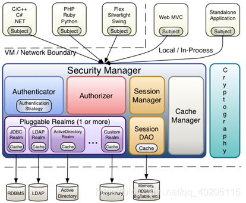
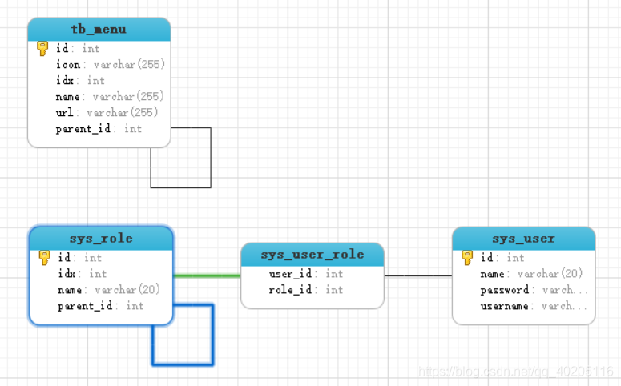
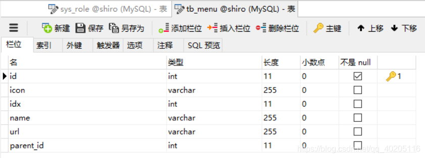
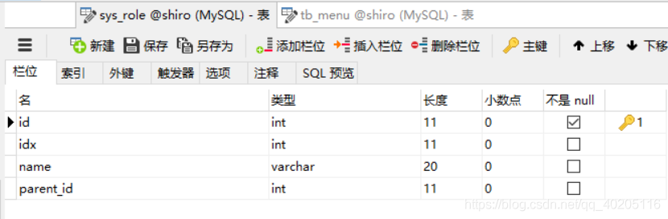
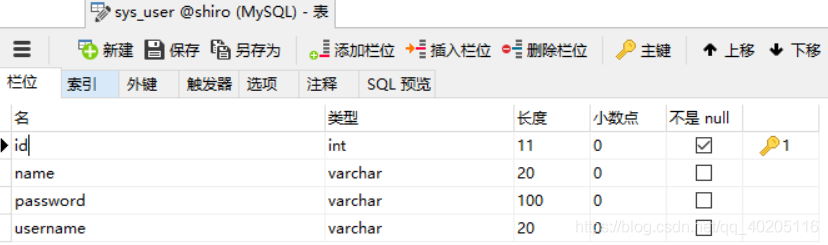
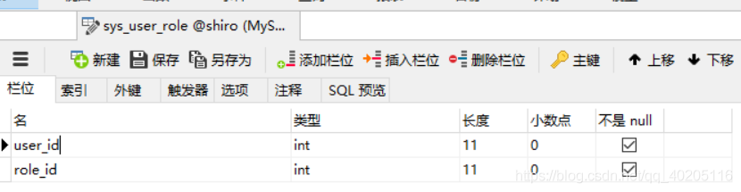
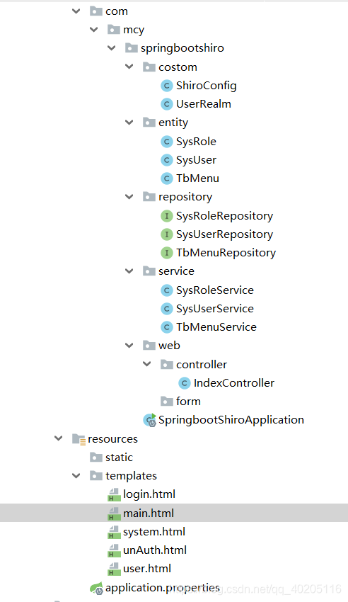
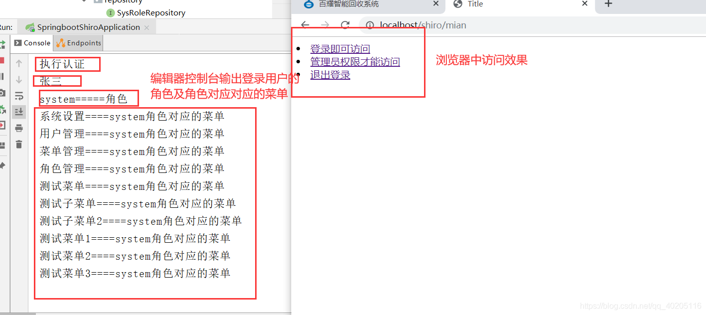
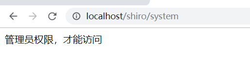
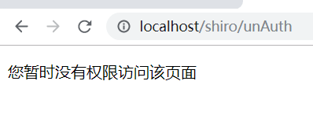

# Spring Boot 整合Shrio

[SpringBoot整合Shrio（完整版）](https://blog.csdn.net/qq_40205116/article/details/104946528?ops_request_misc=%257B%2522request%255Fid%2522%253A%2522164672753216780264055711%2522%252C%2522scm%2522%253A%252220140713.130102334..%2522%257D&request_id=164672753216780264055711&biz_id=0&utm_medium=distribute.pc_search_result.none-task-blog-2~all~top_positive~default-2-104946528.pc_search_result_control_group&utm_term=shrio&spm=1018.2226.3001.4187)

[案例代码](https://github.com/machaoyin/springboot-shrio)                                            

[shrio小白教程--里面也有Springboot整合Shrio相关操作，而且更详细](https://github.com/ck-chenkang/JavaExamlpeProjects/blob/master/main/Shrio/Shrio%E5%B0%8F%E7%99%BD%E6%95%99%E7%A8%8B.md)

> ★ 
>
> **写在前面：** 从2018年底开始学习SpringBoot，也用SpringBoot写过一些项目。这里对学习Springboot的一些知识总结记录一下。如果你也在学习SpringBoot，可以关注我，一起学习，一起进步。
>
> ”

**相关文章：**

[【Springboot系列】Springboot入门到项目实战](https://blog.csdn.net/qq_40205116/article/details/104269651)

------


### 文章目录

- - [Shiro简介](#Shiro_10)
  - - [1、简介](#1_11)
    - [2、shiro架构](#2shiro_13)
  - [数据库设计](#_31)
  - - [1、表关系](#1_32)
    - [2、数据库表结构](#2_43)
  - [搭建项目](#_52)
  - - [1、新建Springboot项目](#1Springboot_53)
    - [2、项目结构](#2_131)
    - [3、配置链接数据库属性](#3_133)
  - [编写代码](#_148)
  - - [1、编写实体类](#1_149)
    - [2、Shiro配置类](#2Shiro_366)
    - [3、编写控制器](#3_538)
    - [4、编写页面](#4_631)
  - [测试](#_723)
  - - [1、应用测试](#1_724)
    - [2、案例代码下载](#2_734)


------

之前写项目安全控件基本都是用的SpringSecurity，后来发现[Shiro](https://so.csdn.net/so/search?q=Shiro&spm=1001.2101.3001.7020)在实际开发中用的也挺多的。这里一起来看一下Shiro在Springboot中的基本用法吧！想了解SpringSecurity的请移步：[SpringSecurity安全控件使用指南](https://blog.csdn.net/qq_40205116/article/details/103439326)。

## **Shiro简介**

### 1、简介

Apache Shiro 是 Java 的一个安全（权限）框架。 Shiro 可以非常容易的开发出足够好的应用，其不仅可以用在 JavaSE 环境，也可以用在 JavaEE 环境。Shiro 可以完成：认证、授权、加密、会话管理、与Web 集成、缓存等。相对于SpringSecurity简单的多，也没有SpringSecurity那么复杂。

### 2、shiro架构


 **Shiro三大功能模块**

1. Subject：主体，一般指用户（把操作交给SecurityManager）。
2. SecurityManager：安全管理器，管理所有Subject，可以配合内部安全组件（关联Realm）。
3. Realms：用于进行权限信息的验证，shiro链接数据的桥梁。

**细分功能**

1. Authentication：身份认证/登录，验证用户是否拥有相应的身份（账号密码验证）。
2. Authorization：授权，验证某个已认证的用户是否拥有某权限。
3. Session Manager：会话管理，用户登录后，用户信息保存在session会话中。
4. Cryptography：加密，保护数据的安全性，如密码加密存储到数据库，而不是明文存储。
5. Web Support：Web支持，集成Web环境。
6. Caching：缓存，用户信息、角色、权限等缓存到如redis等缓存中。
7. Concurrency：多线程并发验证，在一个线程中开启另一个线程，可以把权限自动传播过去。
8. Testing：测试支持；
9. Run As：允许一个用户假装为另一个用户（如果他们允许）的身份进行访问。
10. Remember Me：记住我，登录后，下次再来的话不用登录了。

## **数据库设计**

### 1、表关系


 菜单（TbMenu）=====> 页面上需要显示的所有菜单

角色（SysRole）=====> 角色及角色对应的菜单

用户（SysUser）=====> 用户及用户对应的角色

用户和角色中间表（sys_user_role）====> 用户和角色中间表
 **【注】** 权限管理实现原理都差不多，虽然使用的安全控件不一样，但数据库表的设计基本一样，这里数据库表的设计和[SpringSecurity实现动态权限菜单控制](https://blog.csdn.net/qq_40205116/article/details/103739978)基本一致。

### 2、数据库表结构

菜单表tb_menu
 
 角色及菜单权限表sys_role，其中父节点parent 为null时为角色，不为null时为对应角色的菜单权限。
 
 用户表sys_user。
 
 用户和角色多对多关系，用户和角色中间表sys_user_role（由[Spring](https://so.csdn.net/so/search?q=Spring&spm=1001.2101.3001.7020)-Data-Jpa自动生成）。
 

## **搭建项目**

### 1、新建Springboot项目

创建一个SprintBoot项目，添加项目需要的依赖（这里持久层使用的是SpringDataJpa）。
 **Shiro依赖**

```xml
<dependency>
	<groupId>org.apache.shiro</groupId>
	<artifactId>shiro-spring</artifactId>
	<version>1.4.0</version>
</dependency>
```

**pom.xml完整依赖代码**

```xml
<?xml version="1.0" encoding="UTF-8"?>
<project xmlns="http://maven.apache.org/POM/4.0.0" xmlns:xsi="http://www.w3.org/2001/XMLSchema-instance"
	xsi:schemaLocation="http://maven.apache.org/POM/4.0.0 https://maven.apache.org/xsd/maven-4.0.0.xsd">
	<modelVersion>4.0.0</modelVersion>
	<parent>
		<groupId>org.springframework.boot</groupId>
		<artifactId>spring-boot-starter-parent</artifactId>
		<version>2.2.5.RELEASE</version>
		<relativePath/> <!-- lookup parent from repository -->
	</parent>
	<groupId>com.mcy</groupId>
	<artifactId>springboot-shiro</artifactId>
	<version>0.0.1-SNAPSHOT</version>
	<name>springboot-shiro</name>
	<description>Demo project for Spring Boot</description>

	<properties>
		<java.version>1.8</java.version>
	</properties>
	<dependencies>
		<dependency>
			<groupId>org.springframework.boot</groupId>
			<artifactId>spring-boot-starter-data-jpa</artifactId>
		</dependency>
		<dependency>
			<groupId>org.springframework.boot</groupId>
			<artifactId>spring-boot-starter-thymeleaf</artifactId>
		</dependency>
		<dependency>
			<groupId>org.springframework.boot</groupId>
			<artifactId>spring-boot-starter-web</artifactId>
		</dependency>
		<dependency>
			<groupId>mysql</groupId>
			<artifactId>mysql-connector-java</artifactId>
			<scope>runtime</scope>
		</dependency>

		<!-- shiro与spring整合依赖 -->
		<dependency>
			<groupId>org.apache.shiro</groupId>
			<artifactId>shiro-spring</artifactId>
			<version>1.4.0</version>
		</dependency>
		<dependency>
			<groupId>org.springframework.boot</groupId>
			<artifactId>spring-boot-starter-test</artifactId>
			<scope>test</scope>
			<exclusions>
				<exclusion>
					<groupId>org.junit.vintage</groupId>
					<artifactId>junit-vintage-engine</artifactId>
				</exclusion>
			</exclusions>
		</dependency>
	</dependencies>
	<build>
		<plugins>
			<plugin>
				<groupId>org.springframework.boot</groupId>
				<artifactId>spring-boot-maven-plugin</artifactId>
			</plugin>
		</plugins>
	</build>
</project>
```

### 2、项目结构



### 3、配置链接数据库属性

```ini
spring.datasource.url=jdbc:mysql://localhost:3306/shiro?serverTimezone=GMT%2B8
spring.datasource.username=root
spring.datasource.password=root
spring.datasource.driver-class-name=com.mysql.cj.jdbc.Driver
spring.jpa.database-platform=org.hibernate.dialect.MySQL5InnoDBDialect
spring.jpa.show-sql=true
spring.jpa.hibernate.ddl-auto=update
spring.jpa.hibernate.use-new-id-generator-mappings=false
spring.jpa.properties.hibernate.enable_lazy_load_no_trans=true

server.port=80
server.servlet.context-path=/shiro
```

## **编写代码**

### 1、编写实体类

菜单表实体类TbMenu，Spring-Data-Jpa可以根据实体类去数据库新建或更新对应的表结构，详情可以访问[Spring-Data-Jpa入门](https://blog.csdn.net/qq_40205116/article/details/103039936)

```java
import com.fasterxml.jackson.annotation.JsonIgnore;
import org.springframework.data.annotation.CreatedBy;
import javax.persistence.*;
import java.util.ArrayList;
import java.util.List;

/**
 * 菜单表
 * @author
 */
@Entity
public class TbMenu {
    private Integer id;
    private String name;
    private String url;
    private Integer idx;
    @JsonIgnore
    private TbMenu parent;
    @JsonIgnore
    private List<TbMenu> children = new ArrayList<>();

    @Id
    @GeneratedValue
    public Integer getId() {
        return id;
    }

    public void setId(Integer id) {
        this.id = id;
    }

    @Column(unique = true)
    public String getName() {
        return name;
    }

    public void setName(String name) {
        this.name = name;
    }

    public String getUrl() {
        return url;
    }

    public void setUrl(String url) {
        this.url = url;
    }

    public Integer getIdx() {
        return idx;
    }

    public void setIdx(Integer idx) {
        this.idx = idx;
    }

    @ManyToOne
    @CreatedBy
    public TbMenu getParent() {
        return parent;
    }

    public void setParent(TbMenu parent) {
        this.parent = parent;
    }

    @OneToMany(cascade = CascadeType.ALL, mappedBy = "parent")
    @OrderBy(value = "idx")
    public List<TbMenu> getChildren() {
        return children;
    }

    public void setChildren(List<TbMenu> children) {
        this.children = children;
    }
}
```

角色及权限表SysRole，parent 为null时为角色，不为null时为权限。

```java
import com.fasterxml.jackson.annotation.JsonIgnore;
import org.springframework.data.annotation.CreatedBy;
import javax.persistence.*;
import java.util.ArrayList;
import java.util.List;

@Entity
/***
 * 角色及角色对应的菜单权限
 * @author
 *parent 为null时为角色，不为null时为权限
 */
public class SysRole {
    private Integer id;
    private String name;    //名称
    @JsonIgnore
    private SysRole parent;
    private Integer idx;    //排序
    @JsonIgnore
    private List<SysRole> children = new ArrayList<>();

    @Id
    @GeneratedValue
    public Integer getId() {
        return id;
    }

    public void setId(Integer id) {
        this.id = id;
    }

    @Column(length = 20)
    public String getName() {
        return name;
    }

    public void setName(String name) {
        this.name = name;
    }

    @ManyToOne
    @CreatedBy
    public SysRole getParent() {
        return parent;
    }

    public void setParent(SysRole parent) {
        this.parent = parent;
    }

    @OneToMany(cascade = CascadeType.ALL, mappedBy = "parent")
    public List<SysRole> getChildren() {
        return children;
    }

    public void setChildren(List<SysRole> children) {
        this.children = children;
    }

    public Integer getIdx() {
        return idx;
    }

    public void setIdx(Integer idx) {
        this.idx = idx;
    }
}
```

最后实现的就是用户管理了，只需要对添加的用户分配对应的角色就可以了，用户登录时，显示角色对应的权限。

```java
import com.fasterxml.jackson.annotation.JsonIgnore;
import javax.persistence.*;
import java.util.ArrayList;
import java.util.List;

/**
 * 用户表
 */
@Entity
public class SysUser {
    private Integer id;
    private String username;    //账号
    private String password;    //密码
    private String name;        //姓名
    @JsonIgnore
    private List<SysRole> roles = new ArrayList<>();    //角色

    @Id
    @GeneratedValue
    public Integer getId() {
        return id;
    }

    public void setId(Integer id) {
        this.id = id;
    }

    @Column(length = 20, unique = true)
    public String getUsername() {
        return username;
    }

    public void setUsername(String username) {
        this.username = username;
    }

    @Column(length = 100)
    public String getPassword() {
        return password;
    }

    public void setPassword(String password) {
        this.password = password;
    }

    @Column(length = 20)
    public String getName() {
        return name;
    }

    public void setName(String name) {
        this.name = name;
    }

    @ManyToMany(cascade = CascadeType.REFRESH, fetch = FetchType.EAGER)
    @JoinTable(name = "sys_user_role", joinColumns = @JoinColumn(name = "user_id"), inverseJoinColumns = @JoinColumn(name = "role_id"))
    public List<SysRole> getRoles() {
        return roles;
    }

    public void setRoles(List<SysRole> roles) {
        this.roles = roles;
    }
}
```

### 2、Shiro配置类

Shiro配置类ShiroConfig。

```java
import org.apache.shiro.authc.credential.HashedCredentialsMatcher;
import org.apache.shiro.spring.web.ShiroFilterFactoryBean;
import org.apache.shiro.web.mgt.DefaultWebSecurityManager;
import org.springframework.beans.factory.annotation.Qualifier;
import org.springframework.context.annotation.Bean;
import org.springframework.context.annotation.Configuration;
import java.util.LinkedHashMap;
import java.util.Map;

/**
 * @description Shiro配置类
 */
@Configuration
public class ShiroConfig {

    @Bean("hashedCredentialsMatcher")
    public HashedCredentialsMatcher hashedCredentialsMatcher() {
        HashedCredentialsMatcher credentialsMatcher = new HashedCredentialsMatcher();
        //指定加密方式为MD5
        credentialsMatcher.setHashAlgorithmName("MD5");
        //加密次数
        credentialsMatcher.setHashIterations(1024);
        credentialsMatcher.setStoredCredentialsHexEncoded(true);
        return credentialsMatcher;
    }

    @Bean("userRealm")
    public UserRealm userRealm(@Qualifier("hashedCredentialsMatcher") HashedCredentialsMatcher matcher) {
        UserRealm userRealm = new UserRealm();
        userRealm.setCredentialsMatcher(matcher);
        return userRealm;
    }

    @Bean
    public ShiroFilterFactoryBean shirFilter(@Qualifier("securityManager")DefaultWebSecurityManager securityManager) {
        ShiroFilterFactoryBean bean = new ShiroFilterFactoryBean();
        // 设置 SecurityManager，安全管理器
        bean.setSecurityManager(securityManager);

        // 设置登录跳转页面
        bean.setLoginUrl("/index");
        // 设置未授权提示页面（没有权限访问后的页面）
        bean.setUnauthorizedUrl("/unAuth");
        /**
         * Shiro内置过滤器，可以实现拦截器相关的拦截器
         *    常用的过滤器：
         *      anon：无需认证（登录）可以访问
         *      authc：必须认证才可以访问
         *      user：如果使用rememberMe的功能可以直接访问
         *      perms：该资源必须得到资源权限才可以访问
         *      role：该资源必须得到角色权限才可以访问
         **/
        Map<String, String> filterMap = new LinkedHashMap<>();

        filterMap.put("/login","anon");
        filterMap.put("/user","authc");
        filterMap.put("/system","perms[system]");
        filterMap.put("/static/**","anon");

        filterMap.put("/**","authc");
        filterMap.put("/logout", "logout");

        bean.setFilterChainDefinitionMap(filterMap);
        return bean;
    }

    /**
     * 注入 securityManager
     */
    @Bean(name="securityManager")
    public DefaultWebSecurityManager getDefaultWebSecurityManager(HashedCredentialsMatcher hashedCredentialsMatcher) {
        DefaultWebSecurityManager securityManager = new DefaultWebSecurityManager();
        // 关联realm.
        securityManager.setRealm(userRealm(hashedCredentialsMatcher));
        return securityManager;
    }
}
```

自定义Realm用于查询用户的角色和权限信息并保存到权限管理器中。代码如下：

```java
import com.mcy.springbootshiro.entity.SysRole;
import com.mcy.springbootshiro.entity.SysUser;
import com.mcy.springbootshiro.service.SysUserService;
import org.apache.shiro.SecurityUtils;
import org.apache.shiro.authc.*;
import org.apache.shiro.authz.AuthorizationInfo;
import org.apache.shiro.authz.SimpleAuthorizationInfo;
import org.apache.shiro.realm.AuthorizingRealm;
import org.apache.shiro.subject.PrincipalCollection;
import org.apache.shiro.subject.Subject;
import org.apache.shiro.util.ByteSource;
import org.springframework.beans.factory.annotation.Autowired;
import java.util.Collection;
import java.util.HashSet;
import java.util.List;
import java.util.Set;

public class UserRealm extends AuthorizingRealm {
    @Autowired
    private SysUserService userService;
    
    /**
     * 授权逻辑方法
     **/
    @Override
    protected AuthorizationInfo doGetAuthorizationInfo(PrincipalCollection principalCollection) {
        System.out.println("执行授权");

        //获取当前登录对象
        Subject subject = SecurityUtils.getSubject();
        SysUser user = (SysUser)subject.getPrincipal();
        if(user != null){
            SimpleAuthorizationInfo info = new SimpleAuthorizationInfo();
            // 角色与权限字符串集合
            Collection<String> rolesCollection = new HashSet<>();

            //获得当前用户的角色
            List<SysRole> roles = user.getRoles();
            for(SysRole role : roles){
                rolesCollection.add(role.getName());
            }
            //添加当前用户的角色权限，用于判断可以访问那些功能
            info.addStringPermissions(rolesCollection);
            return info;
        }
        return null;
    }

    /**
     * 认证
     **/
    @Override
    protected AuthenticationInfo doGetAuthenticationInfo(AuthenticationToken authenticationToken) throws AuthenticationException {

        System.out.println("执行认证");

        // 编写shiro判断逻辑，判断用户名和密码
        UsernamePasswordToken token = (UsernamePasswordToken)authenticationToken;
        // 判断用户名
        SysUser bean = userService.findByUsername(token.getUsername());

        //用户名不存在
        if(bean == null){
            throw new UnknownAccountException();
        }

        //以账号作为加密的盐值
        ByteSource credentialsSalt = ByteSource.Util.bytes(bean.getUsername());

        // 判断密码，
        return new SimpleAuthenticationInfo(bean, bean.getPassword(),
                credentialsSalt, getName());
    }
}
```

其中密码加密使用的是MD5加密，加密代码如下：

```java
public static void main(String[] args){
    String hashAlgorithName = "MD5";
    //加密密码
    String password = "123456";
    //加密次数
    int hashIterations = 1024;
    //账号作为加密的盐值
    ByteSource credentialsSalt = ByteSource.Util.bytes("admin");
    Object obj = new SimpleHash(hashAlgorithName, password, credentialsSalt, hashIterations);
    System.out.println(obj);
}
```

### 3、编写控制器

新建IndexController测试控制器。这里持久层框架使用的是SpringDataJpa，查询只需遵循查询方法命名规范即可，所以这里就直接写控制器代码了。想进一步了解SpringDataJpa的小伙伴，请移步：[Spring-Data-Jpa入门。](https://blog.csdn.net/qq_40205116/article/details/103039936)
 IndexController控制器代码如下：

```java
import com.mcy.springbootshiro.entity.SysRole;
import com.mcy.springbootshiro.entity.SysUser;
import com.mcy.springbootshiro.service.SysRoleService;
import org.apache.shiro.SecurityUtils;
import org.apache.shiro.authc.IncorrectCredentialsException;
import org.apache.shiro.authc.UnknownAccountException;
import org.apache.shiro.authc.UsernamePasswordToken;
import org.apache.shiro.subject.Subject;
import org.springframework.beans.factory.annotation.Autowired;
import org.springframework.stereotype.Controller;
import org.springframework.ui.Model;
import org.springframework.web.bind.annotation.RequestMapping;

@Controller
public class IndexController {

    @Autowired
    private SysRoleService roleService;

    @RequestMapping({"/index", "/"})
    public String index(){
        return "login";
    }

    @RequestMapping(value = "/login")
    public String login(String username, String password, Model model){
        //1.获取subject
        Subject subject = SecurityUtils.getSubject();

        //2.封装用户数据
        UsernamePasswordToken token = new UsernamePasswordToken(username, password);

        try {
            //3.执行登录方法
            subject.login(token);
            //登录成功
            return "redirect:/mian";
        } catch (UnknownAccountException e) {
            //e.printStackTrace();
            //登录失败：用户名不存在
            model.addAttribute("msg", "用户名不存在");
            return "login";
        } catch (IncorrectCredentialsException e) {
            //e.printStackTrace();
            //登录失败：用户名不存在
            model.addAttribute("msg", "密码输入有误");
            return "login";
        }
    }

    @RequestMapping(value = "/mian")
    public String main(){
        SysUser user = (SysUser) SecurityUtils.getSubject().getPrincipal();
        System.out.println(user.getName());
        //登录成功后，输出对应的角色和菜单
        for(SysRole role: user.getRoles()){
            System.out.println(role.getName()+"=====角色");
            for(SysRole roles : role.getChildren()){
                System.out.println(roles.getName()+"===="+role.getName()+"角色对应的菜单");
            }
        }
        return "main";
    }

    @RequestMapping("/logout")
    public String logout(){
        Subject subject = SecurityUtils.getSubject();
        if (subject != null) {
            subject.logout();
        }
        return "redirect:/main";
    }

    @RequestMapping("/unAuth")
    public String unAuth(){
        return "unAuth";
    }

    @RequestMapping("/system")
    public String system(){
        return "system";
    }
    
    @RequestMapping("/user")
    public String user(){
        return "user";
    }
}
```

### 4、编写页面

页面内容都比较简单，主要为一个登录页面，登录成功后的页面和几个访问页面。
 登录页面login.html代码如下（测试页面写的比较简单，页面中font标签为登录失败的提示信息，内容为后台传递过来的）：

```html
<!DOCTYPE html>
<html lang="en">
<head>
    <meta charset="UTF-8">
    <title>登录页面</title>
    <style type="text/css">
        #main{
            width: 400px;
            margin: 100px auto;
        }
        input{
            border-radius: 5px;
            width: 200px;
            height: 20px;
        }
        button{
            margin-left: 30px;
            width: 80px;
            border-radius: 15px;
        }
    </style>
</head>
<body>
    <div id="main">
        <form action="login" method="post">
            <font color="red" th:text="${msg}"></font><br><br>
            账号：<input type="text" name="username"><br><br>
            密码：<input type="password" name="password"><br><br>
            <button type="submit">登录</button>
        </form>
    </div>
</body>
</html>
```

登录成功main.html页面（几个页面跳转超链接）

```html
<!DOCTYPE html>
<html lang="en">
<head>
    <meta charset="UTF-8">
    <title>Title</title>
</head>
<body>
    <li><a href="user">登录即可访问</a></li>
    <li><a href="system">管理员权限才能访问</a></li>
    <li><a href="logout">退出登录</a></li> 
</body>
</html>
```

管理员权限才能访问的页面system.html

```html
<!DOCTYPE html>
<html lang="en">
<head>
    <meta charset="UTF-8">
    <title>Title</title>
</head>
<body>
    管理员权限，才能访问
</body>
</html>
```

登录即可访问的页面user.html

```html
<!DOCTYPE html>
<html lang="en">
<head>
    <meta charset="UTF-8">
    <title>Title</title>
</head>
<body>
    登录后即可访问
</body>
</html>
```

没有权限访问的页面，提示页面unAuth.html

```html
<!DOCTYPE html>
<html lang="en">
<head>
    <meta charset="UTF-8">
    <title>Title</title>
</head>
<body>
<p>您暂时没有权限访问该页面</p>
</body>
</html>
```

## **测试**

### 1、应用测试

运行项目后访问http://localhost/shiro/index，进入登录页面，登录拥有管理员权限的用户。
 
 登录成功后，可以从编辑器控制台中看出第一步进行了Shrio的认证。之后执行了登录成功后跳转页面的后台方法，输出了对应的角色和角色对应的菜单。
 **【注】** 此案例中前台菜单没有进行遍历，菜单，权限等功能也没有写对应的增删改查。直接在数据库中添加数据进行测试的。如果想了解菜单遍历，菜单权限等功能的实现，请访问[SpringSecurity实现动态菜单加载](https://blog.csdn.net/qq_40205116/article/details/103739978)。其中数据库设计，功能操作都是一样的。

点击“管理员权限才能访问”首先会进行执行授权，根据判断是否有管理员身份，确定是否可以访问。因为是拥有管理员身份的用户登录的，所以可以访问，效果如下：
 
 正是system.html页面中的内容。如果没有管理员身份，则显示效果如下：
 

### 2、案例代码下载

案例代码下载地址：https://github.com/machaoyin/springboot-shrio

> ★ 
>
> 最后有什么不足之处，欢迎大家指出，期待与你的交流。
>
> ”