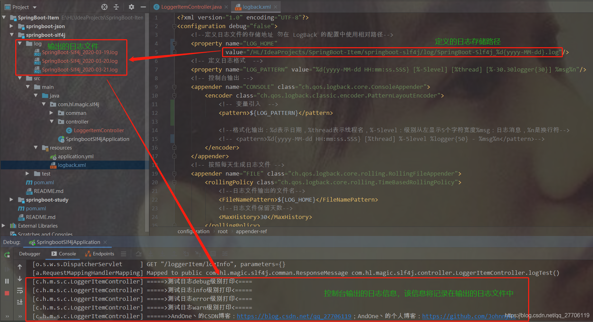

# SpringBoot集成slf4j日志配置

[SpringBoot集成slf4j日志配置](https://blog.csdn.net/qq_27706119/article/details/104977666?ops_request_misc=%257B%2522request%255Fid%2522%253A%2522164688235316780269871344%2522%252C%2522scm%2522%253A%252220140713.130102334..%2522%257D&request_id=164688235316780269871344&biz_id=0&utm_medium=distribute.pc_search_result.none-task-blog-2~all~baidu_landing_v2~default-3-104977666.pc_search_result_control_group&utm_term=springboot+slf4j&spm=1018.2226.3001.4187)

[源码示例](https://github.com/ck-chenkang/springboot-quick-start/tree/master/course03)

**目录**

[前言](#t0)

[1、slf4j概述](#t1)

[2、pom.xml的日志依赖](#t2)

[3、application.yml的日志配置](#t3)

[4、logback.xml配置文件定义](#t4)

[5、logback.xml配置文件解析](#t5)

[5.1 定义日志的存储路径](#t6)

[5.2 定义日志的输出格式](#t7)

[5.3 定义控制台输出](#t8)

[5.4 定义日志相关参数](#t9)

[5.5 定义日志的输出级别](#t10)

[6、测试日志输出](#t11)

[7、小结](#t12)

------

## **前言**

日志，作为一个应用系统的重要部分，然而并不会在项目预研或需求设计阶段就作为一个功能模块单独规划设计，但这丝毫不影响它在任何一个系统中的重要的地位。

为了保证服务的高可用，及时发现问题，迅速解决问题等诉求，所以生产环境一旦出现问题，预警系统就会通过邮件、短信甚至电话的方式实施多维轰炸模式，确保相关负责人不错过每一个可能的bug。

预警系统判断疑似bug大部分源于日志。比如某个微服务接口由于各种原因导致频繁调用出错，此时调用端会捕获这样的异常并打印ERROR级别的日志，当该错误日志达到一定次数出现的时候，就会触发报警。

其次，在以往项目开发过程中，我们往往习惯性使用**System.out.println()这个常用的打印输出语句来显示断点信息或业务运行对象信息或控制台日志记录，**其实大量的使用**System.out.println()在一定程度上**会增加资源的消耗。Java日志[框架](https://so.csdn.net/so/search?q=框架&spm=1001.2101.3001.7020)众多，常用的有java.util.logging，log4j，logback，commons-logging等等。而且SpringBoot 提供了一套日志系统，logback是最优的选择。因此本文根据实际项目中使用slf4j 的logback来输出日志，效率很高。

**日志的重要性，不言而喻。**

OK，接下来，本文主要总结一下项目中目前使用的SpringBoot集成slf4j日志配置。

------

## **1、slf4j概述**

slf4j，即(**Simple Logging Facade for Java，简单门面日志**)。它是对所有日志框架制定的一种规范、标准、接口，并不是一个框架的具体的实现，它只服务于各种各样的日志系统。

slf4j提供了统一的记录日志的接口，对不同日志系统的具体实现进行了抽象化，只要按照其提供的方法记录即可，最终日志的格式、记录级别、输出方式等通过绑定具体的日志系统来实现。在项目中使用了slf4j记录日志，并且绑定了[log4j](https://so.csdn.net/so/search?q=log4j&spm=1001.2101.3001.7020)(pom.xml中配置了相应的jar包依赖)，则日志会以log4j的风格输出；后期需要改为以logback的风格输出日志，只需要将jar包log4j替换成logback即可，根本不需要修改日志文件的代码。

首先看下日志打印，如下，在启动类中引入Logger日志记录：

```java
@SpringBootApplication


public class SpringbootSlf4jApplication {


 


    private static final Logger logger = LoggerFactory.getLogger(SpringbootSlf4jApplication.class);


 


    public static void main(String[] args) {


        logger.info("===============项目启动了===============");


        SpringApplication app = new SpringApplication(SpringbootSlf4jApplication.class);


        app.run(args);


        logger.info("===============启动成功了===============");


    }


}
```

日志信息： 

```html
2020-03-21 11:28:18.017 [main] INFO  com.hl.magic.slf4j.SpringbootSlf4jApplication - ===============项目启动了===============


2020-03-21 11:28:18.447 [main] INFO  com.hl.magic.slf4j.SpringbootSlf4jApplication - Starting SpringbootSlf4jApplication on DESKTOP-V8RSTKO with PID 17476


2020-03-21 11:28:18.447 [main] DEBUG com.hl.magic.slf4j.SpringbootSlf4jApplication - Running with Spring Boot v2.1.8.RELEASE, Spring v5.1.9.RELEASE


2020-03-21 11:28:18.447 [main] INFO  com.hl.magic.slf4j.SpringbootSlf4jApplication - No active profile set, falling back to default profiles: default


2020-03-21 11:28:19.077 [main] INFO  o.s.boot.web.embedded.tomcat.TomcatWebServer - Tomcat initialized with port(s): 8080 (http)


2020-03-21 11:28:19.087 [main] INFO  org.apache.coyote.http11.Http11NioProtocol - Initializing ProtocolHandler ["http-nio-8080"]


2020-03-21 11:28:19.097 [main] INFO  org.apache.catalina.core.StandardService - Starting service [Tomcat]


2020-03-21 11:28:19.097 [main] INFO  org.apache.catalina.core.StandardEngine - Starting Servlet engine: [Apache Tomcat/9.0.24]


2020-03-21 11:28:19.157 [main] INFO  o.a.c.core.ContainerBase.[Tomcat].[localhost].[/] - Initializing Spring embedded WebApplicationContext


2020-03-21 11:28:19.157 [main] INFO  org.springframework.web.context.ContextLoader - Root WebApplicationContext: initialization completed in 680 ms


2020-03-21 11:28:19.287 [main] INFO  o.s.scheduling.concurrent.ThreadPoolTaskExecutor - Initializing ExecutorService 'applicationTaskExecutor'


2020-03-21 11:28:19.387 [main] INFO  org.apache.coyote.http11.Http11NioProtocol - Starting ProtocolHandler ["http-nio-8080"]


2020-03-21 11:28:19.397 [main] INFO  o.a.c.core.ContainerBase.[Tomcat].[localhost].[/] - Initializing Spring DispatcherServlet 'dispatcherServlet'


2020-03-21 11:28:19.397 [main] INFO  org.springframework.web.servlet.DispatcherServlet - Initializing Servlet 'dispatcherServlet'


2020-03-21 11:28:19.407 [main] INFO  org.springframework.web.servlet.DispatcherServlet - Completed initialization in 10 ms


2020-03-21 11:28:19.410 [main] INFO  o.s.boot.web.embedded.tomcat.TomcatWebServer - Tomcat started on port(s): 8080 (http) with context path ''


2020-03-21 11:28:19.410 [main] INFO  com.hl.magic.slf4j.SpringbootSlf4jApplication - Started SpringbootSlf4jApplication in 1.323 seconds (JVM running for 2.024)


2020-03-21 11:28:19.410 [main] INFO  com.hl.magic.slf4j.SpringbootSlf4jApplication - ===============启动成功了===============
```

getLogger(xxxxxxx.class)；这个方法将当前所在的类作为入参传递，输出日志就会显示对应的xxx类名。这样声明的好处就是方便定位日志，准确编写class信息能够提供快速定位日志的效率。

然鹅，SpringBoot内部虽然提供了slf4j，但是日志记录是需要根据项目实地需要进行配置后，才能发挥它的最大功效。OK，接下来一起来了解下SpringBoot项目集成slf4j日志的配置。 

------

## **2、pom.xml的日志依赖**

pom.xml中日志依赖配置如下：

```html
<dependency>


    <groupId>org.slf4j</groupId>


    <artifactId>slf4j-api</artifactId>


    <version>1.7.30</version>


</dependency>


    <dependency>


    <groupId>org.slf4j</groupId>


    <artifactId>slf4j-log4j12</artifactId>


    <version>1.7.30</version>


</dependency>
```

------

## **3、application.yml的日志配置**

SpringBoot框架内部已经集成slf4j，在使用时，根据项目实地需要，还是须对slf4j进行指定配置。

application.yml文件是SpringBoot的一个及其重要、核心的配置文件。yml 文件的层次感较强且直观，但对格式要求比较高，英文冒号后面必须要有一个空格，如果换行配置子项，须定格输入两个空格后再进行配置，否则项目估计无法启动，而且也不报错。本文测试项目的application.yml中日志配置如下：

```html
logging:


  config: /HL/IdeaProjects/SpringBoot-Item/springboot-slf4j/src/main/resources/logback.xml


  level:


    com.hl.magic: trace
```

**注意：**

【1】这里logback.xml的配置不同于一般日志配置；

因为在单独的一个SpringBoot工程中，配置config标签处为：locbak.xml即可；

这里在SpringBoot工程的一个子Module中集成日志配置，因此config标签处，设置为绝对路径。

【2】logging.config是用来指定项目启动的时候，读取哪个配置文件，这里指定的是日志配置文件，即子module项目根路径下的 logback.xml文件，该文件是日志的主要配置信息。

【3】level用来配置指定包的路径下应用程序的日志记录，及其日志级别。

logging.level用来指定具体的包中应用程序日志的输出级别。上面的配置表示**com.hl.magic**包下的所有日志输出级别为 trace，会将操作数据库的 sql 打印出来，开发时设置成 trace 方便定位问题，在生产环境上，将这个日志级别再设置成 error 级别即可。

**日志常用的五个级别，根据严重程度由低到高，依次为：debug(调试 ) < info(消息) < warn(警告) < error(错误) < fatal(严重错误)。**通常可以根据实际所需要的颗粒度的大小选择其中的几个，当前常用debug，info，warn，error4个级别。

------

## **4、logback.xml配置文件定义**

在引入日志配置后，需要制定日志的配置文件内容，这样系统运行后，根据定制化需求才能输出我们所需的指定日志记录信息。

本文测试用例的日志配置内容logback.xml文件，详细内容如下：

```html
<?xml version="1.0" encoding="UTF-8"?>


<configuration debug="false">


    <!--定义日志文件的存储地址 勿在 LogBack 的配置中使用相对路径-->


    <property name="LOG_HOME" value="/HL/IdeaProjects/SpringBoot-Item/springboot-slf4j/log"/>


    <!-- 定义日志格式  -->


    <property name="LOG_PATTERN" value="%d{yyyy-MM-dd HH:mm:ss.SSS} [%-5level] [%thread] [%-30.30logger{30}] %msg%n"/>


    <!-- 控制台输出 -->


    <appender name="CONSOLE" class="ch.qos.logback.core.ConsoleAppender">


        <encoder class="ch.qos.logback.classic.encoder.PatternLayoutEncoder">


            <!--格式化输出：%d表示日期，%thread表示线程名，%-5level：级别从左显示5个字符宽度%msg：日志消息，%n是换行符-->


            <pattern>%d{yyyy-MM-dd HH:mm:ss.SSS} [%thread] %-5level %logger{50} - %msg%n</pattern>


        </encoder>


    </appender>


    <!-- 按照每天生成日志文件 -->


    <appender name="FILE" class="ch.qos.logback.core.rolling.RollingFileAppender">


        <rollingPolicy class="ch.qos.logback.core.rolling.TimeBasedRollingPolicy">


            <!--日志文件输出的文件名-->


            <FileNamePattern>${LOG_HOME}/SpringBoot-Slf4j_%d{yyyy-MM-dd}.log</FileNamePattern>


            <!--日志文件保留天数-->


            <MaxHistory>30</MaxHistory>


        </rollingPolicy>


        <encoder class="ch.qos.logback.classic.encoder.PatternLayoutEncoder">


            <!--格式化输出：%d表示日期，%thread表示线程名，%-5level：级别从左显示5个字符宽度%msg：日志消息，%n是换行符-->


            <pattern>%d{yyyy-MM-dd HH:mm:ss.SSS} [%thread] %-5level %logger{50} - %msg%n</pattern>


        </encoder>


        <!--日志文件最大的大小-->


        <triggeringPolicy class="ch.qos.logback.core.rolling.SizeBasedTriggeringPolicy">


            <MaxFileSize>10MB</MaxFileSize>


        </triggeringPolicy>


    </appender>


 


    <!-- 日志输出级别 -->


    <logger name="org.springframework" level="INFO"/>


    <logger name="com.hl.magic" level="INFO"/>


    <root level="INFO">


        <appender-ref ref="CONSOLE"/>


        <appender-ref ref="FILE"/>


    </root>


</configuration>
```

 有上边可以看出，我们可以轻松的在logback.xml中定义日志输出的格式、路径、控制台输出格式、文件大小、保存时长等内容。接下来，就这些内容进行分析。

------

## **5、logback.xml配置文件解析**

### 5.1 定义日志的存储路径

logback.xml文件中日志存储路径定义：

```html
<!--定义日志文件的存储地址 勿在 LogBack 的配置中使用相对路径-->


<property name="LOG_HOME" value="/HL/IdeaProjects/SpringBoot-Item/springboot-slf4j/log"/>
```

**分析：**

首先，定义日志的名称：LOG_HOME；

其次，设置输出value定义为日志的存储路径，日志都会存储在该路径下。

**注意：**这里勿在logback文件中使用[相对路径](https://so.csdn.net/so/search?q=相对路径&spm=1001.2101.3001.7020)，不管是 windows 系统还是 Linux 系统，日志存储的路径必须要是绝对路径。

### 5.2 定义日志的输出格式

```html
<!-- 定义日志格式  -->


<property name="LOG_PATTERN" value="%d{yyyy-MM-dd HH:mm:ss.SSS} [%-5level] [%thread] [%-30.30logger{30}] %msg%n"/>
```

**分析：**

 首先，定义日志格式的名称：LOG_PATTERN

其次，设置日志的具体格式value。

"**%d**" 表示日期(也可以使用"**%date**")；

"**%-5level**" 表示级别从左显示5个字符宽度；

"**%thread**" 表示线程名；

"**%-30.30logger{30}"** 表示如果logger的名称小于30，就“-”指定左对齐；如果其名称长于30字符，就从左边较远输出的字符截掉，保持logger的名字长度最终限制为30个字符；

"**%msg**" 表示日志消息，`%n` 是换行符。

### 5.3 定义控制台输出

```html
<!-- 定义控制台输出 -->


<appender name="CONSOLE" class="ch.qos.logback.core.ConsoleAppender">


    <encoder class="ch.qos.logback.classic.encoder.PatternLayoutEncoder">


        <!-- 变量引入  -->


        <pattern>${LOG_PATTERN}</pattern>


            


        <!--格式化输出：%d表示日期，%thread表示线程名，%-5level：级别从左显示5个字符宽度%msg：日志消息，%n是换行符-->


        <!-- <pattern>%d{yyyy-MM-dd HH:mm:ss.SSS} [%thread] %-5level %logger{50} - %msg%n</pattern>-->


    </encoder>


</appender>
```

**分析：**

使用 <appender>标签设置控制台输出（`class="ch.qos.logback.core.ConsoleAppender"`）的配置，定义为 “CONSOLE”。使用引入变量的方式： <pattern>${LOG_PATTERN}</pattern>引进来即可。引入上面定义好的输出格式（LOG_PATTERN）来输出

**这里，也可以直接配置格式化输出结果的方式，不过体力工作。**

### 5.4 定义日志相关参数

在<appender>标签内定义一个名为 “FILE” 的文件参数配置。主要是配置日志文件的输出文件名、日志文件保留时间、日志文件保存的路径和日志的输出格式、及单个日志文件存储的大小。

```html
<!-- 按照每天生成日志文件 -->


<appender name="FILE" class="ch.qos.logback.core.rolling.RollingFileAppender">


    <rollingPolicy class="ch.qos.logback.core.rolling.TimeBasedRollingPolicy">


        <!--日志文件输出的文件名-->


        <FileNamePattern>${LOG_HOME}</FileNamePattern>


        <!--日志文件保留天数-->


        <MaxHistory>30</MaxHistory>


    </rollingPolicy>


    <encoder class="ch.qos.logback.classic.encoder.PatternLayoutEncoder">


         <!-- 变量引入  -->


         <pattern>${LOG_PATTERN}</pattern>


            


         <!--格式化输出：%d表示日期，%thread表示线程名，%-5level：级别从左显示5个字符宽度%msg：日志消息，%n是换行符-->


         <!-- <pattern>%d{yyyy-MM-dd HH:mm:ss.SSS} [%thread] %-5level %logger{50} - %msg%n</pattern> -->


    </encoder>


    <!--日志文件最大的存储-->


    <triggeringPolicy class="ch.qos.logback.core.rolling.SizeBasedTriggeringPolicy">


         <MaxFileSize>10MB</MaxFileSize>


    </triggeringPolicy>


</appender>
```

**分析：**

 这里，根据前面配置的日志变量，引入到配置日志文件的输出文件名、日志文件保留时间、日志文件保存的路径和日志的输出格式、及单个日志文件存储的大小的各个标签项即可。

### 5.5 定义日志的输出级别

在完成前边的准备工作后，最后来定义一下日志的输出级别：

```html
<!-- 日志输出级别 -->


<logger name="org.springframework" level="ERROR"/>


<logger name="com.hl.magic" level="ERROR"/>


<root level="ERROR">


    <appender-ref ref="CONSOLE"/>


    <appender-ref ref="FILE"/>


</root>
```

**分析：**

在<logger>标签中来项目默认的日志输出级别，这里定义级别为ERROR(用在生产环境中)，然后针对ERROR级别的日志，使用<root>引用上面定义好的控制台日志输出和日志文件的参数。这样 logback.xml 文件中的配置就设置完了。

**注意：**

<logger>标签并不是只能添加一个，我们还可以指定项目特定包路径的日志输出级别。

本文测试类配置日志输出级别为：**DEBUG，**使用最低日志输出级别，确保后边测试时能够打印出所有测试项。如果需要改变日志级别就在上面配置内容修改即可。

------

## **6、测试日志输出**

在程序中，一般使用 Logger(注意引jar包为slf4j) 对象来打印出一些日志信息，可以指定打印出的日志级别，也支持占位符。

定义一个测试类：LoggerItemController.java

```java
/**


 * 日志输出测试的controller


 */


@RestController


@RequestMapping("/loggerItem")


public class LoggerItemController {


 


    private static final Logger logger = LoggerFactory.getLogger(LoggerItemController.class);


 


    @GetMapping("/logInfo")


    public ResponseMessage logTest(){


 


        logger.debug("=====>测试日志debug级别打印<====");


        logger.info("=====>测试日志info级别打印<=====");


        logger.error("=====>测试日志error级别打印<====");


        logger.warn("=====>测试日志warn级别打印<=====");


 


        // 使用占位符打印出一些参数信息


        String csdn = "https://blog.csdn.net/qq_27706119";


        String git = "https://github.com/JohnnyHL";


        logger.info("======>AndOne丶的CSDN博客：{}；AndOne丶的GitHub地址：{}；", csdn, git);


 


        return new ResponseMessage(ResponseStatus.SUCCESS.getStatus(),ResponseStatus.SUCCESS.getMessage());


    }


}
```

先启动项目，浏览器访问地址：[127.0.0.1:8080/loggerItem/logInfo](http://127.0.0.1:8080/loggerItem/logInfo)

查看控制台打印信息：

```coffeescript
=====>测试日志debug级别打印<====


=====>测试日志info级别打印<=====


=====>测试日志error级别打印<====


=====>测试日志warn级别打印<=====


======>AndOne丶的CSDN博客：https://blog.csdn.net/qq_27706119；AndOne丶的GitHub地址：https://github.com/JohnnyHL；
```

日志的输出级别中，DEBUG为最低级别，这样能打印出全部信息。如果提高日志输出级别，比如选择INFO。则DEBUG 这条记录将不会被打印出来，这个大家可自行测试即可。同时，查看下前边配置的日志存储路径：“/HL/IdeaProjects/SpringBoot-Item/springboot-slf4j/log”目录，该目录下记录了项目启动，以及后面生成的所有日志记录。在日常开发过程中，项目部署后，可通过查看日志文件来定位问题。



------

## **7、小结**

 本文首先简述slf4j，详细地分析了logback.xml 文件中对日志相关信息的配置；然后对SpringBoot集成slf4j 输出日志做了详细的分析说明；最后，根据日志配置，利用一个demo进行测试分析。在实地项目中，日志都是排查问题的过程中非常重要的资料。

## 8、@Slf4j使用

​                                            

@Slf4j是用作日志输出的，一般会在项目每个类的开头加入该注解。

如果不想每次都写[private](https://so.csdn.net/so/search?q=private&spm=1001.2101.3001.7020) final Logger logger = LoggerFactory.getLogger(当前类名.class); 并且想用log,可以用注解@Slf4j;这样就省去这行代码。

- 首先在idea中安装lombok插件，安装完idea会提示重启idea，重启后会生效；
- 在pom.xml文件中加入lombok的依赖;

```xml
<dependency>
  <groupId>org.projectlombok</groupId>
  <artifactId>lombok</artifactId>
  <version>xxxx</version>
</dependency>
```

- 类上面添加@Sl4j注解,然后使用log打印日志。

### 示例：

```java
import lombok.extern.slf4j.Slf4j;

@RestController
@RequestMapping("/user_cdutg")
@Slf4j
public class CDUTGController {

	    @PutMapping("/edit")
	    @EnmsLog("修改xxxx")
	    public Result edit(CDUTG cdutg) {
	
	        try {
	            cdutgservice.set(cdutg);
	            return new Result(true);
	        } catch (Exception e) {
	
	            if ( e instanceof ENMSException) {
	                return new Result(false,
	                        messageSource.getMessage(((ENMSException) e).getMessage(),null, LocaleContextHolder.getLocale()));
	            }
	            log.error("CDUTGController[]edit[]异常原因：{}", e);
	            return new Result(false, messageSource.getMessage("enms.inner.error", null, LocaleContextHolder.getLocale()));
	        }
	
	    }
  }
```

------

### 愿你就像早晨八九点钟的太阳，活力十足，永远年轻。