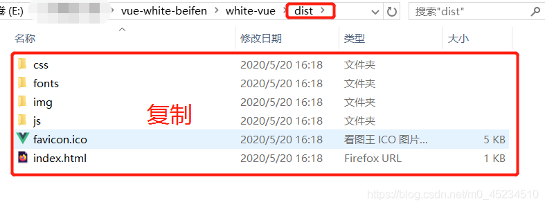
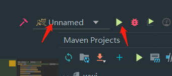

​                                            

# springboot+vue的前后端分离部署（详细）

### 部署

- [方法一：前后端分开部署](#_2)
- [一、前端部署](#_3)
- - [1、下载 nginx，官方网址如下：](#1_nginx_4)
  - [2、解压安装包到任意目录](#2_7)
  - [3、打开前端项目，执行` npm run build`](#3_npm_run_build_8)
  - [4、进入本地项目的dist目录，把里面的文件都复制](#4dist_9)
  - [5、然后把它直接拷贝进` nginx\html` 下（注意：需要覆盖掉nginx\html 下的index.html）](#5_nginxhtml_nginxhtml_indexhtml_11)
  - [6、配置一下服务器的默认端口，打开 `nginx\conf\nginx.conf`，找到 server 的配置处，然后按照下图来更改：](#6_nginxconfnginxconf_server__12)
  - [7、配置完成后，运行 nginx 根目录下的 `nginx.exe` （会出现命令窗口一闪而过，说明启动了），访问 `http://localhost:8081/` 。到此，前端部署完成，接下来到后端。](#7_nginx__nginxexe__httplocalhost8081___15)
- [二、后端部署](#_18)
- - [1、首先打开后端项目的` pom.xml`，修改 标签里的 war 为 jar](#1_pomxml_packaging__war__jar_20)
  - [2、在后端项目的终端输入`mvn install`](#2mvn_install_22)
  - [3、在这里，可能会报错，说`mvn`不是可执行的命令，原因是没有将maven配置为全局环境变量。](#3mvnmaven_24)
  - [4、再回到后端项目输入`mvn install`](#4mvn_install_35)
  - [5、程序执行完成，在项目的 target 文件夹下就会出现我们的 jar 包](#5_target__jar__36)
  - [6、先在控制台cd 到 target目录下，然后执行 `java -jar wj-0.0.1-SNAPSHOT.jar` （注意名称）。](#6cd__target_java_jar_wj001SNAPSHOTjar__39)
  - [7、测试一下`http://localhost:8443/api/XXX`,没报错。到这，后端也部署成功了。可以去前端的端口使用后端了。](#7httplocalhost8443apiXXX_41)
- [方法二：把前端整合到后端再部署](#_43)
- - [1、把方法一中list文件夹下的静态文件都拷贝到后端项目的./static目录下。](#1liststatic_45)
  - [2、把pom里的jar改为war](#2pomjarwar_47)
  - [3、再在pom中添加两个依赖](#3pom_50)
  - [4、在控制台输入`mvn insatll`即可](#4mvn_insatll_72)
  - [5、配置tomcat](#5tomcat_73)


# **方法一：前后端分开部署**

# **一、前端部署**

## **1、下载 nginx，官方网址如下：**

http://nginx.org/en/download.html
 

## **2、解压安装包到任意目录**

## **3、打开前端项目，执行npm run build**

## **4、进入本地项目的dist目录，把里面的文件都复制**



## **5、然后把它直接拷贝进nginx\html 下（注意：需要覆盖掉nginx\html 下的index.html）**

## **6、配置一下服务器的默认端口，打开 nginx\conf\nginx.conf，找到 server 的配置处，然后按照下图来更改：**


## **7、配置完成后，运行 nginx 根目录下的 nginx.exe （会出现命令窗口一闪而过，说明启动了），访问 http://localhost:8081/ 。到此，前端部署完成，接下来到后端。**

------

# **二、后端部署**

## **1、首先打开后端项目的pom.xml，修改 标签里的 war 为 jar**


## **2、在后端项目的终端输入mvn install**


## **3、在这里，可能会报错，说mvn不是可执行的命令，原因是没有将maven配置为全局环境变量。**

这时，需给maven配置环境变量。
 1.在桌面我的电脑处，右键选择 属性
 2.选择高级系统设置
 
 3.环境变量


 4.
 6.选择新建，然后输入你安装的maven的路径，一直到\bin目录，点击确定。
 

## **4、再回到后端项目输入mvn install**

## **5、程序执行完成，在项目的 target 文件夹下就会出现我们的 jar 包**


## **6、先在控制台cd 到 target目录下，然后执行 java -jar wj-0.0.1-SNAPSHOT.jar （注意名称）。**

## **7、测试一下http://localhost:8443/api/XXX,没报错。到这，后端也部署成功了。可以去前端的端口使用后端了。**

------

# **方法二：把前端整合到后端再部署**

## **1、把方法一中list文件夹下的静态文件都拷贝到后端项目的./static目录下。**

## **2、把pom里的jar改为war**


## **3、再在pom中添加两个依赖**

```java
<!-- springboot tomcat 支持 -->
        <dependency>
            <groupId>org.springframework.boot</groupId>
            <artifactId>spring-boot-starter-tomcat</artifactId>
            <scope>provided</scope>
        </dependency>

123456
<!-- mvn 打包依赖 -->
            <plugin>
                <groupId>org.apache.maven.plugins</groupId>
                <artifactId>maven-surefire-plugin</artifactId>
                <configuration>
                    <skip>true</skip>
                </configuration>
            </plugin>

12345678
```

## **4、在控制台输入mvn insatll即可**

## **5、配置tomcat**


 
 修改端口号
 
 到此，就启动完成了！

> ★ 
>
> 部署这遇到了好多坑啊，东查查西查查，才算把项目前后端都部署了，java路漫漫，继续前进！如果你觉得这篇文章对你有帮助，请给我个赞吧！
>
> ”