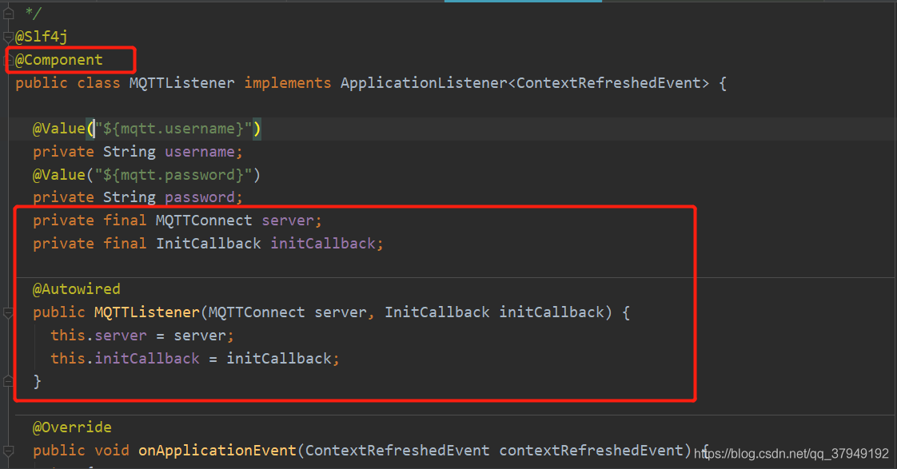
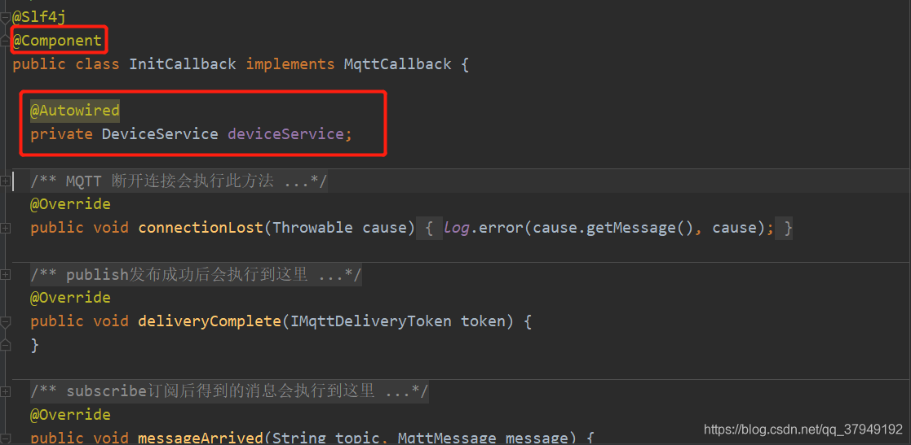

# springboot整合Mqtt

[github IOT 项目源码](https://github.com/ck-chenkang/springboot-mqtt)

## [java连接MQTT服务器(Springboot整合MQTT)](https://blog.csdn.net/qq_37949192/article/details/103962848)

**目录**

[一、业务场景](#t0)

[二、本文只讲解java连接MQTT服务器进行数据处理](#t1)

------

### 一、业务场景

 硬件采集的数据传入EMQX平台(采用[MQTT](https://so.csdn.net/so/search?q=MQTT&spm=1001.2101.3001.7020)协议)，java通过代码连接MQTT服务器，进行采集数据接收、解析、业务处理、存储入库、数据展示。

MQTT 是基于 **发布(Publish)/订阅(Subscribe)** 模式来进行通信及数据交换的。

### 二、本文只讲解java连接MQTT服务器进行数据处理

1、新建springboot项目，pom文件中直接引入下面的mqtt依赖

```xml
<dependency>
  <groupId>org.springframework.integration</groupId>
  <artifactId>spring-integration-mqtt</artifactId>
</dependency>
```

2、 编写MQTT工具类

```java
package com.siborui.dc.mqtt;

import lombok.extern.slf4j.Slf4j;
import org.eclipse.paho.client.mqttv3.*;
import org.eclipse.paho.client.mqttv3.persist.MemoryPersistence;
import org.springframework.beans.factory.annotation.Value;
import org.springframework.stereotype.Component;

/**
 * MQTT工具类操作
 *
 * @author Mr.Qu
 * @since v1.1.0 2020-01-10
 */
@Slf4j
@Component
public class MQTTConnect {

    private String HOST = "tcp://127.0.0.1:1883"; //mqtt服务器的地址和端口

    private final String clientId = "DC" + (int) (Math.random() * 100000000);


    private MqttClient mqttClient;


 


    /**


     * 客户端connect连接mqtt服务器


     *


     * @param userName     用户名


     * @param passWord     密码


     * @param mqttCallback 回调函数


     **/


    public void setMqttClient(String userName, String passWord, MqttCallback mqttCallback) throws MqttException {


        MqttConnectOptions options = mqttConnectOptions(userName, passWord);


        if (mqttCallback == null) {


            mqttClient.setCallback(new Callback());


        } else {


            mqttClient.setCallback(mqttCallback);


        }


        mqttClient.connect(options);


    }


 


    /**


     * MQTT连接参数设置


     */


    private MqttConnectOptions mqttConnectOptions(String userName, String passWord) throws MqttException {


        mqttClient = new MqttClient(HOST, clientId, new MemoryPersistence());


        MqttConnectOptions options = new MqttConnectOptions();


        options.setUserName(userName);


        options.setPassword(passWord.toCharArray());


        options.setConnectionTimeout(10);///默认：30


        options.setAutomaticReconnect(true);//默认：false


        options.setCleanSession(false);//默认：true


        //options.setKeepAliveInterval(20);//默认：60


        return options;


    }


 


    /**


     * 关闭MQTT连接


     */


    public void close() throws MqttException {


        mqttClient.close();


        mqttClient.disconnect();


    }


 


    /**


     * 向某个主题发布消息 默认qos：1


     *


     * @param topic:发布的主题


     * @param msg：发布的消息


     */


    public void pub(String topic, String msg) throws MqttException {


        MqttMessage mqttMessage = new MqttMessage();


        //mqttMessage.setQos(2);


        mqttMessage.setPayload(msg.getBytes());


        MqttTopic mqttTopic = mqttClient.getTopic(topic);


        MqttDeliveryToken token = mqttTopic.publish(mqttMessage);


        token.waitForCompletion();


    }


 


    /**


     * 向某个主题发布消息


     *


     * @param topic: 发布的主题


     * @param msg:   发布的消息


     * @param qos:   消息质量    Qos：0、1、2


     */


    public void pub(String topic, String msg, int qos) throws MqttException {


        MqttMessage mqttMessage = new MqttMessage();


        mqttMessage.setQos(qos);


        mqttMessage.setPayload(msg.getBytes());


        MqttTopic mqttTopic = mqttClient.getTopic(topic);


        MqttDeliveryToken token = mqttTopic.publish(mqttMessage);


        token.waitForCompletion();


    }


 


    /**


     * 订阅某一个主题 ，此方法默认的的Qos等级为：1


     *


     * @param topic 主题


     */


    public void sub(String topic) throws MqttException {


        mqttClient.subscribe(topic);


    }


 


    /**


     * 订阅某一个主题，可携带Qos


     *


     * @param topic 所要订阅的主题


     * @param qos   消息质量：0、1、2


     */


    public void sub(String topic, int qos) throws MqttException {


        mqttClient.subscribe(topic, qos);


    }


 


    /**


     * main函数自己测试用


     */


    public static void main(String[] args) throws MqttException {


        MQTTConnect mqttConnect = new MQTTConnect();


        mqttConnect.setMqttClient("admin", "public", new Callback());


        mqttConnect.sub("com/iot/init");


        mqttConnect.pub("com/iot/init", "Mr.Qu" + (int) (Math.random() * 100000000));


    }


}
```

3、编写MQTT的回调函数

```java
package com.siborui.dc.mqtt;


 


import lombok.extern.slf4j.Slf4j;


import org.eclipse.paho.client.mqttv3.IMqttDeliveryToken;


import org.eclipse.paho.client.mqttv3.MqttCallback;


import org.eclipse.paho.client.mqttv3.MqttMessage;


 


/**


 * 常规MQTT回调函数


 *


 * @author Mr.Qu


 * @since 2020/1/9 16:26


 */


@Slf4j


public class Callback implements MqttCallback {


 


    /**


     * MQTT 断开连接会执行此方法


     */


    @Override


    public void connectionLost(Throwable throwable) {


        log.info("断开了MQTT连接 ：{}", throwable.getMessage());


        log.error(throwable.getMessage(), throwable);


    }


 


    /**


     * publish发布成功后会执行到这里


     */


    @Override


    public void deliveryComplete(IMqttDeliveryToken iMqttDeliveryToken) {


        log.info("发布消息成功");


    }


 


    /**


     * subscribe订阅后得到的消息会执行到这里


     */


    @Override


    public void messageArrived(String topic, MqttMessage message) throws Exception {


        //  TODO    此处可以将订阅得到的消息进行业务处理、数据存储


        log.info("收到来自 " + topic + " 的消息：{}", new String(message.getPayload()));


    }


}
```

4、由于业务场景需要，在项目启动时，监听MQTT主题Topic，编写MQTT监听器

```java
package com.siborui.dc.mqtt;


 


import lombok.extern.slf4j.Slf4j;


import org.eclipse.paho.client.mqttv3.MqttException;


import org.springframework.beans.factory.annotation.Autowired;


import org.springframework.context.ApplicationListener;


import org.springframework.context.event.ContextRefreshedEvent;


import org.springframework.stereotype.Component;


 


import com.siborui.dc.mqtt.Callback;


 


/**


 * 项目启动 监听主题


 *


 * @author Mr.Qu


 * @since 2020/1/10


 */


@Slf4j


@Component


public class MQTTListener implements ApplicationListener<ContextRefreshedEvent> {


 


    private final MQTTConnect server;


 


    @Autowired


    public MQTTListener(MQTTConnect server) {


        this.server = server;


    }


 


    @Override


    public void onApplicationEvent(ContextRefreshedEvent contextRefreshedEvent) {


        try {


            server.setMqttClient("admin", "public", new Callback());


            server.sub("com/iot/init");


        } catch (MqttException e) {


            log.error(e.getMessage(), e);


        }


    }

}
 
```

## [MQTT异常掉线原因](https://blog.csdn.net/qq_37949192/article/details/103990913)

### **一、业务场景**

我们在使用MQTT协议的时候，有些伙伴可能会遇到MQTT客户端频繁掉线、上线问题

### **二、原因分析及异常处理**

1. **原因：使用相同的clientID**

    方案：全局使用的clientID保证唯一性，可以采用UUID等方式

2. **原因: 当前用户没有Topic权限**

​     方案：如果配置有acl权限，则查询当前登录mqtt用户是否具有订阅对应topic的权限，无权时也会造成一直频繁断线重连

  **3. 原因：在回调函数内进行业务处理遇到异常并没有捕获**

方案：在可能出现异常的语句块，进行try-catch捕获

```java
    /**


     * subscribe订阅后得到的消息会执行到这里


     */


    @Override


    public void messageArrived(String topic, MqttMessage message) {


        String msg = new String(message.getPayload());


        try {


            //此处可能因为收到的消息不合法，会造成JSON转化异常，若异常未捕获，会导致MQTT客户端掉线


            JSONObject jsonObject = JSON.parseObject(msg);


            String gwId = String.valueOf(jsonObject.get("gwId"));


        } catch (JSONException e) {


            log.error("JSON Format Parsing Exception : {}", msg);


        }


    }
```

## [MQTT设置自动重连后，无法自动订阅以前的主题](https://blog.csdn.net/qq_37949192/article/details/103991674)

### **一、业务场景**

我们在使用MQTT的时候，在设置客户端参数的时候设置的自动重连属性，但是断开重连后无法订阅断开之前订阅的消息。

### **二、异常处理**

在设置MQTT客户端参数配置的时候记得设置不要清除[Session](https://so.csdn.net/so/search?q=Session&spm=1001.2101.3001.7020)即可

```java
    /**


     * MQTT连接参数设置


     */


    private MqttConnectOptions mqttConnectOptions(String userName, String passWord) throws MqttException {


        mqttClient = new MqttClient(HOST, clientId, new MemoryPersistence());


        MqttConnectOptions options = new MqttConnectOptions();


        options.setUserName(userName);


        options.setPassword(passWord.toCharArray());


        options.setConnectionTimeout(10);///默认：30


        options.setAutomaticReconnect(true);//默认：false


        options.setCleanSession(false);//默认：true


        //options.setKeepAliveInterval(20);//默认：60


        return options;


    }
```

设置AutomaticReconnect(true)和CleanSession(false)，这样MQTT客户端在断开重连后还能继续收到之前的消息

## [MQTT将订阅到的消息存储数据库](https://blog.csdn.net/qq_37949192/article/details/103998723)

### **一、业务场景**

​    ***提示：对于Broker（MQTT服务器）来说，不论我们是发布方，还是订阅方，都是属于客户端***

​     硬件方面将采集的数据上报至MQTT服务器，我们平台（自己的WEB服务）将订阅到的消息***存储数据库\***，如何用JAVA作为客户端订阅消息在我的上一篇文章中有讲解***[如何使用JAVA编写MQTT客户端连接MQTT服务器](https://blog.csdn.net/qq_37949192/article/details/103962848)***。

​    好多朋友在看官网的时候对于这一点理解有点偏差，官网上面说开源版本不支持消息存储数据库，主要表达的意思是MQTT服务端不会自动将收到的消息存储数据库（当企业版的是可以配置后，MQTT服务端自动将收到的消息存储数据库），但是我们可以自己编写代码去实现这个功能，并不麻烦的。

### **二、解决方案**

​     基于以上问题，针对开源版本，有两种方式将订阅到的消息存储数据库，如下：

​     方式一、我们可以自己编写插件，采用EMQX支持自定义插件扩展，但是个人不建议采用自定义插件，因为erlang语言不熟悉，出问题无法及时解决。

​     方式二、下面主要讲解如何在[回调](https://so.csdn.net/so/search?q=回调&spm=1001.2101.3001.7020)函数中调用我们的service服务，将订阅到的数据存储数据库

​     1、首先，采用Springboot搭建项目框架，编写MQTT客户端，在我的上一章节中有详细代码介绍***[JAVA编写MQTT客户端连接MQTT服务端](https://blog.csdn.net/qq_37949192/article/details/103962848)。\***

​     2、如何在回调函数中调用我们的service服务存储数据，可能好多朋友直接在回调函数中使用注解形式@Autowired，就像我们在controller中那样直接调用service服务，但是实际用的时候发现注解注入的service服务是空的，给你报java.lang.NullException,然后MQTT就断开连接了。

​       其实采用注解形式是可以获取到service服务的，那是因为我们的编码不当造成的。以下是采用注解方式解决的办法：

-   在监听器中（MQTTListener）将回调函数注入，回调函数本身添加@Component注解   
  - 
-   在回调函数中注入对应的Service即可，此Service跟普通的Service接口一样   
  - 

## [java如何监听MQTT客户端状态（在线、离线）](https://blog.csdn.net/qq_37949192/article/details/104015861)

## **一、业务场景**

好多朋友在咨询如何得知（监测）MQTT客户端状态（在线、离线），或者可以说是监测采集器状态。

其实这个在MQTT协议中已经给出系统主题，MQTT服务端可以知道客户端的任何情况，比如：什么时候上线和下线。

## **二、解决方案**

**$SYS/brokers/${node}/clients/${clientid}/connected**：上线事件。当某客户端上线时，会向该主题（Topic）发布消息

 **$SYS/brokers/${node}/clients/${clientid}/disconnected**：掉线事件。当某客户端掉线时，会向该主题（Topic）发布消息

当然在开发的时候我们订阅两个主题比较麻烦，在这里我们可以采用主题通配符模式直接订阅一个主题即可：**$SYS/brokers/+/clients/#**

这样比较方便，只不过需要我们在回调函数中进行Topic主题的区分就可以了，例如：

```java
    /**


     * subscribe后得到的消息会执行到这里面


     */


    @Override


    public void messageArrived(String topic, MqttMessage message) throws Exception {


        String msg = new String(message.getPayload());


        try {


            JSONObject jsonObject = JSON.parseObject(msg);


            String clientId = String.valueOf(jsonObject.get("clientid"));


            if (topic.endsWith("disconnected")) {


                log.info("客户端已掉线：{}",clientId);


            } else {


                log.info("客户端已上线：{}",clientId);


            }


        } catch (JSONException e) {


            log.error("JSON Format Parsing Exception : {}", msg);


        }

    }
```