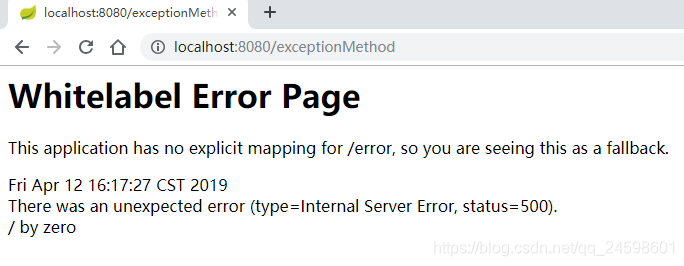
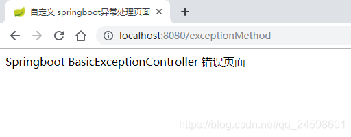
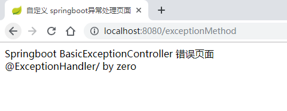
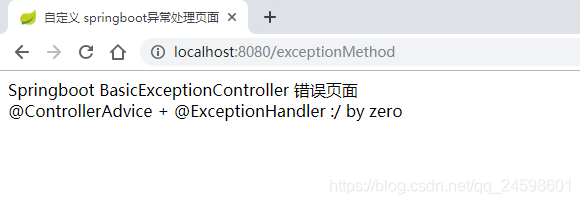
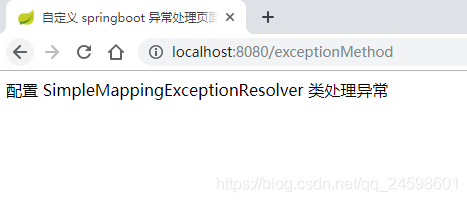
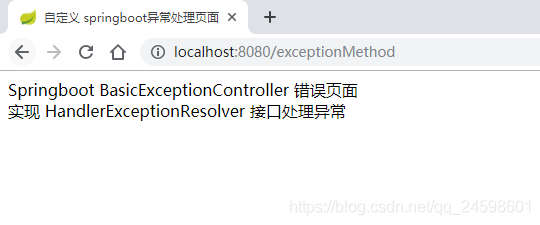

# Springboot异常处理的五种方式——SpringBoot学习

[Springboot异常处理的五种方式——SpringBoot学习](https://blog.csdn.net/qq_24598601/article/details/89243914?ops_request_misc=%257B%2522request%255Fid%2522%253A%2522164697061416780265435604%2522%252C%2522scm%2522%253A%252220140713.130102334.pc%255Fall.%2522%257D&request_id=164697061416780265435604&biz_id=0&utm_medium=distribute.pc_search_result.none-task-blog-2~all~first_rank_ecpm_v1~rank_v31_ecpm-1-89243914.pc_search_result_control_group&utm_term=Springboot++%E5%BC%82%E5%B8%B8%E5%A4%84%E7%90%86&spm=1018.2226.3001.4187)

​                                            

  SpringBoot [框架](https://so.csdn.net/so/search?q=框架&spm=1001.2101.3001.7020)异常处理有五种处理方式，从范围来说包括有全局异常捕获处理方式和局部异常捕获处理方式，接下来通过使用下面的后端代码一一对这五种捕获方式讲解。

```
package com.controller;

import org.slf4j.Logger;
import org.slf4j.LoggerFactory;
import org.springframework.stereotype.Controller;
import org.springframework.ui.Model;
import org.springframework.web.bind.annotation.RequestMapping;

/**
* @Description 抛出异常 Controller，测试异常
* @author 欧阳
* @since 2019年4月12日 下午12:48:31
* @version V1.0
*/

@Controller
public class ExceptionController {
	
	private static final Logger log = LoggerFactory.getLogger(ExceptionController.class);
	
	@RequestMapping("/exceptionMethod")
	public String exceptionMethod(Model model) throws Exception {
		
		model.addAttribute("msg", "没有抛出异常");
		
		int num = 1/0;   //a处
		log.info(String.valueOf(num));
		
		return "home";
	}

}


123456789101112131415161718192021222324252627282930313233
```

  上述代码将会在 a处抛出 `ArithmeticException` 异常。

### 一、自定义异常错误页面

  相信大家有过这样的经历，在遇到异常时，SpringBoot 会自动跳到一个统一的异常页面，没错，SpringBoot 默认的已经提供了一套处理异常的机制，我们只需要自定义该错误页面就可以，所以这种方式就是自定义这个异常的错误页面。
   SpringBoot 默认的[异常处理](https://so.csdn.net/so/search?q=异常处理&spm=1001.2101.3001.7020)机制：一旦程序中出现了异常 SpringBoot 就会请求 `/error` 的 url 。在 SpringBoot 中提供了一个叫 BasicExceptionController 来处理 `/error` 请求，然后跳转到默认显示异常的页面来展示异常信息。接下来就是自定义异常错误页面了，方法很简单，就是在目录 `src/main/resources/templates/` 下定义一个叫 `error` 的文件，可以是 jsp 也可以是 html 。
 
   上图为在指定目录 `src/main/resources/templates/` 添加 `error.html` 页面前效果。

```
<!DOCTYPE html>
<html>
<head>
<meta charset="UTF-8">
<title>自定义 springboot 异常处理页面</title>
</head>
<body>
Springboot BasicExceptionController  错误页面
<br>
<span th:text="${msg}"></span>
</body>
</html>

123456789101112
```

  在指定目录添加 error.html 页面后效果图：
 

  注意：必须是在目录 `src/main/resources/templates/` 下定义 `error` 的文件。

### 二、使用 @ExceptionHandler 注解处理局部异常

  使用这个注解就容易了，但是只能处理使用 `@ExceptionHandler` 注解的方法的 `Controller` 的异常，对于其他 `Controller` 的异常就无能为力了，只能再使用同样的方法将使用 `@ExceptionHandler` 注解的方法写入要捕获异常的 `Controller` 中，所以不推荐使用。

  使用方式：在最上面的 `ExceptionController` 中加入使用 `@ExceptionHandler` 注解的方法代码，整个 `ExceptionController` 代码如下：

```
package com.controller;

import org.slf4j.Logger;
import org.slf4j.LoggerFactory;
import org.springframework.stereotype.Controller;
import org.springframework.ui.Model;
import org.springframework.web.bind.annotation.ExceptionHandler;
import org.springframework.web.bind.annotation.RequestMapping;

/**
* @Description 抛出异常 Controller，测试异常
* @author 欧阳
* @since 2019年4月12日 下午12:48:31
* @version V1.0
*/

@Controller
public class ExceptionController {
	
	private static final Logger log = LoggerFactory.getLogger(ExceptionController.class);
	
	@RequestMapping("/exceptionMethod")
	public String exceptionMethod(Model model) throws Exception {
		
		model.addAttribute("msg", "没有抛出异常");
		
		int num = 1/0;
		log.info(String.valueOf(num));
		
		return "home";
	}
	
	/**
	 * 描述：捕获 ExceptionController 中的 ArithmeticException 异常
	 * @param model 将Model对象注入到方法中
	 * @param e 将产生异常对象注入到方法中
	 * @return 指定错误页面
	 */
	@ExceptionHandler(value = {ArithmeticException.class})
	public String arithmeticExceptionHandle(Model model, Exception e) {
		
		model.addAttribute("msg", "@ExceptionHandler" + e.getMessage());
		log.info(e.getMessage());
		
		return "error";
	}
}


123456789101112131415161718192021222324252627282930313233343536373839404142434445464748
```

  **代码说明**：注解 `@ExceptionHandler` 中 `value` 的值为数组，表示指定捕获的异常类型，这里表示捕获 `ArithmeticException` 异常，因为 `a 处` 抛出的是 `ArithmeticException` 异常，跳转的页面为统一的 `error.html` 页面，但描述信息不同，以用来区分是 SpringBoot 处理的异常还是我们自己的方法处理的异常，下面也是使用这个方式来区分。

  当访问 `http://localhost:8080/exceptionMethod` 时，跳转到下面页面，显示 `@ExceptionHandler/ by zero` ，表示我们使用 `@ExceptionHandler` 注解处理异常成功。
 

### 三、使用 @ControllerAdvice + @ExceptionHandler 注解处理全局异常

  使用 `@ControllerAdvice` + `@ExceptionHandler` 注解能够处理全局异常，这种方式推荐使用，可以根据不同的异常对不同的异常进行处理。
   使用方式：定义一个类，使用 `@ControllerAdvice` 注解该类，使用 `@ExceptionHandler` 注解方法，这里我定义了一个 `GlobalException` 类表示来处理全局异常，代码如下：

```
package com.controller;

import org.slf4j.Logger;
import org.slf4j.LoggerFactory;
import org.springframework.ui.Model;
import org.springframework.web.bind.annotation.ControllerAdvice;
import org.springframework.web.bind.annotation.ExceptionHandler;

/**
* @Description 全局异常处理类
* @author 欧阳
* @since 2019年4月12日 下午3:52:04
* @version V1.0
*/
@ControllerAdvice
public class GlobalException {
	
	private static final Logger log = LoggerFactory.getLogger(GlobalException.class);

	
	/**
	 * 描述：捕获 ArithmeticException 异常
	 * @param model 将Model对象注入到方法中
	 * @param e 将产生异常对象注入到方法中
	 * @return 指定错误页面
	 */
	@ExceptionHandler(value = {ArithmeticException.class})
	public String arithmeticExceptionHandle(Model model, Exception e) {
		
		model.addAttribute("msg", "@ControllerAdvice + @ExceptionHandler :" + e.getMessage());
		log.info(e.getMessage());
		
		return "error";
	}
	
}


12345678910111213141516171819202122232425262728293031323334353637
```

   如果需要处理其他异常，例如 `NullPointerException` 异常，则只需要在 `GlobalException` 类中定义一个方法使用 `@ExceptionHandler(value = {NullPointerException.class})` 注解该方法，在该方法内部处理异常就可以了。

  当访问 `http://localhost:8080/exceptionMethod` 时，跳转到下面页面，显示 `@ControllerAdvice + @ExceptionHandler :/ by zero` ，表示我们使用 `@ControllerAdvice` + `@ExceptionHandler` 注解处理异常成功。
 

### 四、配置 SimpleMappingExceptionResolver 类处理异常

  通过配置 `SimpleMappingExceptionResolver` 类处理异常也是全局范围的，通过将 `SimpleMappingExceptionResolver` 类注入到 Spring 容器。

```
package com.config;

import java.util.Properties;

import org.springframework.context.annotation.Bean;
import org.springframework.context.annotation.Configuration;
import org.springframework.web.servlet.handler.SimpleMappingExceptionResolver;

/**
* @Description 配置 SimpleMappingExceptionResolver 类处理异常
* @author 欧阳
* @since 2019年4月12日 下午5:01:08
* @version V1.0
*/

@Configuration
public class GlobalException {
	
	@Bean
	public SimpleMappingExceptionResolver
		getSimpleMappingExceptionResolver(){
		SimpleMappingExceptionResolver resolver = new SimpleMappingExceptionResolver();
		
		Properties mappings = new Properties();
		/*
		 * 参数一：异常的类型，注意必须是异常类型的全名
		 * 参数二：视图名称
		 */
		mappings.put("java.lang.ArithmeticException", "errors");
		
		//设置异常与视图映射信息的
		resolver.setExceptionMappings(mappings);
		
		return resolver;
	}
}


12345678910111213141516171819202122232425262728293031323334353637
```

  注意：在类上加上 `@Configuration` 注解，在方法上加上 `@Bean` 注解，方法返回值必须是 `SimpleMappingExceptionResolver` 。

  编写 `errors.html` 页面

```
<!DOCTYPE html>
<html>
<head>
<meta charset="UTF-8">
<title>自定义 springboot 异常处理页面</title>
</head>
<body>
配置 SimpleMappingExceptionResolver 类处理异常
</body>
</html>

12345678910
```

  访问 `http://localhost:8080/exceptionMethod` 链接后抛出 `ArithmeticException` 异常，跳转到 `errors.html` 页面，效果图如下所示：
 

### 五、实现 HandlerExceptionResolver 接口处理异常

  通过实现 `HandlerExceptionResolver` 接口处理异常，第一步是编写类实现 `HandlerExceptionResolver` 接口。

```
package com.config;

import javax.servlet.http.HttpServletRequest;
import javax.servlet.http.HttpServletResponse;

import org.springframework.context.annotation.Configuration;
import org.springframework.web.servlet.HandlerExceptionResolver;
import org.springframework.web.servlet.ModelAndView;

/**
* @Description 实现 HandlerExceptionResolver 接口处理异常
* @author 欧阳
* @since 2019年4月12日 下午5:13:58
* @version V1.0
*/

@Configuration
public class HandlerExceptionResolverImpl implements HandlerExceptionResolver {

	@Override
	public ModelAndView resolveException(HttpServletRequest request, HttpServletResponse response, Object handler,
			Exception ex) {
		ModelAndView modelAndView = new ModelAndView();
		
		modelAndView.addObject("msg", "实现 HandlerExceptionResolver 接口处理异常");
		
		//判断不同异常类型，做不同视图跳转
		if(ex instanceof ArithmeticException){
			modelAndView.setViewName("error");
		}
		
		return modelAndView;
	}

}


123456789101112131415161718192021222324252627282930313233343536
```

  注意：在类上加上 `@Configuration` 注解。

  配置完后访问 `http://localhost:8080/exceptionMethod` 后效果：
 