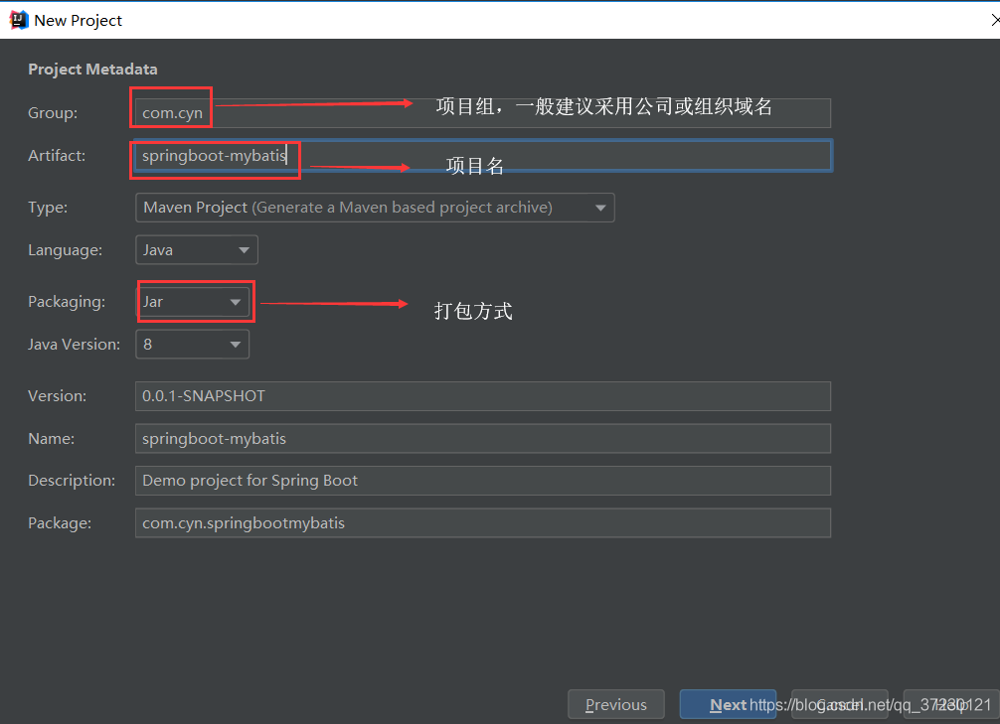

# spring boot整合Mybatis
参考链接：
[springboot整合Mybatis完整详细版](https://blog.csdn.net/iku5200/article/details/82856621?ops_request_misc=%257B%2522request%255Fid%2522%253A%2522164663372616780366532958%2522%252C%2522scm%2522%253A%252220140713.130102334..%2522%257D&request_id=164663372616780366532958&biz_id=0&utm_medium=distribute.pc_search_result.none-task-blog-2~all~top_positive~default-2-82856621.pc_search_result_control_group&utm_term=springboot%E6%95%B4%E5%90%88mybatis&spm=1018.2226.3001.4187)
[springboot整合Mybatis实现增删改查操作--基于XML](https://blog.csdn.net/shengshenglalalala/article/details/100576106?ops_request_misc=%257B%2522request%255Fid%2522%253A%2522164663372616780366532958%2522%252C%2522scm%2522%253A%252220140713.130102334..%2522%257D&request_id=164663372616780366532958&biz_id=0&utm_medium=distribute.pc_search_result.none-task-blog-2~all~top_positive~default-1-100576106.pc_search_result_control_group&utm_term=springboot%E6%95%B4%E5%90%88mybatis&spm=1018.2226.3001.4187)
[springboot整合Mybatis项目源码github](https://github.com/wjup/springBoot_Mybatis)
[springboot整合Mybatis注解版](https://blog.csdn.net/qq_37230121/article/details/85458419?ops_request_misc=%257B%2522request%255Fid%2522%253A%2522164664038616780261961037%2522%252C%2522scm%2522%253A%252220140713.130102334..%2522%257D&request_id=164664038616780261961037&biz_id=0&utm_medium=distribute.pc_search_result.none-task-blog-2~all~baidu_landing_v2~default-1-85458419.pc_search_result_control_group&utm_term=springboot%E6%95%B4%E5%90%88mybatis%E6%B3%A8%E8%A7%A3&spm=1018.2226.3001.4187)
[mybatis中文文档](https://mybatis.org/mybatis-3/zh/index.html)
[mybatis-spring中文文档](http://mybatis.org/spring/zh/index.html)
## 注解的方式
### 一、项目创建
- 新建一个工程

- 选择Spring Initializr，配置JDK版本

- 输入项目名

-  选择构建web项目所需的staters（启动器）

------
- 选择与数据库相关的组件

> ★ 
>
> **分析：Spring Boot基本上将我们实际项目开发中所遇到的所有场景都做了封装。它将所有的功能场景都抽取出来，做成了一个个的staters（启动器），只需要在项目的pom.xml配置文件里面引入这些starter相关场景的所有依赖都会导入进来。需要什么功能就导入什么场景的启动器，实质就是通过配置导入了与实现其功能相关的jar包，然后直接进行项开发即可。** 
>
> ”
------
- 选择保存地址后点击Finish

------
- 注意：idea必须在联网环境下才会自动构建项目

------
- 在项目中使用druid作为数据源，不会的请点击[SpringBoot整合Druid数据源](https://blog.csdn.net/qq_37230121/article/details/85405567)
- 在bean包下新建实体类对象Department （职位）
```java
package com.cyn.bean;
/**
 * @author：cyn
 * @create：2018/12/30 16:17
 * @description：职位实体类
 */
public class Department {
    private  Integer id;                   //职位id
    private  String departmentName;        //职位名
    public Integer getId() {
        return id;
    }
    public void setId(Integer id) {
        this.id = id;
    }
    public String getDepartmentName() {
        return departmentName;
    }
    public void setDepartmentName(String departmentName) {
        this.departmentName = departmentName;
    }
}
```
------
- 新建数据库mybatis，在数据库中新建与实体类对象相关联的数据库表 department
```sql
SET FOREIGN_KEY_CHECKS=0;
-- ----------------------------
-- Table structure for department
-- ----------------------------
DROP TABLE IF EXISTS `department`;
CREATE TABLE `department` (
  `id` int(11) NOT NULL AUTO_INCREMENT,
  `departmentName` varchar(255) DEFAULT NULL,
  PRIMARY KEY (`id`)
) ENGINE=InnoDB AUTO_INCREMENT=1 DEFAULT CHARSET=utf8; 
```
------
- 在mapper包下新建与实体类所关联的mapper接口【注解版】：DepartmentMapper 
```java
package com.cyn.mapper;
import com.cyn.bean.Department;
import org.apache.ibatis.annotations.*;
/**
 * @author：cyn
 * @create：2018/12/30 16:19
 * @description：职位实体类mapper接口
 */
//指定这是一个操作数据库的mapper
@Mapper
public interface DepartmentMapper {
    @Select("select * from department where id = #{id}")
    public Department getDeptById(Integer id);
    @Delete("delete from department where id = #{id}")
    public int deleteDeptById(Integer id);
    //指定表的id列为自增主键并自动绑定到pojo
    @Options(useGeneratedKeys = true,keyColumn = "id")
    @Insert("insert into department(departmentName) values(#{departmentName})")
    public int insertDept(Department department);
    @Update("update department set departmentName = #{departmentName} where id = #{id}")
    public int updateDept(Department department);
}
```
- ### 常用注解总结： 
> ★ 
>
> 1.   @Mapper：将mapper接口注册到容器中
> 2.   @Select：查询
> 3.   @Delete：删除
> 4.   @Insert：插入 
> 5.   @Update：更新
> 6.   @Options(useGeneratedKeys = true,keyColumn = "id")：指定表的自增主键并自动绑定到实体类对象   
> 7.   @Result 修饰返回的结果集，关联实体类属性和数据库字段一一对应，如果实体类属性和数据库属性名保持一致，   就不需要这个属性来修饰。
>
> ”
------
- 在controller包下新建controller控制类：DeptController
```java
package com.cyn.controller;
import com.cyn.bean.Department;
import com.cyn.mapper.DepartmentMapper;
import org.springframework.beans.factory.annotation.Autowired;
import org.springframework.web.bind.annotation.GetMapping;
import org.springframework.web.bind.annotation.PathVariable;
import org.springframework.web.bind.annotation.RestController;
/**
 * @author：cyn
 * @create：2018/12/30 16:27
 * @description：职位管理
 */
@RestController
public class DeptController {
    @Autowired
    DepartmentMapper departmentMapper;
    @GetMapping("/dept/{id}")
    public Department getDepartment(@PathVariable("id") Integer id){
        return departmentMapper.getDeptById(id);
    }
    @GetMapping("dept")
    public Department insertDeptment(Department department){
        departmentMapper.insertDept(department);
        return department;
    }
}
```
> ★ 
>
> 1. @RestController：等价于同时使用@ResponseBody和@Controller
> 2. @GetMapping("/dept/{id}")：等价于@RequestMapping(value = "/dept/{id}",method = RequestMethod.GET)
> 3.  /dept/{id}：controller中的url采用restful形式，不会的请自行百度
> 4. @PathVariable("id")：将url中相对应参数名的值绑定到指定的形参上
>
> ”
------
- 最后项目结构目录如下 

------
### 二、其他配置分析
- 如果数据库表满足驼峰命名规则，查询时候数据则无法自动映射到相对应的实体类属性上，我们可以在config包下新建一个自动配置类：MybatisConfig
```java
package com.cyn.config;
import org.apache.ibatis.session.Configuration;
import org.mybatis.spring.boot.autoconfigure.ConfigurationCustomizer;
import org.springframework.context.annotation.Bean;
/**
 * @author：cyn
 * @create：2018/12/30 17:04
 * @description：自定义Mybatis的配置规则
 */
@org.springframework.context.annotation.Configuration
public class MybatisConfig {
    //注册到容器中
    @Bean
    public ConfigurationCustomizer configurationCustomizer(){
        return new ConfigurationCustomizer(){
            @Override
            public void customize(Configuration configuration) {
                //开启驼峰命名规则
                configuration.setMapUnderscoreToCamelCase(true);
            }
        };
    }
}
```
------
- 如果我们不想每次都在mapper接口上添加@Mapper注解，我们可以在主配置类上通过添加@MapperScan注解来批量扫描指定包下的所有mapper接口，如下：
```java
package com.cyn;
import org.mybatis.spring.annotation.MapperScan;
import org.springframework.boot.SpringApplication;
import org.springframework.boot.autoconfigure.SpringBootApplication;
//添加对mapper的自动扫描
@MapperScan(value = "com.cyn.mapper")
@SpringBootApplication
public class SprignbootDataMybatisApplication {
    public static void main(String[] args) {
    SpringApplication.run(SprignbootDataMybatisApplication.class, args);
    }
}
```
------
### 三、项目测试：
- 启动项目，在url地址栏输入插入操作：http://localhost:8080/dept?departmentName=AAA

- 观察数据库，看是否插入成功

- 再在url地址栏输入查询操作：http://localhost:8080/dept/1

- 至此，springboot整合mybatis成功！如果你失败了，继续调试吧骚年！
------
### (￣︶￣)↗[GO!] 
## xml的方式
### **1.新建一个project**
新建项目时选择Spring Initializer。

### **2.创建项目文件结构、选择jdk版本**
一般选择Java version8

### **3.选择项目需要的依赖**
首先点击web选择spring web，再点击SQL选择MySQL driver 等，然后再一路next到新建完成。

### **4.查看项目新建完成后的pom文件**
```html
    <?xml version="1.0" encoding="UTF-8"?>
    <project xmlns="http://maven.apache.org/POM/4.0.0" xmlns:xsi="http://www.w3.org/2001/XMLSchema-instance"
    xsi:schemaLocation="http://maven.apache.org/POM/4.0.0 https://maven.apache.org/xsd/maven-4.0.0.xsd">
    <modelVersion>4.0.0</modelVersion>
    <parent>
    <groupId>org.springframework.boot</groupId>
    <artifactId>spring-boot-starter-parent</artifactId>
    <version>2.1.7.RELEASE</version>
    <relativePath/> <!-- lookup parent from repository -->
    </parent>
    <groupId>com.example</groupId>
    <artifactId>demo</artifactId>
    <version>0.0.1-SNAPSHOT</version>
    <name>demo</name>
    <description>Demo project for Spring Boot</description>
    <properties>
    <project.build.sourceEncoding>UTF-8</project.build.sourceEncoding>
    <project.reporting.outputEncoding>UTF-8</project.reporting.outputEncoding>
    <java.version>1.8</java.version>
    </properties>
    <dependencies>
    <dependency>
    <groupId>org.springframework.boot</groupId>
    <artifactId>spring-boot-starter-jdbc</artifactId>
    </dependency>
    <!--web相关-->
    <dependency>
    <groupId>org.springframework.boot</groupId>
    <artifactId>spring-boot-starter-web</artifactId>
    </dependency>
    <!--mybatis相关-->
    <dependency>
    <groupId>org.mybatis.spring.boot</groupId>
    <artifactId>mybatis-spring-boot-starter</artifactId>
    <version>2.1.0</version>
    </dependency>
    <!--mysql相关-->
    <dependency>
    <groupId>mysql</groupId>
    <artifactId>mysql-connector-java</artifactId>
    <scope>runtime</scope>
    </dependency>
    <dependency>
    <groupId>org.springframework.boot</groupId>
    <artifactId>spring-boot-starter-test</artifactId>
    <scope>test</scope>
    </dependency>
    </dependencies>
    <build>
    <resources>
    <resource>
        <directory>src/main/resources</directory>
        <includes>
            <include>**/*.properties</include>
            <include>**/*.xml</include>
            <include>**/*.yml</include>
        </includes>
        <filtering>true</filtering>
    </resource>
    </resources>
    <plugins>
    <plugin>
        <groupId>org.springframework.boot</groupId>
        <artifactId>spring-boot-maven-plugin</artifactId>
    </plugin>
    </plugins>
    </build>
    </project>
```
pom文件为默认生成，只需要在其中的build下添加以下代码，改代码表示在编译时囊括src/main/resources文件下的
1. .properties
2. .xml
3. .yml文件
防止编译出错。
```html
<resources>
            <resource>
                <directory>src/main/resources</directory>
                <includes>
                    <include>**/*.properties</include>
                    <include>**/*.xml</include>
                    <include>**/*.yml</include>
                </includes>
                <filtering>true</filtering>
            </resource>
        </resources>
```
### **5.修改相关配置文件src/main/resources**
5.1删除application.properties文件
5.2创建application.yml配置文件，该配置文件用于加载application-dev（后文创建）
```html
spring:
  profiles:
    active: dev
```
5.3创建application-dev.yml配置文件
```html
server:
  port: 8080
spring:
  datasource:
    username: root
    password: 123456
    #url中database为对应的数据库名称
    url: jdbc:mysql://localhost:3306/database?useUnicode=true&characterEncoding=utf-8&useSSL=true&serverTimezone=UTC
    driver-class-name: com.mysql.cj.jdbc.Driver
mybatis:
  mapper-locations: classpath:mapping/*.xml
  type-aliases-package: com.example.demo.entity
#showSql
logging:
  level:
    com.example.demo.mapper: debug
```
对以上两个文件的解释：
     一个项目有很多环境：开发环境，测试环境，准生产环境，生产环境。
​    每个环境的参数不同，我们就可以把每个环境的参数配置到yml文件中，这样在想用哪个环境的时候只需要在主配置文件中将用的配置文件写上就行如application.yml
​    在Spring Boot中多环境配置文件名需要满足application-{profile}.yml的格式，其中{profile}对应环境标识，比如：
​    application-dev.yml：开发环境
​     application-test.yml：测试环境
​     application-prod.yml：生产环境
​     至于哪个具体的配置文件会被加载，需要在application.yml文件中通过spring.profiles.active属性来设置，其值对应{profile}值
### **6.该项目的文件结构**
在com.example.demo包下分别创建包controller、entity、mapper、service。在resources下创建mapping文件夹。具体的代码结构如下图所示：

### **7.开始编码操作**
7.1新建数据库database，并在该数据库下建表user，包含id（int），userName（varchar），passWord（varchar），realName（varchar），插入几组数据。
```sql
CREATE TABLE `user` (
  `id` int(32) NOT NULL AUTO_INCREMENT,
  `userName` varchar(32) NOT NULL,
  `passWord` varchar(50) NOT NULL,
  `realName` varchar(32) DEFAULT NULL,
  PRIMARY KEY (`id`)
) ENGINE=InnoDB AUTO_INCREMENT=3 DEFAULT CHARSET=utf8;
```

7.2在entity包中新建User.java，使之与数据库中的字段一一对应
```java
package com.example.demo.entity;
public class User {
    private Integer id;
    private String userName;
    private String passWord;
    private String realName;
    public Integer getId() {
        return id;
    }
    public void setId(Integer id) {
        this.id = id;
    }
    public String getUserName() {
        return userName;
    }
    public void setUserName(String userName) {
        this.userName = userName;
    }
    public String getPassWord() {
        return passWord;
    }
    public void setPassWord(String passWord) {
        this.passWord = passWord;
    }
    public String getRealName() {
        return realName;
    }
    public void setRealName(String realName) {
        this.realName = realName;
    }
    @Override
    public String toString() {
        return "User{" +
                "id=" + id +
                ", userName='" + userName + '\'' +
                ", passWord='" + passWord + '\'' +
                ", realName='" + realName + '\'' +
                '}';
    }
}
```
7.3在mapper包中新建UserMapper接口
```java
package com.example.demo.mapper;
import com.example.demo.entity.User;
import org.springframework.stereotype.Repository;
import java.util.List;
@Repository
public interface UserMapper {
    /**
     * 根据id查询用户信息
     * @param id
     * @return
     */
    User getUserInfo(int id);
    /**
     * 新增用户
     * @param user
     * @return
     */
    int save (User user);
    /**
     * 更新用户信息
     * @param user
     * @return
     */
    int update (User user);
    /**
     * 根据id删除
     * @param id
     * @return
     */
    int deleteById (int id);
    /**
     * 查询所有用户信息
     * @return
     */
    List<User> selectAll ();
}
```
7.4在service包中新建实现类UserService.java
```java
package com.example.demo.service;
import com.example.demo.entity.User;
import com.example.demo.mapper.UserMapper;
import org.springframework.beans.factory.annotation.Autowired;
import org.springframework.stereotype.Service;
import java.util.List;
@Service
public class UserService {
    @Autowired
    private UserMapper userMapper;
    public User getUserInfo(int id) {
        return userMapper.getUserInfo(id);
    }
    public int deleteById(int id) {
        return userMapper.deleteById(id);
    }
    public int Update(User user) {
        return userMapper.update(user);
    }
    public User save(User user) {
        int save = userMapper.save(user);
        return user;
    }
    public List<User> selectAll() {
        return userMapper.selectAll();
    }
}
```
7.5在controller包中新建访问类UserController.java
```java
package com.example.demo.controller;
import com.example.demo.entity.User;
import com.example.demo.service.UserService;
import org.springframework.beans.factory.annotation.Autowired;
import org.springframework.web.bind.annotation.*;
import java.util.List;
@RestController
@RequestMapping("/testBoot")
public class UserController {
    @Autowired
    private UserService userService;
    //通过用户id获取用户所有信息
    //    http://localhost:8080/testBoot/getUser/1(此处1为要获取的id）
    @RequestMapping(value = "getUser/{id}", method = RequestMethod.GET)
    //    http://localhost:8080/testBoot/getUser?id=1(此处1为要获取的id）
    //    @RequestMapping(value = "/getUser", method = RequestMethod.GET)
    public String GetUser(@PathVariable int id) {
        return userService.getUserInfo(id).toString();
    }
    //通过用户id删除用户
    //    http://localhost:8080/testBoot/delete?id=1(此处1为要删除的id）
    @RequestMapping(value = "/delete", method = RequestMethod.GET)
    public String delete(int id) {
        int result = userService.deleteById(id);
        if (result >= 1) {
            return "删除成功";
        } else {
            return "删除失败";
        }
    }
    //根据用户id更新用户信息
    //http://localhost:8080/testBoot/update?id=2&userName=波波&passWord=123456&realName=lalala
    @RequestMapping(value = "/update", method = RequestMethod.POST)
    public String update(User user) {
        int result = userService.Update(user);
        if (result >= 1) {
            return "修改成功";
        } else {
            return "修改失败";
        }
    }
    //插入新用户
    //    http://localhost:8080/testBoot/insert?id=100&userName=波波&passWord=123456&realName=lalala
    @RequestMapping(value = "/insert", method = RequestMethod.POST)
    public User insert(User user) {
        return userService.save(user);
    }
    //打印所有用户信息
    //    http://localhost:8080/testBoot/selectAll
    @RequestMapping("/selectAll")
    @ResponseBody
    public List<User> ListUser() {
        return userService.selectAll();
    }
}
```
7.6在src/main/resources/mapping文件夹下新建UserMapper的映射文件UserMapper.[xml](https://so.csdn.net/so/search?q=xml&spm=1001.2101.3001.7020)
```java
<?xml version="1.0" encoding="UTF-8"?>
<!DOCTYPE mapper PUBLIC "-//mybatis.org//DTD Mapper 3.0//EN" "http://mybatis.org/dtd/mybatis-3-mapper.dtd">
<mapper namespace="com.example.demo.mapper.UserMapper">
    <resultMap id="BaseResultMap" type="com.example.demo.entity.User">
        <result column="id" jdbcType="INTEGER" property="id" />
        <result column="userName" jdbcType="VARCHAR" property="userName" />
        <result column="passWord" jdbcType="VARCHAR" property="passWord" />
        <result column="realName" jdbcType="VARCHAR" property="realName" />
    </resultMap>
<!--查询用户信息-->
    <select id="getUserInfo" resultType="com.example.demo.entity.User">
        select * from user where id = #{id}
    </select>
<!--删除用户信息-->
    <delete id="deleteById" parameterType="int">
        delete from user where id=#{id}
    </delete>
<!--返回所有用户信息-->
    <select id="selectAll"  resultType="com.example.demo.entity.User">
        select * from user
    </select>
<!--增加用户信息-->
    <insert id="save" parameterType="com.example.demo.entity.User" >
        insert into user
        <trim prefix="(" suffix=")" suffixOverrides="," >
            <if test="id != null" >
                id,
            </if>
            <if test="userName != null" >
                userName,
            </if>
            <if test="passWord != null" >
                passWord,
            </if>
            <if test="realName != null" >
                realName,
            </if>
        </trim>
        <trim prefix="values (" suffix=")" suffixOverrides="," >
            <if test="id != null" >
                #{id,jdbcType=INTEGER},
            </if>
            <if test="userName != null" >
                #{userName,jdbcType=VARCHAR},
            </if>
            <if test="passWord != null" >
                #{passWord,jdbcType=VARCHAR},
            </if>
            <if test="realName != null" >
                #{realName,jdbcType=VARCHAR},
            </if>
        </trim>
    </insert>
<!--根据id更改用户信息-->
    <update id="update" parameterType="com.example.demo.entity.User">
        update user
        <set >
            <if test="userName != null" >
                userName = #{userName,jdbcType=VARCHAR},
            </if>
            <if test="passWord != null" >
                passWord = #{passWord,jdbcType=VARCHAR},
            </if>
            <if test="realName != null" >
                realName = #{realName,jdbcType=VARCHAR},
            </if>
        </set>
        where id = #{id,jdbcType=INTEGER}
    </update>
</mapper>
```
7.7修改程序的启动入口类DemoApplication
```java
package com.example.demo;
import org.mybatis.spring.annotation.MapperScan;
import org.springframework.boot.SpringApplication;
import org.springframework.boot.autoconfigure.SpringBootApplication;
@MapperScan("com.example.demo.mapper") //扫描的mapper
@SpringBootApplication
public class DemoApplication {
    public static void main(String[] args) {
        SpringApplication.run(DemoApplication.class, args);
    }
}
```
### **8.验证**
到这里就完成了增删改查操作，接下来我们对上面的代码在Postman中进行验证
8.1通过用户id获取用户信息：
```html
http://localhost:8080/testBoot/getUser/1
(此处1为要获取的id）
```

8.2通过用户id删除用户
```html
http://localhost:8080/testBoot/delete?id=1
(此处1为要删除的id）
```

8.3根据用户id更新用户信息
http://localhost:8080/testBoot/update?id=2&userName=波波&passWord=123456&realName=lalala

8.4插入新用户
http://localhost:8080/testBoot/insert?id=120&userName=波波&passWord=123456&realName=lalala

8.5打印所有用户信息
http://localhost:8080/testBoot/selectAll

