# spring boot整合lombok

参考链接：

[官方参考](https://projectlombok.org/features/all)

[spring boot lombok的使用](https://www.cnblogs.com/zhangyinhua/p/8623018.html)

[你不得不会的Lombok全面详细讲解，全网最详细的教程](https://baijiahao.baidu.com/s?id=1663718812859963066&wfr=spider&for=pc)

### lombok概述

- lombok简介

  Lombok想要解决了的是在我们实体Bean中大量的Getter/Setter方法，以及toString, hashCode等可能不会用到，但是某些时候仍然需要复写，以期方便使用的方法；在使用Lombok之后，将由其来自动帮你实现代码生成，注意，其是 **在运行过程中，帮你自动生成的** 。就是说，将极大减少你的代码总量。

- lombok作用

  消除模板代码

  getter、setter、构造器、toString()、equals()

  便捷的生成比较复杂的代码，例如一个POJO要转化成构建器模式的形式，只需要一个注解。

### SpringBoot中使用lombok

1. 添加依赖

```
<!-- https://mvnrepository.com/artifact/org.projectlombok/lombok -->
<dependency>
  <groupId>org.projectlombok</groupId>
  <artifactId>lombok</artifactId>
  <version>1.16.10</version>
</dependency>
```

1. 编写一个实体类 User，使用@Data注解

```
@Data
public class User {  
 private String name;  
 private int age;
}
```

1. 编写测试方法，测试@Data的作用

```
@Test
public void testUser(){  
  User user = new User();  
  user.setName("AnyCode");  
  user.setAge(20);  
  System.err.println(user.toString());
}
```


### lombok的注解介绍

@NonNull : 让你不在担忧并且爱上NullPointerException

@CleanUp : 自动资源管理：不用再在finally中添加资源的close方法

@Setter/@Getter : 自动生成set和get方法

@ToString : 自动生成toString方法

@EqualsAndHashcode : 从对象的字段中生成hashCode和equals的实现

@NoArgsConstructor/@RequiredArgsConstructor/@AllArgsConstructor
自动生成构造方法

@Data : 自动生成set/get方法，toString方法，equals方法，hashCode方法，不带参数的构造方法

@Value : 用于注解final类

@Builder : 产生复杂的构建器api类

@SneakyThrows : 异常处理（谨慎使用）

@Synchronized : 同步方法安全的转化

@Getter(lazy=true) :

@Log : 支持各种logger对象，使用时用对应的注解，如：@Log4j

### 推荐使用技巧

- 在 Bean / Entity 类上使用 @Data 注解。
- 需要使用 Log 对象的地方使用 @Log4j（依项目日志框架决定）。
- 注意：lombok 的注解不能被继承。

### IDEA中使用lombok

如果想让lombok生效我们还需要针对idea工具进行插件的安装，下面我们按照顺序打开Idea配置

File > Settings > Plugins > Browse repositories... > 输入lombok，插件就会被自动检索出来,如下图所示：
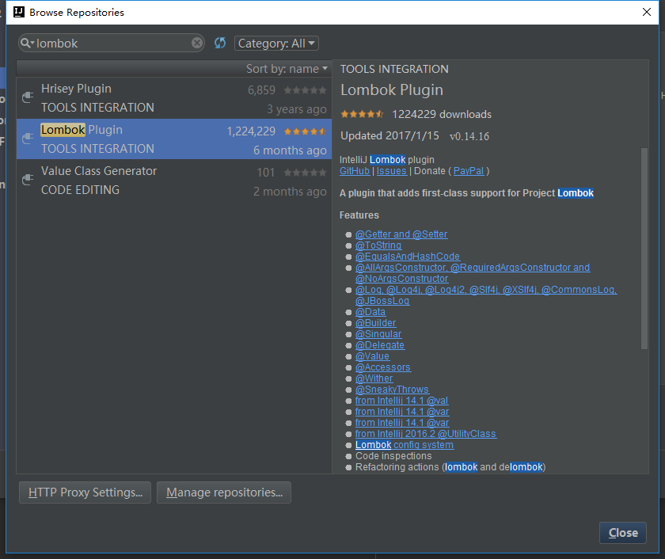

我的工具已经安装了该插件，所有在右侧是没有任何按钮的，如果你的工具没有安装该插件,

右侧会有一个绿色的按钮，按钮的内容则是Install，点击安装后重启Idea就可以了。

**同时设置** Preferences -> Compiler -> Annotation Processors -> Enable annotation processing勾选。

### lombok注解详解

#### **1. @Getter/@Setter**

为字段生成Getter和Setter方法，可以注解到字段或者类上(注解在类上会为类中的所有字段生成Getter和Setter方法)，默认是public类型的，如果需要的话可以修改方法的访问级别。


结果解释：

id字段生成了Getter&Setter,访问修饰符是public

phone只生成了Getter方法，因为只使用了@Getter而没有使用@Setter, 并且访问修饰符是protected

password 上并没有注解，所以什么都不生成

注意：Lombok中的注解一般都会包含一个无参构造函数注解@NoArgsConstructor(用于生成无参构造函数的) ，所以还会额外生成一个无参构造函数

@Getter @Setter 注解在类上，表示为类中的所有字段生成Getter&Setter方法。

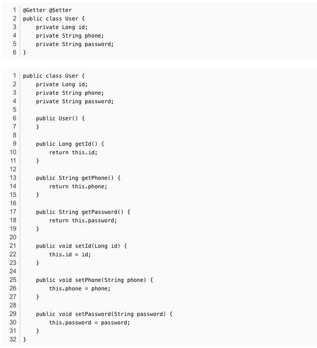

#### **2. @NonNull**

为字段赋值时(即调用字段的setter方法时)，如果传的参数为null，则会抛出空异常NullPointerException，生成setter方法时会对参数是否为空检查

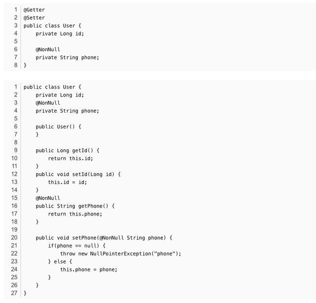

官方的例子，注意里面**super()的位置**：

源码：

```java
import lombok.NonNull;

public class NonNullExample extends Something {
  private String name;
  
  public NonNullExample(@NonNull Person person) {
    super("Hello");
    this.name = person.getName();
  }
}
```

反编译：

```java
import lombok.NonNull;

public class NonNullExample extends Something {
  private String name;
  
  public NonNullExample(@NonNull Person person) {
    super("Hello");
    if (person == null) {
      throw new NullPointerException("person is marked @NonNull but is null");
    }
    this.name = person.getName();
  }
}
```

#### 3. @NoArgsConstructor

生成一个无参构造方法。当类中有final字段没有被初始化时，编译器会报错，此时可用@NoArgsConstructor(force = true)，然后就会为没有初始化的final字段设置默认值 0 / false / null, 这样编译器就不会报错。对于具有约束的字段（例如@NonNull字段），不会生成检查或分配，因此请注意，正确初始化这些字段之前，这些约束无效。

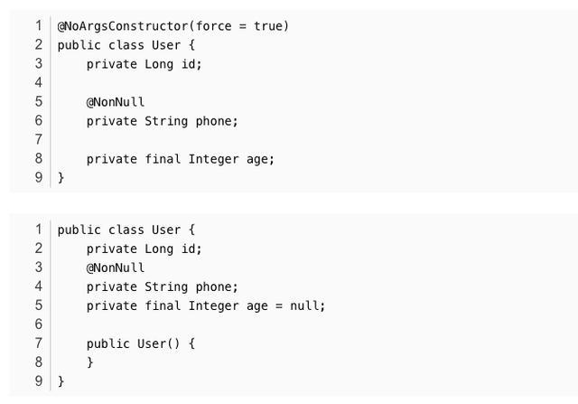

#### 4. @RequiredArgsConstructor

生成构造方法（可能带参数也可能不带参数），如果带参数，这参数只能是以final修饰的未经初始化的字段，或者是以@NonNull注解的未经初始化的字段。

@RequiredArgsConstructor(staticName = “of”)会生成一个of()的静态方法，并把构造方法设置为私有的

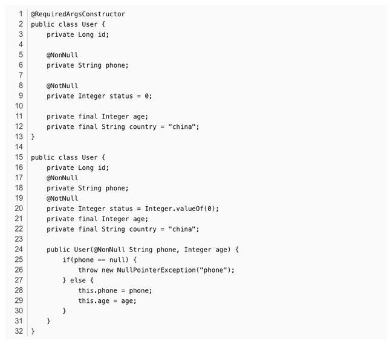

必要的构造函数只会生成final修饰的未经初始化的字段或者是以@NonNull注解的未经初始化的字段， 所以生成了public User(@NonNull String phone, Integer age)构造函数


#### **5. @AllArgsConstructor**

生成一个全参数的构造方法


#### 6. @ToString

生成toString()方法，默认情况下它会按顺序（以逗号分隔）打印你的类名称以及每个字段。可以这样设置不包含哪些字段,可以指定一个也可以指定多个@ToString(exclude = “id”) / @ToString(exclude = {“id”,“name”})

如果继承的有父类的话，可以设置callSuper 让其调用父类的toString()方法，例如：@ToString(callSuper = true)


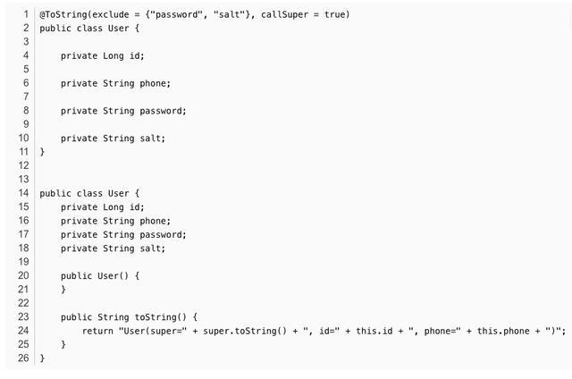

#### 7. @EqualsAndHashCode

生成hashCode()和equals()方法，默认情况下，它将使用所有非静态，非transient字段。但可以通过在可选的exclude参数中来排除更多字段。或者，通过在of参数中命名它们来准确指定希望使用哪些字段。

// exclude 排除字段

@EqualsAndHashCode(exclude = {“password”, “salt”})

// of 指定要包含的字段

@EqualsAndHashCode(of = {“id”, “phone”, “password”})


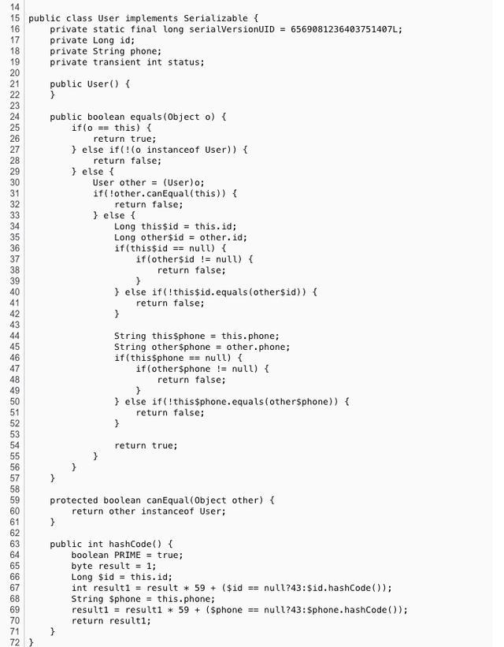

#### **8. @Data**

@Data 包含了 @ToString、@EqualsAndHashCode、@Getter / @Setter和@RequiredArgsConstructor的功能


#### **9. @Value**

@Value 将字段都变成不可变类型:使用final修饰， 同时还包含@ToString、@EqualsAndHashCode、@AllArgsConstructor 、@Getter(注意只有Getter没有Setter)


#### 10. @Log

生成log对象，用于记录日志，可以通过topic属性来设置getLogger(String name)方法的参数 例如 @Log4j(topic = “com.xxx.entity.User”)，默认是类的全限定名，即 类名.class，log支持以下几种：

@Log java.util.logging.Logger

@Log4j org.apache.log4j.Logger

@Log4j2 org.apache.logging.log4j.Logger

@Slf4j org.slf4j.Logger

@XSlf4j org.slf4j.ext.XLogger

@CommonsLog org.apache.commons.logging.Log

@JBossLog org.jboss.logging.Logger


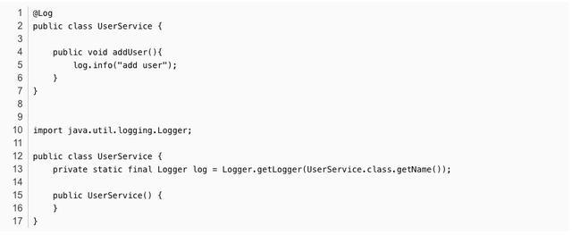

#### **11. @SneakyThrows**


#### **12. @Synchronized**

给方法加上同步锁

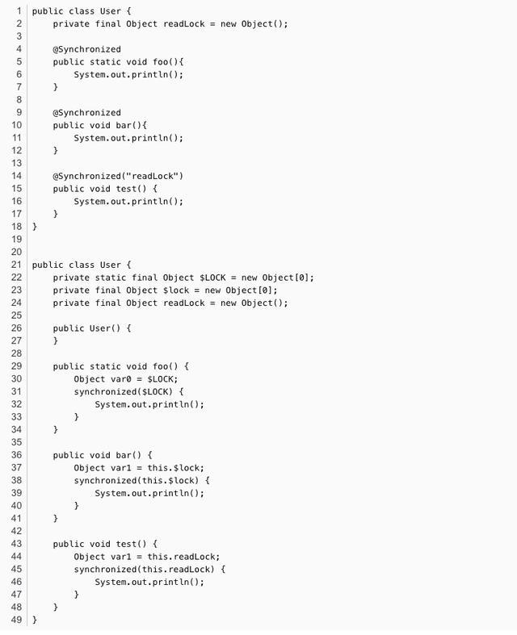

#### **13. @Cleanup**

主要用来修饰 IO 流相关类, 会在 finally 代码块中对该资源进行 close();

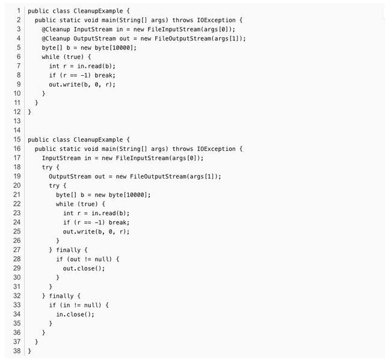

#### **14. @Getter(lazy = true)**

@Getter(lazy = true)

标注字段为懒加载字段，懒加载字段在创建对象时不会进行初始化，而是在第一次访问的时候才会初始化，后面再次访问也不会重复初始化


#### **15. @Wither**

提供了给final字段赋值的一种方法

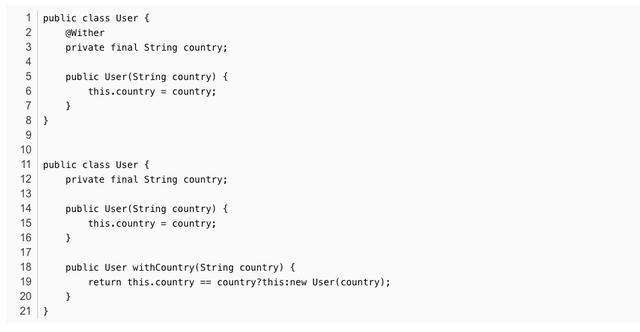

#### **16. @Builder**

@Builder注释为你的类生成复杂的构建器API。

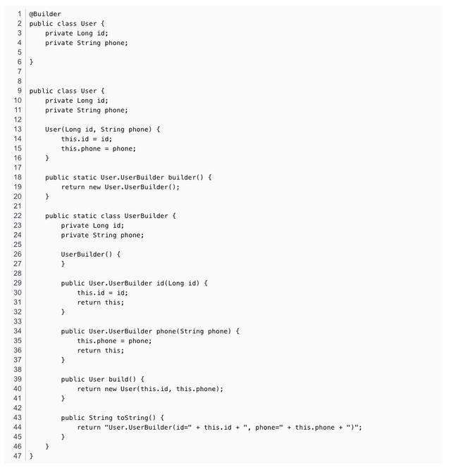

#### **17. @Delegate**

为List类型的字段生成一大堆常用的方法，其实这些方法都是List中的方法

注意：一个类中只能使用一个@Delegate注解，因为使用多个会生成多个size()方法，从而会编译报错。

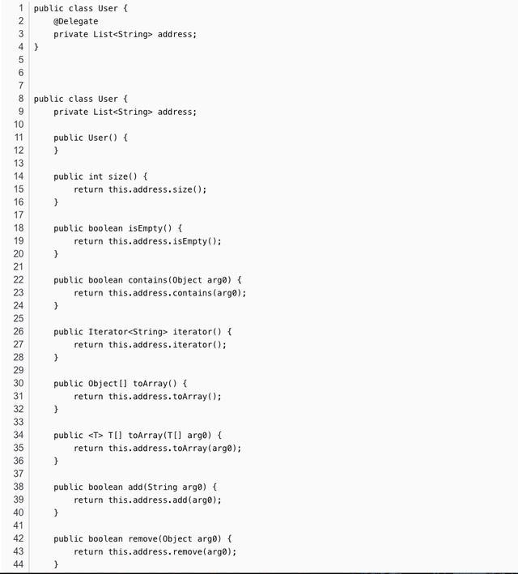

lombok.config

lombok.config配置文件是通过一些设置来控制代码生成的规则或者称之为习惯，配置文件的位置应放在src/mian/java，不要放置在src/main/resources。

注意配置文件和要使用注解的类要在同一套代码中，要么同时在src/main/java 要么同时在 src/test/java中

lombok.config


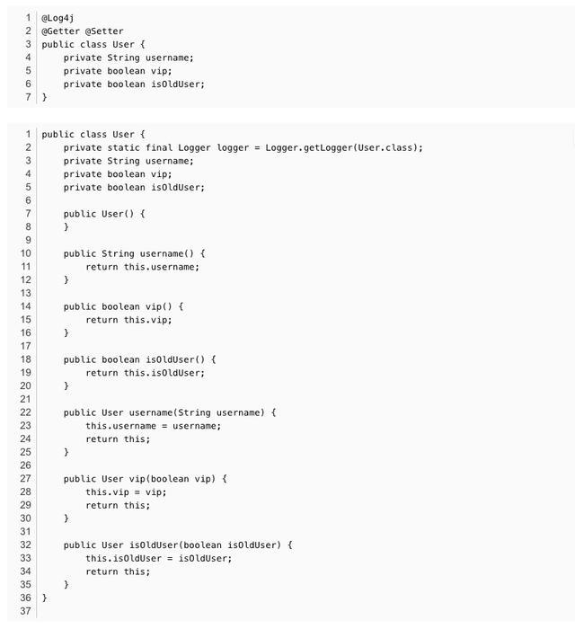

