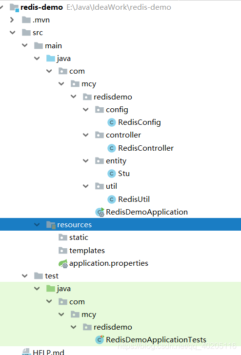
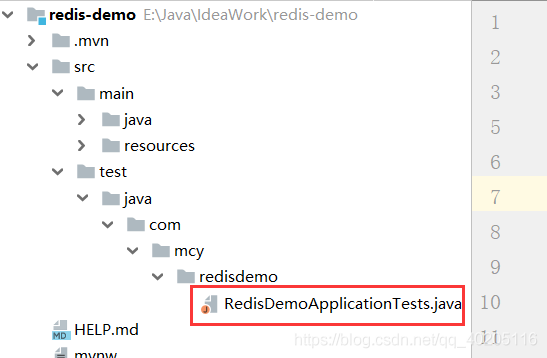
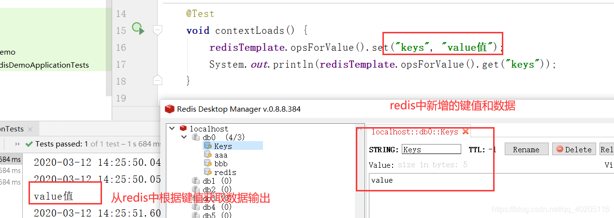
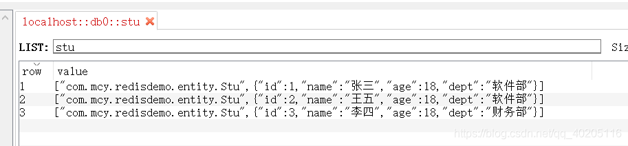
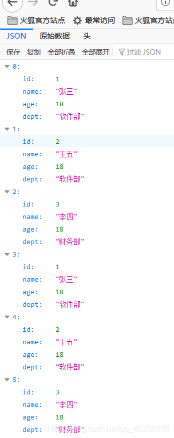

# springboot整合Redis

有两个 redis 模板：RedisTemplate 和 StringRedisTemplate。在[springBoot速成第十四课中使用的是stringRedisTemplate](https://github.com/ck-chenkang/JavaExamlpeProjects/blob/master/main/Spring%20Boot/Srping%20Boot%20%E9%80%9F%E6%88%90.md)

但是在CSDN上很多都是用的RedisTemplate，所以这里总结这种方式。

参考链接：

[springBoot整合Redis项目实战篇](https://blog.csdn.net/qq_40205116/article/details/104817114?ops_request_misc=%257B%2522request%255Fid%2522%253A%2522164663929816780366542373%2522%252C%2522scm%2522%253A%252220140713.130102334..%2522%257D&request_id=164663929816780366542373&biz_id=0&utm_medium=distribute.pc_search_result.none-task-blog-2~all~top_positive~default-2-104817114.pc_search_result_control_group&utm_term=springboot%E6%95%B4%E5%90%88redis&spm=1018.2226.3001.4187)

[springBootzh整合Redis项目实战篇github源码](https://github.com/machaoyin/Redis-Demo-.git)

[springboot集合Redis](https://blog.csdn.net/weixin_40623736/article/details/98097708?ops_request_misc=&request_id=&biz_id=102&utm_term=springboot%E6%95%B4%E5%90%88redis&utm_medium=distribute.pc_search_result.none-task-blog-2~all~sobaiduweb~default-1-98097708.nonecase&spm=1018.2226.3001.4187)

​                                            

> ★ 
>
> 写在前面： 从2018年底开始学习SpringBoot，也用SpringBoot写过一些项目。现在想对学习Springboot的一些知识总结记录一下。如果你也在学习SpringBoot，可以关注我，一起学习，一起进步。如果对[Redis](https://so.csdn.net/so/search?q=Redis&spm=1001.2101.3001.7020)的数据类型不了解的小伙伴，可以先了解一下：[Redis数据类型及基本使用](https://blog.csdn.net/qq_40205116/article/details/104705132)。
>
> ”

**相关文章：**

[【Springboot系列】Springboot入门到项目实战](https://blog.csdn.net/qq_40205116/article/details/104269651)

------


### 文章目录

- - [Redis](#Redis_9)
  - - [1、Redis简介](#1Redis_10)
    - [2、Redis特点](#2Redis_12)
  - [搭建项目](#_18)
  - - [1、项目结构](#1_19)
    - [2、新建Springboot项目](#2Springboot_21)
    - [3、配置链接信息](#3_79)
  - [测试链接](#_104)
  - - [1、测试](#1_105)
    - [2、查看效果](#2_153)
  - [Springboot整合Redis使用](#SpringbootRedis_156)
  - - [1、Redis配置类](#1Redis_158)
    - [2、RedisTemplate封装](#2RedisTemplate_272)
    - [3、编写实体类](#3_811)
    - [4、RedisController类](#4RedisController_853)
    - [5、测试](#5_940)
    - [6、案例代码下载](#6_947)


------

## **Redis**

### 1、Redis简介

Redis 是一个开源（BSD许可）的，内存中的数据结构存储系统，它可以用作数据库、缓存和消息中间件。 它支持多种[类型](https://so.csdn.net/so/search?q=类型&spm=1001.2101.3001.7020)的数据结构，如 字符串（strings）， 散列（hashes）， 列表（lists）， 集合（sets）， 有序集合（sorted sets） 与范围查询， bitmaps， hyperloglogs 和 地理空间（geospatial） 索引半径查询。 Redis 内置了 复制（replication），LUA脚本（Lua scripting）， LRU驱动事件（LRU eviction），事务（transactions） 和不同级别的 磁盘持久化（persistence）， 并通过 Redis哨兵（Sentinel）和自动 分区（Cluster）提供高可用性（high availability）。

### 2、Redis特点

1. 性能极高 – Redis能读的速度是110000次/s,写的速度是81000次/s 。
2. 支持多种数据结构：string（字符串）；list（列表）；hash（哈希），set（集合）；zset(有序集合)
3. 原子 – Redis的所有操作都是原子性的，意思就是要么成功执行要么失败完全不执行。单个操作是原子性的。多个操作也支持事务，即原子性，通过MULTI和EXEC指令包起来。
4. 丰富的特性 – Redis还支持 publish/subscribe, 通知, key 过期等等特性。

## **搭建项目**

### 1、项目结构



### 2、新建Springboot项目

新建项目需要添加web和redis的依赖，完整的pom.xml依赖代码如下：

```
<?xml version="1.0" encoding="UTF-8"?>
<project xmlns="http://maven.apache.org/POM/4.0.0" xmlns:xsi="http://www.w3.org/2001/XMLSchema-instance"
         xsi:schemaLocation="http://maven.apache.org/POM/4.0.0 https://maven.apache.org/xsd/maven-4.0.0.xsd">
    <modelVersion>4.0.0</modelVersion>
    <parent>
        <groupId>org.springframework.boot</groupId>
        <artifactId>spring-boot-starter-parent</artifactId>
        <version>2.2.2.RELEASE</version>
        <relativePath/> <!-- lookup parent from repository -->
    </parent>
    <groupId>com.mcy</groupId>
    <artifactId>redis-demo</artifactId>
    <version>0.0.1-SNAPSHOT</version>
    <name>redis-demo</name>
    <description>Demo project for Spring Boot</description>

    <properties>
        <java.version>1.8</java.version>
    </properties>

    <dependencies>
    	<!--- redis依赖 -->
        <dependency>
            <groupId>org.springframework.boot</groupId>
            <artifactId>spring-boot-starter-data-redis</artifactId>
        </dependency>
        <!-- web启动器依赖 -->
        <dependency>
            <groupId>org.springframework.boot</groupId>
            <artifactId>spring-boot-starter-web</artifactId>
        </dependency>
        <dependency>
            <groupId>org.springframework.boot</groupId>
            <artifactId>spring-boot-starter-test</artifactId>
            <scope>test</scope>
            <exclusions>
                <exclusion>
                    <groupId>org.junit.vintage</groupId>
                    <artifactId>junit-vintage-engine</artifactId>
                </exclusion>
            </exclusions>
        </dependency>
    </dependencies>

    <build>
        <plugins>
            <plugin>
                <groupId>org.springframework.boot</groupId>
                <artifactId>spring-boot-maven-plugin</artifactId>
            </plugin>
        </plugins>
    </build>

</project>

123456789101112131415161718192021222324252627282930313233343536373839404142434445464748495051525354
```

### 3、配置链接信息

```
server.port=80
server.servlet.context-path=/

#reids相关配置
#redis服务器地址
spring.redis.host=localhost
#雷迪森服务器端口
spring.redis.port=6379
#redis密码，默认为空
spring.redis.password=
#redis数据库索引（默认为0）
spring.redis.database=0
#连接池对打阻塞等待时间（负表示没有限制）
spring.redis.jedis.pool.max-wait=10000
#连接池最大连接数(负表示没有限制)
spring.redis.jedis.pool.max-active=100
#连接池中的最大空闲链接
spring.redis.jedis.pool.max-idle=20
#连接池中的最小空闲链接
spring.redis.jedis.pool.min-idle=0
#链接超时时间
spring.redis.timeout=3000

12345678910111213141516171819202122
```

## **测试链接**

### 1、测试

在RedisDemoApplicationTests测试类中，编写代码测试连接。
 
 测试代码如下：

```
import org.junit.jupiter.api.Test;
import org.springframework.beans.factory.annotation.Autowired;
import org.springframework.boot.test.context.SpringBootTest;
import org.springframework.data.redis.core.RedisTemplate;

@SpringBootTest
class RedisDemoApplicationTests {

    @Autowired
    private RedisTemplate<String, String> redisTemplate;

    @Test
    void contextLoads() {
    	//向redis中添加数据
        redisTemplate.opsForValue().set("keys", "value值");
       	//根据键值取出数据
        System.out.println(redisTemplate.opsForValue().get("keys"));
    }

}

1234567891011121314151617181920
```

**【释】** RedisTemplate是[Spring](https://so.csdn.net/so/search?q=Spring&spm=1001.2101.3001.7020) Data Redis提供给用户的最高级的抽象客户端，用户可直接通过RedisTemplate对redis进行操作。操作方法即redis的指令，关于redis的指令的操作可以移步：[Redis数据类型及基本使用](https://blog.csdn.net/qq_40205116/article/details/104705132)。
 可以点进去看一下RedisTemplate继承关系和方法，下面是继承关系，方法就比较多了，这里就不贴出来了，感兴趣的小伙伴可以直接去RedisTemplate类中看看。

```
//RedisAccessor是RedisTemplate定义普通属性的基类，不直接使用
//RedisOperations是指定RedisTemplate实现的Redis connection操作的集合接口
//BeanClassLoaderAware是给其实现类是设置类加载器的接口
RedisTemplate<K, V> extends RedisAccessor implements RedisOperations<K, V>, BeanClassLoaderAware

1234
```

**【注】** 上述的测试案例中RedisTemplate中的value值设置的是String类型，但redis有五种数据类型，所以这里最好使用Object类型。

```
@Resource
private RedisTemplate<String, Object> redisTemplate;

12
```

这里注解如果继续使用@AutoWired会报错，需要使用@Resource，这两个注解的区别在前者是根据类型后者是根据名字（报错原因：@AutoWired找不到该类型<String,Object>的Bean因为根本没有。使用@Resource直接注入的是RedisTemplate）

**操作不同类型的数据，调用的方法不同**

1. 操作String字符串类型数据时，使用RedisTemplate类中的opsForValue方法操作。
2. 操作List列表类型数据时，使用RedisTemplate类中的opsForList方法操作。
3. 操作Set集合类型数据时，使用RedisTemplate类中的opsForSet方法操作。
4. 操作Hash哈希类型数据时，使用RedisTemplate类中的opsForHash方法操作。
5. 操作Zset有序集合类型数据时，使用RedisTemplate类中的opsForZSet方法操作。

### 2、查看效果

查看Redis中的数据，可以使用RedisDesktopManager工具查看。
 

## **Springboot整合Redis使用**

上述操作可以直接在Springboot项目中使用。但也可以对redisTemplate的操作进行一下简单的封装。

### 1、Redis配置类

Redis配置类RedisConfig类代码如下：

```
import com.fasterxml.jackson.annotation.JsonAutoDetect;
import com.fasterxml.jackson.annotation.PropertyAccessor;
import com.fasterxml.jackson.databind.ObjectMapper;
import org.springframework.cache.annotation.CachingConfigurerSupport;
import org.springframework.cache.annotation.EnableCaching;
import org.springframework.context.annotation.Bean;
import org.springframework.context.annotation.Configuration;
import org.springframework.data.redis.connection.RedisConnectionFactory;
import org.springframework.data.redis.core.*;
import org.springframework.data.redis.serializer.Jackson2JsonRedisSerializer;
import org.springframework.data.redis.serializer.StringRedisSerializer;

/**
 * redis配置类
 */
@Configuration
@EnableCaching
public class RedisConfig extends CachingConfigurerSupport {

    /**
     * retemplate相关配置
     * @param factory
     * @return
     */
    @Bean
    public RedisTemplate<String, Object> redisTemplate(RedisConnectionFactory factory) {

        RedisTemplate<String, Object> template = new RedisTemplate<>();
        // 配置连接工厂
        template.setConnectionFactory(factory);

        //使用Jackson2JsonRedisSerializer来序列化和反序列化redis的value值（默认使用JDK的序列化方式）
        Jackson2JsonRedisSerializer jacksonSeial = new Jackson2JsonRedisSerializer(Object.class);

        ObjectMapper om = new ObjectMapper();
        // 指定要序列化的域，field,get和set,以及修饰符范围，ANY是都有包括private和public
        om.setVisibility(PropertyAccessor.ALL, JsonAutoDetect.Visibility.ANY);
        // 指定序列化输入的类型，类必须是非final修饰的，final修饰的类，比如String,Integer等会跑出异常
        om.enableDefaultTyping(ObjectMapper.DefaultTyping.NON_FINAL);
        jacksonSeial.setObjectMapper(om);

        // 值采用json序列化
        template.setValueSerializer(jacksonSeial);
        //使用StringRedisSerializer来序列化和反序列化redis的key值
        template.setKeySerializer(new StringRedisSerializer());

        // 设置hash key 和value序列化模式
        template.setHashKeySerializer(new StringRedisSerializer());
        template.setHashValueSerializer(jacksonSeial);
        template.afterPropertiesSet();

        return template;
    }

    /**
     * 对hash类型的数据操作
     *
     * @param redisTemplate
     * @return
     */
    @Bean
    public HashOperations<String, String, Object> hashOperations(RedisTemplate<String, Object> redisTemplate) {
        return redisTemplate.opsForHash();
    }

    /**
     * 对redis字符串类型数据操作
     *
     * @param redisTemplate
     * @return
     */
    @Bean
    public ValueOperations<String, Object> valueOperations(RedisTemplate<String, Object> redisTemplate) {
        return redisTemplate.opsForValue();
    }

    /**
     * 对链表类型的数据操作
     *
     * @param redisTemplate
     * @return
     */
    @Bean
    public ListOperations<String, Object> listOperations(RedisTemplate<String, Object> redisTemplate) {
        return redisTemplate.opsForList();
    }

    /**
     * 对无序集合类型的数据操作
     *
     * @param redisTemplate
     * @return
     */
    @Bean
    public SetOperations<String, Object> setOperations(RedisTemplate<String, Object> redisTemplate) {
        return redisTemplate.opsForSet();
    }

    /**
     * 对有序集合类型的数据操作
     *
     * @param redisTemplate
     * @return
     */
    @Bean
    public ZSetOperations<String, Object> zSetOperations(RedisTemplate<String, Object> redisTemplate) {
        return redisTemplate.opsForZSet();
    }

}

123456789101112131415161718192021222324252627282930313233343536373839404142434445464748495051525354555657585960616263646566676869707172737475767778798081828384858687888990919293949596979899100101102103104105106107108109110
```

### 2、RedisTemplate封装

RedisTemplate封装工具类代码如下：

```
import org.springframework.beans.factory.annotation.Autowired;
import org.springframework.data.redis.core.RedisTemplate;
import org.springframework.stereotype.Component;
import org.springframework.util.CollectionUtils;

import java.util.List;
import java.util.Map;
import java.util.Set;
import java.util.concurrent.TimeUnit;

/**
 * redisTemplate封装
 *
 */
@Component
public class RedisUtil {

    @Autowired
    private RedisTemplate<String, Object> redisTemplate;

    public RedisUtil(RedisTemplate<String, Object> redisTemplate) {
        this.redisTemplate = redisTemplate;
    }

    /**
     * 指定缓存失效时间
     * @param key 键
     * @param time 时间(秒)
     * @return
     */
    public boolean expire(String key,long time){
        try {
            if(time>0){
                redisTemplate.expire(key, time, TimeUnit.SECONDS);
            }
            return true;
        } catch (Exception e) {
            e.printStackTrace();
            return false;
        }
    }

    /**
     * 根据key 获取过期时间
     * @param key 键 不能为null
     * @return 时间(秒) 返回0代表为永久有效
     */
    public long getExpire(String key){
        return redisTemplate.getExpire(key,TimeUnit.SECONDS);
    }

    /**
     * 判断key是否存在
     * @param key 键
     * @return true 存在 false不存在
     */
    public boolean hasKey(String key){
        try {
            return redisTemplate.hasKey(key);
        } catch (Exception e) {
            e.printStackTrace();
            return false;
        }
    }

    /**
     * 删除缓存
     * @param key 可以传一个值 或多个
     */
    @SuppressWarnings("unchecked")
    public void del(String ... key){
        if(key!=null&&key.length>0){
            if(key.length==1){
                redisTemplate.delete(key[0]);
            }else{
                redisTemplate.delete(CollectionUtils.arrayToList(key));
            }
        }
    }

    //============================String=============================
    /**
     * 普通缓存获取
     * @param key 键
     * @return 值
     */
    public Object get(String key){
        return key==null?null:redisTemplate.opsForValue().get(key);
    }

    /**
     * 普通缓存放入
     * @param key 键
     * @param value 值
     * @return true成功 false失败
     */
    public boolean set(String key,Object value) {
        try {
            redisTemplate.opsForValue().set(key, value);
            return true;
        } catch (Exception e) {
            e.printStackTrace();
            return false;
        }
    }

    /**
     * 普通缓存放入并设置时间
     * @param key 键
     * @param value 值
     * @param time 时间(秒) time要大于0 如果time小于等于0 将设置无限期
     * @return true成功 false 失败
     */
    public boolean set(String key,Object value,long time){
        try {
            if(time>0){
                redisTemplate.opsForValue().set(key, value, time, TimeUnit.SECONDS);
            }else{
                set(key, value);
            }
            return true;
        } catch (Exception e) {
            e.printStackTrace();
            return false;
        }
    }

    /**
     * 递增
     * @param key 键
     * @param delta 要增加几(大于0)
     * @return
     */
    public long incr(String key, long delta){
        if(delta<0){
            throw new RuntimeException("递增因子必须大于0");
        }
        return redisTemplate.opsForValue().increment(key, delta);
    }

    /**
     * 递减
     * @param key 键
     * @param delta 要减少几(小于0)
     * @return
     */
    public long decr(String key, long delta){
        if(delta<0){
            throw new RuntimeException("递减因子必须大于0");
        }
        return redisTemplate.opsForValue().increment(key, -delta);
    }

    //================================Map=================================
    /**
     * HashGet
     * @param key 键 不能为null
     * @param item 项 不能为null
     * @return 值
     */
    public Object hget(String key,String item){
        return redisTemplate.opsForHash().get(key, item);
    }

    /**
     * 获取hashKey对应的所有键值
     * @param key 键
     * @return 对应的多个键值
     */
    public Map<Object,Object> hmget(String key){
        return redisTemplate.opsForHash().entries(key);
    }

    /**
     * HashSet
     * @param key 键
     * @param map 对应多个键值
     * @return true 成功 false 失败
     */
    public boolean hmset(String key, Map<String,Object> map){
        try {
            redisTemplate.opsForHash().putAll(key, map);
            return true;
        } catch (Exception e) {
            e.printStackTrace();
            return false;
        }
    }

    /**
     * HashSet 并设置时间
     * @param key 键
     * @param map 对应多个键值
     * @param time 时间(秒)
     * @return true成功 false失败
     */
    public boolean hmset(String key, Map<String,Object> map, long time){
        try {
            redisTemplate.opsForHash().putAll(key, map);
            if(time>0){
                expire(key, time);
            }
            return true;
        } catch (Exception e) {
            e.printStackTrace();
            return false;
        }
    }

    /**
     * 向一张hash表中放入数据,如果不存在将创建
     * @param key 键
     * @param item 项
     * @param value 值
     * @return true 成功 false失败
     */
    public boolean hset(String key,String item,Object value) {
        try {
            redisTemplate.opsForHash().put(key, item, value);
            return true;
        } catch (Exception e) {
            e.printStackTrace();
            return false;
        }
    }

    /**
     * 向一张hash表中放入数据,如果不存在将创建
     * @param key 键
     * @param item 项
     * @param value 值
     * @param time 时间(秒)  注意:如果已存在的hash表有时间,这里将会替换原有的时间
     * @return true 成功 false失败
     */
    public boolean hset(String key,String item,Object value,long time) {
        try {
            redisTemplate.opsForHash().put(key, item, value);
            if(time>0){
                expire(key, time);
            }
            return true;
        } catch (Exception e) {
            e.printStackTrace();
            return false;
        }
    }

    /**
     * 删除hash表中的值
     * @param key 键 不能为null
     * @param item 项 可以使多个 不能为null
     */
    public void hdel(String key, Object... item){
        redisTemplate.opsForHash().delete(key,item);
    }

    /**
     * 判断hash表中是否有该项的值
     * @param key 键 不能为null
     * @param item 项 不能为null
     * @return true 存在 false不存在
     */
    public boolean hHasKey(String key, String item){
        return redisTemplate.opsForHash().hasKey(key, item);
    }

    /**
     * hash递增 如果不存在,就会创建一个 并把新增后的值返回
     * @param key 键
     * @param item 项
     * @param by 要增加几(大于0)
     * @return
     */
    public double hincr(String key, String item,double by){
        return redisTemplate.opsForHash().increment(key, item, by);
    }

    /**
     * hash递减
     * @param key 键
     * @param item 项
     * @param by 要减少记(小于0)
     * @return
     */
    public double hdecr(String key, String item,double by){
        return redisTemplate.opsForHash().increment(key, item,-by);
    }

    //============================set=============================
    /**
     * 根据key获取Set中的所有值
     * @param key 键
     * @return
     */
    public Set<Object> sGet(String key){
        try {
            return redisTemplate.opsForSet().members(key);
        } catch (Exception e) {
            e.printStackTrace();
            return null;
        }
    }

    /**
     * 根据value从一个set中查询,是否存在
     * @param key 键
     * @param value 值
     * @return true 存在 false不存在
     */
    public boolean sHasKey(String key,Object value){
        try {
            return redisTemplate.opsForSet().isMember(key, value);
        } catch (Exception e) {
            e.printStackTrace();
            return false;
        }
    }

    /**
     * 将数据放入set缓存
     * @param key 键
     * @param values 值 可以是多个
     * @return 成功个数
     */
    public long sSet(String key, Object...values) {
        try {
            return redisTemplate.opsForSet().add(key, values);
        } catch (Exception e) {
            e.printStackTrace();
            return 0;
        }
    }

    /**
     * 将set数据放入缓存
     * @param key 键
     * @param time 时间(秒)
     * @param values 值 可以是多个
     * @return 成功个数
     */
    public long sSetAndTime(String key,long time,Object...values) {
        try {
            Long count = redisTemplate.opsForSet().add(key, values);
            if(time>0) {
                expire(key, time);
            }
            return count;
        } catch (Exception e) {
            e.printStackTrace();
            return 0;
        }
    }

    /**
     * 获取set缓存的长度
     * @param key 键
     * @return
     */
    public long sGetSetSize(String key){
        try {
            return redisTemplate.opsForSet().size(key);
        } catch (Exception e) {
            e.printStackTrace();
            return 0;
        }
    }

    /**
     * 移除值为value的
     * @param key 键
     * @param values 值 可以是多个
     * @return 移除的个数
     */
    public long setRemove(String key, Object ...values) {
        try {
            Long count = redisTemplate.opsForSet().remove(key, values);
            return count;
        } catch (Exception e) {
            e.printStackTrace();
            return 0;
        }
    }
    //===============================list=================================

    /**
     * 获取list缓存的内容
     * @param key 键
     * @param start 开始
     * @param end 结束  0 到 -1代表所有值
     * @return
     */
    public List<Object> lGet(String key, long start, long end){
        try {
            return redisTemplate.opsForList().range(key, start, end);
        } catch (Exception e) {
            e.printStackTrace();
            return null;
        }
    }

    /**
     * 获取list缓存的长度
     * @param key 键
     * @return
     */
    public long lGetListSize(String key){
        try {
            return redisTemplate.opsForList().size(key);
        } catch (Exception e) {
            e.printStackTrace();
            return 0;
        }
    }

    /**
     * 通过索引 获取list中的值
     * @param key 键
     * @param index 索引  index>=0时， 0 表头，1 第二个元素，依次类推；index<0时，-1，表尾，-2倒数第二个元素，依次类推
     * @return
     */
    public Object lGetIndex(String key,long index){
        try {
            return redisTemplate.opsForList().index(key, index);
        } catch (Exception e) {
            e.printStackTrace();
            return null;
        }
    }

    /**
     * 将list放入缓存
     * @param key 键
     * @param value 值
     * @return
     */
    public boolean lSet(String key, Object value) {
        try {
            redisTemplate.opsForList().rightPush(key, value);
            return true;
        } catch (Exception e) {
            e.printStackTrace();
            return false;
        }
    }

    /**
     * 将list放入缓存
     * @param key 键
     * @param value 值
     * @param time 时间(秒)
     * @return
     */
    public boolean lSet(String key, Object value, long time) {
        try {
            redisTemplate.opsForList().rightPush(key, value);
            if (time > 0) {
                expire(key, time);
            }
            return true;
        } catch (Exception e) {
            e.printStackTrace();
            return false;
        }
    }

    /**
     * 将list放入缓存
     * @param key 键
     * @param value 值
     * @return
     */
    public boolean lSetList(String key, List<Object> value) {
        try {
            redisTemplate.opsForList().rightPushAll(key, value);
            return true;
        } catch (Exception e) {
            e.printStackTrace();
            return false;
        }
    }

    /**
     * 将list放入缓存
     * @param key 键
     * @param value 值
     * @param time 时间(秒)
     * @return
     */
    public boolean lSetList(String key, List<Object> value, long time) {
        try {
            redisTemplate.opsForList().rightPushAll(key, value);
            if (time > 0) {
                expire(key, time);
            }
            return true;
        } catch (Exception e) {
            e.printStackTrace();
            return false;
        }
    }

    /**
     * 根据索引修改list中的某条数据
     * @param key 键
     * @param index 索引
     * @param value 值
     * @return
     */
    public boolean lUpdateIndex(String key, long index,Object value) {
        try {
            redisTemplate.opsForList().set(key, index, value);
            return true;
        } catch (Exception e) {
            e.printStackTrace();
            return false;
        }
    }

    /**
     * 移除N个值为value
     * @param key 键
     * @param count 移除多少个
     * @param value 值
     * @return 移除的个数
     */
    public long lRemove(String key,long count,Object value) {
        try {
            Long remove = redisTemplate.opsForList().remove(key, count, value);
            return remove;
        } catch (Exception e) {
            e.printStackTrace();
            return 0;
        }
    }
}

123456789101112131415161718192021222324252627282930313233343536373839404142434445464748495051525354555657585960616263646566676869707172737475767778798081828384858687888990919293949596979899100101102103104105106107108109110111112113114115116117118119120121122123124125126127128129130131132133134135136137138139140141142143144145146147148149150151152153154155156157158159160161162163164165166167168169170171172173174175176177178179180181182183184185186187188189190191192193194195196197198199200201202203204205206207208209210211212213214215216217218219220221222223224225226227228229230231232233234235236237238239240241242243244245246247248249250251252253254255256257258259260261262263264265266267268269270271272273274275276277278279280281282283284285286287288289290291292293294295296297298299300301302303304305306307308309310311312313314315316317318319320321322323324325326327328329330331332333334335336337338339340341342343344345346347348349350351352353354355356357358359360361362363364365366367368369370371372373374375376377378379380381382383384385386387388389390391392393394395396397398399400401402403404405406407408409410411412413414415416417418419420421422423424425426427428429430431432433434435436437438439440441442443444445446447448449450451452453454455456457458459460461462463464465466467468469470471472473474475476477478479480481482483484485486487488489490491492493494495496497498499500501502503504505506507508509510511512513514515516517518519520521522523524525526527528529530531532533534535
```

### 3、编写实体类

新建Stu.java实体类，代码如下：

```
public class Stu {
    private Integer id;
    private String name;    //姓名
    private Integer age;    //年龄
    private String dept;    //部门

    public Integer getId() {
        return id;
    }

    public void setId(Integer id) {
        this.id = id;
    }

    public String getName() {
        return name;
    }

    public void setName(String name) {
        this.name = name;
    }

    public Integer getAge() {
        return age;
    }

    public void setAge(Integer age) {
        this.age = age;
    }

    public String getDept() {
        return dept;
    }

    public void setDept(String dept) {
        this.dept = dept;
    }
}

1234567891011121314151617181920212223242526272829303132333435363738
```

### 4、RedisController类

RedisController类，其中写了几个测试方法，可以自行添加其他方法。操作Redis时可以用原生的RedisTemplate方法，也可以用封装的RedisUtil类中的方法。代码如下：

```
import com.mcy.redisdemo.entity.Stu;
import com.mcy.redisdemo.util.RedisUtil;
import org.springframework.beans.factory.annotation.Autowired;
import org.springframework.data.redis.core.RedisTemplate;
import org.springframework.web.bind.annotation.RequestMapping;
import org.springframework.web.bind.annotation.RestController;

import javax.annotation.Resource;
import java.util.ArrayList;
import java.util.List;

@RestController
@RequestMapping(value = "/redis")
public class RedisController {

    @Resource
    private RedisTemplate<String, Object> redisTemplate;
    @Autowired
    private RedisUtil redisUtil;

    /**
     * 获取对应键的值，redisTemplate操作
     * @param key
     * @return
     */
    @RequestMapping(value = "get")
    public Object getValue(String key){
        Object value = redisTemplate.opsForValue().get(key);
        return value;
    }

    /**
     * 添加键值
     * @param key
     * @param value
     * @return
     */
    @RequestMapping(value = "set")
    public boolean set(String key, String value){
        return redisUtil.set(key, value);
    }

    /**
     * 添加List对象数据到redis中
     * @return
     */
    @RequestMapping(value = "/setList")
    public boolean setList(){
        List<Object> stuList = new ArrayList<>();
        Stu stu = new Stu();
        stu.setId(1);
        stu.setAge(18);
        stu.setDept("软件部");
        stu.setName("张三");

        Stu stu1 = new Stu();
        stu1.setId(2);
        stu1.setAge(18);
        stu1.setDept("软件部");
        stu1.setName("王五");

        Stu stu2 = new Stu();
        stu2.setId(3);
        stu2.setAge(18);
        stu2.setDept("财务部");
        stu2.setName("李四");

        stuList.add(stu);
        stuList.add(stu1);
        stuList.add(stu2);
        return redisUtil.lSetList("stu", stuList);
    }

    /**
     * 获取全部数据
     * @return
     */
    @RequestMapping(value = "getList")
    public Object getList(){
        return redisUtil.lGet("stu", 0, -1);
    }

}

1234567891011121314151617181920212223242526272829303132333435363738394041424344454647484950515253545556575859606162636465666768697071727374757677787980818283
```

### 5、测试

运行项目后访问setList方法，添加数据到Redis缓存中。添加后可以用RedisDesktopManager工具查看添加后的数据。
 
 访问getList方法，查询对应键值的list数据。
 
 这里就只测试了这两个方法，对于Redis的操作使用String类型来存储的比较多，上面写的有字符串的保存于读取方法，大家可以自行测试。这里主要就对于List类型，List中存放的对象进行了一下测试。
 这里注意一下：一般Redis只用做缓存，Redis中的数据一般数据库中的都有，查询时先查询Redis中是否存在，不存在则查询数据库中数据。

### 6、案例代码下载

案例代码GitHub下载地址：[https://github.com/machaoyin/Redis-Demo](https://github.com/machaoyin/Redis-Demo-)

> ★ 
>
> **最后有什么不足之处，欢迎大家指出，期待与你的交流。**
>
> ”