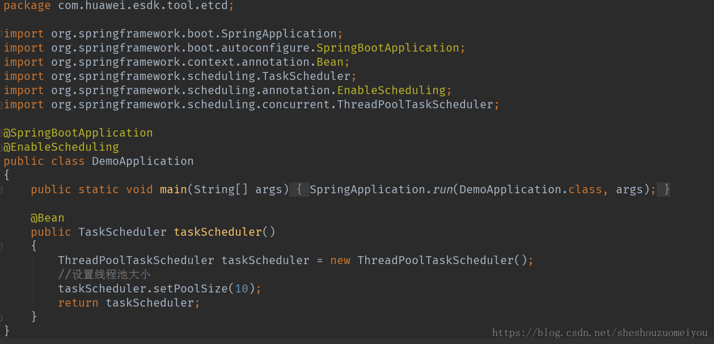
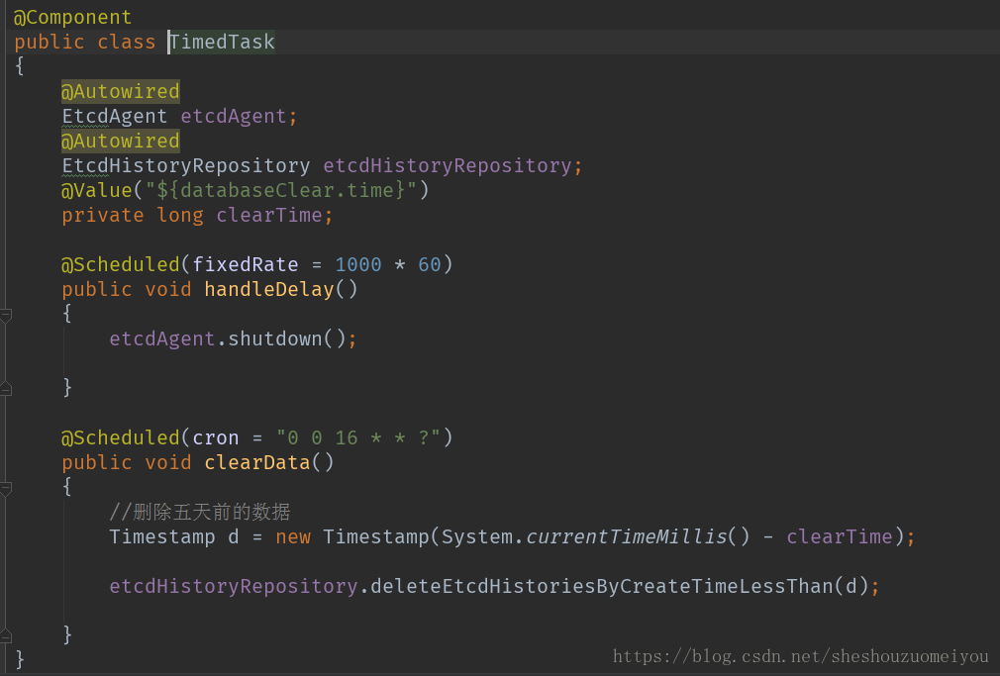
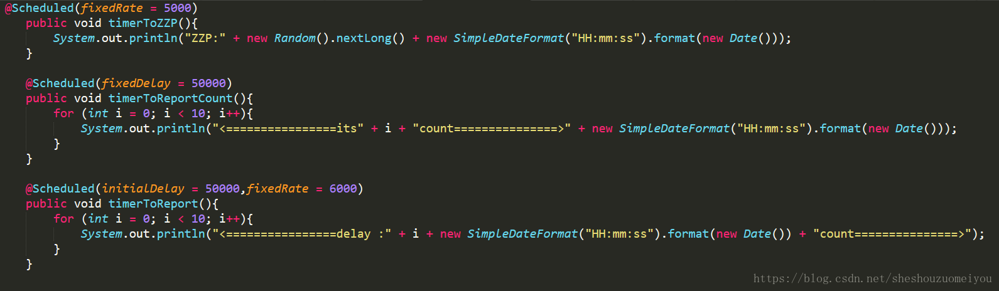
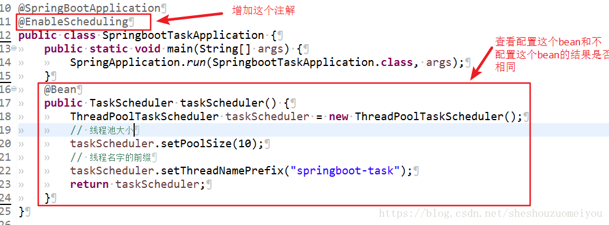
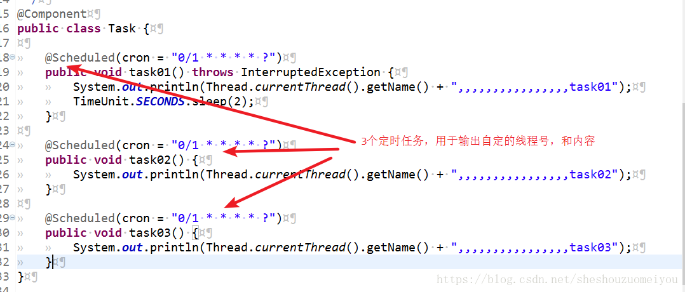
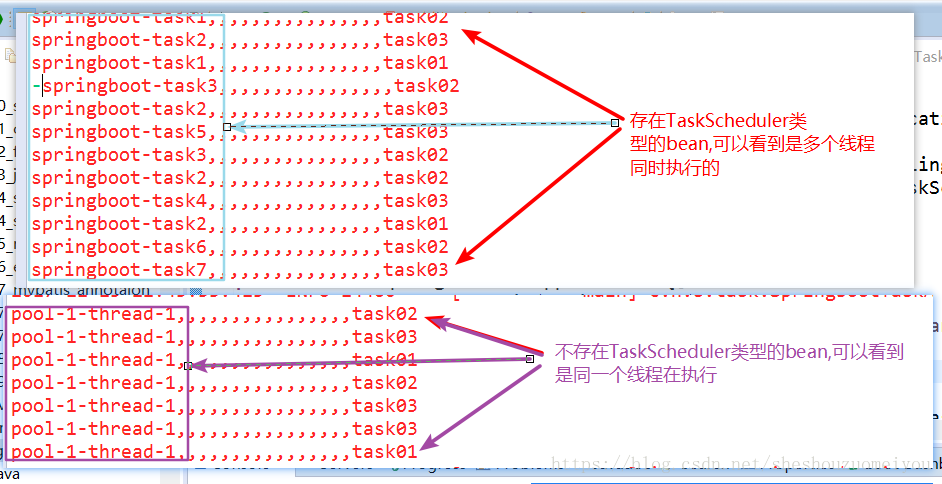

# springboot定时任务

[简单定时任务管理系统](https://gitee.com/hhf002/job)

[springboot定时任务](https://blog.csdn.net/sheshouzuomeiyou/article/details/82622237?ops_request_misc=&request_id=&biz_id=102&utm_term=springboot%20%E5%AE%9A%E6%97%B6%E4%BB%BB%E5%8A%A1&utm_medium=distribute.pc_search_result.none-task-blog-2~all~sobaiduweb~default-1-82622237.nonecase&spm=1018.2226.3001.4187)

[springboot三种方式实现定时任务](https://blog.csdn.net/longzhongxiaoniao/article/details/86182075?ops_request_misc=%257B%2522request%255Fid%2522%253A%2522164672251516780357268763%2522%252C%2522scm%2522%253A%252220140713.130102334..%2522%257D&request_id=164672251516780357268763&biz_id=0&utm_medium=distribute.pc_search_result.none-task-blog-2~all~baidu_landing_v2~default-4-86182075.pc_search_result_control_group&utm_term=springboot+%E5%AE%9A%E6%97%B6%E4%BB%BB%E5%8A%A1&spm=1018.2226.3001.4187)

## Cron表达式

是一种规则，表示定时策略，具体可以查看，[cron表达式维基百科](https://en.wikipedia.org/wiki/Cron)

[cron在线生成器](https://cron.qqe2.com/)

## 三种方式实现定时任务

SpringBoot三种方式实现定时任务
 定时任务实现的三种方式：

Timer：这是java自带的java.util.Timer类，这个类允许你调度一个java.util.TimerTask任务。使用这种方式可以让你的程序按照某一个频度执行，但不能在指定时间运行。一般用的较少。

ScheduledExecutorService：也jdk自带的一个类；是基于[线程池](https://so.csdn.net/so/search?q=线程池&spm=1001.2101.3001.7020)设计的定时任务类,每个调度任务都会分配到线程池中的一个线程去执行,也就是说,任务是并发执行,互不影响。

Spring Task：Spring3.0以后自带的task，可以将它看成一个轻量级的Quartz，而且使用起来比Quartz简单许多。

### **使用Timer**

这个目前在项目中用的较少，直接贴demo代码。具体的介绍可以查看api

```typescript
public class TestTimer {


    public static void main(String[] args) {


        TimerTask timerTask = new TimerTask() {


            @Override


            public void run() {


                System.out.println("task  run:"+ new Date());


            }


        };


        Timer timer = new Timer();


        //安排指定的任务在指定的时间开始进行重复的固定延迟执行。这里是每3秒执行一次


        timer.schedule(timerTask,10,3000);


    }


}
```

### **使用ScheduledExecutorService**

该方法跟Timer类似，直接看demo：

```typescript
public class TestScheduledExecutorService {


    public static void main(String[] args) {


        ScheduledExecutorService service = Executors.newSingleThreadScheduledExecutor();


        // 参数：1、任务体 2、首次执行的延时时间


        //      3、任务执行间隔 4、间隔时间单位


        service.scheduleAtFixedRate(()->System.out.println("task ScheduledExecutorService "+new Date()), 0, 3, TimeUnit.SECONDS);


    }


}
```

### **使用Spring Task**

1，简单的定时任务
 在SpringBoot项目中，我们可以很优雅的使用注解来实现定时任务，首先创建项目，导入依赖：

```xml
<dependencies>


  <dependency>


    <groupId>org.springframework.boot</groupId>


    <artifactId>spring-boot-starter-web</artifactId>


  </dependency>


  <dependency>


    <groupId>org.springframework.boot</groupId>


    <artifactId>spring-boot-starter</artifactId>


  </dependency>


  <dependency>


    <groupId>org.projectlombok</groupId>


    <artifactId>lombok</artifactId>


    <optional>true</optional>


  </dependency>


  <dependency>


    <groupId>org.springframework.boot</groupId>


    <artifactId>spring-boot-starter-test</artifactId>


    <scope>test</scope>


  </dependency>


</dependencies>
```

创建任务类：

```typescript
@Slf4j


@Component


public class ScheduledService {


    @Scheduled(cron = "0/5 * * * * *")


    public void scheduled(){


        log.info("=====>>>>>使用cron  {}",System.currentTimeMillis());


    }


    @Scheduled(fixedRate = 5000)


    public void scheduled1() {


        log.info("=====>>>>>使用fixedRate{}", System.currentTimeMillis());


    }


    @Scheduled(fixedDelay = 5000)


    public void scheduled2() {


        log.info("=====>>>>>fixedDelay{}",System.currentTimeMillis());


    }


}
```

在主类上使用@EnableScheduling注解开启对定时任务的支持，然后启动项目
 **可以看到三个定时任务都已经执行，并且使同一个线程中串行执行，如果只有一个定时任务，这样做肯定没问题，当定时任务增多，如果一个任务卡死，会导致其他任务也无法执行。**

2，多线程执行
 在传统的Spring项目中，我们可以在xml配置文件添加task的配置，而在SpringBoot项目中一般使用config配置类的方式添加配置，所以新建一个AsyncConfig类

```java
@Configuration


@EnableAsync


public class AsyncConfig {


     /*


    此处成员变量应该使用@Value从配置中读取


     */


    private int corePoolSize = 10;


    private int maxPoolSize = 200;


    private int queueCapacity = 10;


    @Bean


    public Executor taskExecutor() {


        ThreadPoolTaskExecutor executor = new ThreadPoolTaskExecutor();


        executor.setCorePoolSize(corePoolSize);


        executor.setMaxPoolSize(maxPoolSize);


        executor.setQueueCapacity(queueCapacity);


        executor.initialize();


        return executor;


    }


}
```

@Configuration：表明该类是一个配置类
 @EnableAsync：开启异步事件的支持

然后在定时任务的类或者方法上添加@Async 。最后重启项目，每一个任务都是在不同的线程中。

在线cron表达式生成：http://qqe2.com/cron/index

## 使用fixedRate，fixedDelay作为时间配置

​                                            

使用定时任务完成一些业务逻辑，比如天气接口的数据获取，定时发送短信，邮件。以及商城中每天用户的限额，定时自动收货等等。定时器在项目中是常常会使用到的一个手段。

### **定时任务在Spring Boot中的集成**

在启动类中加入开启定时任务的注解： 
 在SpringBoot中使用定时任务相当的简单。首先，我们在启动类中加入@EnableScheduling来开启定时任务。 
 

之后我们直接创建实现定时任务的Service即可



### **@Scheduled**

可以使用cron表达式来制定每分钟启动一次定时器，除了该表达式外，还可以使用fixedRate，fixedDelay等来作为时间配置。



第一张图片中输出的ZZP:254779489776178507600:15:14是从00:15:14开始，并且每5秒打印一次，由此可知： 
 项目启动时间00:15:09（这对理解之后的initialDelay有用） 
 **fixedRate：** 
 上一次 启动时间点之后 X秒执行一次 
 同时我们可以看到<================delay :000:15:59count===============>和<================its0count===============>00:15:59都是从00:15:59开始的，也就是项目开始后的50秒之后， 
 由此可知： 
 **fixedDelay：** 
 上一次 结束时间点之后 每X秒执行一次 
 通过第二张图可以看到之后的<================delay :000:15:59count===============>是间隔6秒执行的， 
 由此可知： 
 **initialDelay：** 
 第一次延迟 X秒执行，之后按照fixedRate的规则每X秒执行

默认情况下，如果什么都不进行配置，就会导致一个问题，系统中所有的定时任务都是使用的一个线程去执行的，也就是说，如果如果同一个时刻有2个定时任务需要执行，那么只可能有一个定时任务在执行，如果要解决这个问题可以定义一个自定的任务调度线程池即可。 
 实现功能： 
 启动3个定时任务，每隔1s打印出一句话，观看是同一个线程打印的还是不同的线程打印的。 
 实现步骤： 
 1、在启动类上增加@EnableScheduling注解 
 2、配置一个类型为 TaskScheduler类型的bean （可以将这个类型的bean删除，看程序输出的结果） 
 3、编写一个任务类，每隔1s输出内容

首先编写启动类： 
 

然后编写任务类： 
 

执行结果： 
 

### **如何理解 fixedRate 和 fixedDelay 的区别**

fixedRate 任务两次执行时间间隔是任务的开始点，而 fixedDelay 的间隔是前次任务的结束与下次任务的开始。 
 大致用示意字符串来表示如下(每个 T1, 或 T2 代表任务执行秒数(每次任务执行时间不定)，假定 fixedRate 或 fixedDelay 的值是 5 秒，用 W 表示等待的数) 
 fixedRate: 
 T1.T1WWWT2.T2.T2WW.T3.T3.T3.T3.T3.T4.T4.T4.T4.T4.T4.T4T5T5WWWT6.T6…….. 
 fixedDelay: 
 T1.T1.WWWWW.T2.T2.T2WWWWW.T3.T3.T3.T3.T3.WWWWW.T4.T4.T4.T4.T4.T4.T4.WWWWWT6.T6…… 
 一般来说能理解到上面两个场景已经差不多了，相比而言 fixedDelay 简单些，盯着上一次任务的屁股就行。

## 动态定时任务

 使用spring自带的scheduling定时调度任务相当于轻量级的Quartz,但是不支持[分布式](https://so.csdn.net/so/search?q=分布式&spm=1001.2101.3001.7020),若要实现分布式定时任务就得使用Quartz了。

简单的实现的话，可以参考下面的源码：

[简单定时任务管理系统](https://gitee.com/hhf002/job)

## Quartz

若想要实现分布式定时任务需要学习。