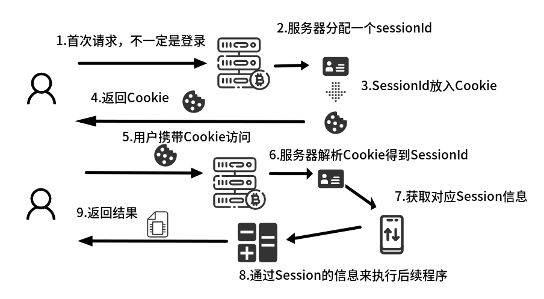
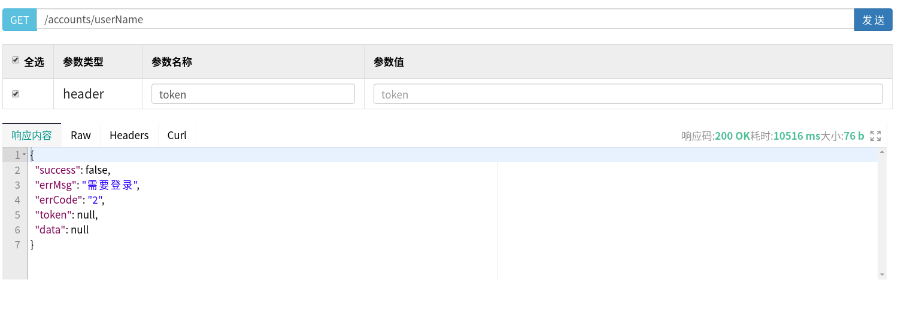
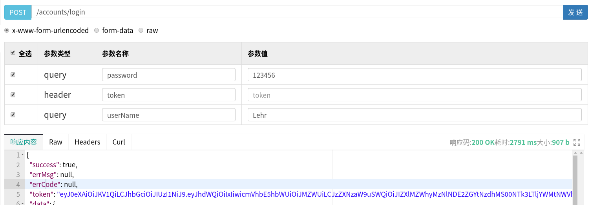
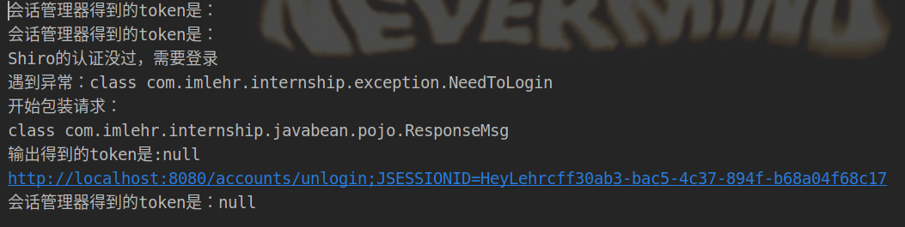

# Springboot实现Shiro整合JWT

[Springboot实现Shiro整合JWT](https://blog.csdn.net/qq_43948583/article/details/104539122?ops_request_misc=%257B%2522request%255Fid%2522%253A%2522164689441716780269850094%2522%252C%2522scm%2522%253A%252220140713.130102334..%2522%257D&request_id=164689441716780269850094&biz_id=0&utm_medium=distribute.pc_search_result.none-task-blog-2~all~baidu_landing_v2~default-1-104539122.pc_search_result_control_group&utm_term=springboot%E6%95%B4%E5%90%88jwt%E5%92%8Cshrio&spm=1018.2226.3001.4187)

# **写在前面**

> ★ 
>
> 之前想尝试把JWT和Shiro结合到一起，但是在网上查了些博客，也没太有看懂，所以就自己重新研究了一下Shiro的工作机制，然后自己想了个（傻逼）办法把JWT和Shiro整合到一起了
>
> ”

另外接下来还会涉及到JWT相关的内容，我之前写过一篇博客，可以看这里：[Springboot实现JWT认证](https://blog.csdn.net/qq_43948583/article/details/104437752)

# **Shiro的Session机制**

由于我的方法是改变了Shiro的默认的Session机制，所以这里先简单讲一下Shiro的机制，简单了解Shiro是怎么确定每次访问的是哪个用户的

## **Servlet的Session机制**

Shiro在JavaWeb中使用到的就是默认的Servlet的Session机制，大致流程如下：
 

1.用户首次发请求

2.服务器接收到请求之后，无论你有没有权限访问到资源，在返回响应的时候，服务器都会生成一个Session用来储存该用户的信息，然后生成SessionId作为对应的Key

3.服务器会在响应中，用jsessionId这个名字，把这个SessionId以Cookie的方式发给客户（就是Set-Cookie响应头）

4.由于已经设置了Cookie，下次访问的时候，服务器会自动识别到这个SessionId然后找到你上次对应的Session

## **Shiro带来的变化**

而结合Shiro之后，上面的第二步和第三步会发生小变化：

2.—>服务器不但会创建Session，还会创建一个Subject对象（就是Shiro中用来代表当前用户的类），也用这个SessionId作为Key绑定

3.—>第二次接受到请求的时候，Shiro会从请求头中找到SessionId，然后去寻找对应的Subject然后绑定到当前上下文，这时候Shiro就能知道来访的是谁了

# **我的思路**

由于这个是我自己想出来的，所以可能会存在一定的问题，还请大佬指点

主要思想是：`用JWT Token来代替Shiro原本返回的Session`



工作流程：

- 用户登录
- 若成功则shiro会默认生成一个SessionId用来匹配当前Subject对象，则我们将这个SessionId放入JWT中
- 返回JWT
- 用户第二次携带JWT来访问接口
- 服务器解析JWT，获得SessionId
- 服务器把SessionId交给Shiro执行相关认证

# **代码实现**

## **导入JWT相关包**

导入`java-jwt`包：

这个包里实现了一系列jwt操作的api（包括上面讲到的怎么校验，怎么生成jwt等等）

如果你是Maven玩家：

pom.xml里写入

```maven
<!-- https://mvnrepository.com/artifact/com.auth0/java-jwt -->
<dependency>
    <groupId>com.auth0</groupId>
    <artifactId>java-jwt</artifactId>
    <version>3.8.3</version>
</dependency>


1234567
```

如果你是Gradle玩家：

build.gradle里写入

```gradle
compile group: 'com.auth0', name: 'java-jwt', version: '3.8.3'

1
```

如果你是其他玩家：

maven中央仓库地址点[这里](https://mvnrepository.com/artifact/com.auth0/java-jwt)

## **JWT工具类**

JwtUtils，代码如下：

```java
import com.auth0.jwt.JWT;
import com.auth0.jwt.JWTVerifier;
import com.auth0.jwt.algorithms.Algorithm;
import com.auth0.jwt.exceptions.JWTDecodeException;
import com.auth0.jwt.interfaces.Claim;
import com.auth0.jwt.interfaces.DecodedJWT;

import java.io.Serializable;
import java.util.Calendar;
import java.util.Date;

/**
 * @author Lehr
 * @create: 2020-02-04
 */
public class JwtUtils {

    /**
     签发对象：这个用户的id
     签发时间：现在
     有效时间：30分钟
     载荷内容：暂时设计为：这个人的名字，这个人的昵称
     加密密钥：这个人的id加上一串字符串
     */
    public static String createToken(String userId,String realName, String userName) {

        Calendar nowTime = Calendar.getInstance();
        nowTime.add(Calendar.MINUTE,30);
        Date expiresDate = nowTime.getTime();

        return JWT.create().withAudience(userId)   //签发对象
                .withIssuedAt(new Date())    //发行时间
                .withExpiresAt(expiresDate)  //有效时间
                .withClaim("userName", userName)    //载荷，随便写几个都可以
                .withClaim("realName", realName)
                .sign(Algorithm.HMAC256(userId+"HelloLehr"));   //加密
    }

    /**
     * 检验合法性，其中secret参数就应该传入的是用户的id
     * @param token
     * @throws TokenUnavailable
     */
    public static void verifyToken(String token, String secret) throws TokenUnavailable {
        DecodedJWT jwt = null;
        try {
            JWTVerifier verifier = JWT.require(Algorithm.HMAC256(secret+"HelloLehr")).build();
            jwt = verifier.verify(token);
        } catch (Exception e) {
            //效验失败
            //这里抛出的异常是我自定义的一个异常，你也可以写成别的
            throw new TokenUnavailable();
        }
    }

    /**
    * 获取签发对象
    */
    public static String getAudience(String token) throws TokenUnavailable {
        String audience = null;
        try {
            audience = JWT.decode(token).getAudience().get(0);
        } catch (JWTDecodeException j) {
            //这里是token解析失败
            throw new TokenUnavailable();
        }
        return audience;
    }


    /**
    * 通过载荷名字获取载荷的值
    */
    public static Claim getClaimByName(String token, String name){
        return JWT.decode(token).getClaim(name);
    }
}


1234567891011121314151617181920212223242526272829303132333435363738394041424344454647484950515253545556575859606162636465666768697071727374757677787980
```

一点小说明：

关于jwt生成时的加密和验证方法：

jwt的验证其实就是验证jwt最后那一部分（签名部分）。这里在指定签名的加密方式的时候，还传入了一个字符串来加密，所以验证的时候不但需要知道加密算法，还需要获得这个字符串才能成功解密，提高了安全性。我这里用的是id来，比较简单，如果你想更安全一点，可以把用户密码作为这个加密字符串，这样就算是这段业务代码泄露了，也不会引发太大的安全问题（毕竟我的id是谁都知道的，这样令牌就可以被伪造，但是如果换成密码，只要数据库没事那就没人知道）

关于获得载荷的方法：

可能有人会觉得奇怪，为什么不需要解密不需要verify就能够获取到载荷里的内容呢？原因是，本来载荷就只是用Base64处理了，就没有加密性，所以能直接获取到它的值，但是至于可不可以相信这个值的真实性，就是要看能不能通过验证了，因为最后的签名部分是和前面头部和载荷的内容有关联的，所以一旦签名验证过了，那就说明前面的载荷是没有被改过的。

## **Controller层**

### 登录逻辑

```java
    /**
     * 用户登录
     * @param userName
     * @param password
     * @param req
     * @return
     * @throws Exception
     */
    @SneakyThrows
    @PostMapping(value = "/login")
    public AccountVO login(String userName, String password, HttpServletRequest req){
        //尝试登录
        Subject subject = SecurityUtils.getSubject();
        try {
            subject.login(new UsernamePasswordToken(userName, password));
        } catch (Exception e) {
            throw new LoginFailed();
        }
        AccountVO account = accountService.getAccountByUserName(userName);
        String id = account.getId();
        //生成jwtToken
        String jwtToken = JwtUtils.createToken(id, account.getRealName(),account.getUserName(), subject.getSession().getId().toString());
        //设置好token，后来会在全局处理的时候放入响应里
        req.setAttribute("token", jwtToken);
        return account;
    }


12345678910111213141516171819202122232425262728
```

主要是：在登录成功之后把这个Subject的SessionId放入JWT然后生成token：

```java
String jwtToken = JwtUtils.createToken(id, account.getRealName(),account.getUserName(),      subject.getSession().getId().toString());

1
```

以后我们就可以通过解析JWT来获取SessionId了，而不是每次把SessionId作为Cookie返回

### 退出逻辑

首先，由于JWT令牌本身就会失效，所以如果JWT令牌失效，也就相当与退出了

然后我们还可以同样实现Shiro中传统的手动登出：

```java
    public String logout(HttpServletRequest req) {
        SecurityUtils.getSubject().logout();
        return "用戶已经安全登出";
    }


12345
```

这样的话Realm中的用户状态就变成未认证了，就算JWT没过期也需要重新登录了

## **自定义SessionManager**

先上代码：

```java
package com.imlehr.internship.shiroJwt;

import com.imlehr.internship.exception.TokenUnavailable;
import lombok.SneakyThrows;
import org.apache.shiro.session.mgt.SessionKey;
import org.apache.shiro.web.servlet.ShiroHttpServletRequest;
import org.apache.shiro.web.session.mgt.DefaultWebSessionManager;
import org.apache.shiro.web.util.WebUtils;

import javax.servlet.ServletRequest;
import javax.servlet.ServletResponse;
import javax.servlet.http.HttpServletRequest;
import javax.servlet.http.HttpServletResponse;
import java.io.Serializable;
import java.util.UUID;

/**
 * @author Lehr
 * @create: 2020-02-10
 */
public class CustomSessionManager extends DefaultWebSessionManager {


    //这里我为了省事用了lombok的标签
    @SneakyThrows
    @Override
    protected Serializable getSessionId(ServletRequest request, ServletResponse response) {

        String token = WebUtils.toHttp(request).getHeader("token");
        System.out.println("会话管理器得到的token是：" + token);
        if (token == null || token.length()<1) {
            return UUID.randomUUID().toString();
        }

        //在这里验证一下jwt了，虽然我知道这样不好
        String userId = JwtUtils.getAudience(token);
        JwtUtils.verifyToken(token, userId);
        String sessionId = JwtUtils.getClaimByName(token, "sessionId").asString();

        if (sessionId == null) {
            return new TokenUnavailable();
        }

        
        request.setAttribute(ShiroHttpServletRequest.REFERENCED_SESSION_ID_SOURCE, "header");
        request.setAttribute(ShiroHttpServletRequest.REFERENCED_SESSION_ID, token);
        request.setAttribute(ShiroHttpServletRequest.REFERENCED_SESSION_ID_IS_VALID, Boolean.TRUE);
        request.setAttribute(ShiroHttpServletRequest.SESSION_ID_URL_REWRITING_ENABLED, isSessionIdUrlRewritingEnabled());

        return sessionId;
    }


}


12345678910111213141516171819202122232425262728293031323334353637383940414243444546474849505152535455
```

之前的Session的获取，就是在DefaultWebSessionManager里实现的，所以我们现在只需要重写这个类，把我们如何获取Session的逻辑写进去就好了

这里说两个方法：

### getSessionId(SessionKey key)

这个方法是在DefaultWebSessionManager的，这里并没有重写，我们上面重写的是后面第二个同名方法，只是想在这里谈谈，读者可以直接跳过这段也不影响

### 源码逻辑

在Shiro想要获取SessionId的时候，首先会调用的就是这个方法，而不是那个传入httpRequest的方法

在DefaultWebSessionManager中，他是这样做的

```
@Override
public Serializable getSessionId(SessionKey key) {
    Serializable id = super.getSessionId(key);
    if (id == null && WebUtils.isWeb(key)) {
        ServletRequest request = WebUtils.getRequest(key);
        ServletResponse response = WebUtils.getResponse(key);
        //调用第二个同名方法
        id = getSessionId(request, response);
    }
    return id;
}

1234567891011
```

- 如果没能找到id，就调用第二个同名方法
- 如果有，就返回

这里需要注意的是，这个方法会在整个验证过程中多次被反复调用，而在服务器接受到用户请求的时候，只会调用一次的方法是下面这个，也就是我们重写的这个

### getSessionId(ServletRequest request, ServletResponse response)

这个才是真正涉及到服务器接受到请求的时候获取Session逻辑，从用户的请求报文中获取SessionId

所以我们要重写的就是这一步

原版中的逻辑是：从Cookie里找到sessionId的值

我们只需要把逻辑该为：从Header中找出JWT（也就是从请求头的’token’头中找），然后解析JWT，获取到我们存放在其中的SessionId属性即可

## **ShiroConfiguration**

我们只需要把自己写的SessionManager配置进去就好了

首先配好：

```java
public DefaultWebSessionManager sessionManager()
{
    CustomSessionManager customSessionManager = new CustomSessionManager();
    return  customSessionManager;
}

12345
```

然后放入SecurityManager

```java
public SecurityManager securityManager(MyRealm myRealm) {
    
    DefaultWebSecurityManager securityManager = new DefaultWebSecurityManager();
    securityManager.setRealm(myRealm);
    
    return securityManager;
}

1234567
```

完成🎉

# **测试**

## **登录**



我们获取到了JWT，JWT里面就带有SessionId

## **后续请求不带token**


显然，没过认证，我们看下后台：


因为不能获得token所以无法得到该用户对应的sessionId，所以被授权拦截了

后面那个JSESSIONID是因为没得到sessionId新生成的，所以对应了一个没有登录的用户，自然就会被拒绝

只有带上之前的token，shiro才会认为我们是之前那个已经登录过的用户

## **后续请求带token**


后台：



成功！

另外，因为JWT本身就适合RESTful API服务，所以，如果把Shiro和Redis整合起来做成分布式的，那么效果会更好