# springboot项目中常用注解

## 1、@SpringBootApplication

这个注解是 Spring Boot 项目的基石，创建 SpringBoot 项目之后会默认在主类加上。

```typescript
@SpringBootApplication
public class SpringSecurityJwtGuideApplication {
      public static void main(java.lang.String[] args) {
        SpringApplication.run(SpringSecurityJwtGuideApplication.class, args);
    }
}
```

我们可以把 `@SpringBootApplication`看作是 `@Configuration`、`@EnableAutoConfiguration`、`@ComponentScan` 注解的集合。

```java
package org.springframework.boot.autoconfigure;
@Target(ElementType.TYPE)
@Retention(RetentionPolicy.RUNTIME)
@Documented
@Inherited
@SpringBootConfiguration
@EnableAutoConfiguration
@ComponentScan(excludeFilters = {
  @Filter(type = FilterType.CUSTOM, classes = TypeExcludeFilter.class),
  @Filter(type = FilterType.CUSTOM, classes = AutoConfigurationExcludeFilter.class) })
public @interface SpringBootApplication {
   ......


}

package org.springframework.boot;

@Target(ElementType.TYPE)
@Retention(RetentionPolicy.RUNTIME)
@Documented
@Configuration
public @interface SpringBootConfiguration {

}
```

根据 SpringBoot 官网，这三个注解的作用分别是：

- `@EnableAutoConfiguration`：启用 SpringBoot 的自动配置机制
- `@ComponentScan`： 扫描被`@Component` (`@Service`,`@Controller`)注解的 bean，注解默认会扫描该类所在的包下所有的类。
- `@Configuration`：允许在 Spring 上下文中注册额外的 bean 或导入其他配置类

## 2、 Bean相关

### Bean定义	@Component、@Service、@Controller、@Repository 

我们一般使用 `@Autowired` 注解让 Spring 容器帮我们自动装配 bean。要想把类标识成可用于 `@Autowired` 注解自动装配的 bean 的类,可以采用以下注解实现：

- `@Component` ：通用的注解，可标注任意类为 `Spring` 组件。如果一个 Bean 不知道属于哪个层，可以使用`@Component` 注解标注。
- `@Repository` : 对应持久层即 Dao 层，主要用于数据库相关操作。
- `@Service` : 对应服务层，主要涉及一些复杂的逻辑，需要用到 Dao 层。
- `@Controller` : 对应 Spring MVC 控制层，主要用户接受用户请求并调用 Service 层返回数据给前端页面。

### @Bean @Configuration

@Configuration作用于类上面，表明这是一个配置类，@Bean产生一个Bean对象加入Spring IOC容器

**注意：@Configuration标注在类上，相当于把该类作为spring的xml配置文件中，作用为：配置spring容器(应用上下文)**

| 注解           | 说明                                                         |
| -------------- | ------------------------------------------------------------ |
| @Configuration | 作用于类上表示这是一个配置类，可理解为用spring的时候xml里面的< beans>标签 |
| @Bean          | 产生bean对象加入容器，作用于方法，可理解为用spring的时候xml里面的标签 |

一般这两个注解同时配合使用

新建配置类，将User加入容器，并自定义生命周期

测试
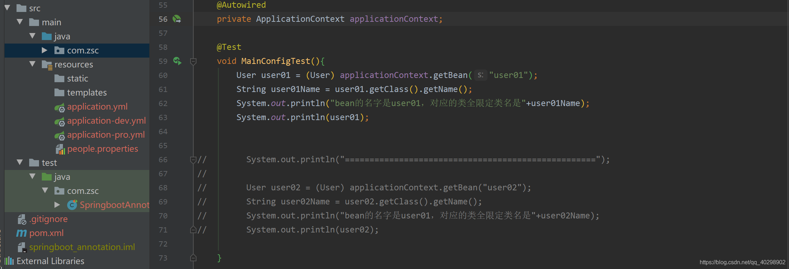

### **@ResponseBody**

@ResponseBody可以作用在方法上或类上，表示该方法的返回结果直接写入 HTTP response body 中，而不会被解析为跳转路径，即不会经过视图解析器，返回什么数据即在页面输入什么数据。

| 注解          | 说明                                                    |
| :------------ | :------------------------------------------------------ |
| @ResponseBody | @ResponseBody的作用其实是将java对象转为json格式的数据。 |

测试如下
 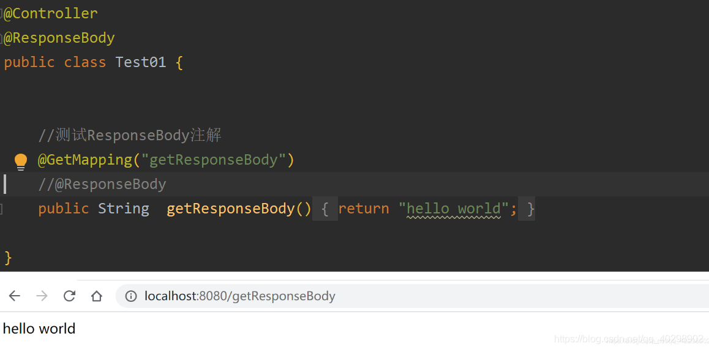

## 

### **@RestController**

该注解是@Controller和@ResponseBody的结合体，一般用于类，作用等于在类上面添加了@ResponseBody和@Controller

### @Scope

声明 Spring Bean 的作用域，使用方法:

```java
@Bean
@Scope("singleton")
public Person personSingleton() {
    return new Person();
}
```

**四种常见的 Spring Bean 的作用域：**

- singleton : 唯一 bean 实例，Spring 中的 bean 默认都是单例的。
- prototype : 每次请求都会创建一个新的 bean 实例。
- request : 每一次 HTTP 请求都会产生一个新的 bean，该 bean 仅在当前 HTTP request 内有效。
- session : 每一次 HTTP 请求都会产生一个新的 bean，该 bean 仅在当前 HTTP session 内有效。

### @Configuration

一般用来声明配置类，可以使用 `@Component`注解替代，不过使用`Configuration`注解声明配置类更加语义化。

```java
@Configuration
public class AppConfig {
    @Bean
    public TransferService transferService() {
        return new TransferServiceImpl();
    }
}
```

## 3、依赖注入

### 依赖注入	@Autowired	@Qualifier	@Resource

这3个注解都是基于注解方式进行自动装配，在容器里面将查找到的bean返回，一般@AutoWired用得最多，@Qualifier则需要配合@AutoWired使用，@Resource则是可以通过名字进行自动装配

| 注解       | 说明                                                         |
| :--------- | :----------------------------------------------------------- |
| @AutoWired | @Autowired默认按类型装配，如果发现找到多个bean，则按照name方式比对，如果还有多个，则报出异常 |
| @Qualifier | spring的注解，按名字注入 一般当出现两个及以上bean时,不知道要注入哪个，结合@AutoWired使用 |
| @Resource  | 默认按名称注入例如@Resource(name = “zhaozhao”)则根据name属性注入找不到则报错，若无name属性则根据属性名称注入，如果匹配不成功则按照类型匹配匹配不成功则报错。 |

**@AutoWired**
 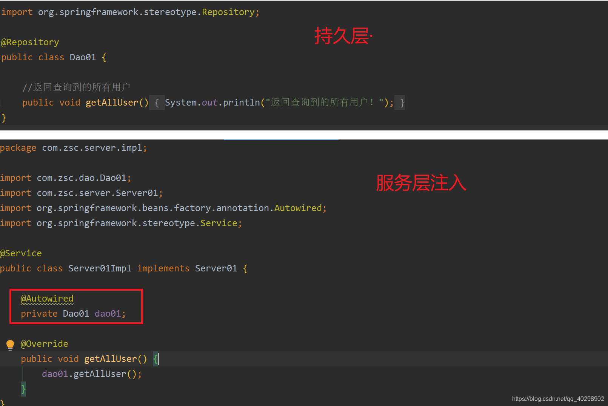
 **@Qualifier**
 当有一个接口的多个实现类时，只用@AutoWired会报错，因为它有多个接口的实现类，不知道你要找哪一个，这个时候就需要在注入bean的时候起个名字，然后用@Qualifier注解指定哪一个bean(按照名字注入与装配)
 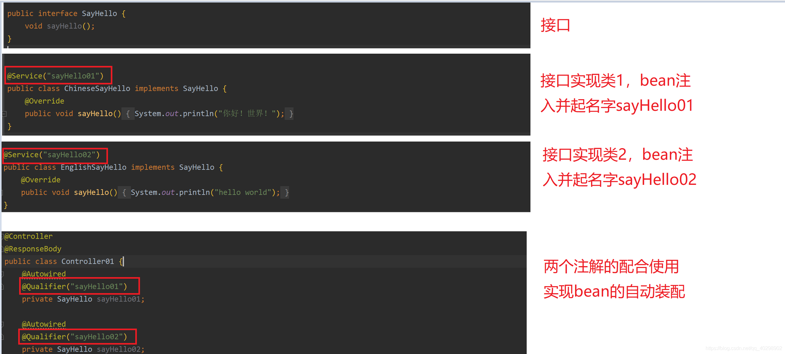
 **@Resource**
 该注解的使用相当于@AutoWired和@Qualifier配合使用的效果
 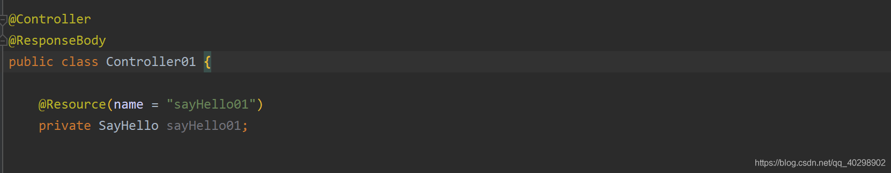

## 4、处理Http请求

###  @RequestMapping

[【springboot】超详细 Spring @RequestMapping 注解使用技巧](https://blog.csdn.net/rocling/article/details/82903574?ops_request_misc=&request_id=&biz_id=102&utm_term=springboot%20requestmapping&utm_medium=distribute.pc_search_result.none-task-blog-2~all~sobaiduweb~default-1-82903574.nonecase&spm=1018.2226.3001.4187)

**@RequestMapping**
 发起get请求或者post请求都可以
 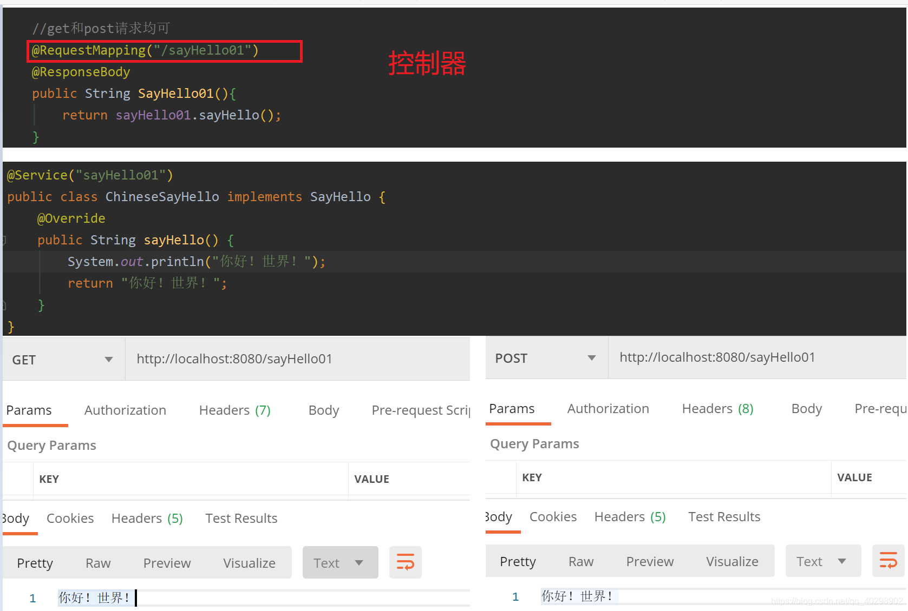

### @GetMapping

GET 请求

```java
@GetMapping("users")` 等价于`@RequestMapping(value="/users",method=RequestMethod.GET)
@GetMapping("/users")
public ResponseEntity<List<User>> getAllUsers() {
 return userRepository.findAll();
}
```

### @PostMapping

Post请求

```
@PostMapping("users")` 等价于`@RequestMapping(value="/users",method=RequestMethod.POST)
```

关于`@RequestBody`注解的使用，在下面的“前后端传值”这块会讲到。

```kotlin
@PostMapping("/users")
public ResponseEntity<User> createUser(@Valid @RequestBody UserCreateRequest userCreateRequest) {
 return userRespository.save(user);
}
```

### @PutMapping 

PUT 请求

```java
@PutMapping("/users/{userId}")` 等价于`@RequestMapping(value="/users/{userId}",method=RequestMethod.PUT)
@PutMapping("/users/{userId}")
public ResponseEntity<User> updateUser(@PathVariable(value = "userId") Long userId,
  @Valid @RequestBody UserUpdateRequest userUpdateRequest) {
  ......
}
```

### @DeleteMapping

**DELETE 请求**

```java
@DeleteMapping("/users/{userId}")`等价于`@RequestMapping(value="/users/{userId}",method=RequestMethod.DELETE)
@DeleteMapping("/users/{userId}")
public ResponseEntity deleteUser(@PathVariable(value = "userId") Long userId){
  ......
}
```

### @PatchMapping

**PATCH 请求**

一般实际项目中，我们都是 PUT 不够用了之后才用 PATCH 请求去更新数据。

```java
@PatchMapping("/profile")
public ResponseEntity updateStudent(@RequestBody StudentUpdateRequest studentUpdateRequest) {
  studentRepository.updateDetail(studentUpdateRequest);
  return ResponseEntity.ok().build();
}
```

## 5、获取请求参数

### **@RequestParam、@RequestBody、@PathVariable、@RequestHeader、@CookieValue**

这3个注解放在一起主要是经常在控制层用来接收参数的

| 注解           | 说明                                 |
| :------------- | :----------------------------------- |
| @RequestParam  | 获取查询参数。即url?name=这种形式    |
| @PathVariable  | 获取路径参数。即url/{id}这种形式。   |
| @RequestParam  | 获取Body的参数，一般用于post获取参数 |
| @RequestHeader | 获取请求头的信息                     |
| @CookieValue   | 获取Cookie的信息                     |

**@RequestParam**
 @RequestParam主要用于接收url?后面的参数，get或post请求，只要后面的url?有参数都可以获取到对应的参数

@RequestParam注解有几个比较重要的属性，required 表示是否必须，默认为 true，必须。defaultValue 可设置请求参数的默认值。value 为接收url的参数名（相当于key值）。

示例代码如下

```java
    @GetMapping("/requestParam")
    @ResponseBody
    public Map<String, String> requestParam(
            UserDto userDto,//通过一个实体类来接收，字段名必须一致
            @RequestParam(value = "id", required = false) String userId,
            @RequestParam(value = "name", required = false) String userName,
            @RequestParam(value = "pageIndex", required = true, defaultValue = "1") String pageIndex,
            @RequestParam(value = "pageSize", required = true, defaultValue = "5") String pageSize) {
        Map<String, String> map = new HashMap<>();
        map.put("userDto",userDto.toString());
        map.put("id", userId);
        map.put("name", userName);
        map.put("pageIndex", pageIndex);
        map.put("pageSize", pageSize);
        return map;
    }
```

运行
 

**@PathVariable**
 该注解主要用于获取路径参数，像url/{id}/{name}这种形式的参数都可以，get获取post请求均可

示例代码如下：

```java
    @PostMapping("/pathVariable/{id}/{name}")
    @ResponseBody
    public Map<String, String> pathVariable(
            @PathVariable(name = "id") String userId,
            @PathVariable(name = "name") String userName) {

        Map<String, String> map = new HashMap<>();
        map.put("id", userId);
        map.put("name", userName);
        return map;
    }
```

运行结果

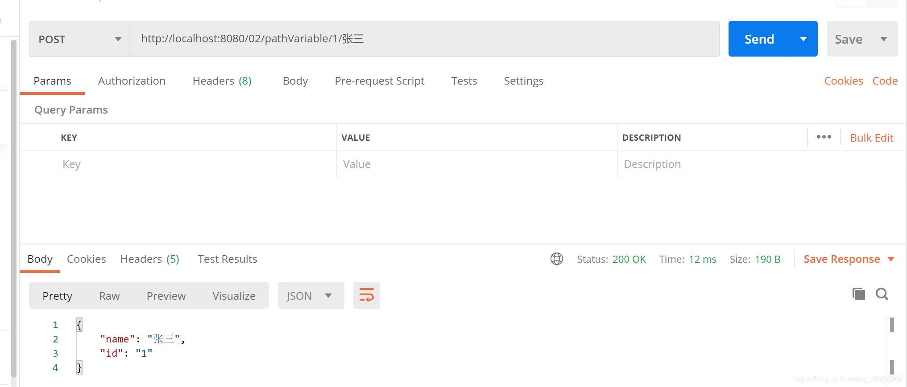

**@RequestBody**
 该注解用于获取请求体数据（body）,get没有请求体，故而一般用于post请求

示例代码如下：

```java
    @PostMapping("/test01")
    @ResponseBody
    public UserDto test01(@RequestBody UserDto userDto) {
        return userDto;
    }

    @PostMapping("/test02")
    @ResponseBody
    public String test02(@RequestBody String str) {
        return str;
    }
```

运行结果
 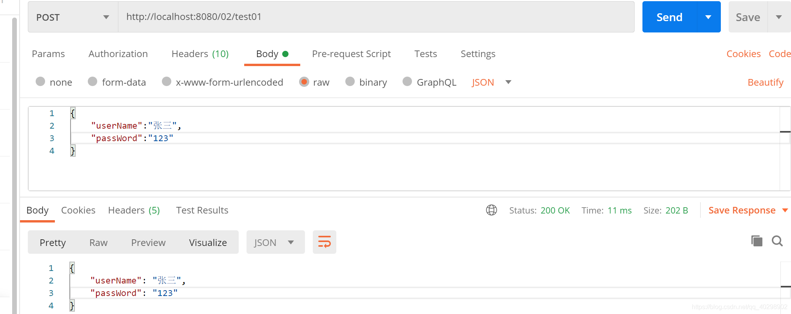
 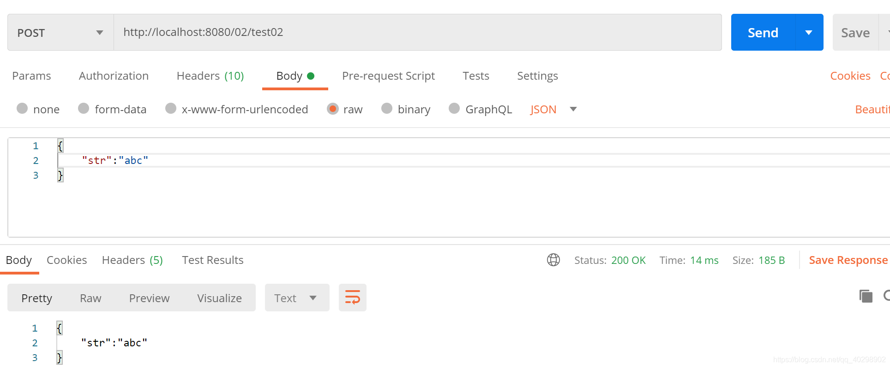

注意，如果要传多个参数过去只能将其封装成一个类，如果是出现了多个@RequestBody注解访问的时候会报400错误，例如下面这种代码就是错误的

```java
    @PostMapping("/requestBody")
    @ResponseBody
    public Map<String,String> requestBody(
            @RequestBody(required = true) String id,
            @RequestBody(required = true) String name,
            @RequestBody(required = false) String sex,
            @RequestBody(required = false) String age
            ){

        Map<String,String> map = new HashMap<>();
        map.put("id","id");
        map.put("name","name");

        return map;
    }
```

**@RequestHeader**
 示例代码如下

```java
    @PostMapping("/requestHeader")
    @ResponseBody
    public String requestBody03(@RequestHeader(name = "Content-Type") String contentType){
        return contentType;
    }
```

运行结果
 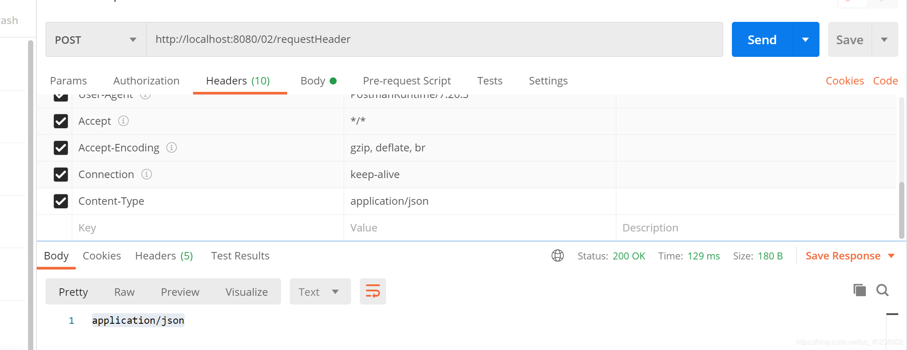

**@CookieValue**
 由于postman模拟cookie本人不会弄，只能用别人的代码

```java
@GetMapping("/demo3")
public void demo3(@RequestHeader(name = "myHeader") String myHeader,
        @CookieValue(name = "myCookie") String myCookie) {
    System.out.println("myHeader=" + myHeader);
    System.out.println("myCookie=" + myCookie);
}
```

## 6、属性注入 

### **@Value、@ConfigurationProperties、@PropertySource**

| 注解                     | 说明                                                         |
| :----------------------- | :----------------------------------------------------------- |
| @Value                   | 用于获取bean的属性，一般用于读取配置文件的数据，作用在变量上 |
| @ConfigurationProperties | 用于注入Bean属性，然后再通过当前Bean获取注入值，作用在类上   |
| @PropertySource          | 用于指定要读取的配置文件，可以和@Value或@ConfigurationProperties配合使用 |

**注意：@PropertySource不支持yml文件读取。**

**@Value**
 这里用yml配置文件进行演示，propres配置文件也是同样的效果，在application.yml配置文件里设置开发环境的的配置文件（dev），这样用@Value获取到的就是开发环境的配置文件的数据，切换成生产环境（pro）则获取到的是生产环境的数据
 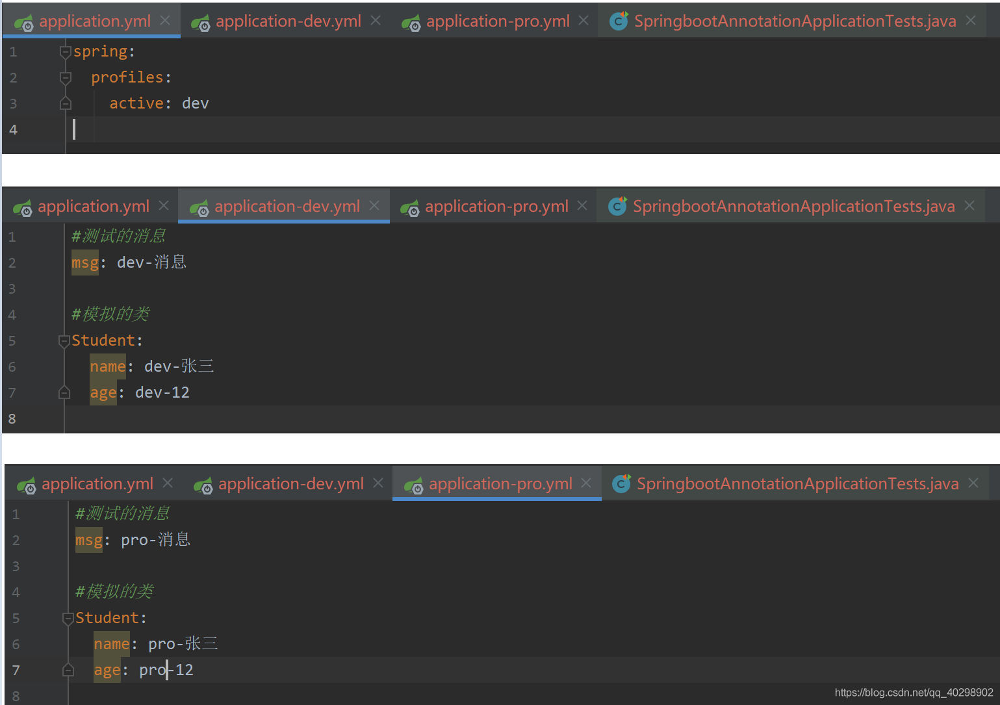
 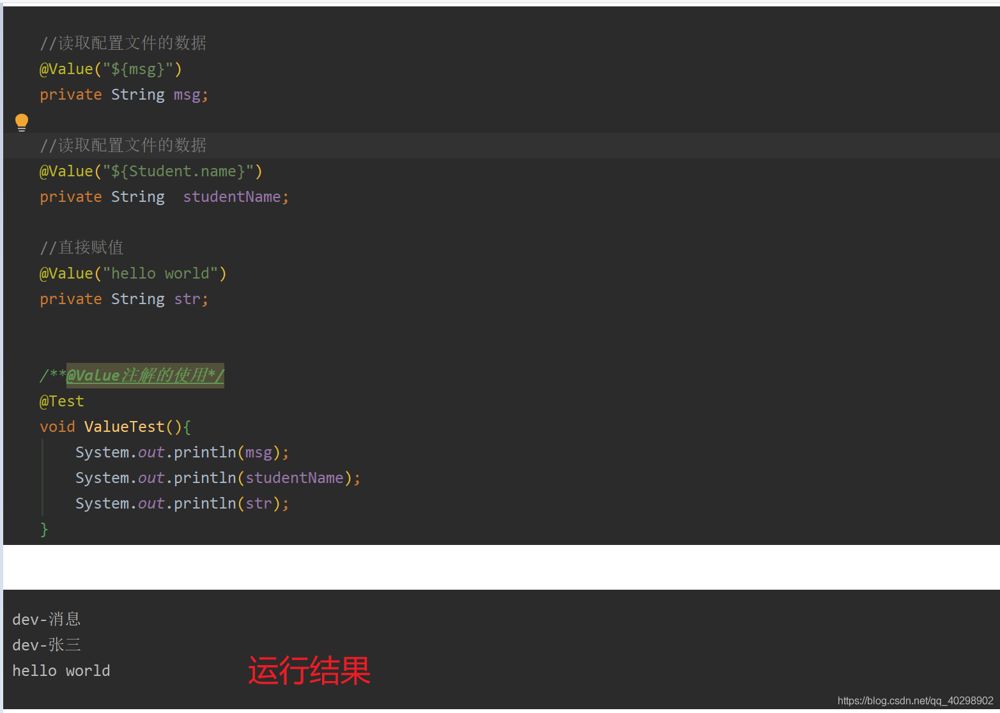
 **@ConfigurationProperties**
 该注解可以直接注入整个类的数据，作用于类

配置文件如下，这里使用pro环境
 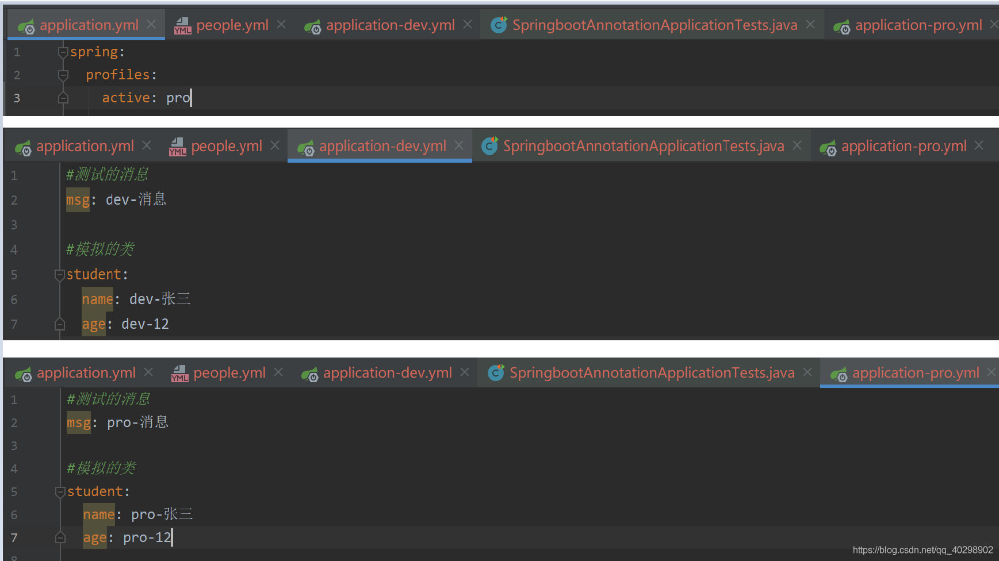
 测试
 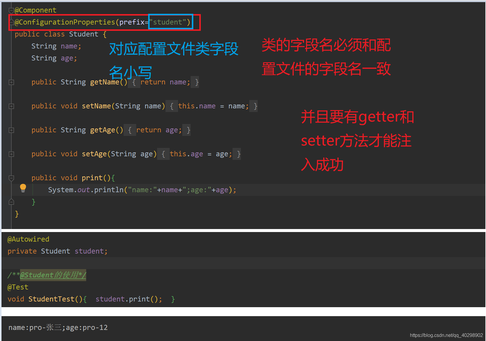

**@PropertySource**

注意：@PropertySource不支持yml文件读取。
 配置文件如下：people.properties
 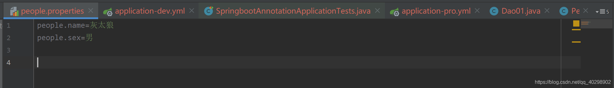
 测试
 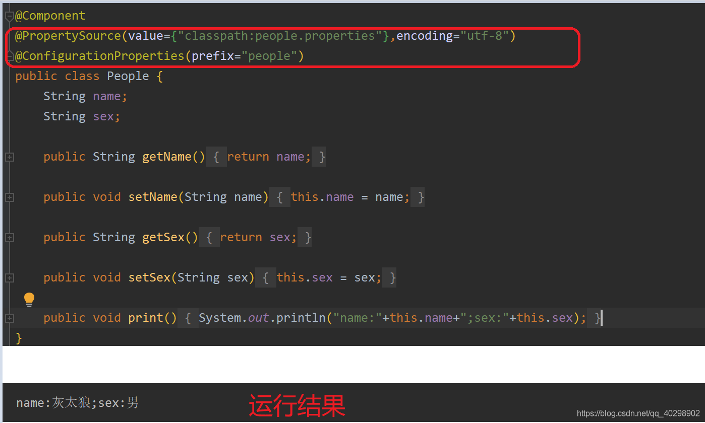
 当然@PropertySource还可以和@Value配合使用，即一个一个注入值。

## 7、参数校验

**数据的校验的重要性就不用说了，即使在前端对数据进行校验的情况下，我们还是要对传入后端的数据再进行一遍校验，避免用户绕过浏览器直接通过一些 HTTP 工具直接向后端请求一些违法数据。**

**JSR(Java Specification Requests）** 是一套 JavaBean 参数校验的标准，它定义了很多常用的校验注解，我们可以直接将这些注解加在我们 JavaBean 的属性上面，这样就可以在需要校验的时候进行校验了，非常方便！

校验的时候我们实际用的是 **Hibernate Validator** 框架。Hibernate Validator 是 Hibernate 团队最初的数据校验框架，Hibernate Validator 4.x 是 Bean Validation 1.0（JSR 303）的参考实现，Hibernate Validator 5.x 是 Bean Validation 1.1（JSR 349）的参考实现，目前最新版的 Hibernate Validator 6.x 是 Bean Validation 2.0（JSR 380）的参考实现。

SpringBoot 项目的 spring-boot-starter-web 依赖中已经有 hibernate-validator 包，不需要引用相关依赖。如下图所示（通过 idea 插件—Maven Helper 生成）：

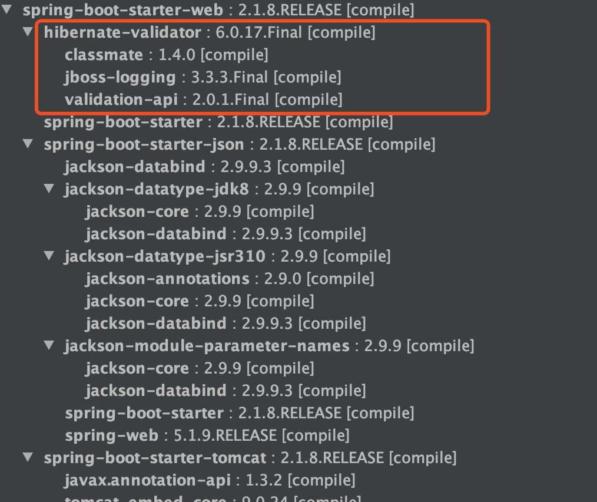

非 SpringBoot 项目需要自行引入相关依赖包，这里不多做讲解，具体可以查看我的这篇文章：《[如何在 Spring/Spring Boot 中做参数校验？你需要了解的都在这里！](https://mp.weixin.qq.com/s?__biz=Mzg2OTA0Njk0OA==&mid=2247485783&idx=1&sn=a407f3b75efa17c643407daa7fb2acd6&chksm=cea2469cf9d5cf8afbcd0a8a1c9cc4294d6805b8e01bee6f76bb2884c5bc15478e91459def49&token=292197051&lang=zh_CN&scene=21#wechat_redirect)》。

👉 需要注意的是： **所有的注解，推荐使用 JSR 注解，即`javax.validation.constraints`，而不是`org.hibernate.validator.constraints`**

### 一些常用的字段验证的注解

- `@NotEmpty` 被注释的字符串的不能为 null 也不能为空
- `@NotBlank` 被注释的字符串非 null，并且必须包含一个非空白字符
- `@Null` 被注释的元素必须为 null
- `@NotNull` 被注释的元素必须不为 null
- `@AssertTrue` 被注释的元素必须为 true
- `@AssertFalse` 被注释的元素必须为 false
- `@Pattern(regex=,flag=)`被注释的元素必须符合指定的正则表达式
- `@Email` 被注释的元素必须是 Email 格式。
- `@Min(value)`被注释的元素必须是一个数字，其值必须大于等于指定的最小值
- `@Max(value)`被注释的元素必须是一个数字，其值必须小于等于指定的最大值
- `@DecimalMin(value)`被注释的元素必须是一个数字，其值必须大于等于指定的最小值
- `@DecimalMax(value)` 被注释的元素必须是一个数字，其值必须小于等于指定的最大值
- `@Size(max=, min=)`被注释的元素的大小必须在指定的范围内
- `@Digits (integer, fraction)`被注释的元素必须是一个数字，其值必须在可接受的范围内
- `@Past`被注释的元素必须是一个过去的日期
- `@Future` 被注释的元素必须是一个将来的日期
- ......

### 验证请求体(RequestBody)

```kotlin
@Data
@AllArgsConstructor
@NoArgsConstructor
public class Person {

    @NotNull(message = "classId 不能为空")
    private String classId;

    @Size(max = 33)
    @NotNull(message = "name 不能为空")
    private String name;

    @Pattern(regexp = "((^Man$|^Woman$|^UGM$))", message = "sex 值不在可选范围")
    @NotNull(message = "sex 不能为空")
    private String sex;

    @Email(message = "email 格式不正确")
    @NotNull(message = "email 不能为空")
    private String email;
}
```

我们在需要验证的参数上加上了`@Valid`注解，如果验证失败，它将抛出`MethodArgumentNotValidException`。

```kotlin
@RestController
@RequestMapping("/api")
public class PersonController {
    @PostMapping("/person")
    public ResponseEntity<Person> getPerson(@RequestBody @Valid Person person) {
        return ResponseEntity.ok().body(person);
    }
}
```

###  验证请求参数(Path Variables 和 Request Parameters)

**一定一定不要忘记在类上加上 `Validated` 注解了，这个参数可以告诉 Spring 去校验方法参数。**

```kotlin
@RestController
@RequestMapping("/api")
@Validated
public class PersonController {
    @GetMapping("/person/{id}")
    public ResponseEntity<Integer> getPersonByID(@Valid @PathVariable("id") @Max(value = 5,message = "超过 id 的范围了") Integer id) {
        return ResponseEntity.ok().body(id);
    }
}
```

更多关于如何在 Spring 项目中进行参数校验的内容，请看《[如何在 Spring/Spring Boot 中做参数校验？你需要了解的都在这里！](https://mp.weixin.qq.com/s?__biz=Mzg2OTA0Njk0OA==&mid=2247485783&idx=1&sn=a407f3b75efa17c643407daa7fb2acd6&chksm=cea2469cf9d5cf8afbcd0a8a1c9cc4294d6805b8e01bee6f76bb2884c5bc15478e91459def49&token=292197051&lang=zh_CN&scene=21#wechat_redirect)》这篇文章。

## 其他

@ PostConstruct 自定义初始化

@ PreDestroy 自定义销毁

