# springboot 整合ActiveMQ

​    [消息队列](https://so.csdn.net/so/search?q=消息队列&spm=1001.2101.3001.7020)中间件是分布式系统中重要的组件，主要解决应用耦合，异步消息，流量削锋等问题。实现高性能，高可用，可伸缩和最终一致性架构。是大型分布式系统不可缺少的中间件。消息形式支持点对点和订阅-发布。

## **ActiveMQ是什么**

1. ActiveMQ是消息队列技术，为解决高并发问题而生
2. ActiveMQ生产者消费者模型（生产者和消费者可以跨平台、跨系统）
3. ActiveMQ支持如下两种消息传输方式

- 点对点模式，生产者生产了一个消息，只能由一个消费者进行消费
- 发布/订阅模式，生产者生产了一个消息，可以由多个消费者进行消费

## **SpringBoot整合ActiveMQ**

   **1. ActiveMQ下载启动**

​     http://activemq.apache.org/download-archives.html ，本文用的是windows版的5.15.3版本，下载下来是压缩包，自行解压一个到目录下，CMD进入到解压目录下的bin目录下，执行 [activemq](https://so.csdn.net/so/search?q=activemq&spm=1001.2101.3001.7020).bat start 启动。                                        如果能成功访问http://localhost:8161/admin（用户名和密码默认为admin），则启动成功。

## provider

   **2. 创建两个springboot项目，分别作为消息提供者（provider）和消费者（consumer），添加依赖**

```html
<dependency>


    <groupId>org.springframework.boot</groupId>


    <artifactId>spring-boot-starter-activemq</artifactId>


</dependency>


<!--消息队列连接池-->


<dependency>


    <groupId>org.apache.activemq</groupId>


    <artifactId>activemq-pool</artifactId>


    <version>5.15.0</version>


</dependency>
```

   **3. 在两个项目中的application.properires配置消息队列，并在启动类添加@EnableJms开启消息队列。**

 **application.properties**

```java
# failover:(tcp://localhost:61616,tcp://localhost:61617)


# tcp://localhost:61616


spring.activemq.broker-url=tcp://localhost:61616


#true 表示使用内置的MQ，false则连接服务器


spring.activemq.in-memory=false


#true表示使用连接池；false时，每发送一条数据创建一个连接


spring.activemq.pool.enabled=true


#连接池最大连接数


spring.activemq.pool.max-connections=10


#空闲的连接过期时间，默认为30秒


spring.activemq.pool.idle-timeout=30000


#强制的连接过期时间，与idleTimeout的区别在于：idleTimeout是在连接空闲一段时间失效，而expiryTimeout不管当前连接的情况，只要达到指定时间就失效。默认为0，never


spring.activemq.pool.expiry-timeout=0
```

 **启动类(provider)，consumer同样**

```java
@SpringBootApplication


@EnableJms //启动消息队列


public class ProviderApplication {


	public static void main(String[] args) {


		SpringApplication.run(ProviderApplication.class, args);


	}


}
```

   **4. prover项目结构图**

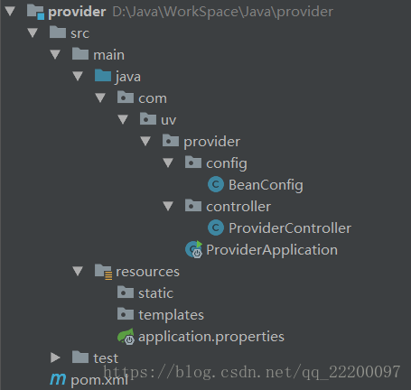

  **BeanConfig定义消息队列**

```java
import javax.jms.Queue;


import org.apache.activemq.command.ActiveMQQueue;


import org.springframework.context.annotation.Bean;


import org.springframework.context.annotation.Configuration;


 


/*


 * @author uv


 * @date 2018/9/15 14:21


 */


@Configuration


public class BeanConfig {


 


    //定义存放消息的队列


    @Bean


    public Queue queue() {


        return new ActiveMQQueue("ActiveMQQueue");


    }


}
```

   **ProviderController**

```java
import javax.jms.Queue;


import org.springframework.beans.factory.annotation.Autowired;


import org.springframework.jms.core.JmsMessagingTemplate;


import org.springframework.web.bind.annotation.RequestMapping;


import org.springframework.web.bind.annotation.RestController;


 


/*


 * @author uv


 * @date 2018/9/15 14:54


 *


 */


@RestController


public class ProviderController {


 


    //注入存放消息的队列，用于下列方法一


    @Autowired


    private Queue queue;


 


    //注入springboot封装的工具类


    @Autowired


    private JmsMessagingTemplate jmsMessagingTemplate;


 


    @RequestMapping("send")


    public void send(String name) {


        //方法一：添加消息到消息队列


        jmsMessagingTemplate.convertAndSend(queue, name);


        //方法二：这种方式不需要手动创建queue，系统会自行创建名为test的队列


        //jmsMessagingTemplate.convertAndSend("test", name);


    }


}
```

   **5. 启动provider，向消息队列添加数据，本次添加5条数据**

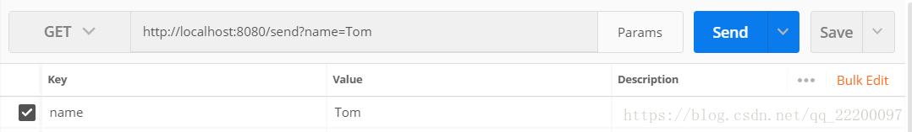

   **查看 http://localhost:8161/admin/queues.jsp 如下**

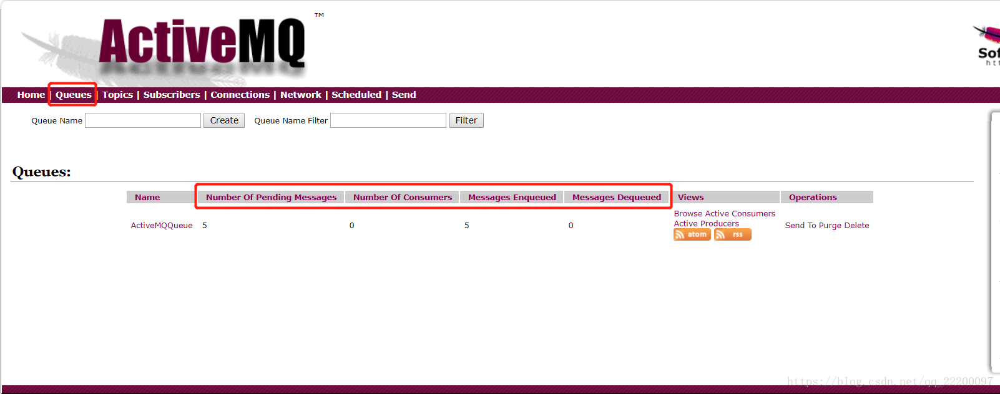

- Number Of Pending Messages：消息队列中待处理的消息
- Number Of Consumers：消费者的数量
- Messages Enqueued：累计进入过消息队列的总量
- Messages Dequeued：累计消费过的消息总量

## consumer

   **6. consumer项目结构图**

 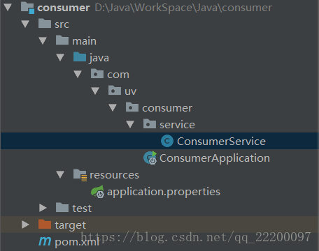

application.properties 和 ConsumerApplication 同 provider类似，如下为不同的ConsumerService：

```java
import org.springframework.beans.factory.annotation.Autowired;


import org.springframework.jms.annotation.JmsListener;


import org.springframework.jms.core.JmsMessagingTemplate;


import org.springframework.messaging.handler.annotation.SendTo;


import org.springframework.stereotype.Component;


 


/*


 * @author uv


 * @date 2018/9/15 18:36


 *


 */


@Component


public class ConsumerService {


 


    @Autowired


    private JmsMessagingTemplate jmsMessagingTemplate;


 


    // 使用JmsListener配置消费者监听的队列，其中name是接收到的消息


    @JmsListener(destination = "ActiveMQQueue")


    // SendTo 会将此方法返回的数据, 写入到 OutQueue 中去.


    @SendTo("SQueue")


    public String handleMessage(String name) {


        System.out.println("成功接受Name" + name);


        return "成功接受Name" + name;


    }


}
```

   **7. 启动consumer，控制台输出如下**

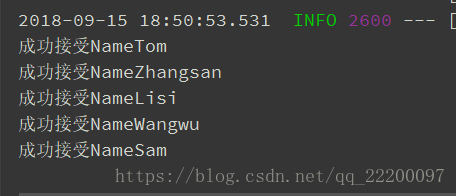 

   消息接收成功，查看 http://localhost:8161/admin/queues.jsp ，如下图所示，消息队列中不再有未处理的消息，由于consumer的启动，消费者的数量为1，Messages Dequeued（累计消费过的消息总量）的数值也变成了5；另外消费者接收到5条消息处理后，返回到OutQueue 5条消息，下图可以看出来。

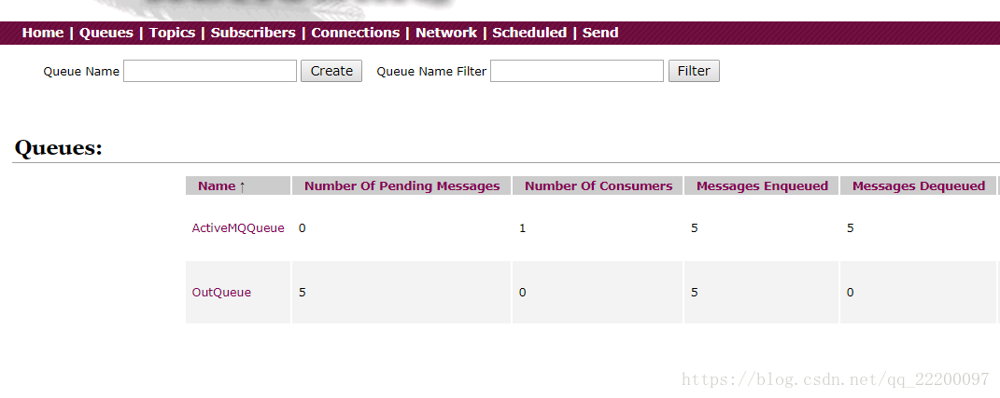

   **8. ActiveMQ的持久化**

   持久化可以参考这篇文章 https://blog.csdn.net/qq_22200097/article/details/82716859

## **ActiveMQ的消息持久化机制**

ActiveMQ的持久化机制包含

- JDBC： 持久化到数据库
- AMQ ：日志文件（已基本不用）
- KahaDB ： AMQ基础上改进，默认选择
- LevelDB ：谷歌K/V数据库

在activemq.xml中查看默认的broker持久化机制。

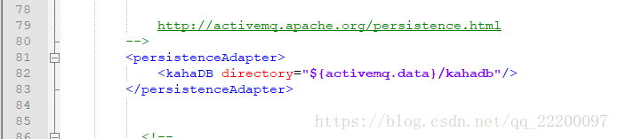

 默认消息持久化到ActiveMQ路径下的data目录下。

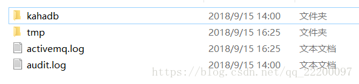

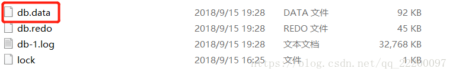

 **1. 将持久化方式改为JDBC的方式**

```html
<persistenceAdapter>


 


<!-- <kahaDB directory="${activemq.data}/kahadb"/> -->


 


<jdbcPersistenceAdapter dataSource="#mysql-ds" createTablesOnStartup="false" />


 


</persistenceAdapter>
```

createTablesOnStartup默认值是true，即每次ActiveMQ启动的时候都重新创建数据表，一般是首次启动设置为true，之后设置为false。

 **2. 在broker标签外配置数据库源**

```html
<bean id="mysql-ds" class="org.apache.commons.dbcp.BasicDataSource" destroy-method="close">


  <property name="driverClassName" value="com.mysql.jdbc.Driver"/>


  <property name="url" value="jdbc:mysql://127.0.0.1:3306/activemq?relaxAutoCommit=true"/>


  <property name="username" value="root"/>


  <property name="password" value="root"/>


  <property name="maxActive" value="200"/> 


  <property name="poolPreparedStatements" value="true"/>


</bean>
```

 **3. 将mysql的jdbc jar包放置到activemq的lib目录下。同时，将commons-pool.jar、commons-dbcp.jar和commons-collections.jar放置到activemq的lib目录下。**

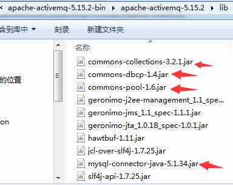

 **4. 重新启动ActiveMQ**

   查看启动的命令行输出信息和登录ActiveMQ的默认控制台http://127.0.0.1:8161/admin。若ActiveMQ正常启动和运行，则表示其JDBC持久化机制设置没有问题。

​    因为使用了JDBC持久化方式，数据库会创建3个表：activemq_msgs，activemq_acks和activemq_lock。activemq_msgs用于存储消息，Queue和Topic都存储在这个表中。

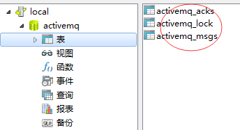

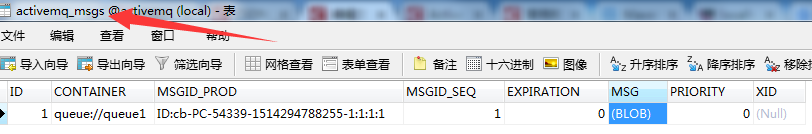