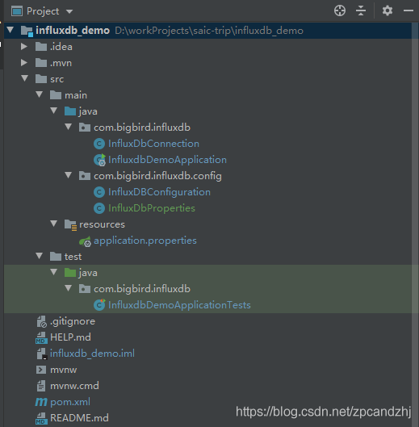

# springboot整合InfluxDB

 [springboot整合InfluxDB](https://blog.csdn.net/hellozpc/article/details/107091466?ops_request_misc=%257B%2522request%255Fid%2522%253A%2522164672534216780366521147%2522%252C%2522scm%2522%253A%252220140713.130102334..%2522%257D&request_id=164672534216780366521147&biz_id=0&utm_medium=distribute.pc_search_result.none-task-blog-2~all~sobaiduend~default-1-107091466.pc_search_result_control_group&utm_term=springboot+Influxdb&spm=1018.2226.3001.4187)                            

[springboot对接InfluxDB](https://blog.csdn.net/qq_25464557/article/details/107411717?ops_request_misc=%257B%2522request%255Fid%2522%253A%2522164672534216780366521147%2522%252C%2522scm%2522%253A%252220140713.130102334..%2522%257D&request_id=164672534216780366521147&biz_id=0&utm_medium=distribute.pc_search_result.none-task-blog-2~all~sobaiduend~default-2-107411717.pc_search_result_control_group&utm_term=springboot+Influxdb&spm=1018.2226.3001.4187)

### 文章目录

- - [1.简介](#1_7)
  - [2.安装](#2_9)
  - [3.数据操作](#3_16)
  - [4. SpringBoot整合InfluxDB](#4_SpringBootInfluxDB_32)
  - - [项目目录结构](#_33)
    - [pom.xml](#pomxml_36)
    - [封装influxdb基本操作](#influxdb_92)
    - [封装自动配置](#_257)
    - [新建配置类](#_302)
    - [配置application.properties](#applicationproperties_320)
    - [单元测试](#_333)


## **1.简介**

## **2.安装**

安装和卸载

添加用户

## **3.数据操作**

3.1创建数据库

3.2删除数据库

3.3插入数据

3.4删除数据

3.5更新数据

3.6查询数据

**InfluxDB基本操作**请参考《中文参考文档》
 https://jasper-zhang1.gitbooks.io/influxdb/content/

## **4. SpringBoot整合InfluxDB**

### 项目目录结构



### pom.xml

```java
<?xml version="1.0" encoding="UTF-8"?>
<project xmlns="http://maven.apache.org/POM/4.0.0" xmlns:xsi="http://www.w3.org/2001/XMLSchema-instance"
         xsi:schemaLocation="http://maven.apache.org/POM/4.0.0 https://maven.apache.org/xsd/maven-4.0.0.xsd">
    <modelVersion>4.0.0</modelVersion>
    <parent>
        <groupId>org.springframework.boot</groupId>
        <artifactId>spring-boot-starter-parent</artifactId>
        <version>2.1.9.RELEASE</version>
        <relativePath/> <!-- lookup parent from repository -->
    </parent>
    <groupId>com.muscleape</groupId>
    <artifactId>influxdb</artifactId>
    <version>0.0.1-SNAPSHOT</version>
    <name>influxdb_demo</name>
    <description>Demo project for InfluxDB</description>

    <properties>
        <java.version>1.8</java.version>
    </properties>

    <dependencies>
        <dependency>
            <groupId>org.springframework.boot</groupId>
            <artifactId>spring-boot-starter</artifactId>
        </dependency>

        <dependency>
            <groupId>org.springframework.boot</groupId>
            <artifactId>spring-boot-starter-test</artifactId>
            <scope>test</scope>
        </dependency>

        <dependency>
            <groupId>org.influxdb</groupId>
            <artifactId>influxdb-java</artifactId>
            <version>2.15</version>
        </dependency>

    </dependencies>

    <build>
        <plugins>
            <plugin>
                <groupId>org.springframework.boot</groupId>
                <artifactId>spring-boot-maven-plugin</artifactId>
            </plugin>
        </plugins>
    </build>

</project>
```

### 封装influxdb基本操作

com.bigbird.influxdb.InfluxDbConnection

```java
import org.influxdb.BatchOptions;
import org.influxdb.InfluxDB;
import org.influxdb.InfluxDBFactory;
import org.influxdb.dto.*;
import java.util.Map;
import java.util.concurrent.TimeUnit;

public class InfluxDbConnection {
    private String userName;
    private String password;
    private String url;
    public String database;
    private String retentionPolicy;
    private String retentionPolicyTime;
    private InfluxDB influxdb;
    private BatchOptions batchOptions;

    public InfluxDbConnection(String userName, String password, String url, String database, String retentionPolicy, String retentionPolicyTime, BatchOptions batchOptions) {
        this.userName = userName;
        this.password = password;
        this.url = url;
        this.database = database;
        //默认数据保存策略为autogen
        this.retentionPolicy = retentionPolicy == null || "".equals(retentionPolicy) ? "autogen" : retentionPolicy;
        this.retentionPolicyTime = retentionPolicyTime == null || "".equals(retentionPolicyTime) ? "30d" : retentionPolicyTime;
        this.batchOptions = batchOptions == null ? BatchOptions.DEFAULTS : batchOptions;
        this.influxdb = buildInfluxDb();
    }

    public InfluxDB buildInfluxDb() {
        if (influxdb == null) {
            influxdb = InfluxDBFactory.connect(url, userName, password);
            try {
                createDatabase(this.database);
            } catch (Exception e) {
                System.out.println("create database error " + e.getMessage());
            }

            influxdb.setDatabase(this.database);
        }
        return influxdb;
    }

    /**
     * 设置数据保存策略:retentionPolicy策略名 /database 数据库名/ DURATION 数据保存时限/REPLICATION副本个数/结尾 DEFAULT
     * DEFAULT表示设为默认的策略
     */
    public void createRetentionPolicy() {
        String command = String.format("CREATE RETENTION POLICY \"%s\" ON \"%s\" DURATION %s REPLICATION %s DEFAULT",
                retentionPolicy, database, retentionPolicyTime, 1);
        this.query(command);
    }

    /**
     * 设置自定义保留策略
     *
     * @param policyName
     * @param duration
     * @param replication
     * @param isDefault
     */
    public void createRetentionPolicy(String policyName, String duration, int replication, boolean isDefault) {
        String command = String.format("CREATE RETENTION POLICY \"%s\" ON \"%s\" DURATION %s REPLICATION %s ", policyName,
                database, duration, replication);
        if (isDefault) {
            command = command + " DEFAULT";
        }
        this.query(command);
    }

    /**
     * 创建数据库
     *
     * @param database
     */
    public void createDatabase(String database) {
        influxdb.query(new Query("CREATE DATABASE " + database));
    }

    /**
     * 操作数据库
     *
     * @param command
     * @return
     */
    public QueryResult query(String command) {
        return influxdb.query(new Query(command, database));
    }

    /**
     * 插入数据库
     *
     * @param measurement
     * @param tags
     * @param fields
     */
    public void insert(String measurement, Map<String, String> tags, Map<String, Object> fields) {
        insert(measurement, tags, fields, 0, null);
    }

    public void insert(String measurement, Map<String, String> tags, Map<String, Object> fields, long time, TimeUnit timeUnit) {
        Point.Builder builder = Point.measurement(measurement);
        builder.time(System.currentTimeMillis(), TimeUnit.MILLISECONDS);
        builder.tag(tags);
        builder.fields(fields);
        if (0 < time) {
            builder.time(time, timeUnit);
        }
        System.out.println(("influxDB insert data:" + builder.build().toString()));
        influxdb.write(database, retentionPolicy, builder.build());
    }

    public void batchInsert(BatchPoints batchPoints) {
        influxdb.write(batchPoints);
    }
    
    /**
     * 批量操作结束时手动刷新数据
     */
    public void flush() {
        if (influxdb != null) {
            influxdb.flush();
        }
    }

    /**
     * 如果调用了enableBatch,操作结束时必须调用disableBatch或者手动flush
     */
    public void enableBatch() {
        if (influxdb != null) {
            influxdb.enableBatch(this.batchOptions);
        }
    }

    public void disableBatch() {
        if (influxdb != null) {
            influxdb.disableBatch();
        }
    }

    /**
     * 测试是否已正常连接
     *
     * @return
     */
    public boolean ping() {
        boolean isConnected = false;
        Pong pong;
        try {
            pong = influxdb.ping();
            if (pong != null) {
                isConnected = true;
            }
        } catch (Exception e) {
            e.printStackTrace();
        }
        return isConnected;
    }
}
```

### 封装自动配置

com.bigbird.influxdb.config.InfluxDBConfiguration
 (该配置类放到容器能扫描的路径)

```java
import com.bigbird.influxdb.InfluxDbConnection;
import org.influxdb.BatchOptions;
import org.influxdb.InfluxDB;
import org.springframework.boot.autoconfigure.condition.ConditionalOnClass;
import org.springframework.boot.autoconfigure.condition.ConditionalOnMissingBean;
import org.springframework.boot.context.properties.ConfigurationProperties;
import org.springframework.context.annotation.Bean;
import org.springframework.context.annotation.Configuration;

@Configuration
@ConditionalOnClass(InfluxDB.class)
public class InfluxDBConfiguration {

    @Bean
    @ConfigurationProperties(prefix = "spring.influx")
    @ConditionalOnMissingBean(name = "influxDbProperties")
    InfluxDbProperties influxDbProperties() {
        return new InfluxDbProperties();
    }

    @Bean
    @ConditionalOnMissingBean(name = "influxDbConnection")
    public InfluxDbConnection influxDbConnection(InfluxDbProperties influxDbProperties) {
        BatchOptions batchOptions = BatchOptions.DEFAULTS;
        batchOptions = batchOptions.actions(influxDbProperties.getActions());
        batchOptions = batchOptions.flushDuration(influxDbProperties.getFlushDuration());
        batchOptions = batchOptions.jitterDuration(influxDbProperties.getJitterDuration());
        batchOptions = batchOptions.bufferLimit(influxDbProperties.getBufferLimit());

        InfluxDbConnection influxDbConnection = new InfluxDbConnection(influxDbProperties.getUserName(), influxDbProperties.getPassword(),
                influxDbProperties.getUrl(), influxDbProperties.getDatabase(), influxDbProperties.getRetentionPolicy(),
                influxDbProperties.getRetentionPolicyTime(), batchOptions);
        influxDbConnection.createRetentionPolicy();

        System.out.println("init influxDb >>>>>>" + influxDbProperties);
        return influxDbConnection;
    }
}
```

### 新建配置类

com.bigbird.influxdb.config.InfluxDbProperties

```java
public class InfluxDbProperties {
    private String url;
    private String userName;
    private String password;
    private String database;
    private String retentionPolicy = "autogen";
    private String retentionPolicyTime = "30d";
    private int actions = 2000;
    private int flushDuration = 1000;
    private int jitterDuration = 0;
    private int bufferLimit = 10000;
	//省略get/set/toString方法
}
```

### 配置application.properties

src/main/resources/application.properties

```java
# influxDB
spring.influx.url=http://10.1.20.7:8086
spring.influx.userName=test_user
spring.influx.password=123456
spring.influx.database=influx_demo
spring.influx.retention_policy=default
spring.influx.retention_policy_time=30d
spring.influx.actions=10000
spring.influx.bufferLimit=20000
```

### 单元测试

com.bigbird.influxdb.InfluxdbDemoApplicationTests

```java
import org.influxdb.dto.QueryResult;
import org.junit.Test;
import org.junit.runner.RunWith;
import org.springframework.boot.test.context.SpringBootTest;
import org.springframework.test.context.junit4.SpringRunner;

import javax.annotation.Resource;
import java.util.*;
import java.util.stream.Collectors;

@RunWith(SpringRunner.class)
@SpringBootTest
public class InfluxdbDemoApplicationTests {
	//需要使用的地方直接注入
    @Autowired
    InfluxDbConnection influxDBConnection;

    @Test
    public void contextLoads() {
        System.out.println("Test Start");
    }

    @Test
    public void testInsert() {
        //准备数据
        int num = 200;
        List<Map<String, String>> tagsList = new ArrayList<>();
        List<Map<String, Object>> fieldsList = new ArrayList<>();
        for (int i = 0; i < num; i++) {
            Map<String, String> tagsMap = new HashMap<>();
            Map<String, Object> fieldsMap = new HashMap<>();
            tagsMap.put("driver_id", "D" + i);
            tagsMap.put("mobile", "1812930821" + i);
            fieldsMap.put("totalDistance", (new Random().nextInt(900) + 100));
            tagsList.add(tagsMap);
            fieldsList.add(fieldsMap);
        }

        //插入数据
        long start = System.currentTimeMillis();
        influxDBConnection.enableBatch();
        for (int k = 0; k < tagsList.size(); k++) {
            influxDBConnection.insert("driverStatistics", tagsList.get(k), fieldsList.get(k));
        }
        influxDBConnection.disableBatch();
        long end = System.currentTimeMillis();
        System.out.println("cost:" + (end - start));

        //查询数据
		//QueryResult query = influxDBConnection.query("select count(*) from driverStatistics");
        QueryResult query = influxDBConnection.query("select * from driverStatistics where driver_id=" + "\'D1\'");

        List<QueryResult.Result> results = query.getResults();
        //只有一条查询语句取第一条查询结果即可
        QueryResult.Result result = results.get(0);
        List<Map<String, String>> res = new ArrayList<>();
        if (result.getSeries() != null) {
            List<List<Object>> valueList = result.getSeries().stream().map(QueryResult.Series::getValues)
                    .collect(Collectors.toList()).get(0);
            if (valueList != null && valueList.size() > 0) {
                for (List<Object> value : valueList) {
                    Map<String, String> resMap = new HashMap<>();
                    // 查询结果字段1取值
                    String field1 = value.get(0) == null ? null : value.get(0).toString();
                    resMap.put("time", field1);
                    // 查询结果字段2取值
                    String field2 = value.get(1) == null ? null : value.get(1).toString();
                    resMap.put("driver_id", field2);
                    // 查询结果字段3取值
                    String field3 = value.get(2) == null ? null : value.get(2).toString();
                    resMap.put("mobile", field3);
                    // 查询结果字段4取值
                    String field4 = value.get(3) == null ? null : value.get(3).toString();
                    resMap.put("totalDistance", field4);

                    res.add(resMap);
                }
            }
        }

        System.out.println(res);
        System.out.println("-----------------------------------------------------------");

        QueryResult queryOne = influxDBConnection.query("select * from driverStatistics where driver_id=" + "\'D1\'" + " and time=" + "1594636413114000000");
        List<QueryResult.Series> series = queryOne.getResults().get(0).getSeries();
        Map<String, String> oneRes = new HashMap<>();
        if (series != null) {
            List<List<Object>> valueList = series.get(0).getValues();
            for (List<Object> value : valueList) {
                // 查询结果字段1取值
                String field1 = value.get(0) == null ? null : value.get(0).toString();
                oneRes.put("time", field1);
                // 查询结果字段2取值
                String field2 = value.get(1) == null ? null : value.get(1).toString();
                oneRes.put("driver_id", field2);
                // 查询结果字段3取值
                String field3 = value.get(2) == null ? null : value.get(2).toString();
                oneRes.put("mobile", field3);
                // 查询结果字段4取值
                String field4 = value.get(3) == null ? null : value.get(3).toString();
                oneRes.put("totalDistance", field4);
            }
        }

        System.out.println(oneRes);
    }
}
```

InfluxDB基本操作请参考《中文参考文档》
 https://jasper-zhang1.gitbooks.io/influxdb/content/