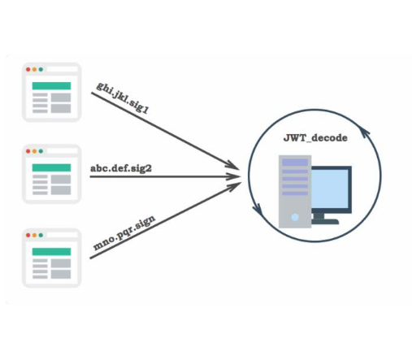
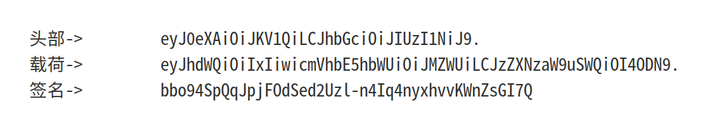
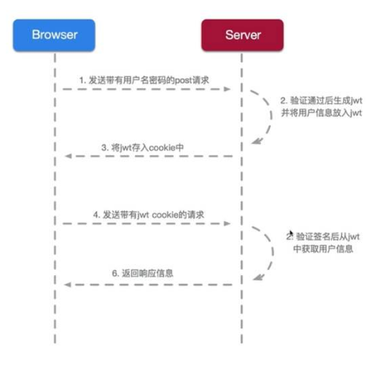
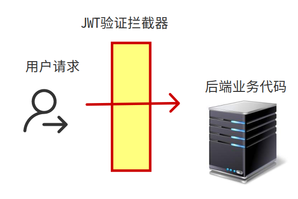
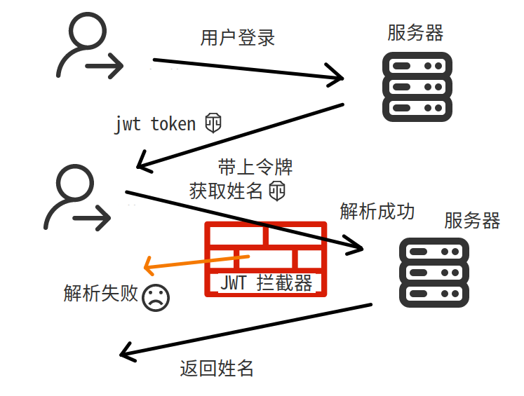

# springboot整合JWT                                           

> ★ 
>
> JSON Web Token是目前最流行的跨域认证解决方案,，适合前后端分离项目通过Restful API进行数据交互时进行身份认证
>
> ”


 关于Shiro整合JWT，可以看这里：[Springboot实现Shiro+JWT认证](https://blog.csdn.net/qq_43948583/article/details/104539122)

## **概述**

由于概念性内容网上多的是，所以就不详细介绍了

具体可以看这里：[阮一峰大佬的博客](https://www.ruanyifeng.com/blog/2018/07/json_web_token-tutorial.html)

我总结几个重点：

- JWT，全称Json Web Token，是一种令牌认证的方式
- 长相：
  - 头部：放有签名算法和令牌类型（这个就是JWT）
  - 载荷：你在令牌上附带的信息：比如用户的id，用户的电话号码，这样以后验证了令牌之后就可以直接从这里获取信息而不用再查数据库了
  - 签名：用来加令牌的
- 安全性：由于载荷里的内容都是用BASE64处理的，所以是没有保密性的(因为BASE64是对称的)，但是由于签名认证的原因，其他人很难伪造数据。不过这也意味着，你不能把敏感信息比如密码放入载荷中，毕竟这种可以被别人直接看到的，但是像用户id这种就无所谓了

## **工作流程**

### **登录阶段**

用户首次登录，通过账号密码比对，判定是否登录成功，如果登录成功的话，就生成一个jwt字符串，然后放入一些附带信息，返回给客户端。



这个jwt字符串里包含了有用户的相关信息，比如这个用户是谁，他的id是多少，这个令牌的有效时间是多久等等。下次用户登录的时候，必须把这个令牌也一起带上。

### **认证阶段**

这里需要和前端统一约定好，在发起请求的时候，会把上次的token放在请求头里的某个位置一起发送过来，后端接受到请求之后，会解析jwt，验证jwt是否合法，有没有被伪造，是否过期，到这里，验证过程就完成了。



不过服务器同样可以从验证后的jwt里获取用户的相关信息，从而减少对数据库的查询。

> ★ 
>
> 比如我们有这样一个业务：“通过用户电话号码查询用户余额”
>
> ”

如果我们在jwt的载荷里事先就放有电话号码这个属性，那么我们就可以避免先去数据库根据用户id查询用户电话号码，而直接拿到电话号码，然后执行接下里的业务逻辑。

### **关于有效期**

由于jwt是直接给用户的，只要能验证成功的jwt都可以被视作登录成功，所以，如果不给jwt设置一个过期时间的话，用户只要存着这个jwt，就相当于永远登录了，而这是不安全的，因为如果这个令牌泄露了，那么服务器是没有任何办法阻止该令牌的持有者访问的（因为拿到这个令牌就等于随便冒充你身份访问了），所以往往jwt都会有一个有效期，通常存在于载荷部分，下面是一段生成jwt的java代码：

```java
        return JWT.create().withAudience(userId)
                .withIssuedAt(new Date())        <---- 发行时间
                .withExpiresAt(expiresDate)     <---- 有效期
                .withClaim("sessionId", sessionId)
                .withClaim("userName", userName)
                .withClaim("realName", realName)
                .sign(Algorithm.HMAC256(userId+"HelloLehr"));
```

在实际的开发中，令牌的有效期往往是越短越安全，因为令牌会频繁变化，即使有某个令牌被别人盗用，也会很快失效。但是有效期短也会导致用户体验不好（总是需要重新登录），所以这时候就会出现另外一种令牌—`refresh token刷新令牌`。刷新令牌的有效期会很长，只要刷新令牌没有过期，就可以再申请另外一个jwt而无需登录（且这个过程是在用户访问某个接口时自动完成的，用户不会感觉到令牌替换），对于刷新令牌的具体实现这里就不详细讲啦（其实因为我也没深入研究过XD…）

### **对比Session**

在传统的session会话机制中，服务器识别用户是通过用户首次访问服务器的时候，给用户一个sessionId，然后把用户对应的会话记录放在服务器这里，以后每次通过sessionId来找到对应的会话记录。这样虽然所有的数据都存在服务器上是安全的，但是对于分布式的应用来说，就需要考虑session共享的问题了，不然同一个用户的sessionId的请求被自动分配到另外一个服务器上就等于失效了

而Jwt不但可以用于登录认证，也把相应的数据返回给了用户（就是载荷里的内容），通过签名来保证数据的真实性，该应用的各个服务器上都有统一的验证方法，只要能通过验证，就说明你的令牌是可信的，我就可以从你的令牌上获取你的信息，知道你是谁了，从而减轻了服务器的压力，而且也对分布式应用更为友好。（毕竟就不用担心服务器session的分布式存储问题了）

## **整合Springboot**

### **导入java-jwt包**

导入`java-jwt`包：

这个包里实现了一系列jwt操作的api（包括上面讲到的怎么校验，怎么生成jwt等等）

如果你是Maven玩家：

pom.xml里写入

```maven
<!-- https://mvnrepository.com/artifact/com.auth0/java-jwt -->
<dependency>
    <groupId>com.auth0</groupId>
    <artifactId>java-jwt</artifactId>
    <version>3.8.3</version>
</dependency>
```

如果你是Gradle玩家：

build.gradle里写入

```gradle
compile group: 'com.auth0', name: 'java-jwt', version: '3.8.3'
```

如果你是其他玩家：

maven中央仓库地址点[这里](https://mvnrepository.com/artifact/com.auth0/java-jwt)

### **工具类的编写**

代码如下：

```java
import com.auth0.jwt.JWT;
import com.auth0.jwt.JWTVerifier;
import com.auth0.jwt.algorithms.Algorithm;
import com.auth0.jwt.exceptions.JWTDecodeException;
import com.auth0.jwt.interfaces.Claim;
import com.auth0.jwt.interfaces.DecodedJWT;

import java.io.Serializable;
import java.util.Calendar;
import java.util.Date;

/**
 * @author Lehr
 * @create: 2020-02-04
 */
public class JwtUtils {

    /**
     签发对象：这个用户的id
     签发时间：现在
     有效时间：30分钟
     载荷内容：暂时设计为：这个人的名字，这个人的昵称
     加密密钥：这个人的id加上一串字符串
     */
    public static String createToken(String userId,String realName, String userName) {

        Calendar nowTime = Calendar.getInstance();
        nowTime.add(Calendar.MINUTE,30);
        Date expiresDate = nowTime.getTime();

        return JWT.create().withAudience(userId)   //签发对象
                .withIssuedAt(new Date())    //发行时间
                .withExpiresAt(expiresDate)  //有效时间
                .withClaim("userName", userName)    //载荷，随便写几个都可以
                .withClaim("realName", realName)
                .sign(Algorithm.HMAC256(userId+"HelloLehr"));   //加密
    }

    /**
     * 检验合法性，其中secret参数就应该传入的是用户的id
     * @param token
     * @throws TokenUnavailable
     */
    public static void verifyToken(String token, String secret) throws TokenUnavailable {
        DecodedJWT jwt = null;
        try {
            JWTVerifier verifier = JWT.require(Algorithm.HMAC256(secret+"HelloLehr")).build();
            jwt = verifier.verify(token);
        } catch (Exception e) {
            //效验失败
            //这里抛出的异常是我自定义的一个异常，你也可以写成别的
            throw new TokenUnavailable();
        }
    }

    /**
    * 获取签发对象
    */
    public static String getAudience(String token) throws TokenUnavailable {
        String audience = null;
        try {
            audience = JWT.decode(token).getAudience().get(0);
        } catch (JWTDecodeException j) {
            //这里是token解析失败
            throw new TokenUnavailable();
        }
        return audience;
    }


    /**
    * 通过载荷名字获取载荷的值
    */
    public static Claim getClaimByName(String token, String name){
        return JWT.decode(token).getClaim(name);
    }
}
```

一点小说明：

关于jwt生成时的加密和验证方法：

jwt的验证其实就是验证jwt最后那一部分（签名部分）。这里在指定签名的加密方式的时候，还传入了一个字符串来加密，所以验证的时候不但需要知道加密算法，还需要获得这个字符串才能成功解密，提高了安全性。我这里用的是id来，比较简单，如果你想更安全一点，可以把用户密码作为这个加密字符串，这样就算是这段业务代码泄露了，也不会引发太大的安全问题（毕竟我的id是谁都知道的，这样令牌就可以被伪造，但是如果换成密码，只要数据库没事那就没人知道）

关于获得载荷的方法：

可能有人会觉得奇怪，为什么不需要解密不需要verify就能够获取到载荷里的内容呢？原因是，本来载荷就只是用Base64处理了，就没有加密性，所以能直接获取到它的值，但是至于可不可以相信这个值的真实性，就是要看能不能通过验证了，因为最后的签名部分是和前面头部和载荷的内容有关联的，所以一旦签名验证过了，那就说明前面的载荷是没有被改过的。

### **注解类的编写**

在controller层上的每个方法上，可以使用这些注解，来决定访问这个方法是否需要携带token，由于默认是全部检查，所以对于某些特殊接口需要有免验证注解

### 免验证注解

`@PassToken`：跳过验证，通常是入口方法上用这个，比如登录接口

```java
import java.lang.annotation.ElementType;
import java.lang.annotation.Retention;
import java.lang.annotation.RetentionPolicy;
import java.lang.annotation.Target;

/**
 * @author Lehr
 * @create: 2020-02-03
 */
@Target({ElementType.METHOD, ElementType.TYPE})
@Retention(RetentionPolicy.RUNTIME)
public @interface PassToken {
    boolean required() default true;
}

1234567891011121314
```

### **拦截器的编写**

#### 配置类

```java
import org.springframework.context.annotation.Bean;
import org.springframework.context.annotation.Configuration;
import org.springframework.web.servlet.config.annotation.InterceptorRegistry;
import org.springframework.web.servlet.config.annotation.WebMvcConfigurer;

/**
* @author lehr
*/
@Configuration
public class JwtInterceptorConfig implements WebMvcConfigurer {
   @Override
   public void addInterceptors(InterceptorRegistry registry) {

       //默认拦截所有路径
       registry.addInterceptor(authenticationInterceptor())
               .addPathPatterns("/**");
   }
   @Bean
   public JwtAuthenticationInterceptor authenticationInterceptor() {
       return new JwtAuthenticationInterceptor();
   }
}    

1234567891011121314151617181920212223
```

#### 拦截器

```java
import com.auth0.jwt.interfaces.Claim;
import com.imlehr.internship.annotation.PassToken;
import com.imlehr.internship.dto.AccountDTO;
import com.imlehr.internship.exception.NeedToLogin;
import com.imlehr.internship.exception.UserNotExist;
import com.imlehr.internship.service.AccountService;
import org.springframework.beans.factory.annotation.Autowired;
import org.springframework.web.method.HandlerMethod;
import org.springframework.web.servlet.HandlerInterceptor;
import org.springframework.web.servlet.ModelAndView;

import javax.servlet.http.HttpServletRequest;
import javax.servlet.http.HttpServletResponse;
import java.lang.reflect.Method;
import java.util.Map;

/**
 * @author Lehr
 * @create: 2020-02-03
 */
public class JwtAuthenticationInterceptor implements HandlerInterceptor {
    @Autowired
    AccountService accountService;

    @Override
    public boolean preHandle(HttpServletRequest httpServletRequest, HttpServletResponse httpServletResponse, Object object) throws Exception {
        // 从请求头中取出 token  这里需要和前端约定好把jwt放到请求头一个叫token的地方
        String token = httpServletRequest.getHeader("token");
        // 如果不是映射到方法直接通过
        if (!(object instanceof HandlerMethod)) {
            return true;
        }
        HandlerMethod handlerMethod = (HandlerMethod) object;
        Method method = handlerMethod.getMethod();
        //检查是否有passtoken注释，有则跳过认证
        if (method.isAnnotationPresent(PassToken.class)) {
            PassToken passToken = method.getAnnotation(PassToken.class);
            if (passToken.required()) {
                return true;
            }
        }
        //默认全部检查
        else {
            System.out.println("被jwt拦截需要验证");
            // 执行认证
            if (token == null) {
                //这里其实是登录失效,没token了   这个错误也是我自定义的，读者需要自己修改
                throw new NeedToLogin();
            }
            
            // 获取 token 中的 user Name
            String userId = JwtUtils.getAudience(token);

            //找找看是否有这个user   因为我们需要检查用户是否存在，读者可以自行修改逻辑
            AccountDTO user = accountService.getByUserName(userId);

            if (user == null) {
                //这个错误也是我自定义的
                throw new UserNotExist();
            }

            // 验证 token 
            JwtUtils.verifyToken(token, userId)
                
            //获取载荷内容
        	String userName = JwtUtils.getClaimByName(token, "userName").asString();
        	String realName = JwtUtils.getClaimByName(token, "realName").asString();
        	
            //放入attribute以便后面调用
            request.setAttribute("userName", userName);
        	request.setAttribute("realName", realName);
            

            return true;

        }
        return true;
    }

    @Override
    public void postHandle(HttpServletRequest httpServletRequest,
                           HttpServletResponse httpServletResponse,
                           Object o, ModelAndView modelAndView) throws Exception {

    }

    @Override
    public void afterCompletion(HttpServletRequest httpServletRequest,
                                HttpServletResponse httpServletResponse,
                                Object o, Exception e) throws Exception {
    }
}

1234567891011121314151617181920212223242526272829303132333435363738394041424344454647484950515253545556575859606162636465666768697071727374757677787980818283848586878889909192
```

这段代码的执行逻辑大概是这样的：

- 目标方法是否有注解？如果有PassToken的话就不用执行后面的验证直接放行，不然全部需要验证
- 开始验证：有没有token？没有？那么返回错误
- 从token的audience中获取签发对象，查看是否有这个用户（有可能客户端造假，有可能这个用户的账户被冻结了），查看用户的逻辑就是调用Service方法直接比对即可
- 检验Jwt的有效性，如果无效或者过期了就返回错误
- Jwt有效性检验成功：把Jwt的载荷内容获取到，可以在接下来的controller层中直接使用了（具体使用方法看后面的代码）

### **接口的编写**

这里设计了两个接口：登录和查询名字，来模拟一个迷你业务，其中后者需要登录之后才能使用，大致流程如下：



### 登录代码

```java
   /**
     * 用户登录：获取账号密码并登录，如果不对就报错，对了就返回用户的登录信息
     * 同时生成jwt返回给用户
     *
     * @return
     * @throws LoginFailed  这个LoginFailed也是我自定义的
     */
    @PassToken
    @GetMapping(value = "/login")
    public AccountVO login(String userName, String password) throws LoginFailed{
        
        try{
            service.login(userName,password);
        }
        catch (AuthenticationException e)
        {
            throw new LoginFailed();
        }

        //如果成功了，聚合需要返回的信息
        AccountVO account = accountService.getAccountByUserName(userName);
        
        //给分配一个token 然后返回
        String jwtToken = JwtUtils.createToken(account);

        //我的处理方式是把token放到accountVO里去了
        account.setToken(jwtToken);

        return account;

    }

12345678910111213141516171819202122232425262728293031
```

### 业务代码

这里列举一个需要登录，用来测试用户名字的接口（其中用户的名字来源于jwt的载荷部分）

```java
   @GetMapping(value = "/username")
    public String checkName(HttpServletRequest req) {
        //之前在拦截器里设置好的名字现在可以取出来直接用了
        String name = (String) req.getAttribute("userName");
        return name;
    }

```

🎉完成！

# JSON Web Token 入门教程

[JSON Web Token 入门教程](https://www.ruanyifeng.com/blog/2018/07/json_web_token-tutorial.html)

JSON Web Token（缩写 JWT）是目前最流行的跨域认证解决方案，本文介绍它的原理和用法。


## 一、跨域认证的问题

互联网服务离不开用户认证。一般流程是下面这样。

> 1、用户向服务器发送用户名和密码。
>
> 2、服务器验证通过后，在当前对话（session）里面保存相关数据，比如用户角色、登录时间等等。
>
> 3、服务器向用户返回一个 session_id，写入用户的 Cookie。
>
> 4、用户随后的每一次请求，都会通过 Cookie，将 session_id 传回服务器。
>
> 5、服务器收到 session_id，找到前期保存的数据，由此得知用户的身份。

这种模式的问题在于，扩展性（scaling）不好。单机当然没有问题，如果是服务器集群，或者是跨域的服务导向架构，就要求 session 数据共享，每台服务器都能够读取 session。

举例来说，A 网站和 B 网站是同一家公司的关联服务。现在要求，用户只要在其中一个网站登录，再访问另一个网站就会自动登录，请问怎么实现？

一种解决方案是 session 数据持久化，写入数据库或别的持久层。各种服务收到请求后，都向持久层请求数据。这种方案的优点是架构清晰，缺点是工程量比较大。另外，持久层万一挂了，就会单点失败。

另一种方案是服务器索性不保存 session 数据了，所有数据都保存在客户端，每次请求都发回服务器。JWT 就是这种方案的一个代表。

## 二、JWT 的原理

JWT 的原理是，服务器认证以后，生成一个 JSON 对象，发回给用户，就像下面这样。

> ```javascript
> {
>   "姓名": "张三",
>   "角色": "管理员",
>   "到期时间": "2018年7月1日0点0分"
> }
> ```

以后，用户与服务端通信的时候，都要发回这个 JSON 对象。服务器完全只靠这个对象认定用户身份。为了防止用户篡改数据，服务器在生成这个对象的时候，会加上签名（详见后文）。

服务器就不保存任何 session 数据了，也就是说，服务器变成无状态了，从而比较容易实现扩展。

## 三、JWT 的数据结构

实际的 JWT 大概就像下面这样。


它是一个很长的字符串，中间用点（`.`）分隔成三个部分。注意，JWT 内部是没有换行的，这里只是为了便于展示，将它写成了几行。

JWT 的三个部分依次如下。

> - Header（头部）
> - Payload（负载）
> - Signature（签名）

写成一行，就是下面的样子。

> ```javascript
> Header.Payload.Signature
> ```


下面依次介绍这三个部分。

### 3.1 Header

Header 部分是一个 JSON 对象，描述 JWT 的元数据，通常是下面的样子。

> ```javascript
> {
>   "alg": "HS256",
>   "typ": "JWT"
> }
> ```

上面代码中，`alg`属性表示签名的算法（algorithm），默认是 HMAC SHA256（写成 HS256）；`typ`属性表示这个令牌（token）的类型（type），JWT 令牌统一写为`JWT`。

最后，将上面的 JSON 对象使用 Base64URL 算法（详见后文）转成字符串。

### 3.2 Payload

Payload 部分也是一个 JSON 对象，用来存放实际需要传递的数据。JWT 规定了7个官方字段，供选用。

> - iss (issuer)：签发人
> - exp (expiration time)：过期时间
> - sub (subject)：主题
> - aud (audience)：受众
> - nbf (Not Before)：生效时间
> - iat (Issued At)：签发时间
> - jti (JWT ID)：编号

除了官方字段，你还可以在这个部分定义私有字段，下面就是一个例子。

> ```javascript
> {
>   "sub": "1234567890",
>   "name": "John Doe",
>   "admin": true
> }
> ```

注意，JWT 默认是不加密的，任何人都可以读到，所以不要把秘密信息放在这个部分。

这个 JSON 对象也要使用 Base64URL 算法转成字符串。

### 3.3 Signature

Signature 部分是对前两部分的签名，防止数据篡改。

首先，需要指定一个密钥（secret）。这个密钥只有服务器才知道，不能泄露给用户。然后，使用 Header 里面指定的签名算法（默认是 HMAC SHA256），按照下面的公式产生签名。

> ```javascript
> HMACSHA256(
>   base64UrlEncode(header) + "." +
>   base64UrlEncode(payload),
>   secret)
> ```

算出签名以后，把 Header、Payload、Signature 三个部分拼成一个字符串，每个部分之间用"点"（`.`）分隔，就可以返回给用户。

### 3.4 Base64URL

前面提到，Header 和 Payload 串型化的算法是 Base64URL。这个算法跟 Base64 算法基本类似，但有一些小的不同。

JWT 作为一个令牌（token），有些场合可能会放到 URL（比如 api.example.com/?token=xxx）。Base64 有三个字符`+`、`/`和`=`，在 URL 里面有特殊含义，所以要被替换掉：`=`被省略、`+`替换成`-`，`/`替换成`_` 。这就是 Base64URL 算法。

## 四、JWT 的使用方式

客户端收到服务器返回的 JWT，可以储存在 Cookie 里面，也可以储存在 localStorage。

此后，客户端每次与服务器通信，都要带上这个 JWT。你可以把它放在 Cookie 里面自动发送，但是这样不能跨域，所以更好的做法是放在 HTTP 请求的头信息`Authorization`字段里面。

> ```javascript
> Authorization: Bearer <token>
> ```

另一种做法是，跨域的时候，JWT 就放在 POST 请求的数据体里面。

## 五、JWT 的几个特点

（1）JWT 默认是不加密，但也是可以加密的。生成原始 Token 以后，可以用密钥再加密一次。

（2）JWT 不加密的情况下，不能将秘密数据写入 JWT。

（3）JWT 不仅可以用于认证，也可以用于交换信息。有效使用 JWT，可以降低服务器查询数据库的次数。

（4）JWT 的最大缺点是，由于服务器不保存 session 状态，因此无法在使用过程中废止某个 token，或者更改 token 的权限。也就是说，一旦 JWT 签发了，在到期之前就会始终有效，除非服务器部署额外的逻辑。

（5）JWT 本身包含了认证信息，一旦泄露，任何人都可以获得该令牌的所有权限。为了减少盗用，JWT 的有效期应该设置得比较短。对于一些比较重要的权限，使用时应该再次对用户进行认证。

（6）为了减少盗用，JWT 不应该使用 HTTP 协议明码传输，要使用 HTTPS 协议传输。