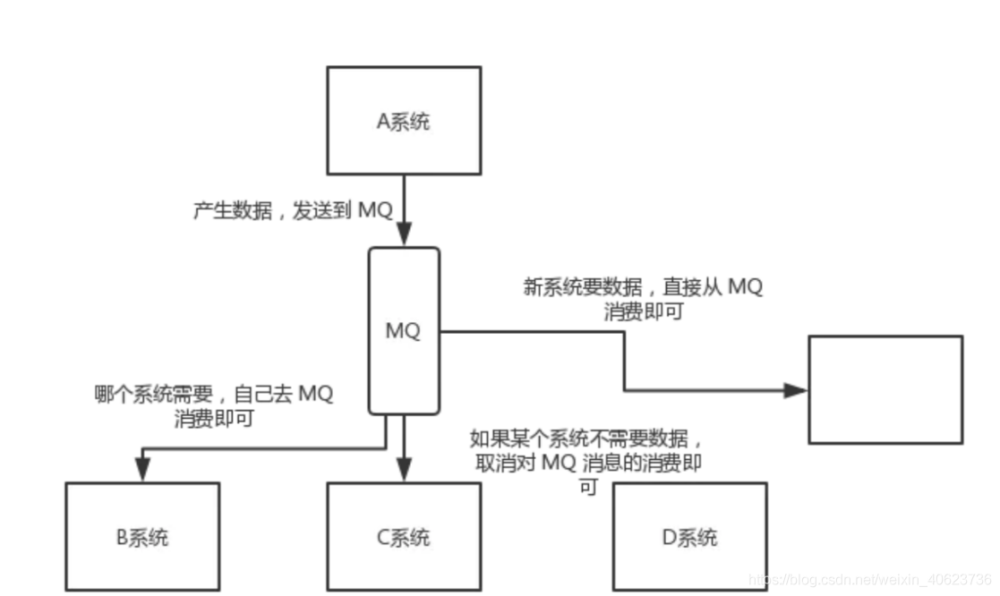

# java常用的消息队列 看完这篇你就懂了

[java常用的消息队列 看完这篇你就懂了](https://blog.csdn.net/weixin_40623736/article/details/108566965?ops_request_misc=%257B%2522request%255Fid%2522%253A%2522164689261516780357214417%2522%252C%2522scm%2522%253A%252220140713.130102334.pc%255Fall.%2522%257D&request_id=164689261516780357214417&biz_id=0&utm_medium=distribute.pc_search_result.none-task-blog-2~all~first_rank_ecpm_v1~rank_v31_ecpm-1-108566965.pc_search_result_control_group&utm_term=java+%E6%B6%88%E6%81%AF%E9%98%9F%E5%88%97%E9%80%89%E5%93%AA%E4%B8%AA&spm=1018.2226.3001.4187)                                            

## **为什么使用消息队列 ？**

**使用场景**
 消息队列的使用场景其实有很多，但是比较核心的有 3 个：**解耦、异步、削峰**

## **解耦**

看这么个场景。A 系统发送数据到 BCD 三个系统，通过接口调用发送。如果 E 系统也要这个数据呢？那如果 C 系统现在不需要了呢？A 系统负责人几乎崩溃…

在这个场景中，A 系统跟其它各种乱七八糟的系统严重耦合，A 系统产生一条比较关键的数据，很多系统都需要 A 系统将这个数据发送过来。A 系统要时时刻刻考虑 BCDE 四个系统如果挂了该咋办？要不要重发，要不要把消息存起来？头发都白了啊！
 如果使用 MQ，A 系统产生一条数据，发送到 MQ 里面去，哪个系统需要数据自己去 MQ 里面消费。如果新系统需要数据，直接从 MQ 里消费即可；如果某个系统不需要这条数据了，就取消对 MQ 消息的消费即可。这样下来，A 系统压根儿不需要去考虑要给谁发送数据，不需要维护这个代码，也不需要考虑人家是否调用成功、失败超时等情况。

**总结**：通过一个 MQ，Pub/Sub 发布订阅消息这么一个模型，A 系统就跟其它系统彻底解耦了。

## **异步**

再来看一个场景，A 系统接收一个请求，需要在自己本地写库，还需要在 BCD 三个系统写库，自己本地写库要 3ms，BCD 三个系统分别写库要 300ms、450ms、200ms。最终请求总延时是 3 + 300 + 450 + 200 = 953ms，接近 1s，用户感觉搞个什么东西，慢死了慢死了。用户通过浏览器发起请求，等待个 1s，这几乎是不可接受的。

一般互联网类的企业，对于用户直接的操作，一般要求是每个请求都必须在 200 ms 以内完成，对用户几乎是无感知的。
 如果使用 MQ，那么 A 系统连续发送 3 条消息到 MQ 队列中，假如耗时 5ms，A 系统从接受一个请求到返回响应给用户，总时长是 3 + 5 = 8ms，对于用户而言，其实感觉上就是点个按钮，8ms 以后就直接返回了，爽！网站做得真好，真快！。

## **削峰**

每天 0:00 到 12:00，A 系统风平浪静，每秒并发请求数量就 50 个。结果每次一到 12:00 ~ 13:00 ，每秒并发请求数量突然会暴增到 5k+ 条。但是系统是直接基于 MySQL的，大量的请求涌入 MySQL，每秒钟对 MySQL 执行约 5k 条 SQL。
 一般的 MySQL，扛到每秒 2k 个请求就差不多了，如果每秒请求到 5k 的话，可能就直接把 MySQL 给打死了，导致系统崩溃，用户也就没法再使用系统了。
 但是高峰期一过，到了下午的时候，就成了低峰期，可能也就 1w 的用户同时在网站上操作，每秒中的请求数量可能也就 50 个请求，对整个系统几乎没有任何的压力。

如果使用 MQ，每秒 5k 个请求写入 MQ，A 系统每秒钟最多处理 2k 个请求，因为 MySQL 每秒钟最多处理 2k 个。A 系统从 MQ 中慢慢拉取请求，每秒钟就拉取 2k 个请求，不要超过自己每秒能处理的最大请求数量就 ok，这样下来，哪怕是高峰期的时候，A 系统也绝对不会挂掉。而 MQ 每秒钟 5k 个请求进来，就 2k 个请求出去，结果就导致在中午高峰期（1 个小时），可能有几十万甚至几百万的请求积压在 MQ 中。

这个短暂的高峰期积压是 ok 的，因为高峰期过了之后，每秒钟就 50 个请求进 MQ，但是 A 系统依然会按照每秒 2k 个请求的速度在处理。所以说，只要高峰期一过，A 系统就会快速将积压的消息给解决掉。

## **消息队列有什么优缺点**

**优点**
 优点上面已经说了，就是在特殊场景下有其对应的好处，解耦、异步、削峰。

## **缺点**

**系统可用性降低**

系统引入的外部依赖越多，越容易挂掉。本来你就是 A 系统调用 BCD 三个系统的接口就好了，人 ABCD 四个系统好好的，没啥问题，你偏加个 MQ 进来，万一 MQ 挂了咋整，MQ 一挂，整套系统崩溃的，你不就完了？

**系统复杂度提高**

硬生生加个 MQ 进来，你怎么保证消息没有重复消费？怎么处理消息丢失的情况？怎么保证消息传递的顺序性？头大头大，问题一大堆，痛苦不已。

**一致性问题**

A 系统处理完了直接返回成功了，别人都以为你这个请求就成功了；但是问题是，要是 BCD 三个系统那里，BD 两个系统写库成功了，结果 C 系统写库失败了，咋整？你这数据就不一致了。

所以消息队列实际是一种非常复杂的架构，你引入它有很多好处，但是也得针对它带来的坏处做各种额外的技术方案和架构来规避掉，做好之后，你会发现，妈呀，系统复杂度提升了一个数量级，也许是复杂了 10 倍。但是关键时刻，用，还是得用的。

## **Kafka、ActiveMQ、RabbitMQ、RocketMQ 有什么优缺点？**

## **1.ActiveMQ**

**优点：**
 单机吞吐量：万级
 topic数量都吞吐量的影响：
 时效性：ms级
 可用性：高，基于主从架构实现高可用性
 消息可靠性：有较低的概率丢失数据
 功能支持：MQ领域的功能极其完备
 **缺点:**
 官方社区现在对ActiveMQ 5.x维护越来越少，较少在大规模吞吐的场景中使用。

## **2.RabbitMQ**

RabbitMQ 2007年发布，是一个在AMQP(高级消息队列协议)基础上完成的，可复用的企业消息系统，是当前最主流的消息中间件之一。
 **优点：**
 由于erlang语言的特性，mq 性能较好，高并发；
 吞吐量到万级，MQ功能比较完备
 健壮、稳定、易用、跨平台、支持多种语言、文档齐全；
 开源提供的管理界面非常棒，用起来很好用
 社区活跃度高；
 **缺点：**
 erlang开发，很难去看懂源码，基本职能依赖于开源社区的快速维护和修复bug，不利于做二次开发和维护。
 RabbitMQ确实吞吐量会低一些，这是因为他做的实现机制比较重。
 需要学习比较复杂的接口和协议，学习和维护成本较高。

## **3.RocketMQ**

RocketMQ出自 阿里公司的开源产品，用 Java 语言实现，在设计时参考了 Kafka，并做出了自己的一些改进。
 RocketMQ在阿里集团被广泛应用在订单，交易，充值，流计算，消息推送，日志流式处理，binglog分发等场景。
 **优点：**
 单机吞吐量：十万级
 可用性：非常高，分布式架构
 消息可靠性：经过参数优化配置，消息可以做到0丢失
 功能支持：MQ功能较为完善，还是分布式的，扩展性好
 支持10亿级别的消息堆积，不会因为堆积导致性能下降
 源码是java，我们可以自己阅读源码，定制自己公司的MQ，可以掌控
 **缺点：**
 支持的客户端语言不多，目前是java及c++，其中c++不成熟；
 社区活跃度一般
 没有在 mq 核心中去实现JMS等接口，有些系统要迁移需要修改大量代码

## **4.Kafka**

号称大数据的杀手锏，谈到大数据领域内的消息传输，则绕不开Kafka，这款为大数据而生的消息中间件，以其百万级TPS的吞吐量名声大噪，迅速成为大数据领域的宠儿，在数据采集、传输、存储的过程中发挥着举足轻重的作用。
 Apache Kafka它最初由LinkedIn公司基于独特的设计实现为一个分布式的提交日志系统( a distributed commit log)，之后成为Apache项目的一部分。
 目前已经被LinkedIn，Uber, Twitter, Netflix等大公司所采纳。
 **优点：**
 性能卓越，单机写入TPS约在百万条/秒，最大的优点，就是吞吐量高。
 时效性：ms级
 可用性：非常高，kafka是分布式的，一个数据多个副本，少数机器宕机，不会丢失数据，不会导致不可用
 消费者采用Pull方式获取消息, 消息有序, 通过控制能够保证所有消息被消费且仅被消费一次;
 有优秀的第三方Kafka Web管理界面Kafka-Manager；
 在日志领域比较成熟，被多家公司和多个开源项目使用；
 功能支持：功能较为简单，主要支持简单的MQ功能，在大数据领域的实时计算以及日志采集被大规模使用
 **缺点：**
 Kafka单机超过64个队列/分区，Load会发生明显的飙高现象，队列越多，load越高，发送消息响应时间变长
 使用短轮询方式，实时性取决于轮询间隔时间；
 消费失败不支持重试；
 支持消息顺序，但是一台代理宕机后，就会产生消息乱序；
 社区更新较慢；

## **消息队列选择建议**

**1.Kafka**
 Kafka主要特点是基于Pull的模式来处理消息消费，追求高吞吐量，一开始的目的就是用于日志收集和传输，适合产生大量数据的互联网服务的数据收集业务。
 大型公司建议可以选用，如果有日志采集功能，肯定是首选kafka了。
 如果是大数据领域的实时计算、日志采集等场景，用 Kafka 是业内标准的，绝对没问题，社区活跃度很高，绝对不会黄，何况几乎是全世界这个领域的事实性规范。

**2.RocketMQ**
 天生为金融互联网领域而生，对于可靠性要求很高的场景，尤其是电商里面的订单扣款，以及业务削峰，在大量交易涌入时，后端可能无法及时处理的情况。
 RoketMQ在稳定性上可能更值得信赖，这些业务场景在阿里双11已经经历了多次考验，如果你的业务有上述并发场景，建议可以选择RocketMQ。
 不过现在确实越来越多的公司，会去用 RocketMQ，确实很不错（阿里出品），但社区可能有突然黄掉的风险，对自己公司技术实力有绝对自信的，推荐用 RocketMQ，否则回去老老实实用 RabbitMQ 吧，人家有活跃的开源社区，绝对不会黄。

**3.RabbitMQ**
 RabbitMQ :结合erlang语言本身的并发优势，性能较好，社区活跃度也比较高，但是不利于做二次开发和维护。不过，RabbitMQ的社区十分活跃，可以解决开发过程中遇到的bug。
 如果你的数据量没有那么大，小公司优先选择功能比较完备的RabbitMQ。
 所以中小型公司，技术实力较为一般，技术挑战不是特别高，用 RabbitMQ 是不错的选择；大型公司，基础架构研发实力较强，用 RocketMQ 是很好的选择。

参考：
 https://www.jianshu.com/p/e2605551c605
 https://blog.csdn.net/u011663149/article/details/86232869