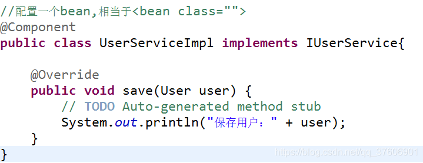
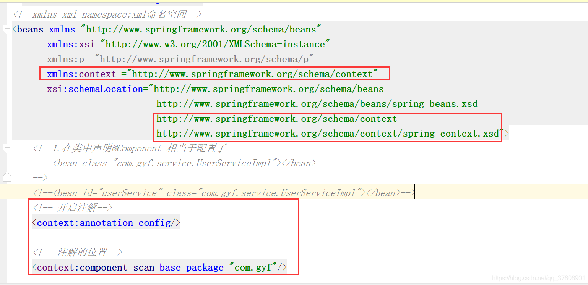
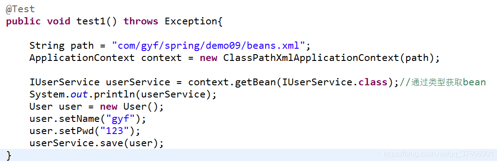
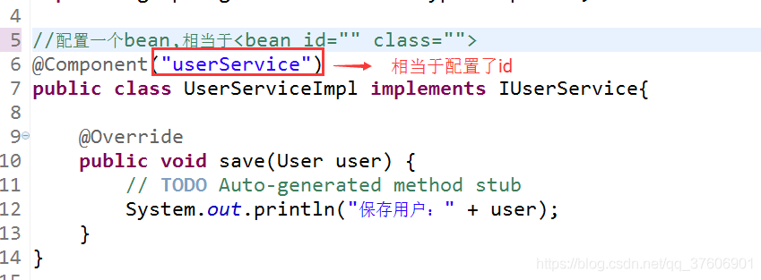
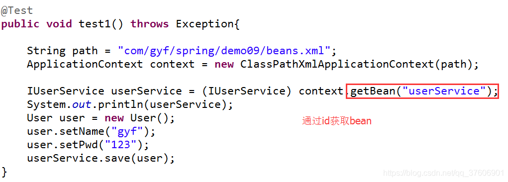

# Spring中@component的使用

@component是spring中的一个注解，它的作用就是实现bean的注入，在探究@component前先了解一下注解？何为注解？注解本质上就是一个类，开发中我们可以使用注解 取代 xml配置文件。

web开发，提供3个@Component注解衍生注解（功能一样）取代
@Repository(“名称”)：dao层
@Service(“名称”)：service层
@Controller(“名称”)：web层

@Autowired：自动根据类型注入
@Qualifier(“名称”):指定自动注入的id名称

@Resource(“名称”)
@ PostConstruct 自定义初始化
@ PreDestroy 自定义销毁

下面直接看具体例子：

（2）案例二

