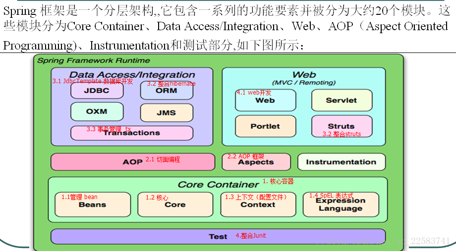
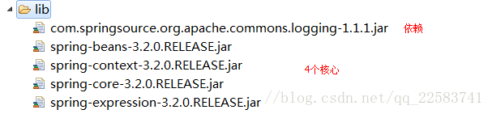
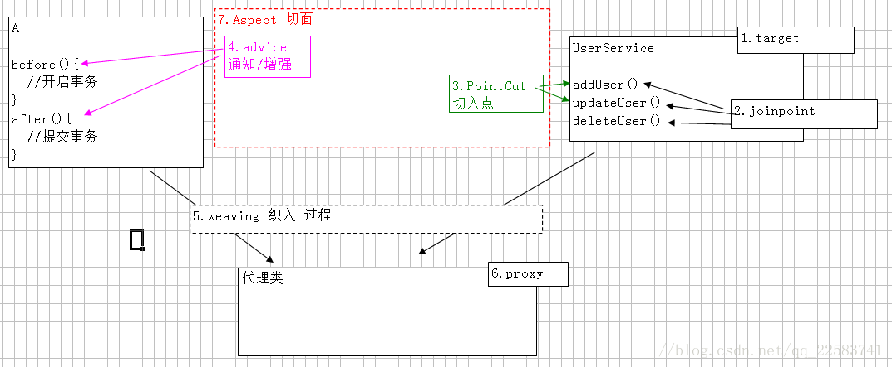

[toc]

# Spring框架介绍及使用

# Spring框架—控制反转（IOC）

### 1 Spring框架概述

##### 1.1 什么是Spring

Spring是一个开源框架，Spring是于2003 年兴起的一个轻量级的Java 开发框架，由Rod Johnson 在其著作Expert One-On-One J2EE Development and Design中阐述的部分理念和原型衍生而来。它是为了解决企业应用开发的复杂性而创建的。框架的主要优势之一就是其分层架构，分层架构允许使用者选择使用哪一个组件，同时为 J2EE 应用程序开发提供集成的框架。Spring使用基本的JavaBean来完成以前只可能由EJB完成的事情。然而，Spring的用途不仅限于服务器端的开发。从简单性、可测试性和松耦合的角度而言，任何Java应用都可以从Spring中受益。Spring的核心是控制反转（IoC）和面向切面（AOP）。简单来说，Spring是一个分层的JavaSE/EE full-stack(一站式) 轻量级开源框架。

##### 1.2 Spring的优点

- 方便解耦，简化开发 （高内聚低耦合）

Spring就是一个大工厂（容器），可以将所有对象创建和依赖关系维护，交给Spring管理

spring工厂是用于生成bean

- AOP编程的支持

Spring提供面向切面编程，可以方便的实现对程序进行权限拦截、运行监控等功能

- 声明式事务的支持

只需要通过配置就可以完成对事务的管理，而无需手动编程

- 方便程序的测试

Spring对Junit4支持，可以通过注解方便的测试Spring程序

- 方便集成各种优秀框架

Spring不排斥各种优秀的开源框架，其内部提供了对各种优秀框架（如：Struts、Hibernate、MyBatis、Quartz等）的直接支持

- 降低JavaEE API的使用难度

Spring 对JavaEE开发中非常难用的一些API（JDBC、JavaMail、远程调用等），都提供了封装，使这些API应用难度大大降低

##### 1.3 Spring的体系结构



### 2 入门案例:（IoC）

##### 2.1导入jar包

 




##### 2.2目标类

- 提供UserService接口和实现类
- 获得UserService实现类的实例

之前开发中，直接new一个对象即可。学习spring之后，将由Spring创建对象实例–> IoC 控制反转（Inverse of Control）

之后需要实例对象时，从spring工厂（容器）中获得，需要将实现类的全限定名称配置到xml文件中

```java
public interface UserService {
	public void addUser();
}
public class UserServiceImpl implements UserService {
	@Override
	public void addUser() {
		System.out.println("a_ico add user");
	}
}
```

##### 2.3 配置文件

- 位置：任意，开发中一般在classpath下（src）
- 名称：任意，开发中常用applicationContext.xml
- 内容：添加schema约束

约束文件位置：spring-framework-3.2.0.RELEASE\docs\spring-framework-reference\html\ xsd-config.html

```xml
<?xml version="1.0" encoding="UTF-8"?>
<beans xmlns="http://www.springframework.org/schema/beans"
       xmlns:xsi="http://www.w3.org/2001/XMLSchema-instance"
       xsi:schemaLocation="http://www.springframework.org/schema/beans 
       					   http://www.springframework.org/schema/beans/spring-beans.xsd">
	<!-- 配置service 
		<bean> 配置需要创建的对象
			id ：用于之后从spring容器获得实例时使用的
			class ：需要创建实例的全限定类名
	-->
	<bean id="userServiceId" class="com.itheima.a_ioc.UserServiceImpl"></bean>
</beans>
```

##### 2.4测试

```java
@Test
public void demo02(){
  //从spring容器获得
  //1 获得容器
  String xmlPath = "com/itheima/a_ioc/beans.xml";
  ApplicationContext applicationContext = new ClassPathXmlApplicationContext(xmlPath);
  //2获得内容 --不需要自己new，都是从spring容器获得
  UserService userService = (UserService) applicationContext.getBean("userServiceId");
  userService.addUser();	
}
```

### 3 入门案例：DI

```java
class BookServiceImpl{
    //之前开发：接口 = 实现类  （service和dao耦合）
	//private BookDao bookDao = new BookDaoImpl();
	//spring之后 （解耦：service实现类使用dao接口，不知道具体的实现类）
	private BookDao bookDao;
	setter方法
```

模拟spring执行过程
创建service实例：BookService bookService = new BookServiceImpl() -->IoC
创建dao实例：BookDao bookDao = new BookDaoImple() -->IoC
将dao设置给service：bookService.setBookDao(bookDao); -->DI

##### 3.1 目标类

##### 3.2 Dao

~~~java
##### 3.1 目标类
- 创建BookService接口和实现类
- 创建BookDao接口和实现类
- 将dao和service配置 xml文件
- 使用api测试
##### 3.2 dao
```java
public interface BookDao {
  public void save();
}
public class BookDaoImpl implements BookDao {

  @Override
  public void save() {
  	System.out.println("di  add book");
  }
}
~~~

##### 3.3 service

```java
public interface BookService {

	public abstract void addBook();

}
public class BookServiceImpl implements BookService {
	
	// 方式1：之前，接口=实现类
//	private BookDao bookDao = new BookDaoImpl();
	// 方式2：接口 + setter
	private BookDao bookDao;
	public void setBookDao(BookDao bookDao) {
		this.bookDao = bookDao;
	}
	
	@Override
	public void addBook(){
		this.bookDao.save();
	}

}
```

##### 3.4 配置文件

```xml
<beans xmlns="http://www.springframework.org/schema/beans"
       xmlns:xsi="http://www.w3.org/2001/XMLSchema-instance"
       xsi:schemaLocation="http://www.springframework.org/schema/beans 
       					   http://www.springframework.org/schema/beans/spring-beans.xsd">
	<!-- 
	模拟spring执行过程
		创建service实例：BookService bookService = new BookServiceImpl()	IoC  <bean>
		创建dao实例：BookDao bookDao = new BookDaoImpl()			IoC
		将dao设置给service：bookService.setBookDao(bookDao);		DI   <property>
		
		<property> 用于进行属性注入
			name： bean的属性名，通过setter方法获得
				setBookDao ##> BookDao  ##> bookDao
			ref ：另一个bean的id值的引用
	 -->

	<!-- 创建service -->
	<bean id="bookServiceId" class="com.itheima.b_di.BookServiceImpl">
		<property name="bookDao" ref="bookDaoId"></property>
	</bean>
	
	<!-- 创建dao实例 -->
	<bean id="bookDaoId" class="com.itheima.b_di.BookDaoImpl"></bean>

</beans>
```

##### 3.5 测试

```java
@Test
public void demo01(){
  //从spring容器获得
  String xmlPath = "com/itheima/b_di/beans.xml";
  ApplicationContext applicationContext = new ClassPathXmlApplicationContext(xmlPath);
  BookService bookService = (BookService) applicationContext.getBean("bookServiceId");	
  bookService.addBook();
}
```

### 4 依赖注入装配Bean 基于xml

##### 4.1属性依赖注入

- 依赖注入方式：手动装配 和 自动装配
  - 手动装配：一般进行配置信息都采用手动
    基于xml装配：构造方法、setter方法
  - 基于注解装配：

###### 4.1.1 构造方法

目标类

```java
public class User {

  private Integer uid;
  private String username;
  private Integer age;

  public User(Integer uid, String username) {
    super();
    this.uid = uid;
    this.username = username;
  }

  public User(String username, Integer age) {
    super();
    this.username = username;
    this.age = age;
  }
```

spring配置

```xml
<!-- 构造方法注入 
  * <constructor-arg> 用于配置构造方法一个参数argument
   name ：参数的名称
   value：设置普通数据
   ref：引用数据，一般是另一个bean id值

   index ：参数的索引号，从0开始 。如果只有索引，匹配到了多个构造方法时，默认使用第一个。
   type ：确定参数类型
  例如：使用名称name
   <constructor-arg name="username" value="jack"></constructor-arg>
   <constructor-arg name="age" value="18"></constructor-arg>
  例如2：【类型type 和  索引 index】
   <constructor-arg index="0" type="java.lang.String" value="1"></constructor-arg>
   <constructor-arg index="1" type="java.lang.Integer" value="2"></constructor-arg>
 -->
<bean id="userId" class="com.itheima.f_xml.a_constructor.User" >
  <constructor-arg index="0" type="java.lang.String" value="1"></constructor-arg>
  <constructor-arg index="1" type="java.lang.Integer" value="2"></constructor-arg>
</bean>
```

###### 4.1.2 setter方法

```xml
<!-- setter方法注入 
  * 普通数据 
   <property name="" value="值">
   等效
   <property name="">
    <value>值
  * 引用数据
   <property name="" ref="另一个bean">
   等效
   <property name="">
    <ref bean="另一个bean"/>

 -->
<bean id="personId" class="com.itheima.f_xml.b_setter.Person">
  <property name="pname" value="阳志"></property>
  <property name="age">
    <value>1234</value>
  </property>

  <property name="homeAddr" ref="homeAddrId"></property>
  <property name="companyAddr">
    <ref bean="companyAddrId"/>
  </property>
</bean>

<bean id="homeAddrId" class="com.itheima.f_xml.b_setter.Address">
  <property name="addr" value="阜南"></property>
  <property name="tel" value="911"></property>
</bean>
<bean id="companyAddrId" class="com.itheima.f_xml.b_setter.Address">
  <property name="addr" value="北京八宝山"></property>
  <property name="tel" value="120"></property>
</bean>
```

##### 4.2 集合依赖注入

```xml
<!-- 
  集合的注入都是给<property>添加子标签
   数组：<array>
   List：<list>
   Set：<set>
   Map：<map> ，map存放k/v 键值对，使用<entry>描述
   Properties：<props>  <prop key=""></prop>  【】

  普通数据：<value>
  引用数据：<ref>
 -->
<bean id="collDataId" class="com.itheima.f_xml.e_coll.CollData" >
  <property name="arrayData">
    <array>
      <value>DS</value>
      <value>DZD</value>
      <value>屌丝</value>
      <value>屌中屌</value>
    </array>
  </property>

  <property name="listData">
    <list>
      <value>于嵩楠</value>
      <value>曾卫</value>
      <value>杨煜</value>
      <value>曾小贤</value>
    </list>
  </property>

  <property name="setData">
    <set>
      <value>停封</value>
      <value>薄纸</value>
      <value>关系</value>
    </set>
  </property>

  <property name="mapData">
    <map>
      <entry key="jack" value="杰克"></entry>
      <entry>
        <key><value>rose</value></key>
        <value>肉丝</value>
      </entry>
    </map>
  </property>

  <property name="propsData">
    <props>
      <prop key="高富帅">嫐</prop>
      <prop key="白富美">嬲</prop>
      <prop key="男屌丝">挊</prop>
    </props>
  </property>
</bean>
```

### 5 依赖注入装配Bean 基于注解

- 注解：就是一个类，使用@注解名称

- 开发中：使用注解 取代 xml配置文件。

  1. @Component取代<bean class="">
     1. @Component("id") 取代 <bean id="" class="">
  2. web开发，提供3个@Component注解衍生注解（功能一样）取代
     1. @Repository ：dao层
     2. @Service：service层
     3. @Controller：web层

  3. 依赖注入，给私有字段设值，也可以给setter方法设值

     1. 普通值：@Value(" ")

     2. 引用值：

       方式1：按照【类型】注入 @Autowired 

       方式2：按照【名称】注入1 @Autowired @Qualifier("名称") 

       方式3：按照【名称】注入2 @Resource("名称")

  4. 生命周期

     初始化：@PostConstruct 销毁：@PreDestroy

  5. 作用域
    @Scope("prototype") 多例
    注解使用前提，添加命名空间，让spring扫描含有注解类

```xml

<beans xmlns="http://www.springframework.org/schema/beans"
   xmlns:xsi="http://www.w3.org/2001/XMLSchema-instance"
   xmlns:context="http://www.springframework.org/schema/context"
   xsi:schemaLocation="http://www.springframework.org/schema/beans 
   					   http://www.springframework.org/schema/beans/spring-beans.xsd
   					   http://www.springframework.org/schema/context 
   					   http://www.springframework.org/schema/context/spring-context.xsd">
<!-- 组件扫描，扫描含有注解的类 -->
<context:component-scan base-package="com.itheima.g_annotation.a_ioc"></context:component-scan>
```

# Spring框架—面向切面编程（AOP）

### 1 什么是AOP

- 在软件业，AOP为Aspect Oriented Programming的缩写，意为：面向切面编程，通过预编译方式和运行期动态代理实现程序功能的统一维护的一种技术。AOP是OOP（面向对象编程）的延续，是软件开发中的一个热点，也是Spring框架中的一个重要内容，是函数式编程的一种衍生范型。利用AOP可以对业务逻辑的各个部分进行隔离，从而使得业务逻辑各部分之间的耦合度降低，提高程序的可重用性，同时提高了开发的效率。

- AOP采取横向抽取机制，取代了传统纵向继承体系重复性代码

- 经典应用：事务管理、性能监视、安全检查、缓存 、日志等

- Spring AOP使用纯Java实现，不需要专门的编译过程和类加载器，在运行期通过代理方式向目标类织入增强代码

  AspectJ是一个基于Java语言的AOP框架，Spring2.0开始，Spring AOP引入对Aspect的支持，AspectJ扩展了Java语言，提供了一个专

  门的编译器，在编译时提供横向代码的织入

### 2 AOP实现原理

- aop底层将采用代理机制进行实现。
- 接口 + 实现类 ：spring采用 jdk 的动态代理Proxy。
- 实现类：spring 采用 cglib字节码增强。

### 3 AOP术语【掌握】

1.target：目标类，需要被代理的类。例如：UserService

2.Joinpoint(连接点):所谓连接点是指那些可能被拦截到的方法。例如：所有的方法

3.PointCut 切入点：已经被增强的连接点。例如：addUser()

4.advice 通知/增强，增强代码。例如：after、before

5.Weaving(织入):是指把增强advice应用到目标对象target来创建新的代理对象proxy的过程.
6.proxy 代理类

7.Aspect(切面): 是切入点pointcut和通知advice的结合

一个线是一个特殊的面。

一个切入点和一个通知，组成成一个特殊的面。


### 4 AOP实现方式

#### 4.1手动方式

###### 4.1.1JDK动态代理

- JDK动态代理 对“装饰者”设计模式 简化。使用前提：必须有接口

1.目标类：接口 + 实现类

```java
public interface UserService {
	public void addUser();
	public void updateUser();
	public void deleteUser();
}
```

2.切面类：用于存通知 MyAspect

```java
public class MyAspect {	
	public void before(){
		System.out.println("鸡首");
	}	
	public void after(){
		System.out.println("牛后");
	}
}
```

3.工厂类：编写工厂生成代理

```java
public class MyBeanFactory {

  public static UserService createService(){
    //1 目标类
    final UserService userService = new UserServiceImpl();
    //2切面类
    final MyAspect myAspect = new MyAspect();
    /* 3 代理类：将目标类（切入点）和 切面类（通知） 结合 --> 切面
		 * 	Proxy.newProxyInstance
		 * 		参数1：loader ，类加载器，动态代理类 运行时创建，任何类都需要类加载器将其加载到内存。
		 * 			一般情况：当前类.class.getClassLoader();
		 * 					目标类实例.getClass().get...
		 * 		参数2：Class[] interfaces 代理类需要实现的所有接口
		 * 			方式1：目标类实例.getClass().getInterfaces()  ;注意：只能获得自己接口，不能获得父元素接口
		 * 			方式2：new Class[]{UserService.class}   
		 * 			例如：jdbc 驱动  --> DriverManager  获得接口 Connection
		 * 		参数3：InvocationHandler  处理类，接口，必须进行实现类，一般采用匿名内部
		 * 			提供 invoke 方法，代理类的每一个方法执行时，都将调用一次invoke
		 * 				参数31：Object proxy ：代理对象
		 * 				参数32：Method method : 代理对象当前执行的方法的描述对象（反射）
		 * 					执行方法名：method.getName()
		 * 					执行方法：method.invoke(对象，实际参数)
		 * 				参数33：Object[] args :方法实际参数
		 * 
		 */
    UserService proxService = (UserService)Proxy.newProxyInstance(
      MyBeanFactory.class.getClassLoader(), 
      userService.getClass().getInterfaces(), 
      new InvocationHandler() {

        @Override
        public Object invoke(Object proxy, Method method, Object[] args) throws Throwable {

          //前执行
          myAspect.before();

          //执行目标类的方法
          Object obj = method.invoke(userService, args);

          //后执行
          myAspect.after();

          return obj;
        }
      });

    return proxService;
  }

}
```

4.测试

```java
@Test
public void demo01(){
  UserService userService = MyBeanFactory.createService();
  userService.addUser();
  userService.updateUser();
  userService.deleteUser();
}
```

###### 4.1.2 CGLIB字节码增强

- 没有接口，只有实现类。
- 采用字节码增强框架 cglib，在运行时 创建目标类的子类，从而对目标类进行增强。

工厂类

```java
public class MyBeanFactory {
	
	public static UserServiceImpl createService(){
		//1 目标类
		final UserServiceImpl userService = new UserServiceImpl();
		//2切面类
		final MyAspect myAspect = new MyAspect();
		// 3.代理类 ，采用cglib，底层创建目标类的子类
		//3.1 核心类
		Enhancer enhancer = new Enhancer();
		//3.2 确定父类
		enhancer.setSuperclass(userService.getClass());
		/* 3.3 设置回调函数 , MethodInterceptor接口 等效 jdk InvocationHandler接口
		 * 	intercept() 等效 jdk  invoke()
		 * 		参数1、参数2、参数3：以invoke一样
		 * 		参数4：methodProxy 方法的代理
		 * 		
		 * 
		 */
		enhancer.setCallback(new MethodInterceptor(){

			@Override
			public Object intercept(Object proxy, Method method, Object[] args, MethodProxy methodProxy) throws Throwable {
				
				//前
				myAspect.before();
				
				//执行目标类的方法
				Object obj = method.invoke(userService, args);
				// * 执行代理类的父类 ，执行目标类 （目标类和代理类 父子关系）
				methodProxy.invokeSuper(proxy, args);
				
				//后
				myAspect.after();
				
				return obj;
			}
		});
		//3.4 创建代理
		UserServiceImpl proxService = (UserServiceImpl) enhancer.create();
		
		return proxService;
	}

}
```

#### 4.2半自动

- 让spring 创建代理对象，从spring容器中手动的获取代理对象

##### 4.2.1目标类

```java
public interface UserService {
	public void addUser();
	public void updateUser();
	public void deleteUser();
}
```

##### 4.2.2切面类

```java
/**
 * 切面类中确定通知，需要实现不同接口，接口就是规范，从而就确定方法名称。
 * * 采用“环绕通知” MethodInterceptor
 *
 */
public class MyAspect implements MethodInterceptor {

	@Override
	public Object invoke(MethodInvocation mi) throws Throwable {
		
		System.out.println("前3");
		
		//手动执行目标方法
		Object obj = mi.proceed();
		
		System.out.println("后3");
		return obj;
	}
}
```

##### 4.2.3Spring 配置

```xml
<!-- 1 创建目标类 -->
<bean id="userServiceId" class="com.itheima.b_factory_bean.UserServiceImpl"></bean>
<!-- 2 创建切面类 -->
<bean id="myAspectId" class="com.itheima.b_factory_bean.MyAspect"></bean>

<!-- 3 创建代理类 
  * 使用工厂bean FactoryBean ，底层调用 getObject() 返回特殊bean
  * ProxyFactoryBean 用于创建代理工厂bean，生成特殊代理对象
   interfaces : 确定接口们
    通过<array>可以设置多个值
    只有一个值时，value=""
   target : 确定目标类
   interceptorNames : 通知 切面类的名称，类型String[]，如果设置一个值 value=""
   optimize :强制使用cglib
    <property name="optimize" value="true"></property>
  底层机制
   如果目标类有接口，采用jdk动态代理
   如果没有接口，采用cglib 字节码增强
   如果声明 optimize = true ，无论是否有接口，都采用cglib

 -->
<bean id="proxyServiceId" class="org.springframework.aop.framework.ProxyFactoryBean">
  <property name="interfaces" value="com.itheima.b_factory_bean.UserService"></property>
  <property name="target" ref="userServiceId"></property>
  <property name="interceptorNames" value="myAspectId"></property>
</bean>
```

##### 4.2.4 测试

```java
@Test
public void demo01(){
  String xmlPath = "com/itheima/b_factory_bean/beans.xml";
  ApplicationContext applicationContext = new ClassPathXmlApplicationContext(xmlPath);

  //获得代理类
  UserService userService = (UserService) applicationContext.getBean("proxyServiceId");
  userService.addUser();
  userService.updateUser();
  userService.deleteUser();
}
```

#### 4.3全自动

- 从spring容器获得目标类，如果配置aop，spring将自动生成代理。

##### 4.3.1 Spring配置

```xml
<?xml version="1.0" encoding="UTF-8"?>
<beans xmlns="http://www.springframework.org/schema/beans"
       xmlns:xsi="http://www.w3.org/2001/XMLSchema-instance"
       xmlns:aop="http://www.springframework.org/schema/aop"
       xsi:schemaLocation="http://www.springframework.org/schema/beans 
       					   http://www.springframework.org/schema/beans/spring-beans.xsd
       					   http://www.springframework.org/schema/aop 
       					   http://www.springframework.org/schema/aop/spring-aop.xsd">
	<!-- 1 创建目标类 -->
	<bean id="userServiceId" class="com.itheima.c_spring_aop.UserServiceImpl"></bean>
	<!-- 2 创建切面类（通知） -->
	<bean id="myAspectId" class="com.itheima.c_spring_aop.MyAspect"></bean>
	<!-- 3 aop编程 
		3.1 导入命名空间
		3.2 使用 <aop:config>进行配置
				proxy-target-class="true" 声明时使用cglib代理
			<aop:pointcut> 切入点 ，从目标对象获得具体方法
			<aop:advisor> 特殊的切面，只有一个通知 和 一个切入点
				advice-ref 通知引用
				pointcut-ref 切入点引用
		3.3 切入点表达式
			execution(* com.itheima.c_spring_aop.*.*(..))
			选择方法         返回值任意   包             类名任意   方法名任意   参数任意
		
	-->
	<aop:config proxy-target-class="true">
		<aop:pointcut expression="execution(* com.itheima.c_spring_aop.*.*(..))" id="myPointCut"/>
		<aop:advisor advice-ref="myAspectId" pointcut-ref="myPointCut"/>
	</aop:config>
</beans>

```

##### 4.3.2 测试

```java
@Test
public void demo01(){
  String xmlPath = "com/itheima/c_spring_aop/beans.xml";
  ApplicationContext applicationContext = new ClassPathXmlApplicationContext(xmlPath);

  //获得目标类
  UserService userService = (UserService) applicationContext.getBean("userServiceId");
  userService.addUser();
  userService.updateUser();
  userService.deleteUser();
}
```

