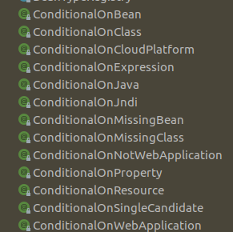
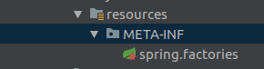
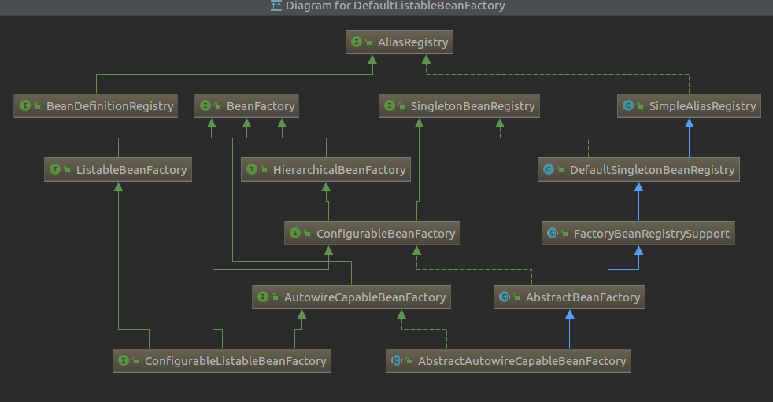

# bean创建的六种方式

原文链接：

[spring创建Bean的六种方式](https://www.cnblogs.com/lgjlife/p/11060570.html)

## 前言

本文讲解了在Spring 应用中创建Bean的多种方式，包括自动创建，以及手动创建注入方式，实际开发中可以根据业务场景选择合适的方案。

## 方式1：

使用Spring XML方式配置，该方式用于在纯Spring 应用中，适用于简单的小应用，当应用变得复杂，将会导致XMl配置文件膨胀 ，不利于对象管理。

```
<bean id="xxxx"  class="xxxx.xxxx"/>
```

## 方式2：

使用@Component,@Service,@Controler,@Repository注解

这几个注解都是同样的功能，被注解的类将会被Spring 容器创建单例对象。

@Component : 侧重于通用的Bean类

@Service：标识该类用于业务逻辑

@Controler：标识该类为Spring MVC的控制器类

@Repository: 标识该类是一个实体类，只有属性和Setter,Getter

```
@Component
public class User{
}
```

当用于Spring Boot应用时，被注解的类必须在启动类的根路径或者子路径下，否则不会生效。

如果不在，可以使用@ComponentScan标注扫描的路径。

spring xml 也有相关的标签<component-scan />

```
@ComponentScan(value={"com.microblog.blog","com.microblog.common"})
public class MicroblogBlogApplication {
    public static void main(String args[]){
        SpringApplication.run(MicroblogBlogApplication.class,args);
    }
}
```

 

## 方式3：

使用@Bean注解,这种方式用在Spring Boot 应用中。

@Configuration 标识这是一个Spring Boot 配置类，其将会扫描该类中是否存在@Bean 注解的方法，比如如下代码，将会创建User对象并放入容器中。

@ConditionalOnBean 用于判断存在某个Bean时才会创建User Bean.

这里创建的Bean名称默认为方法的名称user。也可以@Bean("xxxx")定义。


```
@Configuration
public class UserConfiguration{
     
      @Bean
　　　 @ConditionalOnBean(Location.class)
      public User user(){
           return new User();
      }
      
}    
```


 

Spring boot 还为我们提供了更多类似的注解。



也和方式2一样，也会存在扫描路径的问题，除了以上的解决方式，还有使用Spring boot starter 的解决方式

在resources下创建如下文件。META-INF/spring.factories.

Spring Boot 在启动的时候将会扫描该文件，从何获取到配置类UserConfiguration。



spring.factories.

```
org.springframework.boot.autoconfigure.EnableAutoConfiguration=com.log.config.UserConfiguration
```

 

如果不成功，请引入该依赖

```
    <dependency>
            <groupId>org.springframework.boot</groupId>
            <artifactId>spring-boot-configuration-processor</artifactId>
            <optional>true</optional>
        </dependency>    
```

 

这个方式也是创建SpringBoot-starter的方式。

 

## 方式4：

使用注解@Import,也会创建对象并注入容器中

```
@Import(User.class)
public class MicroblogUserWebApplication {
    public static void main(String args[]) {
        SpringApplication.run(MicroblogUserWebApplication.class, args);
    }
}
```

## 方式5：

使用ImportSelector或者ImportBeanDefinitionRegistrar接口，配合@Import实现。

在使用一些Spring Boot第三方组件时，经常会看到@EnableXXX来使能相关的服务，这里以一个例子来实现。

 

### 创建测试类


```
@Slf4j
public class House {

    public void run(){

        log.info("House  run ....");
    }
}

@Slf4j
public class User {


    public void run(){

        log.info("User  run ....");

    }

}

@Slf4j
public class Student {

    public void run(){

        log.info("Student  run ....");

    }

}
```


 

 

### 实现ImportSelector接口

selectImports方法的返回值为需要创建Bean的类名称。这里创建User类。


```
@Slf4j
public class MyImportSelector implements ImportSelector {

    @Override
    public String[] selectImports(AnnotationMetadata annotationMetadata) {


        log.info("MyImportSelector selectImports ...");
        return new String[]{
            User.class.getName()};
    }
}
```


 

### 实现ImportBeanDefinitionRegistrar接口

beanDefinitionRegistry.registerBeanDefinition用于设置需要创建Bean的类名称。这里创建House类。


```
@Slf4j
public class MyImportBeanDefinitionRegistrar implements ImportBeanDefinitionRegistrar {
    @Override
    public void registerBeanDefinitions(AnnotationMetadata annotationMetadata, BeanDefinitionRegistry beanDefinitionRegistry) {

        log.info("MyImportBeanDefinitionRegistrar  registerBeanDefinitions .....");
        BeanDefinition beanDefinition =  new RootBeanDefinition(House.class.getName());
        beanDefinitionRegistry.registerBeanDefinition(House.class.getName(),beanDefinition);
    }
}
```


 

### 创建一个配置类

这里创建Student类。


```
@Configuration
public class ImportAutoconfiguration {

    @Bean
    public Student student(){
        return new Student();
    }
}
```


 

### 创建EnableImportSelector注解

EnableImportSelector注解上使用@Import，引入以上的三个类。


```
@Retention(RetentionPolicy.RUNTIME)
@Documented
@Target(ElementType.TYPE)
@Import({MyImportSelector.class,ImportAutoconfiguration.class,MyImportBeanDefinitionRegistrar.class})
public @interface EnableImportSelector {

    String value();

}
```

 


###  测试


```
@EnableImportSelector(value = "xxx")
@SpringBootApplication
public class ImportDemoApplication {

    public static void main(String[] args) {
        ConfigurableApplicationContext context =  SpringApplication.run(ImportDemoApplication.class, args);

        User user =  context.getBean(User.class);
        user.run();

        Student student =  context.getBean(Student.class);
        student.run();

        House house =  context.getBean(House.class);
        house.run();

    }

}
```


 

输出，可以看到，三个类User Student House都创建成功，都可从Spring 容器中获取到。

```
2019-06-20 17:53:39.528  INFO 27255 --- [           main] com.springboot.importselector.pojo.User  : User  run ....
2019-06-20 17:53:39.530  INFO 27255 --- [           main] c.s.importselector.pojo.Student          : Student  run ....
2019-06-20 17:53:39.531  INFO 27255 --- [           main] c.springboot.importselector.pojo.House   : House  run ....
```

 

 

## 方式6

手动注入Bean容器，有些场景下需要代码动态注入，以上方式都不适用。这时就需要创建 对象手动注入。

通过DefaultListableBeanFactory注入。

registerSingleton(String beanName,Object object);

这里手动使用new创建了一个Location对象。并注入容器中。

 


```
@Component
public class LocationRegister implements BeanFactoryAware {

    @Override
    public void setBeanFactory(BeanFactory beanFactory) throws BeansException {
        DefaultListableBeanFactory listableBeanFactory = (DefaultListableBeanFactory)beanFactory;
　　　　//方式1
　　　//　Location location = new Location();
　　　//　listableBeanFactory.registerSingleton(Location.class.getName(),location);

　　　　//方式2
　　　　BeanDefinition locationBeanDefinition = new RootBeanDefinition(Location.class);
　　　　listableBeanFactory.registerBeanDefinition(Location.class.getName(),locationBeanDefinition);
    }
}
```


这种方式的应用场景是为接口创建动态代理对象，并向SPRING容器注册。

比如MyBatis中的Mapper接口，Mapper没有实现类，启动时创建动态代理对象，将该对象注册到容器中，使用时只要@Autowired注入即可使用，调用接口方法将会被代理拦截，进而调用相关的SqlSession执行相关的SQL业务逻辑。

 

可以看以下它的继承体系

DefaultListableBeanFactory 是ConfigurableListableBeanFactory的实现类。是对BeanFactory功能的扩展。



测试代码和以上一样

```
Location location =  context.getBean(Location.class);
location.run();
```

 

本文的相关代码位于 [实例代码](https://github.com/lgjlife/Java-Code-Demo/tree/master/SpringBoot/import-selector/src/main/java/com/springboot/importselector) [测试类](https://github.com/lgjlife/Java-Code-Demo/blob/master/SpringBoot/import-demo/src/main/java/com/springboot/importdemo/ImportDemoApplication.java)

 

完结。

===========