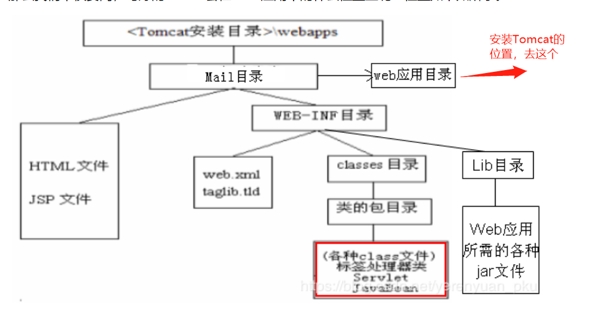
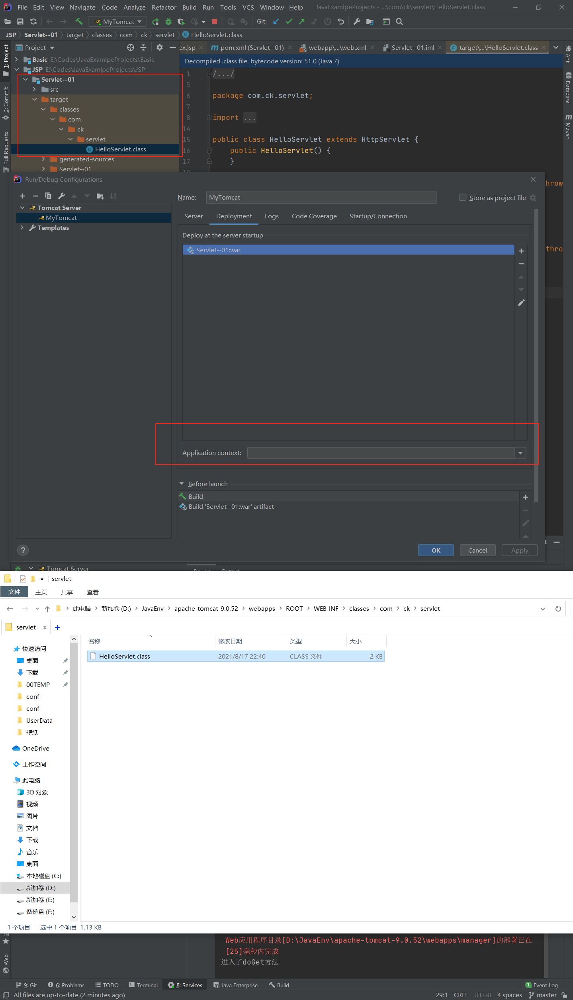

# Servlet原理

参考链接：

[[什么是Servlet(原理，从访问到方法)](https://www.cnblogs.com/yunlongn/p/10756573.html)](https://www.cnblogs.com/yunlongn/p/10756573.html)

## Servlet简介

官方介绍：A servlet is a small Java program that runs within a Web server. Servlets receive and respond to requests from Web clients, usually across HTTP, the HyperText Transfer Protocol.

Servlet就是一个提供Http的类，写好之后，部署到Tomcat里面，就可以根据HTTP请求，做相应的处理。

写好的Servlet的位置：

比如，我本地的一个项目，在配置Tomcat的时候，没有配置Application context，然后他自动在我Tomcat/webapps下面生成了个ROOT目录：

## 怎么快速新建一个Servlet项目

