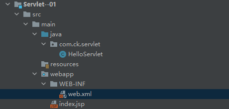

# Servlet原理

参考链接：

[[什么是Servlet(原理，从访问到方法)](https://www.cnblogs.com/yunlongn/p/10756573.html)](https://www.cnblogs.com/yunlongn/p/10756573.html)

## Servlet简介

官方介绍：A servlet is a small Java program that runs within a Web server. Servlets receive and respond to requests from Web clients, usually across HTTP, the HyperText Transfer Protocol.

Servlet就是一个提供Http的类，写好之后，部署到Tomcat里面，就可以根据HTTP请求，做相应的处理。

写好的Servlet的位置：


比如，我本地的一个项目，在配置Tomcat的时候，没有配置Application context，然后他自动在我Tomcat/webapps下面生成了个ROOT目录：


## 怎么快速新建一个Servlet项目

参考当前目录下，[创建Servlet项目](./创建MyFirstWebapp.md)

配置maven pom.xml

```xml
<dependencies>
    <dependency>
        <groupId>javax.servlet.jsp</groupId>
        <artifactId>javax.servlet.jsp-api</artifactId>
        <version>2.3.3</version>
        <scope>provided</scope>
    </dependency>

    <dependency>
        <groupId>javax.servlet</groupId>
        <artifactId>javax.servlet-api</artifactId>
        <version>4.0.1</version>
        <scope>provided</scope>
    </dependency>
</dependencies>
```

## 一个简单的Hello World项目

项目结构



Servlet是运行在Web服务器里的一个小型的Java程序，Servlet通常通过Http接受并响应客户端的请求。

要写一个接口，通常继承

- javax.servlet.GenericServlet
- javax.servlet.http.HttpServle

这两个抽象类都实现了Servlet接口

这个接口定义了方法来初始化一个Servlet，服务请求，并从服务器删除Servlet。这些被称为生命周期方法> 并且按以下顺序依次调用：

- Servlet被构造，然后用init方法初始化；
- 任何来自客户机的请求在service方法中处理；
- Servlet从服务中移除，调用destroy方法销毁，然后垃圾收集和完成。

除了生命周期方法，该接口提供了getServletConfig方法(Servlet可以使用它来得到任何启动信息)和getServletInfo方法(它允许Servlet返回自身的基本信息，比如作者、版本和版权)。

### 写一个HelloServlet类，在这个类里面实现Servlet接口的方法

```java
package com.ck.servlet;


import javax.servlet.ServletException;
import javax.servlet.http.HttpServlet;
import javax.servlet.http.HttpServletRequest;
import javax.servlet.http.HttpServletResponse;
import java.io.IOException;
import java.io.PrintWriter;

public class HelloServlet extends HttpServlet {

    @Override
    protected void doGet(HttpServletRequest req, HttpServletResponse resp) throws ServletException, IOException {

        System.out.println("进入了doGet方法");

        PrintWriter writer = resp.getWriter();
        writer.print("Hello Servlet!");

    }

    @Override
    protected void doPost(HttpServletRequest req, HttpServletResponse resp) throws ServletException, IOException {
        doGet(req, resp);
    }
}
```

### 配置Web.xml

```xml
<!DOCTYPE web-app PUBLIC
 "-//Sun Microsystems, Inc.//DTD Web Application 2.3//EN"
 "http://java.sun.com/dtd/web-app_2_3.dtd" >

<web-app>
  <display-name>Archetype Created Web Application</display-name>

  <servlet>
    <servlet-name>hello</servlet-name>
    <servlet-class>com.ck.servlet.HelloServlet</servlet-class>
  </servlet>

  <servlet-mapping>
    <servlet-name>hello</servlet-name>
    <url-pattern>/hello</url-pattern>
  </servlet-mapping>
</web-app>
```

### 配置Tomcat


### URL访问http://localhost:8080//hello，可以看到结果


## Servlet运行过程

Servlet程序是由Web服务器调用的，Web服务器收到客户端的Servlet访问请求后：

- ①Web服务器首先检查是否已经装载并创建了该Servlet的实例对象。如果是，则直接执行第④步，否则，执行第②步；
- ②装载并创建该Servlet的一个实例对象；
- ③调用Servlet实例对象的init()方法；
- ④创建一个用于封装HTTP请求消息的HttpServletRequest对象和一个代表HTTP响应消息的HttpServletResponse对象，然后调用Servlet的service()方法并将请求和响应对象作为参数传递进去；
- ⑤Web应用程序被停止或重新启动之前，Servlet引擎将卸载Servlet，并在卸载之前调用Servlet的destroy()方法。


注意：上图并没画出destory()方法。destory()方法会在Web容器移除Servlet时执行，客户机第一次访问服务器时，服务器会创建Servlet实例对象，它就永远驻留在内存里面了，等待客户机第二次访问，这时有一个用户访问完Servlet之后，此Servlet对象并不会被摧毁，destory()方法也就不会被执行。

## 请说出Servlet的生命周期

Servlet对象是用户第一次访问时创建，对象创建之后就驻留在内存里面了，响应后续的请求。Servlet对象一旦被创建，init()方法就会被执行，客户端的每次请求导致service()方法被执行，Servlet对象被摧毁时(Web服务器停止后或者Web应用从服务器里删除时)，destory()方法就会被执行。

## Servlet接口实现类

对于Servlet接口，SUN公司定义了两个默认实现类，分别为GenericServlet和HttpServlet。HttpServlet指能够处理HTTP请求的Servlet，它在原有Servlet接口上添加了一些与HTTP协议相关的处理方法，它比Servlet接口的功能更为强大。因此开发人员在编写Servlet时，通常应继承这个类，而避免直接去实现Servlet接口。HttpServlet在实现Servlet接口时，覆写了service方法，该方法体内的代码会自动判断用户的请求方式，如为GET请求，则调用HttpServlet的doGet方法，如为Post请求，则调用doPost方法。因此，开发人员在编写Servlet时，通常只需要覆写doGet或doPost方法，而不要去覆写service方法(温馨提示：可阅读HttpServlet API文档)。

提供了一个抽象类派生子类来创建一个适合于一个网站的HTTP Servlet。HttpServlet的子类必须覆盖至少一个方法，通常是其中一个：

- doGet，如果Servlet支持HTTP GET请求
- doPost，HTTP POST请求
- doPut，HTTP PUT请求
- doDelete，HTTP DELETE请求
- 初始化和销毁，管理Sevlet生命中被掌握的资源
- getServletInfo，Servlet用来提供关于其自身信息

## Servlet访问URL映射配置

由于客户端是通过URL地址访问Web服务器中的资源，所以Servlet程序若想被外界访问，必须把Servlet程序映射到一个URL地址上，这个工作在web.xml文件中使用`<servlet>`元素和`<servlet-mapping>`元素完成。`<servlet>`元素用于注册Servlet，它包含有两个主要的子元素：`<servlet-name>`和`<servlet-class>`，分别用于设置Servlet的注册名称和Servlet的完整类名。一个`<servlet-mapping>`元素用于映射一个已注册的Servlet的一个对外访问路径，它包含有两个子元素：`<servlet-name>`和`<url-pattern>`，分别用于指定Servlet的注册名称和Servlet的对外访问路径。例如：

```xml
<servlet>
    <servlet-name>ServletDemo1</servlet-name>
    <servlet-class>cn.itcast.ServletDemo1</servlet-class>
</servlet>
<servlet-mapping>
    <servlet-name>ServletDemo1</servlet-name>
    <url-pattern>/ServletDemo1</url-pattern>
</servlet-mapping>
```

同一个Servlet可以被映射到多个URL上，即多个`<servlet-mapping>`元素的`<servlet-name>`子元素的设置值可以是同一个Servlet的注册名。例如：

```xml
<servlet>
    <servlet-name>ServletDemo1</servlet-name>
    <servlet-class>cn.itcast.ServletDemo1</servlet-class>
</servlet>
<servlet-mapping>
    <servlet-name>ServletDemo1</servlet-name>
    <url-pattern>/ServletDemo1</url-pattern>
</servlet-mapping>
<servlet-mapping>
    <servlet-name>ServletDemo1</servlet-name>
    <url-pattern>/aa</url-pattern>
</servlet-mapping>
<servlet-mapping>
    <servlet-name>ServletDemo1</servlet-name>
    <url-pattern>/1.html</url-pattern> <!-- 伪静态，明显是一个动态Web资源，但将其映射成静态Web资源的名称 -->
</servlet-mapping>
```

温馨提示：一个Web应用的web.xml文件内容一经修改，不需要重新发布，服务器会自动监测web.xml的改动，只要web.xml文件的内容修改，服务器就会自动加载。原因是在Tomcat服务器的conf/context.xml文件中，有如下关键代码：


根据Tomcat服务器文档可知，在conf/context.xml文件中，Context元素信息被所有的Web应用加载。即Context元素的配置信息会被所有Web应用程序所共享。所以所有的Web应用会监测web.xml的改动，只要web.xml文件的内容一旦修改，服务器就会自动重新加载。

## Servlet访问URL使用*通配符映射

在Servlet映射到的URL中也可以使用`*`通配符，但是只能有两种固定的格式：一种格式是“`*`.扩展名”，另一种格式是以正斜杠（/）开头并以“`*`”结尾。例如：

```xml
<servlet-mapping>
    <servlet-name>AnyName</servlet-name>
    <url-pattern>*.do</url-pattern>
</servlet-mapping>

<servlet-mapping>
    <servlet-name>AnyName</servlet-name>
    <url-pattern>/action/*</url-pattern>
</servlet-mapping>
```

对于如下的一些映射关系：

- Servlet1映射到`/abc/*`；
- Servlet2映射到`/*`；
- Servlet3映射到`/abc`；
- Servlet4映射到`*.do`。

有如下问题：

- 当请求URL为“`/abc/a.html`”，“`/abc/*`”和“`/*`”都匹配，哪个Servlet响应？——Servlet引擎将调用Servlet1；
- 当请求URL为“`/abc`”时，“`/abc/*`”、“`/*`”和“`/abc`”都匹配，哪个Servlet响应？——Servlet引擎将调用Servlet3；
- 当请求URL为“`/abc/a.do`”时，“`/abc/*`”、“`/*`”和“`*.do`”都匹配，哪个Servlet响应？——Servlet引擎将调用Servlet1；
- 当请求URL为“`/a.do`”时，“`/*`”和“`*.do`”都匹配，哪个Servlet响应？——Servlet引擎将调用Servlet2；
- 当请求URL为“`/xxx/yyy/a.do`”时，“`/*`”和“`*.do`”都匹配，哪个Servlet响应？——Servlet引擎将调用Servlet2。

**结论：匹配的原则就是"谁长得更像就找谁"，“`\*.do`”——这种\*在前面的时候优先级最低。**

## Servlet与普通Java类的区别

Servlet是一个供其他Java程序（Servlet引擎）调用的Java类，它不能独立运行，它的运行完全由Servlet引擎来控制和调度。针对客户端的多次Servlet请求，通常情况下，服务器只会创建一个Servlet实例对象，也就是说Servlet实例对象一旦创建，它就会驻留在内存中，为后续的其它请求服务，直至Web容器退出，Servlet实例对象才会销毁。

## 缺省Servlet

如果某个Servlet的映射路径仅仅为一个正斜杠（/），那么这个Servlet就成为当前Web应用程序的缺省Servlet。凡是在web.xml文件中找不到匹配的`<servlet-mapping>`元素的URL，它们的访问请求都将交给缺省Servlet处理，也就是说，缺省Servlet用于处理所有其他Servlet都不处理的访问请求。例如：

```xml
<servlet>
    <servlet-name>ServletDemo3</servlet-name>
    <servlet-class>cn.itcast.ServletDemo3</servlet-class>
    <load-on-startup>1</load-on-startup>
</servlet>
<!-- 将ServletDemo3配置成缺省Servlet -->
<servlet-mapping>
    <servlet-name>ServletDemo3</servlet-name>
    <url-pattern>/</url-pattern>
</servlet-mapping>
```

## Servlet的线程安全问题

当多个客户端并发访问同一个Servlet时，Web服务器会为每一个客户端的访问请求创建一个线程，并在这个线程上调用Servlet的service方法，因此service方法内如果访问了同一个资源的话，就有可能引发线程安全问题。下面我会举例来说明。

## 当Servlet不存在线程安全问题时

下面是不存在线程安全问题的代码。

```java
package cn.liayun;

import java.io.IOException;
import javax.servlet.ServletException;
import javax.servlet.annotation.WebServlet;
import javax.servlet.http.HttpServlet;
import javax.servlet.http.HttpServletRequest;
import javax.servlet.http.HttpServletResponse;

@WebServlet("/ServletSample")
public class ServletSample extends HttpServlet {

	protected void doGet(HttpServletRequest request, HttpServletResponse response)
			throws ServletException, IOException {
		int i = 0;
		i++;
		response.getOutputStream().write((i + "").getBytes());
	}

	protected void doPost(HttpServletRequest request, HttpServletResponse response)
			throws ServletException, IOException {
		doGet(request, response);
	}

}

```

当多线程并发访问这个方法里面的代码时，会存在线程安全问题吗？显然不会，i变量被多个线程并发访问，但是没有线程安全问题，因为i是doGet方法里面的局部变量，当有多个线程并发访问doGet方法时，每一个线程里面都有自己的i变量，各个线程操作的都是自己的i变量，所以不存在线程安全问题。多线程并发访问某一个方法的时候，如果在方法内部定义了一些资源(变量，集合等)，那么每一个线程都有这些东西，所以就不存在线程安全问题。

## 当Servlet存在线程安全问题时

下面是存在线程安全问题的代码。

```java
package cn.liayun;

import java.io.IOException;
import javax.servlet.ServletException;
import javax.servlet.annotation.WebServlet;
import javax.servlet.http.HttpServlet;
import javax.servlet.http.HttpServletRequest;
import javax.servlet.http.HttpServletResponse;

@WebServlet("/ServletSample")
public class ServletSample extends HttpServlet {
	
	private int i = 0;

	protected void doGet(HttpServletRequest request, HttpServletResponse response)
			throws ServletException, IOException {
		i++;

		try {
			Thread.sleep(1000 * 10);
		} catch (InterruptedException e) {
			// TODO Auto-generated catch block
			e.printStackTrace();
		}
		
		response.getOutputStream().write((i + "").getBytes());
	}

	protected void doPost(HttpServletRequest request, HttpServletResponse response)
			throws ServletException, IOException {
		doGet(request, response);
	}

}
```

把i定义成全局变量，当多个线程并发访问变量i时，就会存在线程安全问题了。线程安全问题只存在多个线程并发操作同一个资源的情况下，所以在编写Servlet的时候，如果并发访问某一个资源(变量，集合等)，就会存在线程安全问题，那么该如何解决这个问题呢？可使用同步代码块。

```java
package cn.liayun;

import java.io.IOException;
import javax.servlet.ServletException;
import javax.servlet.annotation.WebServlet;
import javax.servlet.http.HttpServlet;
import javax.servlet.http.HttpServletRequest;
import javax.servlet.http.HttpServletResponse;

@WebServlet("/ServletSample")
public class ServletSample extends HttpServlet {
	
	private int i = 0;//共享资源

	protected void doGet(HttpServletRequest request, HttpServletResponse response)
			throws ServletException, IOException {
		i++;

		synchronized (this) {
			try {
				Thread.sleep(1000 * 10);
			} catch (InterruptedException e) {
				// TODO Auto-generated catch block
				e.printStackTrace();
			}
		}
		
		response.getOutputStream().write((i + "").getBytes());
	}

	protected void doPost(HttpServletRequest request, HttpServletResponse response)
			throws ServletException, IOException {
		doGet(request, response);
	}

}
```

加了synchronized后，并发访问i时就不存在线程安全问题了，为什么加了synchronized后就没有线程安全问题了呢？原因：假如现在有一个线程访问Servlet对象，那么它就先拿到了Servlet对象的那把锁，等到它执行完之后才会把锁还给Servlet对象，由于是它先拿到了Servlet对象的那把锁，所以当有别的线程来访问这个Servlet对象时，由于锁已经被之前的线程拿走了，后面的线程只能排队等候了。
以上这种做法是给Servlet对象加了一把锁，保证任何时候都只有一个线程在访问该Servlet对象里面的资源，这样就不存在线程安全问题了。这种做法虽然解决了线程安全问题，但是编写Servlet却万万不能用这种方式处理线程安全问题，假如有9999个人同时访问这个Servlet，那么这9999个人必须按先后顺序排队轮流访问。
针对Servlet的线程安全问题，SUN公司是提供有解决方案的：让Servlet去实现一个SingleThreadModel接口，如果某个Servlet实现了SingleThreadModel接口，那么Servlet引擎将以单线程模式来调用其service方法。查看Sevlet的API可以看到，SingleThreadModel接口中没有定义任何方法和常量，在Java中，把没有定义任何方法和常量的接口称之为标记接口，经常看到的一个最典型的标记接口就是"Serializable"，这个接口也是没有定义任何方法和常量的，标记接口在Java中有什么用呢？主要作用就是给某个对象打上一个标志，告诉JVM，这个对象可以做什么，比如实现了"Serializable"接口的类的对象就可以被序列化，还有一个"Cloneable"接口，这个也是一个标记接口，在默认情况下，Java中的对象是不允许被克隆的，就像现实生活中的人一样，不允许克隆，但是只要实现了"Cloneable"接口，那么对象就可以被克隆了。SingleThreadModel接口中没有定义任何方法，只要在Servlet类的定义中增加实现SingleThreadModel接口的声明即可。
对于实现了SingleThreadModel接口的Servlet，Servlet引擎仍然支持对该Servlet的多线程并发访问，其采用的方式是产生多个Servlet实例对象，并发的每个线程分别调用一个独立的Servlet实例对象。实现SingleThreadModel接口并不能真正解决Servlet的线程安全问题，因为Servlet引擎会创建多个Servlet实例对象，而真正意义上解决多线程安全问题是指一个Servlet实例对象被多个线程同时调用的问题。事实上，在Servlet API 2.4中，已经将SingleThreadModel标记为Deprecated（过时的）。

